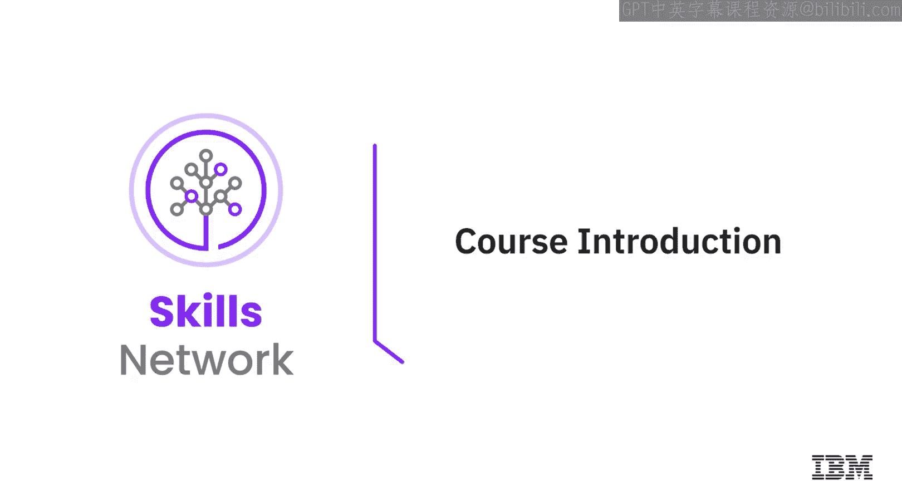
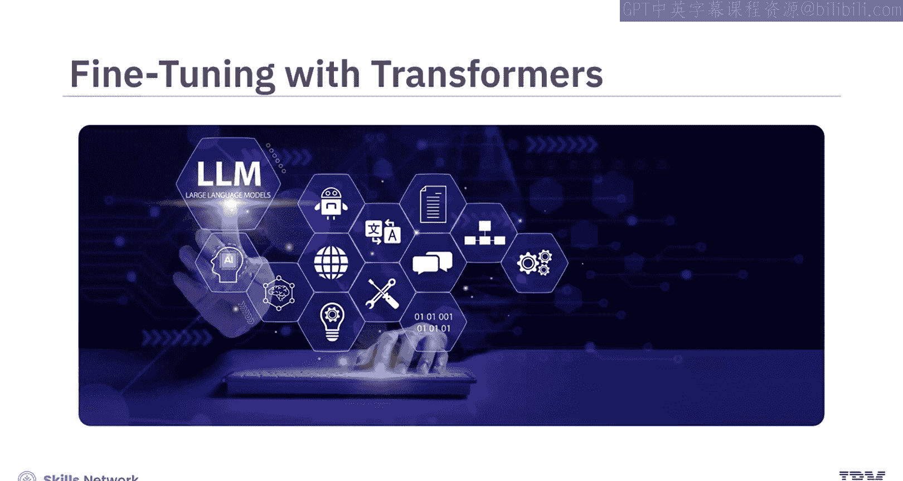
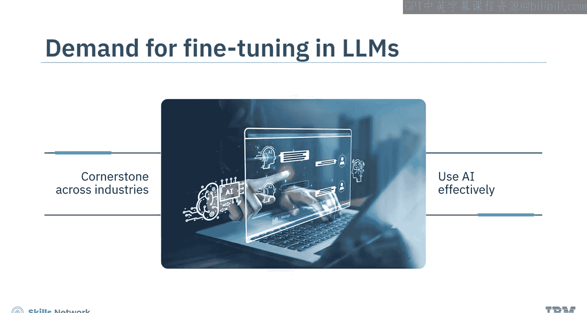
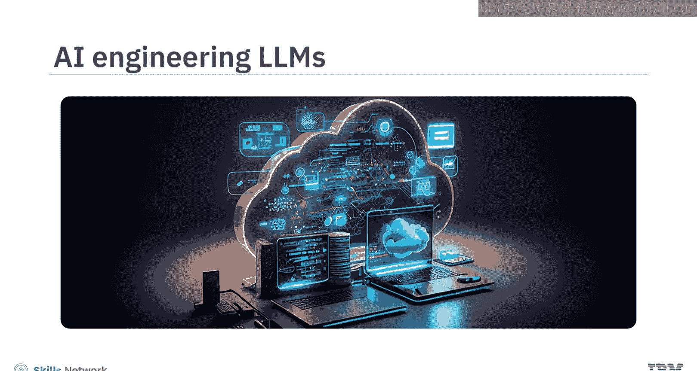
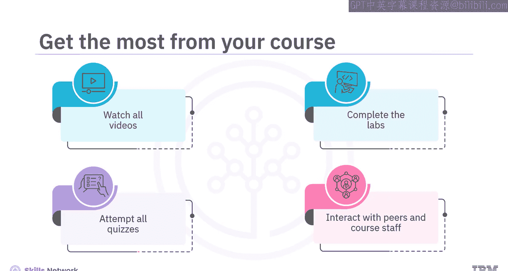
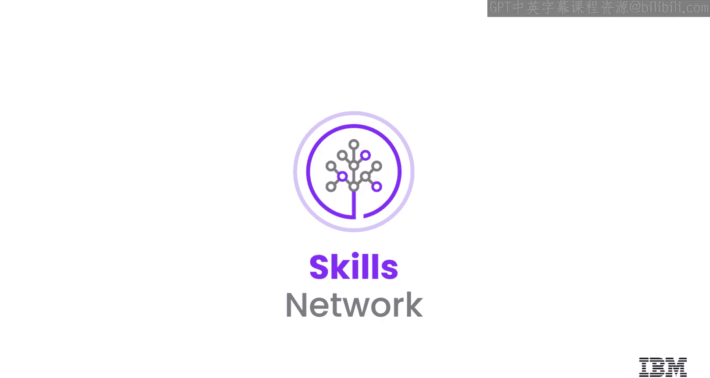

# 生成式人工智能工程：0：课程介绍 🚀

在本节课中，我们将要学习一门关于使用Transformer模型进行微调的课程。我们将了解课程背景、目标受众、所需预备知识以及你将学到的核心技能和课程结构。

## 概述

欢迎来到这门关于使用Transformer进行微调的课程。本课程由人工智能和自然语言处理领域的几个关键趋势所驱动。随着大语言模型在各个领域的持续演进和普及，企业正寻求在特定专业场景中有效利用AI，这使得基于Transformer的微调技术正成为跨行业AI战略的基石。

## 课程目标与受众

在这里，你将通过使用当前热门的大语言模型来学习AI工程概念，并构建面向职场的技能，以推动你的AI职业发展。本课程为简化起见，将主要关注编码器模型，但你所学的这些方法同样适用于解码器模型。

本课程适合现有的和有抱负的数据科学家、机器学习工程师、深度学习工程师、AI工程师以及希望精通大语言模型应用的开发者。学习本课程，具备Python和PyTorch的基础知识，并对Transformer、微调以及如何加载模型有所了解，将是一个优势。

## 你将学到什么

完成本课程后，你将能够应用所获得的技能，在生成式AI工程中处理基于Transformer的大语言模型。

*   你将学会使用预训练的Transformer模型处理语言任务，并针对特定任务对它们进行微调。
*   你还将深入了解使用低秩适应（LoRA）和量化低秩适应（Q-LoRA）进行参数高效微调（PEFT）的技术。

## 课程内容结构

课程将从Transformer和主流语言模型开始，你将学习生成式模型和微调技术。

*   你将回顾高级训练方法，并识别两个强大框架——Hugging Face和PyTorch——之间的差异。
*   你将学习如何使用Hugging Face加载模型并进行推理，以及如何使用Hugging Face训练或预训练模型。
*   你还将理解使用Hugging Face和PyTorch微调模型的重要性。

不仅如此，你还会进一步探索参数高效微调（PEFT）和适配器，例如LoRA和Q-LoRA。

*   你将深入了解软提示和秩的概念。
*   此外，你将定义在自然语言处理中使用的模型量化及其独特方法。

然而，本课程不会在因果大语言模型上进行训练，但这些方法可以轻松迁移。

## 实践环节与学习方式

本课程包含一系列实验，用以巩固教学视频中的知识。动手练习基于Jupyter Lab环境，供你实践、学习概念和技术。这些实验反映了使用Hugging Face和PyTorch预训练和微调大语言模型的学习过程。

课程内容经过精心搭配以促进学习：

*   **视频**：简短精炼，聚焦于核心主题。
*   **阅读材料**：主要以文本形式提供详细内容。
*   **实验**：提供技术环境、详细说明和代码片段，供你完成动手练习。
*   **测验**：练习和分级测验将帮助你应用所学知识并评估掌握程度。

为了从课程中获得最大收益，请观看所有视频，完成实验以练习新技能，并尝试所有测验。你还可以通过课程讨论论坛与同学互动，并从课程工作人员那里获得帮助。

## 总结

本节课中，我们一起了解了这门“生成式人工智能工程”微调课程的概貌。我们明确了课程的学习目标、适合的学习者以及需要掌握的核心技术栈。课程将通过理论讲解、动手实验和测验相结合的方式，帮助你掌握使用Hugging Face和PyTorch对Transformer模型进行高效微调的实用技能。

让我们开始这段激动人心的旅程吧，祝你好运！