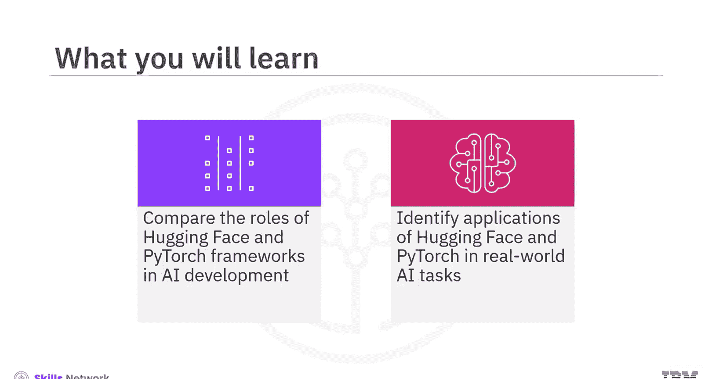
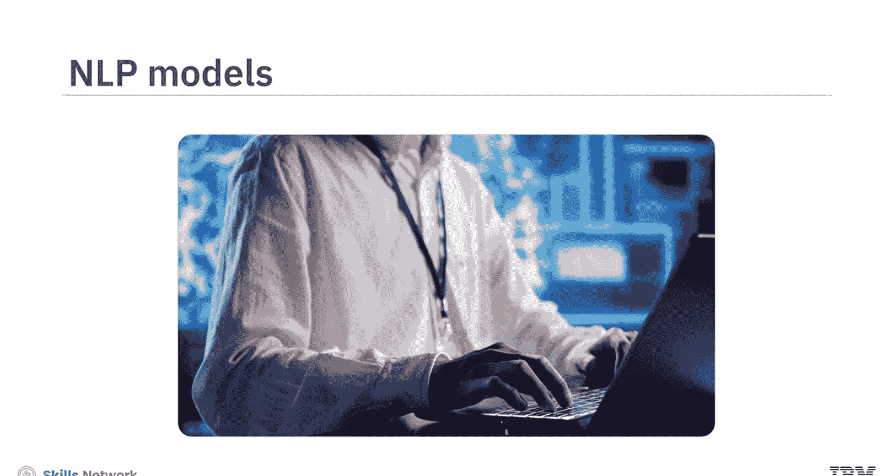
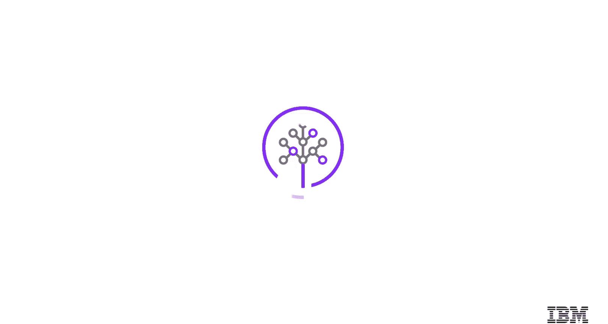

# 生成式人工智能工程：133：Hugging Face 与 PyTorch 对比 🧠

在本节课中，我们将学习 Hugging Face 与 PyTorch 这两个在人工智能开发中至关重要的框架。我们将比较它们的角色，并了解它们在实际 AI 任务中的应用场景。

---

假设你正在研究自然语言处理模型的实现项目。

NLP 模型，如 Hugging Face 和 PyTorch，被广泛应用于医疗保健、金融和客户服务等行业。Hugging Face 是一个以其预训练模型和易用界面而闻名的流行库。另一方面，PyTorch 是一个强大的深度学习框架，常用于从头开始构建自定义的 NLP 模型。

接下来，让我们逐一了解这些框架。

## Hugging Face：机器学习的协作平台

Hugging Face 最初是一家聊天机器人公司，但很快发展成为一个专注于机器学习和数据科学的平台与社区。它旨在帮助用户开发、部署和训练机器学习模型。它提供了演示、操作以及将 AI 集成到实际应用中所必需的基础设施。此外，作为用户，你可以探索他人共享的模型和数据集。

由于其促进开发者之间开放共享和测试的作用，Hugging Face 常被称为“机器学习的 GitHub”。这个比喻突显了它作为 AI 开发者协作中心的重要性。

以下是其一些关键特性：

*   **Transformers 库**：Hugging Face 最受欢迎的特性是其 Transformers 库，它提供了多种预训练模型，如 **BERT**、**GPT** 和 **T5**，可随时用于各种 NLP 任务。
*   **NLP 工具支持**：它非常重视为 NLP 应用创建和支持工具。
*   **活跃社区**：Hugging Face 拥有一个庞大且不断增长的社区，致力于开发和维护模型库及工具。

## PyTorch：灵活的深度学习框架

上一节我们介绍了 Hugging Face，本节中我们来看看 PyTorch。PyTorch 是一个基于软件的开源深度学习框架，最初由 Facebook AI Research（现 Meta）开发，用于构建神经网络。它结合了 Torch 机器学习库和基于 Python 的高级 API。其灵活性、易用性等优点，使其成为学术界和研究社区领先的机器学习框架。

PyTorch 支持多种神经网络架构，并建立在广泛理解的 Python 编程语言之上。它提供了丰富的库、预配置甚至预训练的模型。PyTorch 允许数据科学家实时运行和测试部分代码，而无需等待整个代码实现完成，这对于大型深度学习模型来说可能耗时很长。这使得 PyTorch 成为快速原型设计的绝佳平台，并极大地加快了调试过程。

以下是其核心特性：

*   **动态计算图**：PyTorch 最受欢迎的特性是动态计算图，它允许在运行时动态更改网络架构。
*   **Pythonic 语法**：由于其直观且直接的 Python 基础语法，PyTorch 易于使用。
*   **强大的 GPU 加速**：PyTorch 提供了强大的图形处理器加速，可以高效处理大规模计算，这对深度学习尤其有益。

## 框架对比与应用集成

现在，让我们比较这两个框架。PyTorch 是一个多功能的机器学习库，在深度学习方面表现出色。它提供了创建各种机器学习模型的基本工具，并因其适应性和高效性而受到赞赏，尤其是在研发环境中。PyTorch 因其动态管理计算图的能力而广受欢迎，并广泛应用于学术研究和实际应用。

另一方面，Hugging Face 以其 Transformers 库而闻名，专门提供即用型 NLP 模型和工具。它通过为前沿 NLP 模型提供简洁的接口，增强了 PyTorch 和 TensorFlow 等框架。Hugging Face 在文本分类、情感分析和文本生成等任务中特别有用。

作为开发者，你可以将 PyTorch 与 Hugging Face 的 Transformers 集成。这使你能够更直观、更高效地处理复杂的 NLP 任务。

以下是一些应用示例，展示了 Hugging Face 和 PyTorch 如何无缝集成以提供强大的 NLP 解决方案：

*   **情感分析**：用于对用户评论或社交媒体帖子进行情感分类。
*   **语言翻译**：可以使用 **T5** 和 **MarianMT** 等模型将文本从一种语言翻译到另一种语言。
*   **问答系统**：可以使用这些框架构建能够根据输入问题和上下文提供答案的系统。
*   **文本摘要**：可以帮助你从大量文本中自动生成简洁的摘要。

---

本节课中我们一起学习了以下内容：

*   Hugging Face 是一个专注于机器学习、ML 和数据科学的平台与社区，它帮助用户开发、部署和训练机器学习模型。Hugging Face 常被称为“机器学习的 GitHub”。
*   Hugging Face 最受欢迎的特性是其 Transformers 库，它提供了多种预训练模型，如 **BERT**、**GPT** 和 **T5**，可随时用于各种 NLP 任务。
*   PyTorch 是一个基于软件的开源深度学习框架，用于构建神经网络。PyTorch 支持多种神经网络架构，并建立在广泛理解的 Python 编程语言之上。
*   PyTorch 最受欢迎的特性是动态计算图，它允许在运行时动态更改网络架构。
*   一些应用展示了 Hugging Face 和 PyTorch 的无缝集成，以提供强大的 NLP 解决方案，包括情感分析、语言翻译、问答和文本摘要。