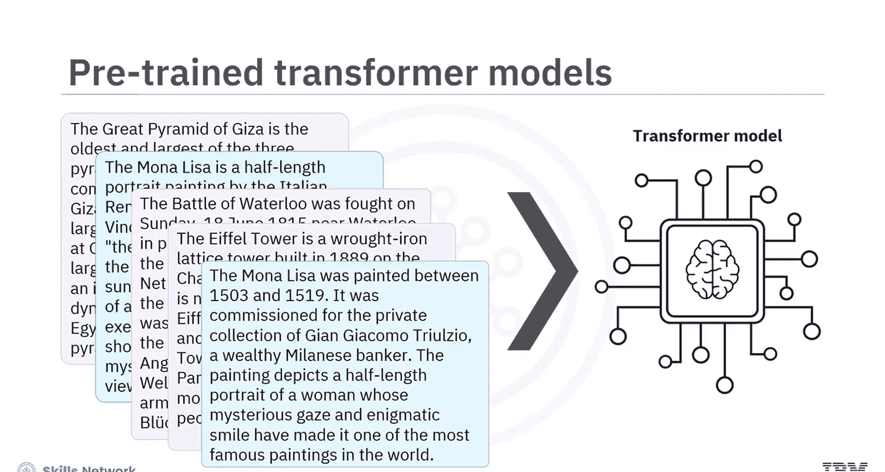
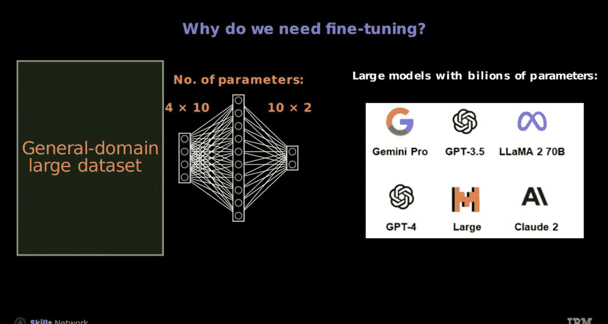
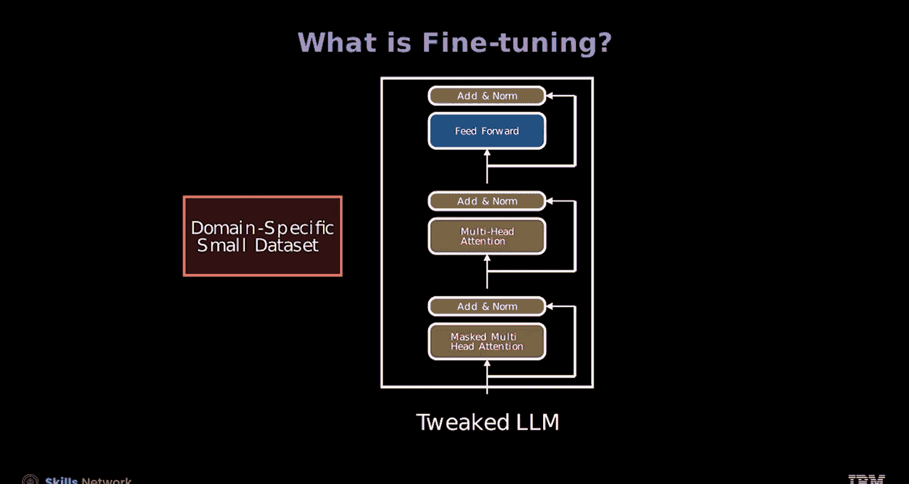
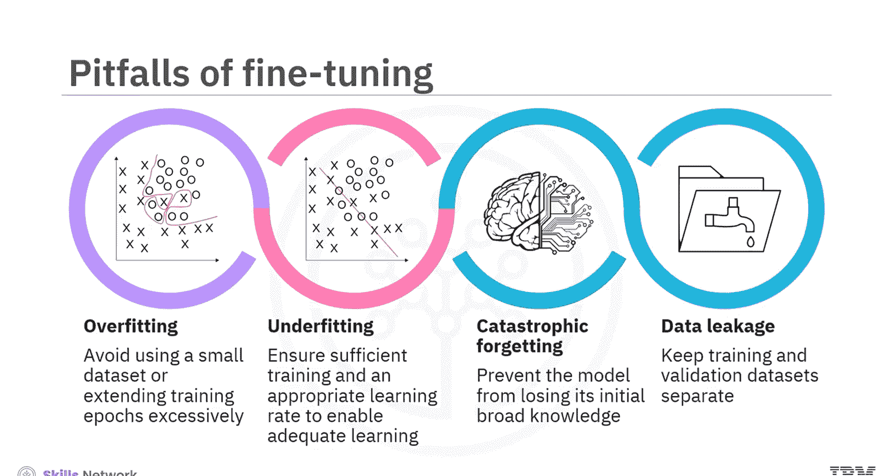
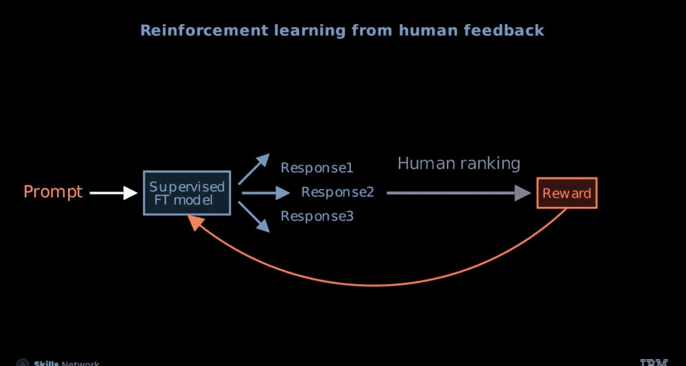

# 生成式人工智能工程：134：使用预训练的Transformer与微调 🧠

在本节课中，我们将学习如何使用预训练的Transformer模型，并了解微调的概念、必要性及其不同方法。

---

## 概述

Transformer模型（如BERT、LLaMA、GPT）凭借其基于注意力的架构和在大规模无标签文本数据集上进行预训练的能力，彻底改变了自然语言处理领域。预训练过程使这些模型能够学习丰富的语言表示，这些表示随后可被用于广泛的NLP下游任务。

---

## 训练大型语言模型的挑战

训练拥有数十亿参数的大型语言模型在计算上非常昂贵。

*   **计算资源**：需要强大的硬件，如图形处理器。
*   **数据需求**：需要大量的训练数据。
*   **时间成本**：过程耗时，可能需要数周或数月，并涉及多个训练轮次的复杂优化。
*   **基础设施**：设置和维护必要的基础设施会增加额外成本。

总而言之，训练LLM需要大量的计算资源、时间和资金投入。

---

## 什么是微调及其优势

上一节我们介绍了训练全新LLM的挑战，本节中我们来看看一种更高效的策略：微调。

微调使用特定领域的数据，使预训练模型适应特定任务或领域。此过程会调整模型的参数以提高任务性能，同时利用其已有的语言理解能力。与从头开始训练模型相比，微调提高了效率，节省了时间和计算资源。

以下是微调的一些主要优势：

*   **迁移学习**：在标记数据有限的情况下尤其有价值。
*   **时间与资源效率**：绕过初始训练阶段，实现更快的收敛。
*   **定制化响应**：可以调整模型的输出，使其符合特定要求，确保生成准确且上下文相关的输出。
*   **任务特定适应**：对于情感分析或不同领域的文本生成等应用至关重要。

---

## 微调中需避免的陷阱

为了优化微调过程以获得更好的性能和泛化能力，需要注意避免以下常见问题：

*   **过拟合**：为避免模型仅在训练数据上表现良好，应避免使用过小的数据集或过度延长训练轮次。
*   **欠拟合**：必须确保充分的训练和适当的学习率，以使模型能够充分学习。
*   **灾难性遗忘**：防止模型丢失其初始的广泛知识，否则可能影响其在各种NLP任务上的表现。
*   **数据泄露**：保持训练集和验证集分离，以避免产生误导性的评估指标。

---

## 微调的实践挑战与评估

微调因果解码器模型（如用于问答）看似直接，只需创建特定任务的数据集即可。然而，在实践中，这些方法可能需要新颖的损失函数，如强化学习或直接偏好优化。

评估大型语言模型的响应具有挑战性。人类擅长比较两个回答的优劣，但通常难以给出绝对分数。

例如，对于问题“哪个国家拥有南极洲？”，一个回答可能是“南极洲由《南极条约》体系管理”，这准确且信息丰富；另一个回答可能是“我们的企鹅领主在那边掌管一切”，这很幽默但不正确。人类很容易判断第一个回答好，第二个回答不好，但将这些判断量化则更为复杂。

这可以通过微调一个理解语言的LLM（如BERT）来解决，让其产生一个单一的输出分数，这更类似于回归而非分类，即使用奖励建模。如下图所示，第一个回答的得分高于第二个。

---

## 微调的主要方法

目前主要有三种微调语言模型的方法：

1.  **自监督微调**：模型学习在大型无标签数据集中预测缺失的单词，例如预测下一个词或被掩盖的词。
2.  **监督微调**：模型使用来自目标任务的标记数据进行微调，以提升其在特定任务（如情感分类）上的性能。
3.  **基于人类反馈的强化学习**：在这种技术中，模型根据人类标注员提供的明确反馈进行调整，使其输出与人类偏好保持一致。

这些方法使语言模型能够通过自监督学习、监督学习或人类反馈来适应特定任务或领域。混合微调结合多种技术可以进一步提升模型性能。OpenAI开发的ChatGPT就是利用此类混合方法的一个例子。

---

## 直接偏好优化

直接偏好优化是一种新兴的流行方法，它专注于直接基于人类偏好来优化语言模型。

让我们看看它的一些特点：

*   **简洁性**：由于以人为中心的优化方式，DPO的实现可能比RLHF更直接。
*   **无需奖励模型训练**：不需要训练额外的奖励模型。
*   **更快收敛**：由于依赖直接反馈，可能实现更快的收敛。

---

## 监督微调的实施方式

监督微调可以通过两种不同的方式进行：

1.  **全参数微调**：针对特定任务调整模型的所有参数。
2.  **参数高效微调**：这是一种更高效的微调基础模型的方法。在这种方法中，可以在不修改大部分原始参数的情况下对大型预训练模型进行微调。

---

## 总结

本节课中我们一起学习了以下核心内容：

*   训练拥有数十亿参数的大型语言模型在计算上非常昂贵，需要强大的硬件和大量的训练数据。
*   微调使用特定领域的数据，使预训练模型适应特定任务或领域。
*   与从头开始训练模型相比，微调提高了效率，节省了时间和计算资源。
*   微调的优势包括迁移学习、时间与资源效率、定制化响应和任务特定适应。
*   解决过拟合、欠拟合、灾难性遗忘和数据泄露等问题可以优化微调，使其在特定领域获得更好的性能和泛化能力。
*   微调语言模型的三种主要方法包括自监督微调、监督微调和基于人类反馈的强化学习。
*   直接偏好优化是一种新兴的流行方法，专注于直接基于人类偏好优化语言模型。
*   监督微调可以通过两种方式进行：全参数微调和参数高效微调。