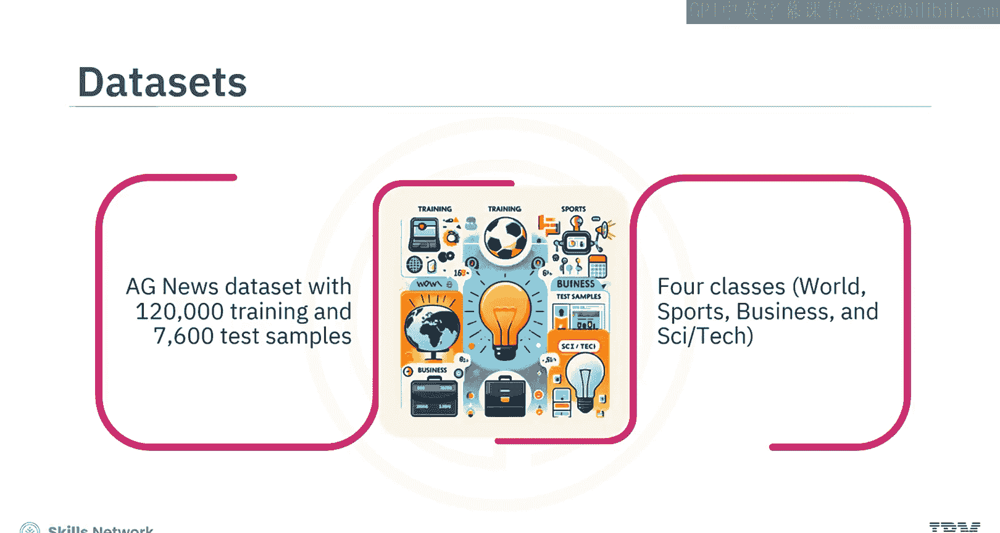
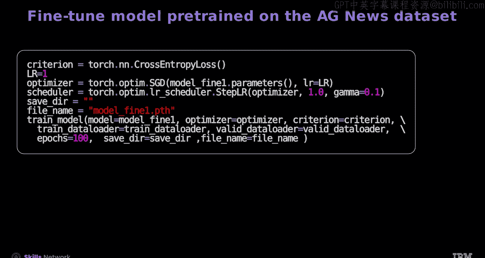
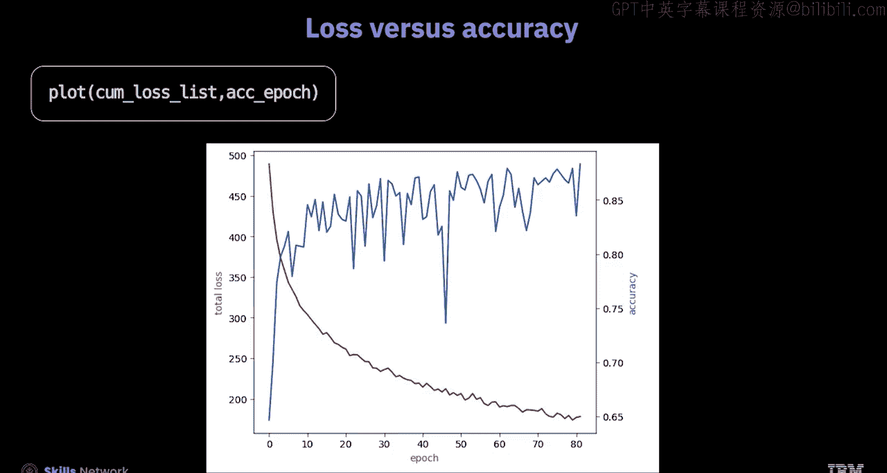
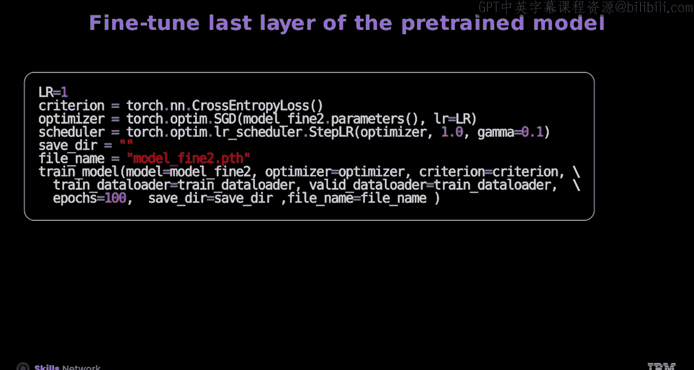
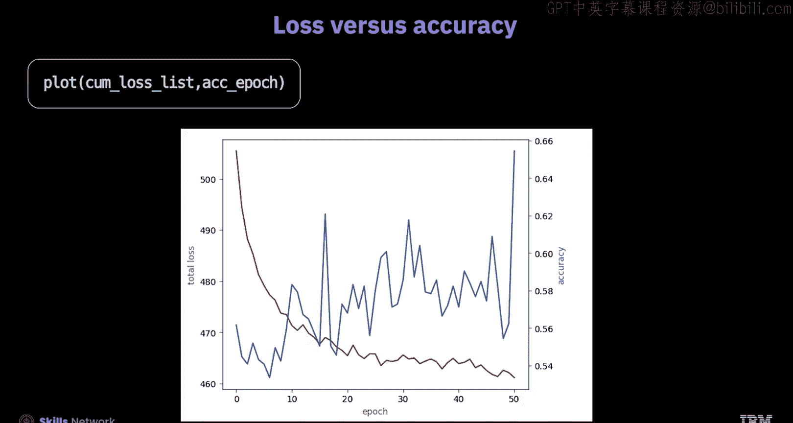

# 生成式人工智能工程：135：使用PyTorch进行微调 🧠

在本节课中，我们将学习如何使用PyTorch对预训练模型进行微调。我们将涵盖数据准备、模型定义，并详细讲解如何微调整个模型以及仅微调其最后一层。

## 概述

微调是机器学习中一个关键过程，旨在使预训练模型适应特定的任务或使用场景。它已成为深度学习的一项基础技术，特别是在用于生成式人工智能的基础模型训练过程中。

上一节我们介绍了微调的基本概念，本节中我们来看看具体的实现步骤。

## 数据准备

首先，我们需要准备将要使用的数据集。

以下是两个我们将要处理的数据集：
*   **IMDB数据集**：包含50,000个电影评论样本。该数据集较小，包含两个类别：正面和负面。
*   **AG News数据集**：包含120,000个训练样本和7,600个测试样本，涵盖四个类别：世界、体育、商业、科技。

我们的目标是先在AG News数据集上预训练模型，使其从多样化的主题中建立对语言和上下文的理解。然后，在IMDB数据集上进行微调，使模型专门用于情感分析和电影评论任务。




## 加载与处理数据

首先，定义用于加载IMDB数据的类。

现在，将IMDB数据集加载到训练和测试迭代器中。以下是数据集的一些示例，其中`0`表示差评，`1`表示好评。

接下来，定义分词器并加载GloVe词嵌入。

然后，从预训练的GloVe词嵌入模型构建词汇表对象，分配索引值，并将默认索引设置为未知词标记。

您可以使用以下代码将数据转换为映射式数据集：

```python
# 示例代码：将数据转换为映射式数据集
```

随后，执行随机分割以创建独立的训练集和验证集，并检查设备。

现在，创建整理函数。该函数对数据集进行分词，将词元转换为词元索引序列，并将这些序列及类别标签转换为张量。

接着，将训练集、验证集和测试集转换为数据加载器对象，这些对象由整理函数处理。以下是创建的验证数据加载器对象中的一个示例。

## 定义模型

现在，您将定义基于Transformer的模型类，即在PyTorch中用于分类的编码器模型类。

该构造函数使用以下配置初始化文本分类器：类别数量、词汇表大小以及Transformer设置（如头数和层数）。它还会设置基本组件：嵌入层、位置编码、Transformer编码器以及用于输出的线性分类器。预训练的词嵌入模型GloVe被用于嵌入层。

前向传播方法将嵌入应用于输入，添加位置编码，使数据通过Transformer编码器，沿第一个维度对数据进行平均，最后使用分类器对数据进行分类。

## 训练与评估

`train_model`函数使用提供的优化器和损失准则训练Transformer模型，迭代指定的轮数。它会在验证数据集上评估模型性能，打印每轮的损失，并在验证准确率提高时选择性地保存模型和性能指标。

`predict`函数接收文本和一个文本处理管道（用于机器学习前的文本预处理），它使用预训练模型来预测文本的标签，以进行数据集上的文本分类。

现在，创建一个函数来评估模型在数据上的准确率。

## 微调整个模型

现在让我们微调整个模型。

首先，在PyTorch中创建一个输出层有4个神经元的模型对象。

然后，使用`load_state_dict`方法，加载在AG News数据集上预训练模型的参数。此方法将参数加载到模型对象中，允许您使用选择的任何数据集对其进行微调。

如您所知，AG News数据集有4个类别。由于您要在IMDB数据集上微调预训练模型，而IMDB数据集只有2个类别，因此需要将最后一层的神经元数量从4改为2。重要的是，您应始终根据微调数据集的类别数量调整最后一层的神经元。

现在，定义用于在IMDB数据集上微调模型的损失函数、优化器和调度器。

然后调用`train_model`函数来完成模型的微调。这一步本质上与从头开始训练模型相同。




这里您可以看到模型的损失与准确率曲线，该模型在验证数据上达到了约90%的准确率。




## 仅微调最后一层

现在，让我们看看如果仅微调模型的最后一层会发生什么。

为此，您将使用与之前相同的在AG News数据集上预训练的模型。冻结模型的所有层，因为您只需要微调最后一层。

这是通过选择层参数并将`requires_grad`属性设置为`False`来实现的。冻结除最后一层外的所有层，通过减少计算量并将优化集中在更少的参数上，可以加速训练。输出层的神经元数量也已从4改为2，因为IMDB数据集的预测类别有两个。

定义重新训练模型的参数，并仅对最后一层进行微调。在这种情况下，训练模型的速度要快得多。

以下是仅微调最后一层的模型的损失与准确率曲线图。




虽然训练速度快得多，但性能却显著下降。因此，您必须在微调整个模型和仅微调关键参数之间进行权衡。




## 总结

本节课中我们一起学习了以下内容：

您了解到，机器学习中的微调是使预训练模型适应特定任务或使用场景的过程。

整理函数对数据集进行分词，将词元转换为词元索引序列，并将这些序列及类别标签转换为张量。

在定义PyTorch中用于分类的基于Transformer的模型类时，构造函数使用类别数量、词汇表大小以及Transformer设置（如头数和层数）等配置来初始化文本分类器。

前向传播方法将嵌入应用于输入，添加位置编码，使数据通过Transformer编码器，沿第一个维度对数据进行平均，最后使用分类器对数据进行分类。

`train_model`函数使用提供的优化器和损失准则训练Transformer模型，迭代指定的轮数。

如果您微调整个模型，模型在验证数据上能达到约90%的准确率。

如果您仅微调模型的最后一层，训练速度会快得多，但性能会显著下降。


