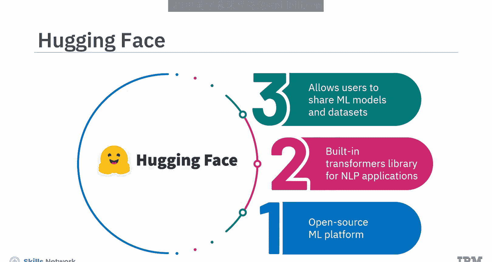
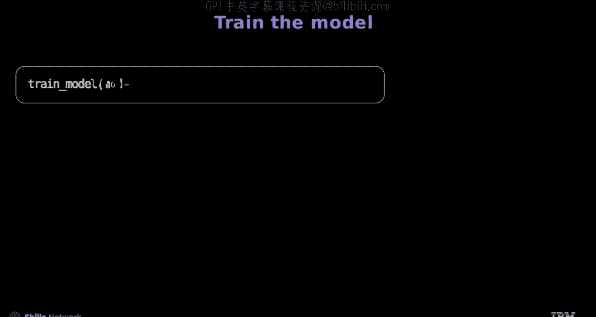
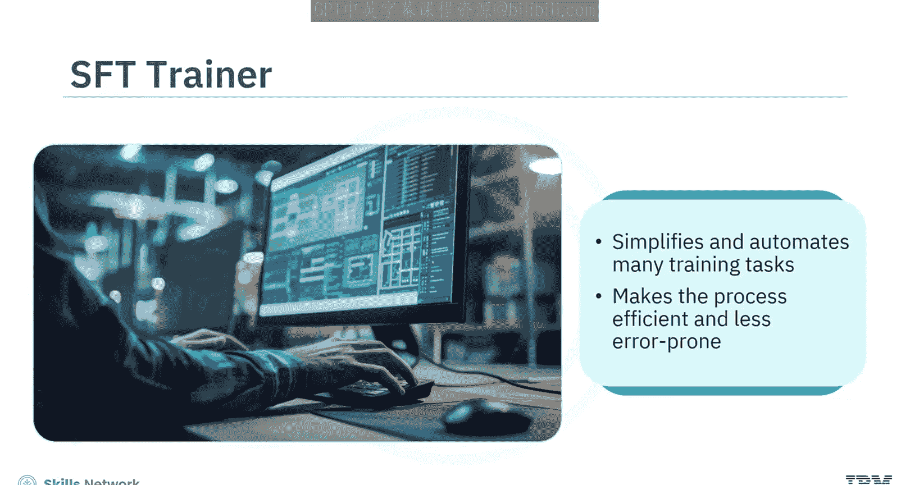
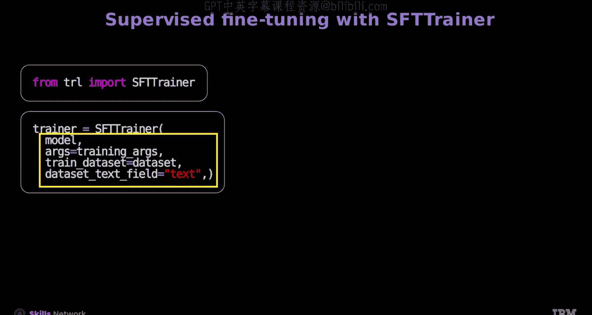
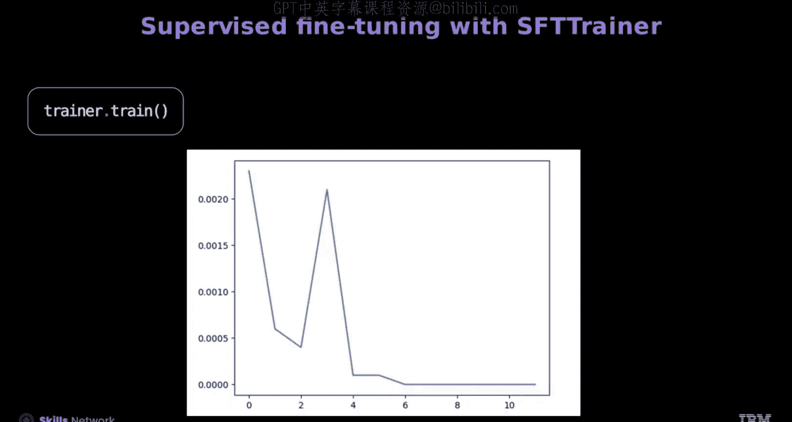
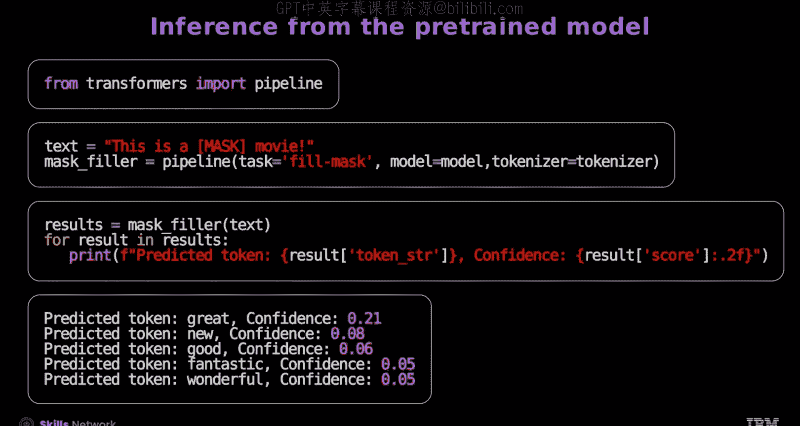
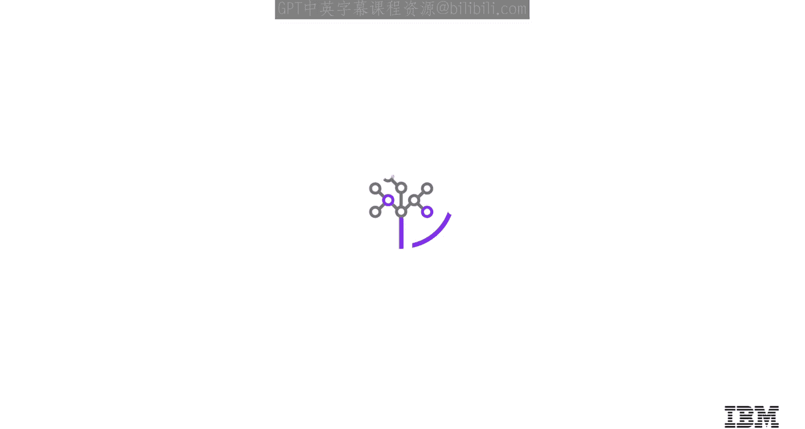

# 生成式人工智能工程：4：使用Hugging Face进行微调 🎯

在本节课中，我们将学习如何使用Hugging Face平台和PyTorch来微调预训练模型。我们将了解如何加载数据集、使用分词器、构建数据加载器，并最终使用监督式微调训练器（SFT Trainer）来高效地完成模型微调任务。

## 概述

Hugging Face是一个开源的机器学习平台，内置了用于自然语言处理应用的Transformers库。该平台允许用户共享机器学习模型和数据集，并展示他们的工作成果。

## 加载数据集与分词处理

上一节我们介绍了Hugging Face平台。本节中，我们来看看如何加载内置数据集并进行数据预处理。

Hugging Face的内置数据集可以使用`load_dataset`函数加载。让我们加载Yelp评论数据集，这是一个类似列表的对象，包含来自Yelp平台的用户评论和相应的元数据。

以下是加载和查看数据集的步骤：
*   每条评论都是一个字典，通常包含评论文本本身（键为`text`）和用户给出的星级评分（键为`label`，范围从1到5）。

你可以加载一个BERT分词器对象来对评论进行分词、填充和截断，这有助于高效处理可变长度的序列。

以下是使用分词器处理数据集的步骤：
*   分词器函数从数据集样本中提取文本并应用分词器。
*   然后，你可以将此方法映射到整个数据集。

结果是数据集中的每个样本文本都被标记化，将文本转换为标记索引（字典键为`input_ids`）。此外，与BERT模型相关的其他参数，如注意力掩码（`attention_mask`），也已为每个样本生成。

由于模型不需要文本信息，你可以删除`text`字段，并将`label`键重命名。数据随后被转换为PyTorch张量。结果是一组包含`labels`、`input_ids`、`token_type_ids`和`attention_mask`键的张量。

## 构建数据加载器与加载模型

在准备好数据张量之后，接下来我们需要为模型训练准备数据迭代器并加载预训练模型。

就像在PyTorch中一样，在Hugging Face中，你可以为训练和测试数据集创建数据加载器对象。这允许你迭代批次数据。

现在，你将从Transformers库加载一个预训练的BERT分类模型，该模型有五个类别。该模块专为序列分类设计。

`num_labels`参数指定类别数量，并决定最终层的神经元数量。

## 配置优化器与训练循环

加载模型后，我们需要配置训练过程。本节将介绍如何设置优化器、学习率调度器并编写训练函数。

让我们创建一个优化器和学习率调度器来微调模型。你可以使用PyTorch的`AdamW`优化器，并相应设置设备。

现在，让我们创建一个训练函数来微调模型。这里，还定义了一个评估函数，用于在微调后评估模型的性能。你现在可以训练模型，并观察每个训练周期（epoch）后损失的减少。

## 使用SFT Trainer简化微调

上一节我们介绍了手动设置训练循环的方法。本节中，我们来看看一个更高效的替代方案——监督式微调训练器。

SFT Trainer（监督式微调训练器）简化并自动化了许多训练任务，与直接使用PyTorch训练相比，该过程更高效且更不易出错。

对于掩码语言模型任务，你的目标应该是使用Transformer模型预测一个被掩码的单词。让我们加载一个掩码语言模型，并使用SFT Trainer对其进行微调，如下所示。

以下是使用SFT Trainer进行微调的步骤：
*   首先，你将加载IMDB数据集，该数据集将用于微调模型。
*   接下来，你将定义训练参数对象。训练参数对象包括学习率和训练周期数等关键参数。
*   最后，你将定义SFT Trainer对象。SFT Trainer参数包括模型、训练参数、数据集以及你想要训练的特定字段键。

让我们训练模型，并查看每个训练周期的损失。

## 使用Pipeline进行预测

模型训练完成后，我们可以使用它来对新数据进行预测。Hugging Face的Pipeline功能让这个过程变得非常简单。

你可以创建一个Pipeline对象`mask_filler`来进行预测。参数`task`指定问题类型。输入包括模型和分词器，这允许你一步完成数据分词和预测。

要进行预测，只需输入文本，例如：`"This is a [MASK] movie."`。输出结果将是一个可迭代对象。键`token_str`将包含对`[MASK]`的预测标记值，键`score`将指示可能性。样本将根据可能性大小排序。

观察输出，你可以看到`"great"`是最有可能的标记。

## 总结

本节课中，我们一起学习了以下核心内容：
*   Hugging Face是一个开源的机器学习平台，内置用于自然语言处理应用的Transformers库。
*   Hugging Face的内置数据集可以使用`load_dataset`函数加载。
*   分词器函数从数据集样本中提取文本并应用分词器。
*   `num_labels`参数指定类别数量，并决定最终层的神经元数量。
*   评估函数用于在微调后评估模型的性能。
*   SFT Trainer（监督式微调训练器）简化并自动化了许多训练任务，与直接使用PyTorch训练相比，该过程更高效且更不易出错。
*   SFT Trainer参数包括模型、训练参数、数据集以及你想要训练的特定字段键。