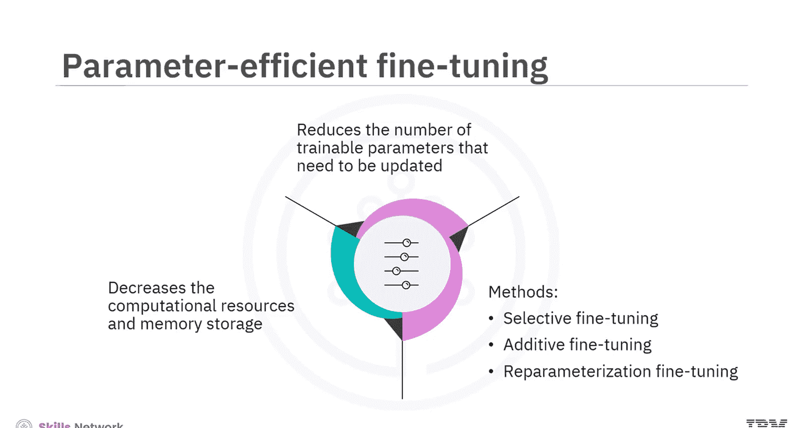
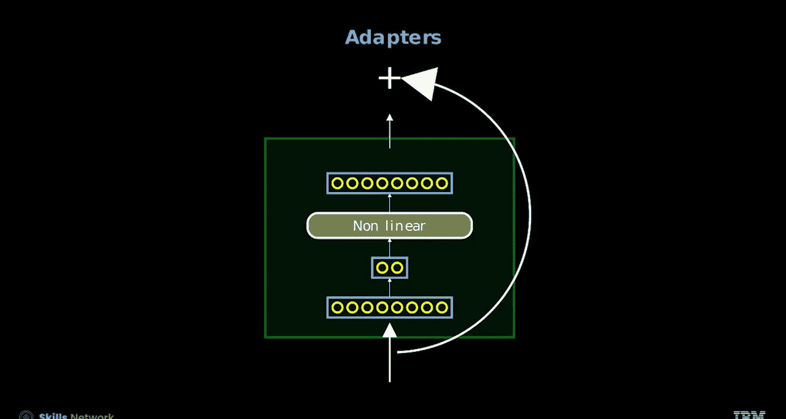
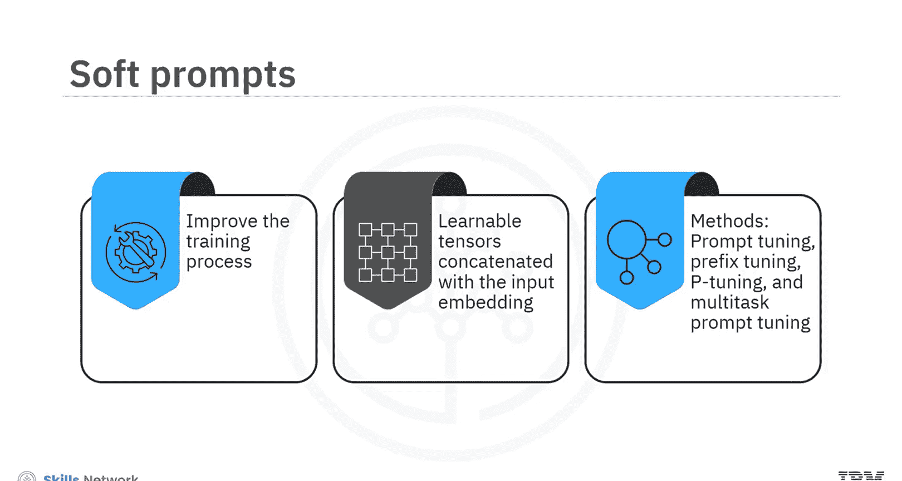
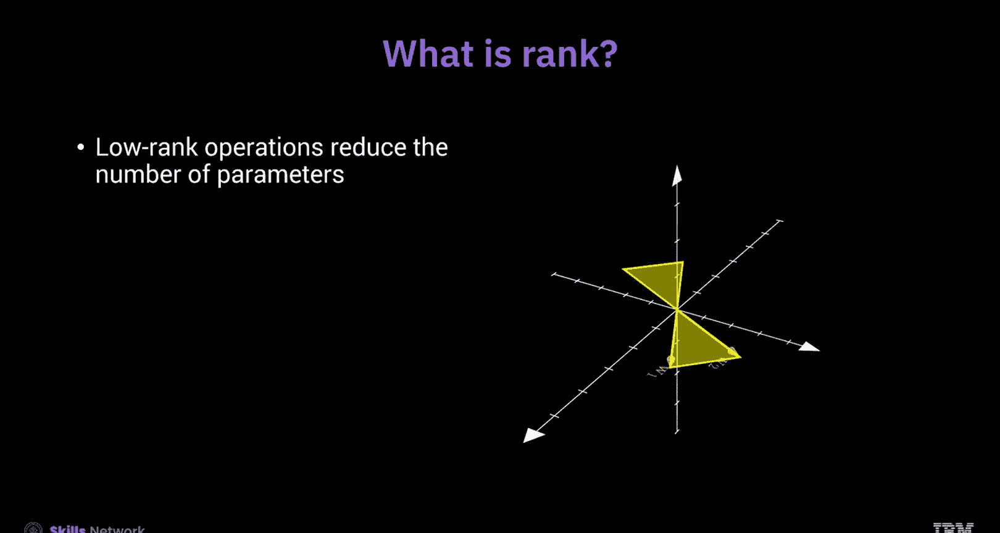
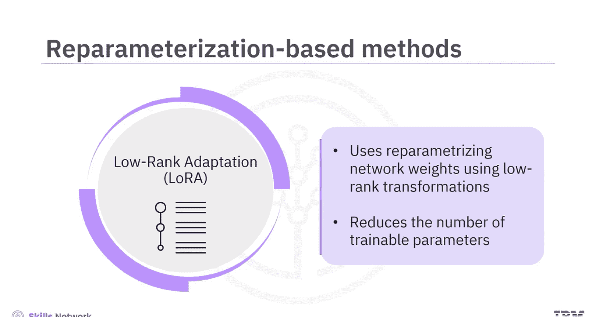
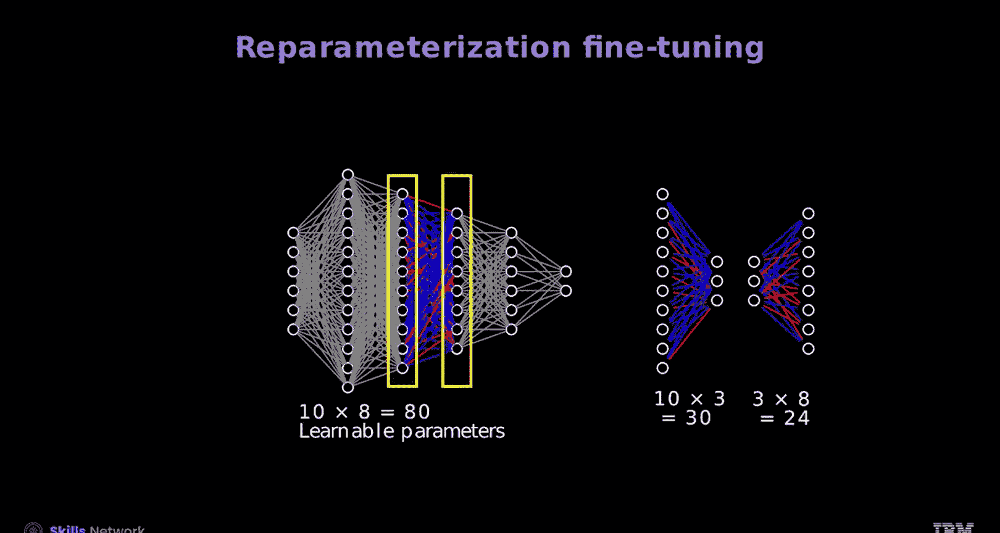
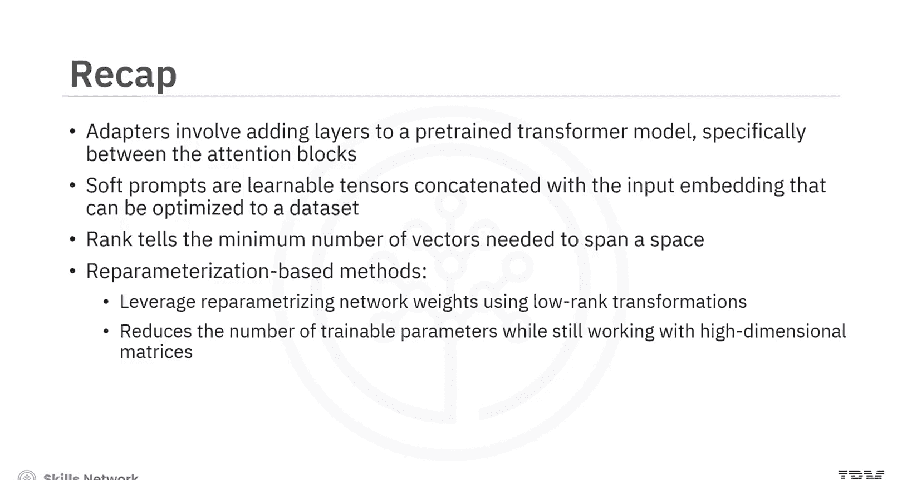

# 参数高效微调 (PEFT) 教程：137：PEFT 简介 🚀

在本节课中，我们将要学习参数高效微调的概念、重要性、主要方法及其核心原理。通过本教程，你将能够解释PEFT的概念，描述其不同类型和用途，并理解软提示和秩的概念。

---

## 监督微调 (SFT) 与全参数微调

上一节我们介绍了课程概述，本节中我们来看看监督微调。监督微调是机器学习中，尤其是在使用预训练模型和迁移学习时常用的一种方法。该方法旨在利用模型从先前训练中获得的知识和理解，并将其适配到新的任务上。

全参数微调是监督微调中常用的一种方法，它涉及更新大型语言模型的学习参数、层和神经元。这种方法需要大量的计算资源、内存以及特定任务的有标签数据。它还存在较高的过拟合风险，耗时且实现复杂。

此外，全参数微调的一个固有问题是灾难性遗忘，即模型在接受新数据训练时会忘记先前学到的信息，导致宝贵的预训练知识丢失。

---

## 参数高效微调 (PEFT) 简介

鉴于全参数微调的上述问题，参数高效微调方法应运而生。PEFT方法减少了为有效将大型预训练模型适配到特定下游应用而需要更新的可训练参数数量。这样做，PEFT显著降低了获得一个有效微调模型所需的计算资源和内存存储。

以下是PEFT的主要方法类别：
*   **选择性微调**
*   **附加式微调**
*   **重参数化微调**

这些方法通常被证明比全参数微调方法更稳定，尤其是在NLP应用场景中。

---

## 选择性微调

首先我们来了解选择性微调。全参数微调涉及更新神经网络的参数、层和神经元，这需要大量的计算资源和内存。相反，选择性微调只更新层或参数的一个子集。

然而，选择性微调对于其他网络架构有效，但对于Transformer架构效果较差，因为Transformer参数数量庞大，需要更广泛的更新。这一局限性促使了替代方法的发展。

---

## 附加式微调

附加式微调是替代方法之一。这种方法不是修改现有的预训练参数，而是在预训练模型中添加新的、任务特定的层或组件。然后，你可以在任务特定数据上训练这些附加层，同时保持预训练参数固定不变。

附加式微调允许进行任务特定的定制，同时保留预训练知识。你可以在模型的任何位置注入附加层。

在Transformer中，适配器用于附加式微调。它们涉及在预训练的Transformer模型中添加层，具体位置在注意力块之间，同时冻结模型的大部分权重。

如果你观察适配器层，它们以一个**下投影层**开始，用于降低输入维度。随后是一个非线性变换，然后是一个**上投影层**，将维度恢复到Transformer的原始维度。

这种设计允许你使用现成的Transformer，只需存储适配器即可。Transformer保持对语言的通用理解，而适配器则存储针对特定问题的信息。

---

## 软提示

训练大型预训练语言模型需要大量的时间和计算资源。随着模型规模增大，你可以利用软提示来改进训练过程。

软提示是可学习的张量，与输入嵌入向量拼接，可以针对数据集进行优化。软提示方法包括提示调优、前缀调优、P调优和多任务提示调优。

让我们更仔细地看看前缀调优。假设你正在将一个通用聊天机器人解码器模型训练成医疗聊天机器人。与其在整个数据集上训练整个模型，你可以简单地将参数化嵌入向量附加到现有嵌入向量上。然后，通过冻结除这些新嵌入向量外的所有参数来训练新模型。

---

## 秩的概念

在了解最流行的PEFT方法——基于重参数化的方法之前，我们先回顾一下秩的概念。秩告诉你张成一个空间所需的最小向量数量。它本质上就是你通常认为的维度。

考虑二维空间中的两个向量。这两个向量可以到达该空间中的任何点，因此秩为2。现在，假设你将这两个向量扩展到三维空间。尽管这两个向量现在存在于三维空间中，但它们仍然只能张成该空间内的一个平面。因此，它们的秩仍然是二，因为它们只能到达二维平面上的点，而非整个三维空间。

在神经网络中，输入和输出层具有固定的维度；然而，你可以使用低秩操作来减少参数数量。即使在更高维度的上下文中，你也只需要两个维度来张成空间，这种维度的降低有助于提高模型效率。

---

## 基于重参数化的方法

基于重参数化的方法，例如低秩自适应，利用了使用低秩变换对网络权重进行重参数化的概念。这减少了可训练参数的数量，同时仍然处理高维矩阵，例如网络的预训练参数。

在一个典型的网络中，前向传播方法使用完整的网络。然而，在LoRA中，额外的低秩层被添加到原始层中，从而减少了表示权重矩阵所需的参数数量。这种重参数化有效地捕获了数据中最重要的方向，在保持模型性能的同时显著降低了计算成本。

其他类似LoRA的流行方法包括量化低秩自适应和权重分解低秩自适应。

QLoRA将低秩自适应与量化相结合，减少了模型的内存占用和计算需求。而DoRA则根据分量的大小调整低秩空间的秩，从而优化模型的性能和效率。

---

## 总结

本节课中我们一起学习了参数高效微调。我们了解到，PEFT方法减少了为有效将大型预训练模型适配到特定下游应用而需要更新的可训练参数数量。

PEFT方法包括选择性微调、附加式微调和重参数化微调。选择性微调只更新层或参数的一个子集，对于Transformer架构效果较差。附加式微调涉及向预训练模型添加任务特定的层或组件，而不是修改现有的预训练参数。适配器用于附加式微调，涉及在预训练Transformer模型的注意力块之间添加层，同时冻结模型的大部分权重。

软提示是可学习的张量，与输入嵌入向量拼接，可以针对数据集进行优化。秩告诉你张成一个空间所需的最小向量数量。

基于重参数化的方法利用了使用低秩变换对网络权重进行重参数化的概念。这减少了可训练参数的数量，同时仍然处理高维矩阵，例如网络的预训练参数。