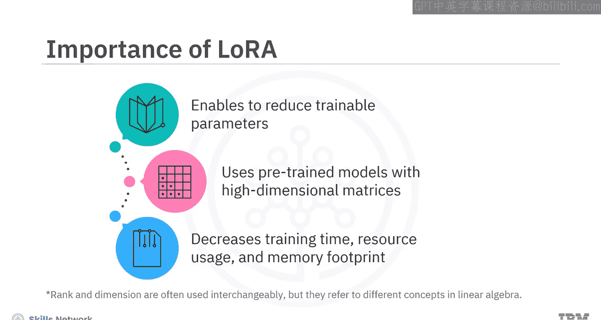
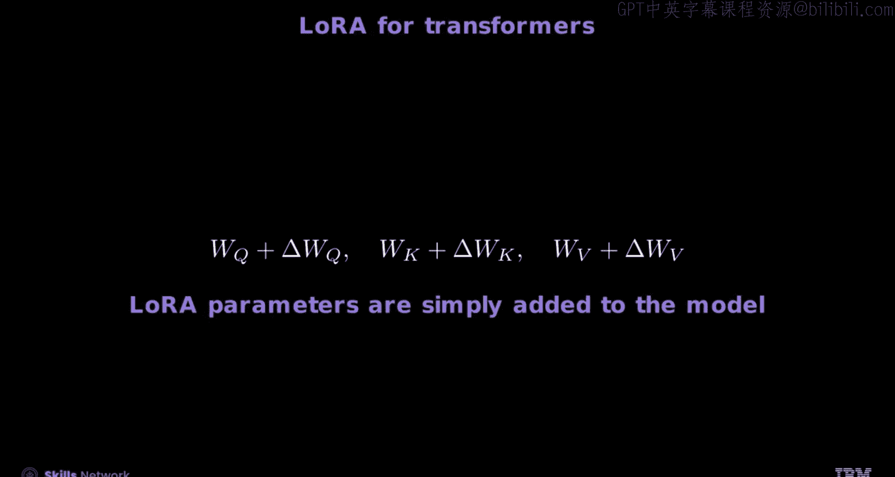
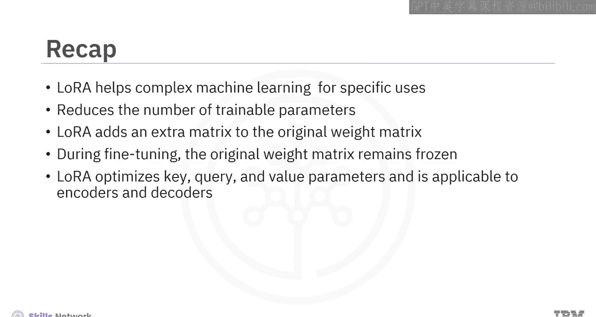

# 生成式人工智能工程：6：低秩适应（LoRA） 🧠

在本节课中，我们将要学习低秩适应（LoRA）技术。这是一种用于高效微调大型预训练模型的方法，它能显著减少训练所需的参数、时间和计算资源。

## 概述

LoRA 是一种通过向原始模型添加轻量级“插件”来简化大型复杂机器学习模型，使其适应特定任务的技术。它的核心思想是利用预训练模型的高维矩阵，通过低秩分解来减少可训练参数的数量。

## LoRA 的工作原理

上一节我们介绍了LoRA的基本概念，本节中我们来看看它的具体工作方式。

LoRA 通过在原始模型的权重矩阵上添加一个低秩更新矩阵来工作。假设原始神经网络层的权重矩阵为 **W0**，其维度为 **D × K**（D是输入维度，K是输出维度）。该层的输出计算为 **h(x) = W0 * x**，其中 **x** 是上一层的输入。

在LoRA中，我们在前向传播时添加一个额外的矩阵 **ΔW**。因此，新的权重矩阵变为：
**W = W0 + ΔW**
而层的输出变为：
**h(x) = (W0 + ΔW) * x**

关键在于，LoRA 将更新矩阵 **ΔW** 分解为两个更小的低秩矩阵 **B** 和 **A** 的乘积：
**ΔW = B * A**
其中，矩阵 **B** 的维度为 **D × R**，矩阵 **A** 的维度为 **R × K**。这里的 **R**（秩）是一个远小于 **D** 和 **K** 的超参数。

## 参数减少示例

为了更直观地理解参数是如何减少的，让我们看一个例子。

考虑一个网络层，其输入维度为10，输出维度为8。传统的全连接层参数数量为：
`10 * 8 = 80` 个参数。

现在，我们引入一个秩 **R=3** 的LoRA适配。以下是参数计算过程：

1.  首先，一个将10维输入映射到3维的矩阵（类似 **B** 矩阵的一部分），参数为 `10 * 3 = 30`。
2.  然后，一个将3维中间结果映射到8维输出的矩阵（类似 **A** 矩阵的一部分），参数为 `3 * 8 = 24`。
3.  总的可训练参数为 `30 + 24 = 54` 个。

通过这种方式，我们使用 **54** 个可训练参数近似实现了原本需要 **80** 个参数才能完成的计算，同时保持了模型的表达能力。图中展示了这一降维过程。

## 训练与优化过程

了解了LoRA的结构后，我们来看看在训练中如何应用和优化它。

在微调过程中，原始模型的权重矩阵 **W0** 被**冻结**（即不更新），只有低秩矩阵 **B** 和 **A** 会被训练。这带来了巨大的优势：

*   **传统网络**的可训练参数数量为：**D × K**
*   **使用LoRA**的可训练参数数量为：**D × R + R × K**

由于 **R** 远小于 **D** 和 **K**，可训练参数总量大幅减少，从而节省了计算资源和内存，尤其是在反向传播过程中。

在前向传播时，通常会对低秩更新应用一个缩放因子，公式如下：
**h(x) = W0 * x + (α / R) * (B * A) * x**
其中 **α** 是一个与 **R** 相关的超参数，用于控制适配更新的强度。

## LoRA 的损失函数与应用

LoRA 是一个通用的参数优化框架，特别适用于拥有海量参数的Transformer模型。

在训练中，我们定义一个损失函数 **L**，它依赖于输入序列 **x** 和目标 **y**。由于只有 **ΔW**（即 **B** 和 **A**）是可训练的，损失函数实际上只是矩阵 **A** 和 **B** 的函数。优化器（如Adam）通过梯度下降算法只更新这些低秩参数。

根据原始LoRA论文的表述，对于自回归模型（如GPT），损失函数可以表示为对数似然：
`L(θ) = Σ_t Σ_i log P(ω_i | x_i; θ)`
其中，**θ** 代表LoRA参数（**A** 和 **B**），**ω** 代表目标词元，**x** 代表对应的嵌入向量。第一个求和遍历序列中的每个预测位置，第二个求和遍历训练样本。

LoRA 主要应用于Transformer的注意力层，优化其**查询（Query）、键（Key）和值（Value）** 投影矩阵的参数。它既可以用于编码器，也可以用于解码器。

## 总结

本节课中我们一起学习了低秩适应（LoRA）技术。

*   **核心目标**：LoRA 通过向原始模型添加轻量级的低秩适配器，使复杂的机器学习模型能够高效地适应特定任务。
*   **核心机制**：它利用矩阵代数，将权重更新矩阵 **ΔW** 分解为两个小矩阵 **B** 和 **A** 的乘积（**ΔW = B * A**），从而大幅减少可训练参数。
*   **训练特点**：在微调时，原始权重 **W0** 保持冻结，仅更新低秩矩阵 **B** 和 **A**。
*   **主要优势**：显著减少了训练时间、资源消耗和内存占用。
*   **主要应用**：特别适用于微调大型Transformer模型，优化其注意力机制中的参数，并可同时应用于编码器和解码器结构。

通过LoRA，我们能够在保持模型性能的同时，以更高效、更经济的方式利用强大的预训练模型。图中概括了LoRA的整体工作流程。

