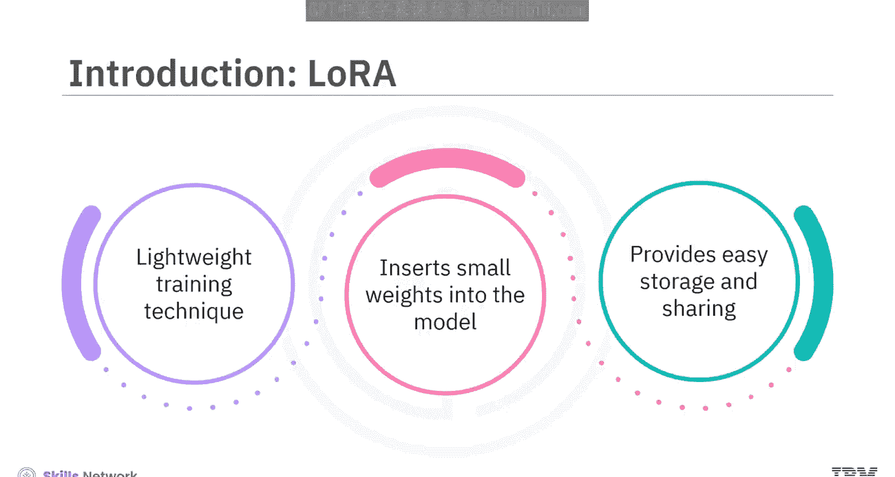
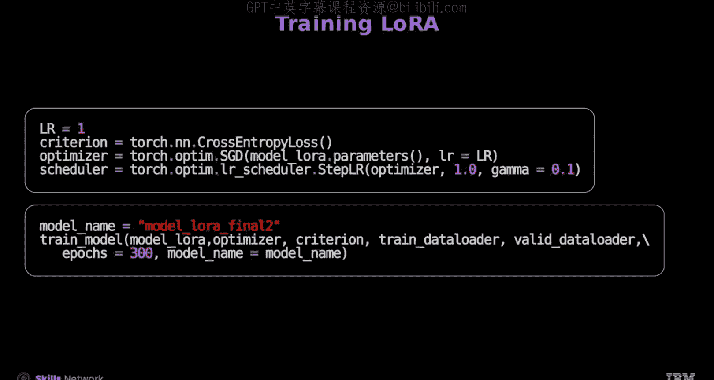
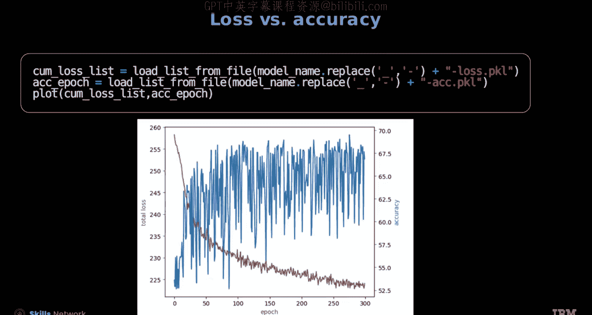
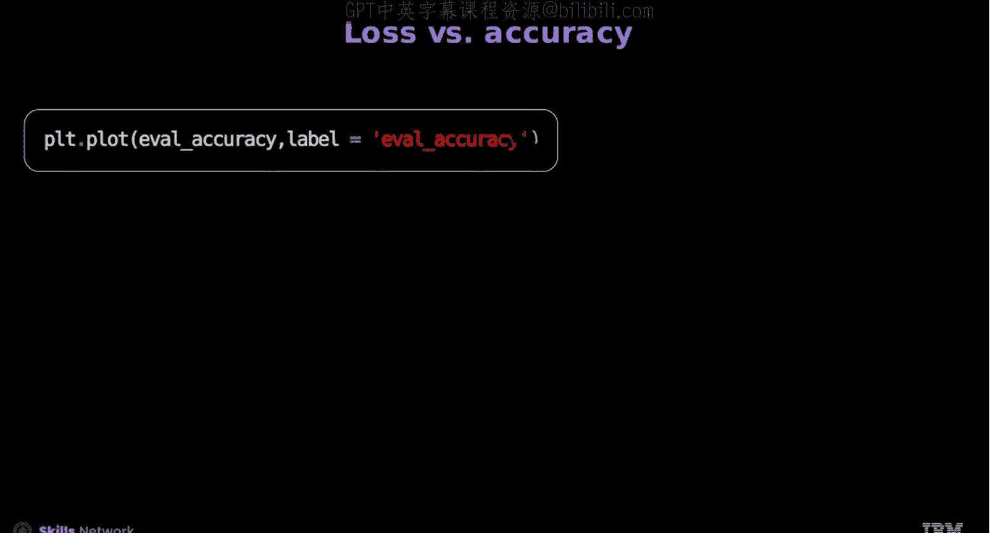
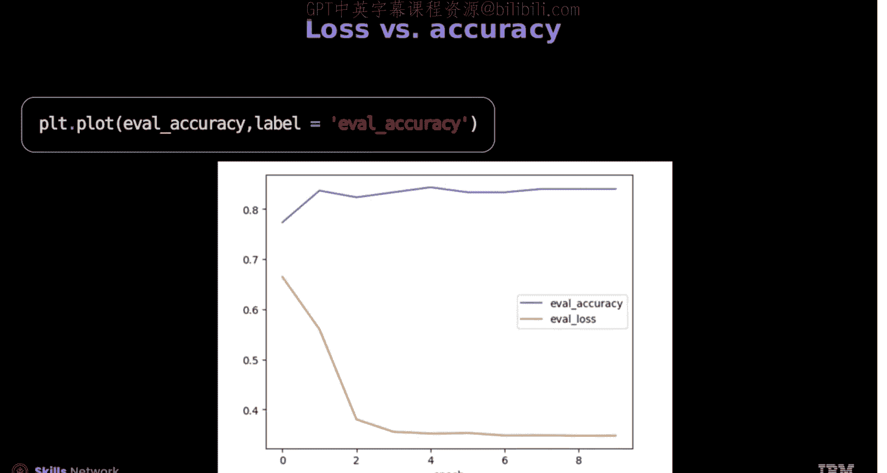

# 生成式人工智能工程：7：使用Hugging Face和PyTorch进行LoRA 🚀

在本节课中，我们将学习如何使用PyTorch和Hugging Face库来实现LoRA技术。LoRA是一种轻量级的训练技术，能显著减少大型语言模型中的可训练参数量，从而实现更快速、更节省内存的微调过程。

## 概述

LoRA通过向预训练模型中插入新的、低秩的小权重矩阵进行训练，而非更新整个庞大的原始模型。这种方法不仅训练速度快、内存效率高，还能生成更小的模型权重文件，便于存储和共享。

上一节我们介绍了微调的基本概念，本节中我们来看看如何具体实现LoRA。



## 使用PyTorch实现LoRA

首先，我们需要准备数据集。这里使用互联网电影数据库数据集进行情感分类任务。

以下是创建数据迭代器的步骤：

1.  定义一个类来遍历IMDB数据。
2.  使用该类创建训练和测试数据集迭代器。
3.  将数据转换为Map风格，并进行随机分割以用于训练和验证。

此时，可以指定训练设备。`collate_batch`函数用于从单个样本中自定义和创建批次。

通过应用`collate`函数并设置批次大小为64，将数据集对象转换为数据加载器。

接下来，定义一个简单的文本分类器类，例如`TextClassifier`。它包含一个嵌入层、一个使用ReLU激活函数的隐藏线性层和一个输出线性层。

现在，我们需要修改高亮的隐藏层，将其转换为LoRA层。

让我们看看`LoRALayer`类。该类实现了一个LoRA模块，它从两个低秩矩阵A和B开始，并将其乘积按因子`alpha`进行缩放。

```python
# LoRA层的前向传播方法示例
def forward(self, x):
    lora_output = self.A @ self.B @ x
    return self.original_output + self.alpha * lora_output
```

在训练模型时，只更新矩阵A和B。`LinearWithLoRA`类复制原始线性模型并创建一个LoRA层对象。在其前向传播方法中，它对输入X同时应用原始线性模型和LoRA模型，并将输出相加。

现在，让我们加载一个在AG News数据集上预训练的模型。该模型有4个输出类别，由于其训练样本量大，具有较好的语言理解能力。

要初始化此模型，需将`num_classes`设置为4。该预训练模型的嵌入层未被冻结，因此初始化时设置`freeze=False`。IMDB数据集包含两个类别，需要将最终输出层替换为一个输出数为2的新线性层。



接着，将隐藏层替换为LoRA层，确保在训练过程中更新矩阵A和B。

现在，让我们定义`train_model`函数来微调模型。



首先，为模型设置训练组件并定义学习率。使用交叉熵损失准则，采用随机梯度下降优化器，并设置学习率调度器，在每个训练周期将学习率衰减0.1倍。

然后，通过绘制每个周期的损失和准确率图表来评估模型性能，并监控模型的改进情况。

评估模型性能后，定义评估函数并在测试数据上获得了69%的模型准确率。从模型的LoRA层中，可以获取可学习参数A、B和`alpha`，并将它们保存下来以便未来加载模型。

矩阵A和B大约有450个参数，而存储整个线性层将需要约12，800个参数，大约是原始参数的28倍。LoRA的主要优势在于，它可以使用参数A、B和`alpha`来微调模型，同时使用输出层对样本进行分类。

接下来，让我们使用保存的参数加载模型。可以创建模型对象并加载预训练的参数。

此外，定义了一个使用模型进行预测的函数，以展示模型的性能。

## 使用Hugging Face实现LoRA

LoRA与Hugging Face结合使用，使得模型训练变得更加简单。

首先，加载IMDB数据集来训练模型。接着，加载DistilBERT分词器，并应用该分词器为给定文本创建输入ID和注意力掩码。

屏幕会显示分词后的文本。然后，从Hugging Face Transformers库加载一个类似BERT的双向Transformer模型，在本微调示例中设置输出类别数为2。

接下来，使用`TaskType`模块中的序列分类类型来定义任务类型，以对评论进行分类。

进一步定义LoRA的配置，并加载预训练的分类模型来应用此配置。设置秩`rank`和LoRA缩放因子`alpha`，并为更大的模型包含`dropout`参数。`target_modules`参数指定了希望更新的模型部分。

Hugging Face的LoRA通过`target_modules`参数来增强Transformer模型的特定部分。然后，使用指定的配置将LoRA应用到给定模型，并通过参数高效微调模型进行初始化。

现在，让我们了解如何在模型中设置训练参数。为此，使用`TrainingArguments`类，它封装了训练模型所需的所有超参数和配置。这使得训练过程变得简单，并有助于管理训练过程的各个方面。



接下来，使用`Trainer`来训练模型。`Trainer`类有助于简化Transformer模型的训练和评估，它处理训练循环并保存模型。这意味着你可以使用`Trainer`轻松地训练模型。



最后，绘制损失与准确率的图表，以验证模型性能的改进。

## 总结

本节课中，我们一起学习了LoRA如何与PyTorch和Hugging Face协同工作。

在PyTorch部分，模型使用IMDB数据集和自定义类来创建训练和测试数据迭代器。`collate_fn`函数从各种样本中整理和自定义批次。文本分类器使用嵌入层对文本进行分类。`LoRALayer`类在预训练模型中实现了LoRA模块。使用`train_model`函数对模型进行微调，评估模型性能并给出准确率。


在Hugging Face部分，LoRA简化了模型训练过程。模型使用分词器创建输入ID，并从Hugging Face Transformers库加载BERT-like模型。使用序列分类类型定义任务类型，并定义LoRA的配置。`TrainingArguments`帮助设置模型训练参数，而`Trainer`类则帮助训练模型。