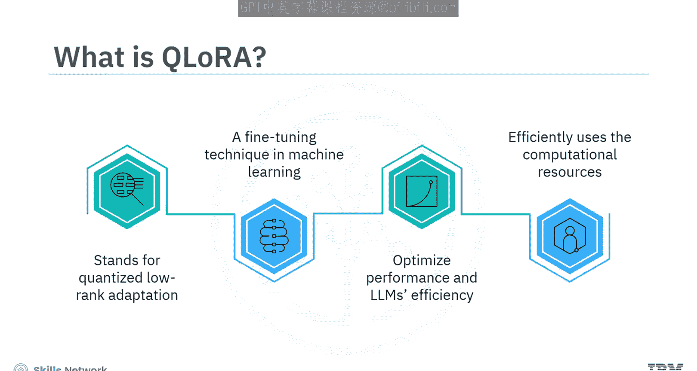
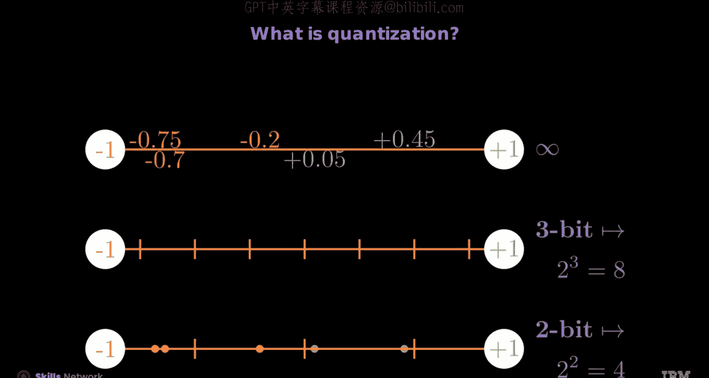
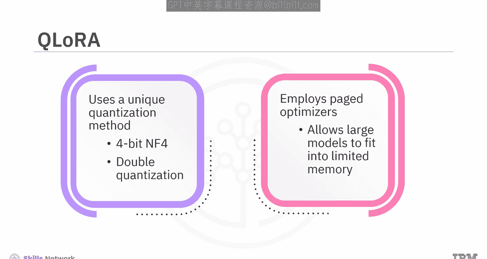
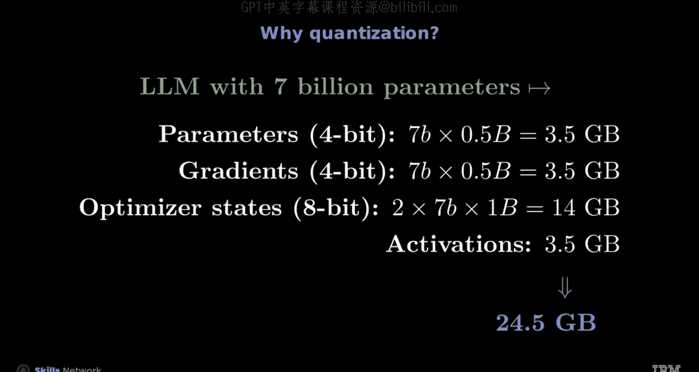

# 生成式人工智能工程：8：从量化到QLoRA 🧠

在本节课中，我们将要学习量化（Quantization）与QLoRA（Quantized Low-Rank Adaptation）的核心概念。你将能够定义量化与QLoRA，并解释QLoRA技术的重要性。

## 什么是QLoRA？ 🤔

上一节我们介绍了课程目标，本节中我们来看看QLoRA是什么。

QLoRA代表量化低秩适应。它是一种机器学习中的微调技术，旨在优化大型语言模型的性能和效率。通过结合量化与LoRA技术，可以在不显著牺牲模型准确性的前提下，高效地利用计算资源。

## 理解量化 📉

在深入QLoRA之前，我们需要先理解其基础组件之一：量化。

量化将数值的精度降低到一个有限的离散级别集合中。这减少了内存使用量，并使得在精度有限的硬件上能够进行高效计算。

例如，将一张图像的色彩转换为256级灰度时，量化可以将灰度级别从256减少到16、8、4甚至2级。这些级别的减少会降低图像的细节表现。这意味着随着量化程度的增加，图像看起来会不那么生动，但占用更少内存的同时仍保持可识别性。

以下是量化范围和级别的定义方式：

在QLoRA中，量化范围通常在-1到1之间。用于表示数值的比特数决定了量化级别。
*   例如，3比特量化表示8个离散级别：-1, -0.75, -0.5, -0.25, 0.25, 0.5, 0.75, 1。因此，数字的量化值可能是：-0.75量化为-0.75，-0.7量化为-0.75，-0.2量化为-0.25，0.05量化为0.25，0.45量化为0.5。
*   类似地，2比特量化表示4个离散级别：-1, -0.5, 0.5, 1。因此，示例数字的量化值可能是：-0.75量化为-1，-0.7量化为-1，-0.2量化为-0.5，0.05量化为0.5，0.45量化为0.5。

## QLoRA的独特方法 ⚙️

了解了基础量化后，我们来看看QLoRA采用的独特方法。

QLoRA使用一种独特的量化方法：4比特标准浮点（4-bit NormalFloat， NF4）和双重量化（Double Quantization）。它还采用了分页优化器（Paged Optimizers）。分页优化器并非量化技术，而是一种内存管理技巧。它允许通过根据需求动态加载和卸载模型参数，使大模型能够适应有限的内存。

## 量化如何减少内存占用 💾

现在，让我们通过一个具体例子，理解量化如何减少模型的内存占用。

我们以一个70亿参数的模型为例，考虑模型参数、梯度、优化器状态和激活值。

以下是各项内存占用的计算：

1.  **模型参数**：
    *   FP16模型使用16比特表示每个参数。总内存占用为：`70亿参数 * 2字节 = 14 GB`。
    *   4比特量化模型使用4比特表示每个参数。总内存占用为：`70亿参数 * 0.5字节 = 3.5 GB`。

2.  **梯度**：
    *   FP16梯度使用16比特表示每个梯度。总内存占用为：`70亿梯度 * 2字节 = 14 GB`。
    *   4比特量化梯度使用4比特表示每个梯度。总内存占用为：`70亿梯度 * 0.5字节 = 3.5 GB`。

3.  **优化器状态**：
    *   FP32优化器状态使用32比特表示每个状态。通常有两个状态，总内存占用为：`2 * 70亿状态 * 4字节 = 56 GB`。
    *   8比特量化优化器状态使用8比特表示每个状态。对于两个状态，总内存占用为：`2 * 70亿状态 * 1字节 = 14 GB`。

4.  **激活值**：
    *   假设FP16激活值与模型参数大小相同，内存占用为：`70亿激活值 * 2字节 = 14 GB`。
    *   假设4比特量化激活值与模型参数大小相同，内存占用为：`70亿激活值 * 0.5字节 = 3.5 GB`。

**内存占用对比**：
*   **FP16模型总内存占用**：14 GB + 14 GB + 56 GB + 14 GB = **98 GB**
*   **4比特量化模型总内存占用**：3.5 GB + 3.5 GB + 14 GB + 3.5 GB = **24.5 GB**

因此，通过应用4比特量化，内存占用从98 GB（FP16）减少到24.5 GB，**减少了约75%**。这种内存占用的大幅降低，使得我们能够在性能较低的硬件上运行大型模型。

## 总结 📚

本节课中我们一起学习了量化与QLoRA。

*   理解量化和QLoRA技术对于开发高效、可扩展的机器学习模型至关重要。
*   QLoRA是一种用于优化大型语言模型性能的机器学习微调技术。
*   QLoRA采用独特的量化方法（NF4和双重量化）来减少内存占用。
*   QLoRA可以将内存占用减少高达75%。
*   量化通过定义量化范围和级别，将数值精度降低到有限的离散级别集合中。