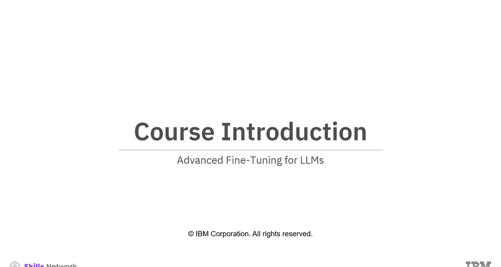
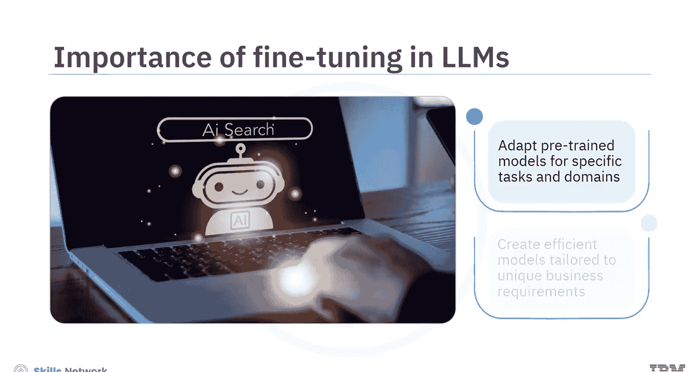
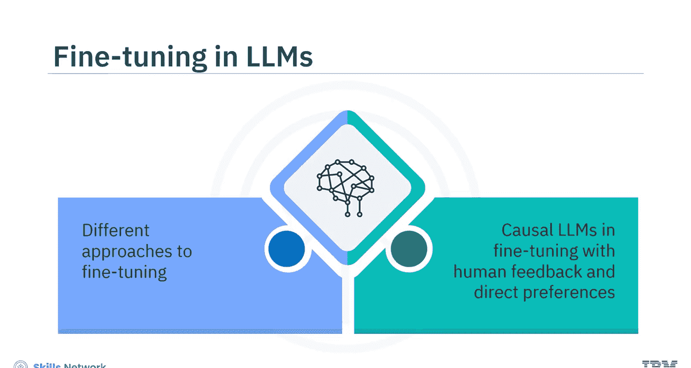
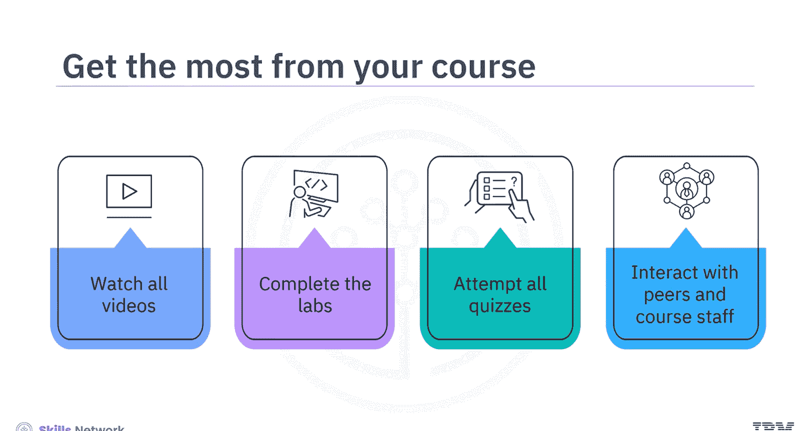

# 生成式人工智能工程：141：高级微调课程介绍 🎯

在本课程中，我们将学习针对大语言模型（LLMs）的高级微调技术。通过掌握这些方法，你将能够使预训练模型更好地适应特定任务和领域需求。

## 课程概述

大语言模型的高级微调是一项强大的技术。它有助于使预训练模型适应特定的任务和领域。理解高级微调技术并实施其最佳实践，可以创建出符合独特业务需求的高效模型。

本课程将聚焦于不同的微调方法及其最佳实践，涵盖因果大语言模型、基于人类反馈的微调以及直接偏好优化等核心概念。

## 目标受众

本课程适合现有的和有抱负的数据科学家、机器学习工程师、深度学习工程师、人工智能工程师以及希望精通大语言模型工作的软件开发人员。

## 预备知识

学习本课程需要具备Python、PyTorch和Hugging Face的基础知识。了解Transformer、指令微调、强化学习、直接偏好优化、最优策略以及因果大语言模型将更有优势。

## 学习目标

完成本课程后，你将能够：
*   应用指令微调的基础知识及其在Hugging Face上的最佳实践。
*   学习使用人类反馈，通过直接偏好优化（DPO）或近端策略优化（PPO）来训练模型。

## 课程内容详解

以下是本课程将涵盖的核心模块：

上一节我们介绍了课程的整体目标，本节中我们来看看具体的学习路径。

*   **指令微调基础**：你将首先探索使用Hugging Face进行指令微调的基础。你将深入了解奖励建模、用于数据集预处理的响应评估，并应用低秩自适应（LoRA）技术。
*   **奖励模型训练**：你还将学习如何通过遵循特定指令来生成相关响应，从而为语言模型进行奖励模型训练。
*   **性能评估**：你将探索使用Hugging Face进行奖励建模，以评估模型的性能。

这还不是全部。本课程将进一步深入探讨以下高级概念：

上一部分我们学习了指令微调，接下来我们将进入更深入的策略层面。

*   **大语言模型即策略**：深入理解大语言模型作为策略的概念，及其作为生成可能响应的分布函数的关系。
*   **人类反馈的强化学习**：学习基于人类反馈的强化学习（RLHF），以使用技术方法解决PPO问题。
*   **近端策略优化**：进一步学习如何使用PPO，以及如何配置PPO来为输入查询获取可能的响应。
*   **直接偏好优化**：探索直接偏好优化（DPO）及其算法，使用数学函数寻找DPO问题的最优解。

## 实践与工具

在本课程中，你将主要聚焦于Hugging Face库，因为它比直接使用PyTorch更加 streamlined（高效便捷）。

本课程包含用于巩固教学视频知识的实验。动手练习基于Jupyter Lab，用于实践所学概念和技术。这些实验反映了使用Hugging Face和PyTorch进行大语言模型预训练和微调的学习过程。

## 学习建议

为了从课程中获得最大收益：
1.  观看所有视频。
2.  完成实验以练习新技能。
3.  尝试所有测验。
4.  你还可以通过课程讨论论坛与同伴互动并向课程工作人员寻求帮助。

让我们开始这段激动人心的旅程。祝你好运！

## 总结

本节课中我们一起学习了《高级大语言模型微调》课程的介绍。我们明确了课程目标、适合的学习者、所需的预备知识以及将涵盖的核心技术，包括指令微调、奖励建模、RLHF、PPO和DPO。同时，我们也了解了课程以Hugging Face为主要实践工具，并通过实验加强学习效果。现在，你已经为接下来的深入学习做好了准备。