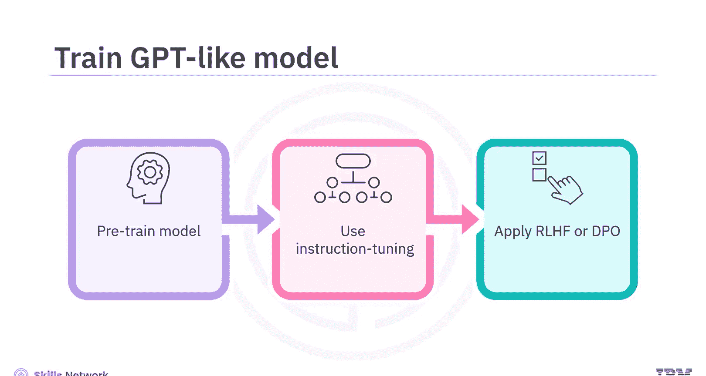
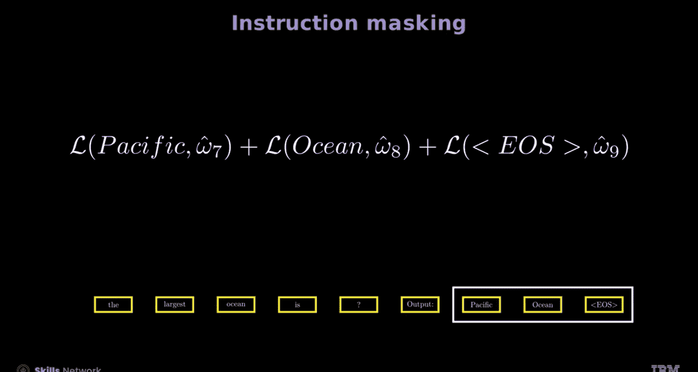

# 生成式人工智能工程：142：指令调优基础 🧠

在本节课中，我们将要学习指令调优的基础知识。指令调优是提升大型语言模型遵循指令并准确执行特定任务能力的关键技术。通过本教程，你将能够定义指令调优，描述其基本流程，并理解其中的核心概念，如特殊符号、提示格式以及指令掩码。

## 什么是指令调优？

上一节我们介绍了课程概述，本节中我们来看看指令调优的定义。指令调优，也称为监督式微调，其核心是使用专家标注的数据集对预训练模型进行进一步训练。**指令调优 = 使用（指令， 输入， 输出）格式的数据对模型进行有监督微调**。这个过程通过为模型提供具体的指令和上下文，来增强模型在特定任务上的表现，并确保任务被准确处理。指令调优通常在执行直接偏好优化或基于人类反馈的强化学习之前使用，旨在为模型建立坚实的理解基础，从而产生精确可靠的结果。

## 如何训练一个类GPT模型？

理解了指令调优的目的后，我们来看看它在整个模型训练流程中的位置。训练一个类GPT模型通常包含三个主要步骤：

以下是训练流程的三个阶段：
1.  **预训练**：通过预测序列中的下一个词来训练模型，例如在GPT中。
2.  **指令调优**：使用专家标注的示例对模型进行微调。
3.  **RLHF或DPO**：应用基于人类反馈的强化学习或直接偏好优化来进一步对齐模型行为。

## 指令调优示例

为了更具体地理解，让我们深入一个指令调优的例子。考虑一个用于教育目的的大型语言模型，它通过指令调优训练成为一个因果语言模型。这个模型被设计用来回答诸如“哪个是最大的海洋？”这样的问题。类GPT模型与普通因果语言模型的关键区别在于其经过专门训练和包含教育内容。

## 指令调优的关键组成部分

指令调优有几个关键的考量因素。模型需要指令和答案。一个反直觉的方面是，模型会生成指令以及响应，因为它计算的是整个序列（包括响应）的似然。例如，当输入是“最大的海洋是”时，模型会生成完整的指令和响应，如屏幕上所示。使用指令调优模型，这个过程相对容易管理，模型能通过更有效地解释和执行指令来执行各种任务。

它使用带有模板的数据集，包含三个核心组件：

以下是数据集的三个核心组件：
*   **指令**：为用户提供方向或命令，指定用户希望模型做什么。它也定义了模型应执行的任务或操作。你可以为模型提供指令来生成文本、翻译语言、总结内容、回答问题或执行特定计算。
*   **输入**：模型为完成指令而需要处理的数据或上下文。输入数据可以是一段文本、一个列表、一个问题或任何其他模型执行任务所需的数据。需要注意的是，并非所有数据集都包含输入，有些只包含指令和输出。
*   **输出**：定义期望的结果或响应。

## 特殊符号的作用

现在，让我们学习特殊符号在指令调优中的角色。考虑这个例子：指令是“创建一个应用线性函数的Python函数”，输出是“def function(x): return a linear function”。这对人类来说难以阅读。你可以看到输出被调整为“def function(x): return x**2 + 3*x”，这说明了特殊符号（如换行符`\n`）和格式的重要性。这种方法确保模型正确解释和处理结构化数据。请注意，此示例不包含输入。

此外，调整提示格式以保持与不同模型分词器的兼容性至关重要，即使用特殊标记来格式化提示。这种方法有助于正确解释输入的特定部分。例如，使用`### Instruction:`和`### Response:`可以确保模型的分词器为这些部分分配了适当的标记索引或ID，从而帮助模型正确处理。这对于像Meta的Open Pretrained Transformer这样的模型的分词器很重要。然而，其他模型或数据可能对指令和响应使用不同的标记，例如`### Human:`和`### Assistant:`。

## 探索指令掩码

在指令掩码中，目标是将损失计算集中在特定的关键标记上，而不是所有输出标记上。与生成式预训练类似，目标是预测向前移动一个时间步的输入，但损失函数略有修改。给定一个序列，特殊标记“指令”位于提示“最大的海洋是”之前，特殊标记“输出”位于响应“太平洋”之前。模型随后学习预测移位后的序列：“指令 最大的海洋是 输出 太平洋 EOS”。

为了理解损失是如何修改的，让我们分解通过最终线性层后的输出逻辑。考虑时间戳T的输入标记（记为ω_t）和相应时间戳的输出逻辑（在PyTorch中通常显示为红色）。交叉熵损失通常在模型的输出逻辑和序列中的下一个标记（记为y_{t+1}）之间计算。为清晰起见，将损失写为实际预测标记ω_hat。在损失计算中，在生成式预训练中，你可以对批次中的标记求和。然而，指令掩码将损失计算限制在关键标记上。

例如，输入指令是“最大的海洋是”。预测输出将是移位序列（在图中以黄色框显示）。在常规微调中，模型会学习预测“指令”、“最大的海洋是”、“输出”、“太平洋”和“EOS”。而在指令调优中，通过掩码，模型只学习预测“太平洋”和“EOS”。这种有针对性的方法确保模型专注于序列的重要部分。

## 指令掩码的注意事项

最后，让我们看看指令掩码的一些考量。研究表明，对于较小的数据集，未掩码的指令有时表现更好。相反，一些库默认对指令进行掩码。在Hugging Face中，你应该使用一个名为`DataCollatorForCompletionOnlyLM`的函数来指定指令是否被掩码。然而，特殊标记通常会被掩码。

## 总结

本节课中我们一起学习了指令调优的基础知识。指令调优涉及使用专家策划的数据集训练模型。对于指令调优，模型需要指令和答案。指令调优通过更有效地解释和执行指令来帮助执行各种任务以生成响应。指令调优使用指令、输入和输出。你可以调整提示格式以保持与不同模型分词器的兼容性。最后，指令掩码专注于特定标记的损失计算。

