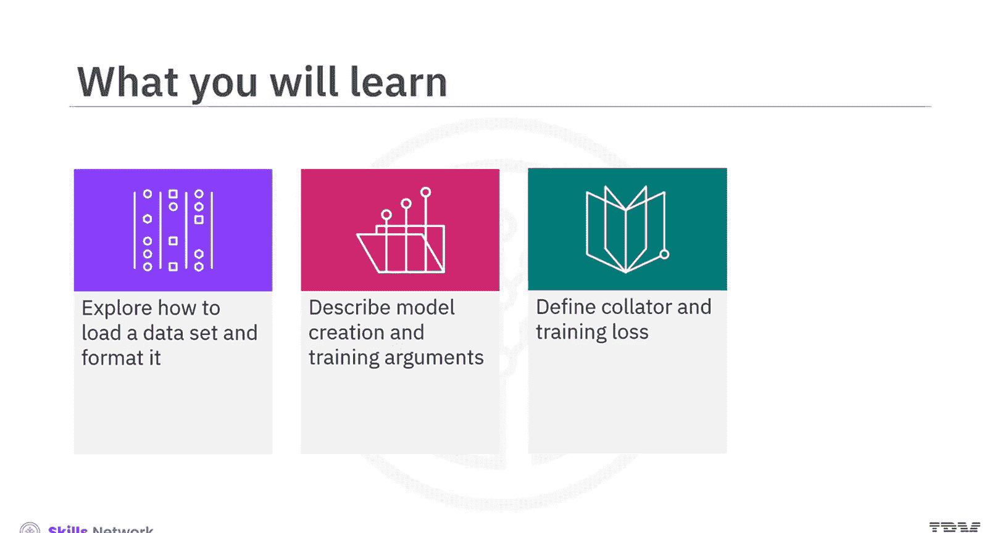
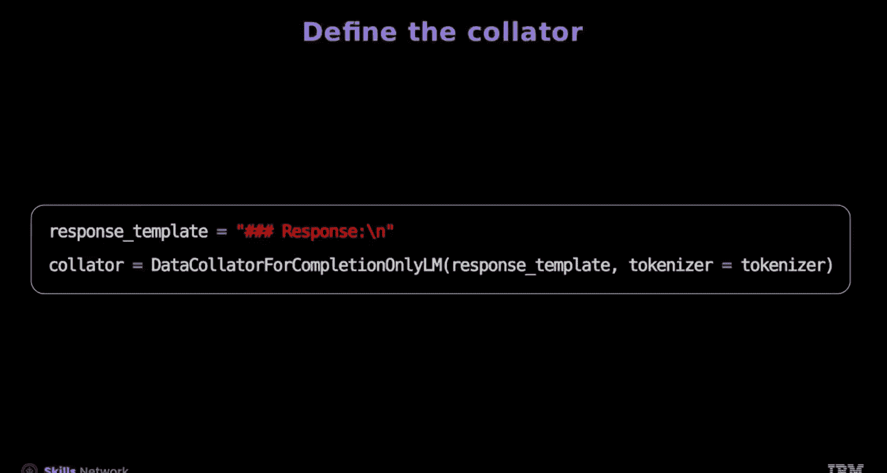
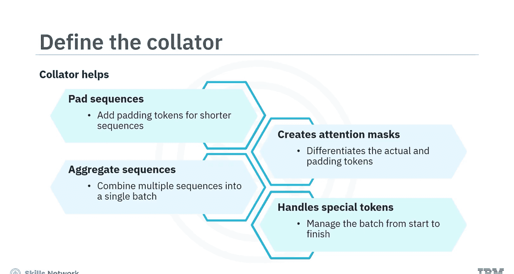
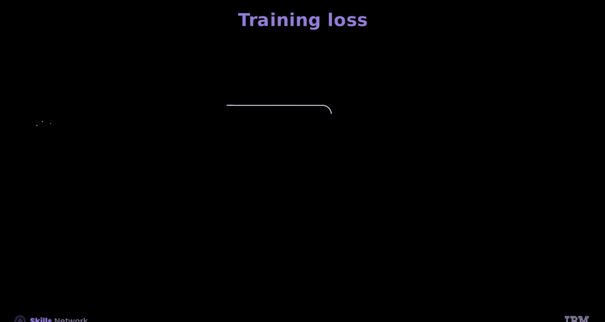
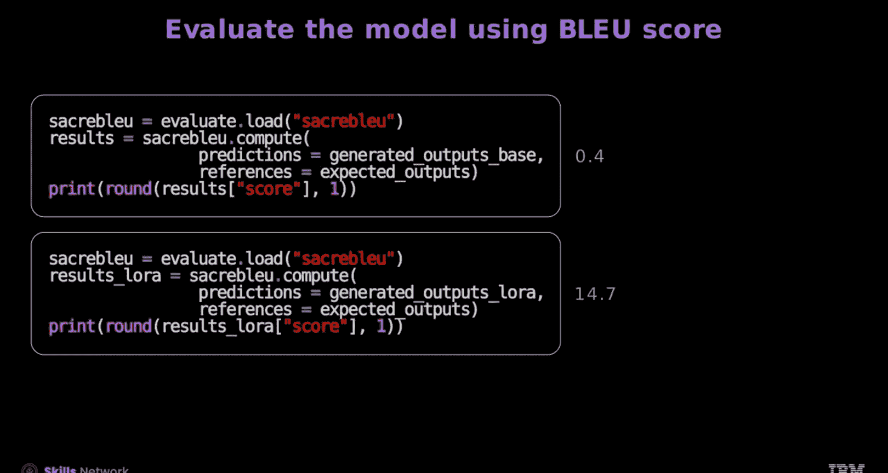

# 生成式人工智能工程：143：使用Hugging Face进行指令调优 🚀

在本节课中，我们将学习如何使用Hugging Face库对预训练语言模型进行指令调优。指令调优，也称为指令GPT，通过让模型遵循特定指令来生成恰当的回答，从而训练语言模型。我们将涵盖从加载和格式化数据集，到创建模型、定义训练参数，再到构建文本生成管道的完整流程。

## 概述

指令调优的核心是让模型学会根据给定的“指令”和可选的“上下文”来生成“回答”。数据集中提供了结构化的指令、上下文和回答示例，这对于训练至关重要。模型会将上下文和指令连接成一个单一的输入序列，并据此生成所需的回答。

## 加载与格式化数据集

首先，我们需要加载一个合适的数据集。这里我们使用Code Alpaca 20K数据集，这是一个编程代码数据集。

以下是该数据集的组成部分：
*   **instruction**: 给模型的唯一任务描述。
*   **input**: 任务的可选上下文或输入（约40%的示例中包含）。
*   **output**: 针对指令的答案。

接下来，将数据集按80%训练集和20%验证集的比例进行划分。为了进行微调，我们将丢弃那些包含输入值的样本。

对数据进行预处理至关重要，我们需要创建函数来生成提示模板。

以下是用于格式化数据的两个关键函数：
*   **`formatting_prompt_func`**: 此函数以数据集为输入，针对数据集中的每个元素，将指令和输出格式化为一个模板。格式通常为：`### 指令: {instruction} ### 回答: {output}`。在文本末尾添加句子结束（EOS）标记，以指示模型应在此处停止生成文本。
*   **`formatting_prompt_func_no_response`**: 此函数与`formatting_prompt_func`类似，但不包含回答部分。该函数用于在验证模型时，为生成回答准备样本。

为了创建格式化数据集，我们使用以下代码块：
1.  第一个代码块对输入进行清理和分词，并对回答进行分词以供评估。
2.  第二个代码块定义一个从数据集获取的列表数据集类，并从中创建一个PyTorch数据集对象。这个类有助于从指令生成数据集对象。

## 创建与配置模型

我们将通过加载Hugging Face上的基础模型来微调Facebook的OPT-350M模型。

为了节省时间和计算资源，可以使用参数高效微调方法，例如低秩适应。首先，将基础模型转换为适合LoRA的PEFT模型。

接下来，通过定义LoRA配置对象来微调LoRA。配置参数包括LoRA秩、目标模块以及用于因果语言模型的任务类型。使用`get_peft_model`将此配置应用到模型上，将其转换为用于训练的LoRA模型。

为了训练模型，我们定义监督微调配置：
*   **`output_dir`**: 定义模型和训练文件的保存位置。
*   可以自定义训练周期数以及训练和评估的批次大小。
*   **`evaluation_strategy`**: 定义评估时机，例如设置为每个训练周期结束后进行评估。
*   **`max_seq_length`**: 控制输出回答的最大长度。
*   **`fp16`**: 设置为`True`以启用16位浮点精度，实现高效训练。

## 定义数据整理器与训练器

现在，我们使用来自Transformers强化学习库的`DataCollatorForCompletionOnlyLM`来定义数据整理器。该整理器为文本补全任务准备训练语言模型的数据批次，并在计算损失时屏蔽输入中的指令部分。

此外，数据整理器还执行以下操作：
*   为较短的序列添加填充标记，确保一个批次内的序列长度统一，并截断较长的序列。
*   创建注意力掩码，以区分实际指令和填充标记，防止填充标记影响模型学习。
*   将多个序列组合成单个批次，以实现高效处理。
*   管理从开始到结束的批次特殊标记，包括填充标记。

接下来定义训练器。通过将格式化函数传递给训练器来处理数据预处理，从而创建SFT训练器对象。

然后将`packing`参数设置为`False`，表示不打包多个短示例。`max_prompt_length`参数控制提示长度。最后，将数据整理器传递给SFT训练器。

让我们回顾一下数据管道：
1.  加载训练数据集。
2.  `formatting_prompt_func`函数从数据集中的元素生成提示。
3.  数据整理器处理分词和掩码操作。

训练期间保存的训练损失可以在`trainer.state`中绘制图表进行查看。

## 构建文本生成管道与评估

为了简化流程，Hugging Face的管道可以自动处理模型加载、分词、填充和文本生成参数。

要评估模型的文本生成能力，可以使用Transformers库中的文本生成管道。

首先，使用`pipeline`类定义管道，并为其指定模型和分词器。将任务设置为`text-generation`。`max_length`定义生成文本的最大长度。最后，将`return_full_text`设置为`False`，使其仅返回回答而不包含指令。

接下来，通过向管道传递输入来生成文本以获取回答。可以使用如`num_beams`等函数来生成更高质量的文本。`early_stopping`参数控制基于束搜索方法的停止条件。创建管道后，传入输入即可生成回答。

最后，我们使用双语评估替换分数来评估模型。对于语言模型，使用定量指标进行评估具有挑战性。BLUE是编码任务中的一个有用指标，而SacreBLEU是BLUE的标准化变体。

结果显示，微调后的模型获得了14.7/100的SacreBLEU分数，显著优于基础模型的0.4/100。因此，经过指令微调的模型生成的回答与数据集中预期的回答更加吻合。

## 总结

本节课中，我们一起学习了使用Hugging Face微调基础模型的完整流程。

首先，我们加载了Code Alpaca 20K编程代码数据集。接着，使用`formatting_prompt_func`函数格式化数据集，该函数以数据集为输入来创建格式化数据集。我们使用了两个代码块来生成带回答和不带回答的指令。

然后，通过从Hugging Face加载基础模型来微调Facebook的OPT-350M模型。我们使用`DataCollatorForCompletionOnlyLM`定义数据整理器，为训练语言模型准备数据批次。并通过创建SFT训练器对象来定义训练器。

最后，我们从Transformers库构建了文本生成管道，并使用BLUE分数评估了模型的文本生成能力。