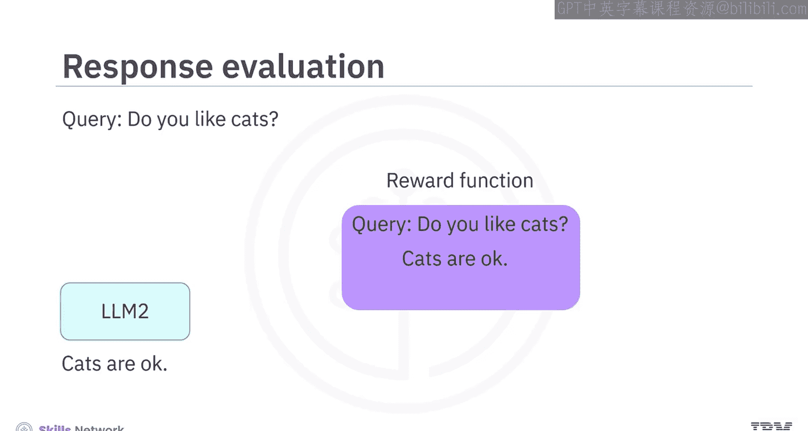
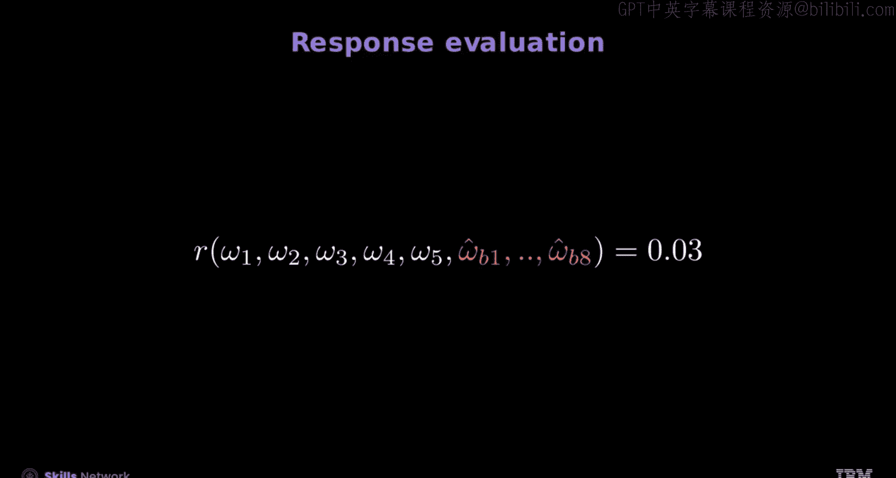
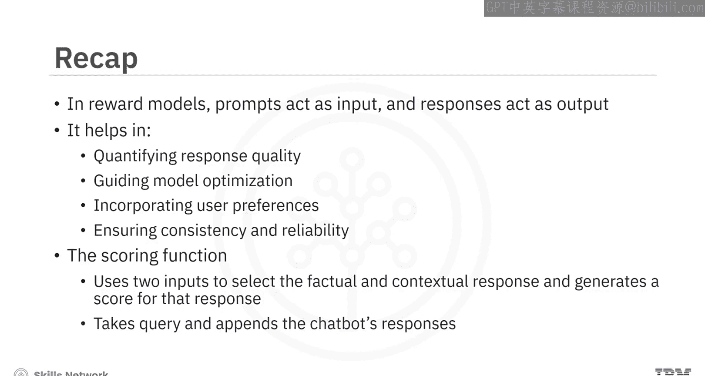

# 生成式人工智能工程：144：奖励建模与响应评估 🏆

在本节课中，我们将学习奖励建模与响应评估的核心概念。你将了解如何定义奖励建模，以及如何评估生成式模型的响应质量。

## 概述

奖励建模是量化模型响应质量、指导模型优化并使其与人类偏好对齐的关键技术。响应评估则是应用奖励模型来具体评判模型输出好坏的过程。

## 什么是奖励建模？

奖励建模通过为模型的响应分配数值分数，来评估其与人类偏好的对齐程度。

奖励建模的核心作用包括：
*   **量化响应质量**：为响应分配数值，以便评估和比较性能。
*   **指导模型优化**：通过优化模型参数以最大化奖励分数，从而提升模型表现。
*   **融入用户偏好**：在评分函数中纳入用户偏好，以定制模型行为。
*   **确保一致性与可靠性**：提供对响应一致且可靠的评估。

## 理解响应评估

上一节我们介绍了奖励建模的概念，本节中我们来看看如何具体评估因果解码器模型（如聊天机器人）的响应。

我们使用一个基于用户偏好的奖励函数（如下图中紫色方框所示）。训练该奖励函数，使其能为符合偏好的响应（例如关于“猫”的正面回应）分配高分。

例如，我们向大型语言模型输入一个查询，以确保LLM偏好“猫”。假设LLM1喜欢猫，而LLM2认为猫只是一般。

奖励函数会评估查询并给出分数。为了确保响应与LLM的偏好一致，分数应该较高。这里，由于LLM1喜欢猫，奖励函数会给反映这一偏好的响应打高分。对于LLM2，因为它认为猫只是一般，所以响应分数为0.5。

## 应用评分函数

现在，让我们考虑一个评分函数，它为生成精确且上下文准确的答案分配更高的分数。

例如，查询是：“哪个国家拥有南极洲？”我们将此查询输入两个聊天机器人A和B。
*   **响应A** 指出：“南极洲由《南极条约》体系管理。”这是事实且准确的。
*   **响应B** 声称：“是企鹅领主在掌管那里。”这是一个假设，并非事实。

因此，根据用户对事实准确性的偏好，我们的目标是选择响应A。

以下是应用评分函数的步骤：

1.  **对输入进行分词**：
    *   首先，对用户输入查询进行分词。用符号 **ω**（下标表示序列索引）表示每个词元。
    *   接着，对响应A进行分词，用变量 **ω̂_A** 表示（表示它是A的估计响应）。
    *   然后，对响应B进行分词，用变量 **ω̂_B** 表示。注意，这些序列的长度不必相同。

2.  **组合输入并评分**：
    *   评分函数 **R** 接收查询，并附加聊天机器人的响应。这意味着将查询和响应的词元收集起来，输入到评分函数 **R** 中。
    *   在屏幕上，查询通常显示为白色，响应显示为蓝色。
    *   使用符号表示：查询为 **ω**，响应为 **ω̂**。因此，对于响应A，评分过程评估其基于查询的准确性和相关性，得到高分0.89。

3.  **评估另一个响应**：
    *   同样，评分函数显示查询和不良响应（通常显示为红色）。
    *   使用符号表示：查询为 **ω**，响应为 **ω̂_B**。
    *   因此，响应B得分较低，为0.03。这个评分反映了基于训练数据的用户偏好。例如，如果训练评分函数优先考虑假设性回答，那么响应B可能会得到更高的分数。

## 总结

本节课中，我们一起学习了奖励建模以及如何创建或训练奖励模型。

奖励模型以提示作为输入，并输出关于响应的奖励分数。奖励建模有助于量化响应质量、指导模型优化、融入奖励偏好以及确保响应的一致性和可靠性。

你学会了使用评分函数：输入查询和两个候选响应，然后根据事实和上下文准确性选择更优的响应。在响应评估过程中，基于生成的响应，你会得到相应的分数或奖励。评分函数接收一个查询并附加聊天机器人的响应来进行计算。

