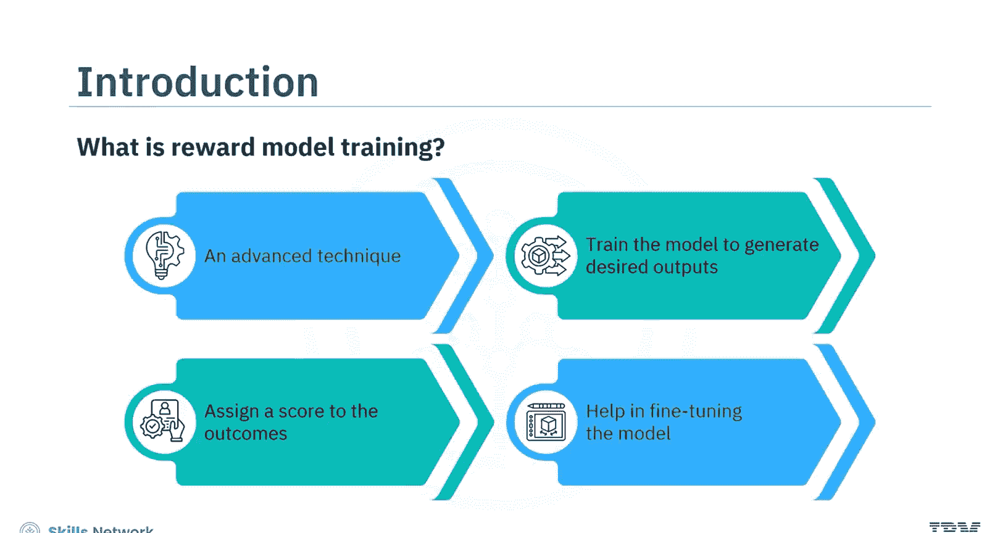
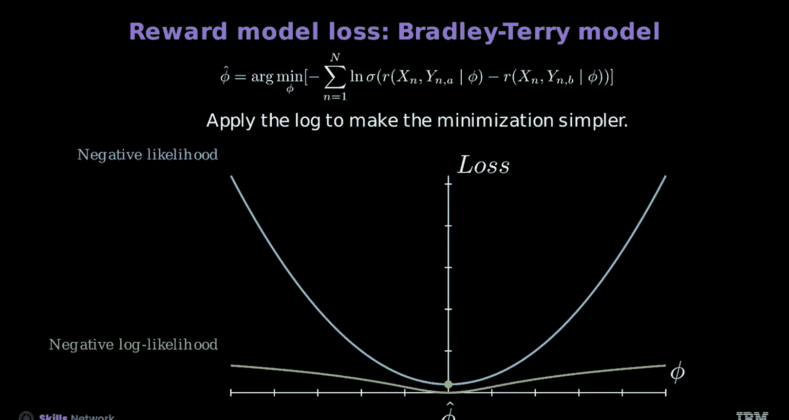

# 生成式人工智能工程：4：奖励模型训练 🏆

在本节课中，我们将学习奖励模型训练的核心概念。你将能够解释奖励模型的损失函数，并了解如何创建和训练一个奖励模型。

奖励模型损失衡量的是模型预测的响应及其得分，与实际环境或系统给出的响应和得分之间的差异。奖励模型训练是一种高级技术，它训练一个模型来识别另一个模型生成的理想输出，并根据其相关性和准确性为结果分配分数。这个分数有助于微调生成模型，以产生更准确的输出。

## 训练评分函数

上一节我们介绍了奖励模型的基本概念，本节中我们来看看如何训练一个语言模型来有效地生成奖励。首先，需要训练评分函数。通常，人类评估者会为响应分配分数。然而，让人提供精确的数值分数是具有挑战性的。

下图展示了查询、响应和分配分数的示例：

第一列和第二列代表查询和响应，第三列代表分配的分数。观察各行，模式是一致的：第一行是查询，第二行是得分较高的响应（响应A），第三行是得分较低的响应（响应B）。

对人类而言，对响应进行排序比分配具体分数要容易得多。下图展示了基于分数排列响应，而不分配具体数值的方法：

这种排序方法简化了评估过程，使人类评估者更容易提供准确的反馈。成对排序方法利用了多个样本的排序。在本视频中，我们重点讨论两个样本。目标是开发一个奖励函数，使其满足不等式：**好响应的奖励高于坏响应的奖励**。

我们采用OpenAI的表示法，其中 **R** 是一个关于 **x** 和 **y** 的函数。这里，**x** 是查询，**y_a** 是聊天机器人的正面输出（好响应），**y_b** 是负面输出（坏响应）。参数 **φ** 代表Transformer模型的可学习参数。

## 生成奖励模型损失

为了理解如何生成奖励模型损失，我们来看一个例子：**x** 是一个查询，**y_a** 是一个好响应，**y_b** 是一个坏响应。

为了生成奖励，将 **x** 和 **y_a** 输入模型。编码器模型生成表示为蓝色的上下文嵌入。类似于分类任务，将分类标记的输出通过一个线性层（768个输入，1个输出数值，表示为 **z_a**，蓝色），这代表了对好响应的估计奖励。

对坏样本重复此过程，其输出嵌入显示为红色。目标是确保 **y_a** 的奖励 **z_a** 高于 **y_b** 的奖励 **z_b**。

接下来，使用Bradley-Terry模型来理解奖励损失模型，通过生成成本或损失函数。首先，找到确保好响应获得比坏响应更高奖励的参数。

为了更好地理解，我们使用一个类似于支持向量机的几何论证，而非纯概率论证。例如，考虑一个数据集。

1.  首先，将比较不等式转换为差值，强调最大化好响应和坏响应奖励之间的差距。
2.  然后，应用sigmoid函数，将差值解释为响应A优于响应B的概率。
3.  最后，通过乘以负一，将其转化为最小化问题。

这种方法简化了参数优化，意味着找到最优参数值 **φ** 可以最小化差值。然而，减少负sigmoid函数有助于实现好响应相对于坏响应的最大奖励。

基于参数 **φ**，**δ** 代表好响应和坏响应奖励之间的差值。此外，**δ** 衡量了对于给定的 **φ**，好响应相对于坏响应的奖励质量。这意味着随着 **δ** 增加，损失应该减少，因为奖励函数的差值在增加。

这种方法以表格形式展示。下表显示了不同 **φ** 值对奖励差值 **δ** 以及相应的损失函数（负sigmoid(δ)）的影响。

第一列代表不同的 **φ** 值。第二列显示 **δ** 值，即好响应和坏响应之间的奖励差值。表中的正值代表对好响应的偏好。第三列显示作为 **δ** 函数的损失。随着 **δ** 增加，损失减少。

让我们观察下图，其中x轴代表 **δ**，y轴显示作为 **δ** 函数的损失值。使用表中的值绘制图表，评估不同 **φ** 值的损失。

图表显示，随着 **δ** 增加，损失减少，这表明当损失最小化时，**δ** 具有更高的值，正如预期的那样。

为了估计参数，使用最大似然估计，将每个样本的sigmoid输出独立相乘。如果将此输出乘以负一，则将问题转化为最小化问题。为了简化此优化，直接对似然应用对数函数，并使用负一进行缩放，从而得到负对数似然。对数函数是单调递增的，不影响最小值的位置。图表显示两种方法具有相同的最小值。对数函数将乘积转换为求和，简化了微分过程，梯度下降可以帮助找到最优参数。

## 总结

本节课中我们一起学习了奖励建模以及如何创建或训练奖励模型。

奖励模型训练是一种高级技术，它训练一个模型来识别另一个模型生成的理想输出，并根据其相关性和准确性为结果分配分数。训练评分函数有助于有效地生成奖励。生成奖励模型损失时，编码器模型会生成上下文嵌入。使用Bradley-Terry奖励损失模型，你可以通过生成成本或损失函数来理解奖励损失模型。