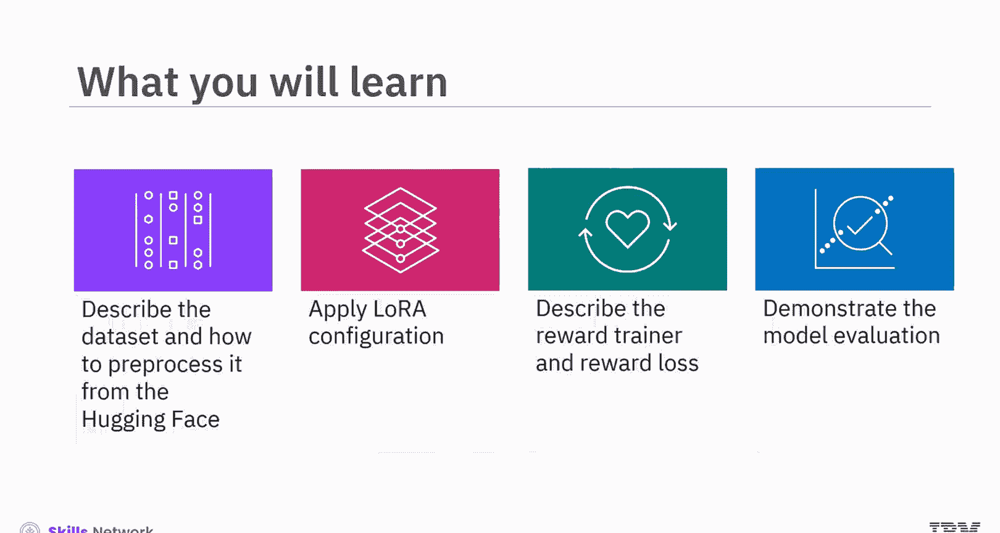
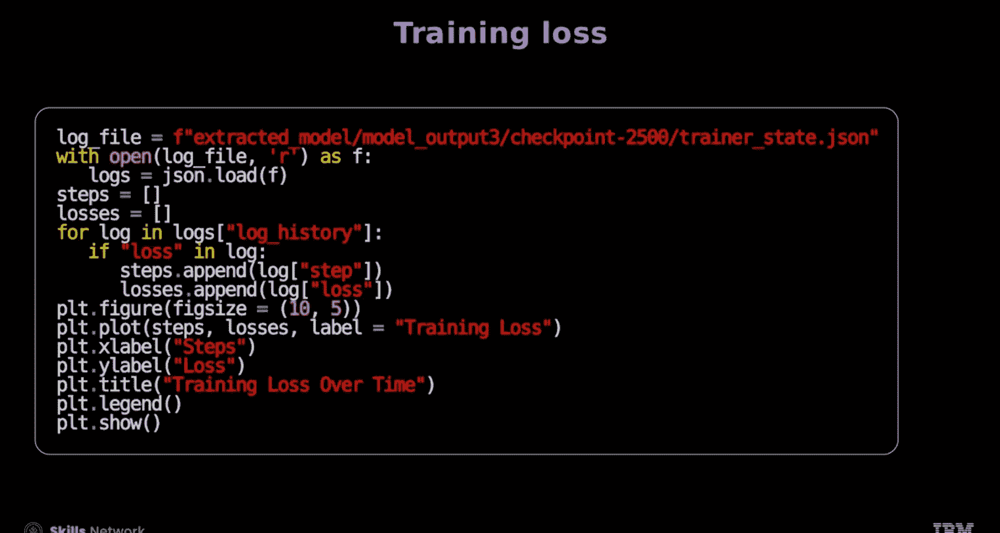
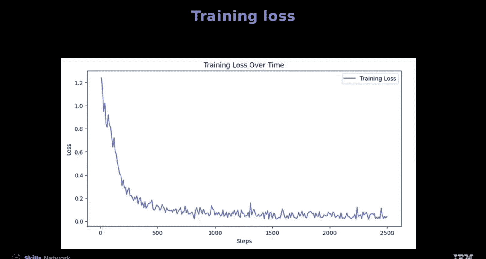
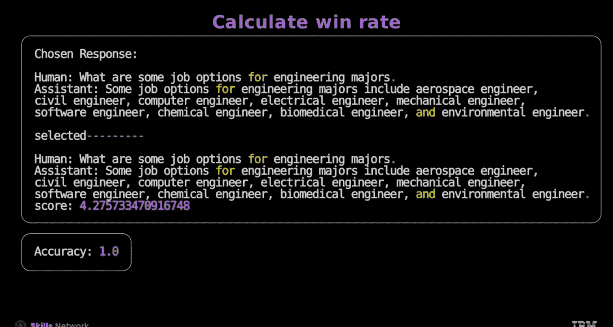
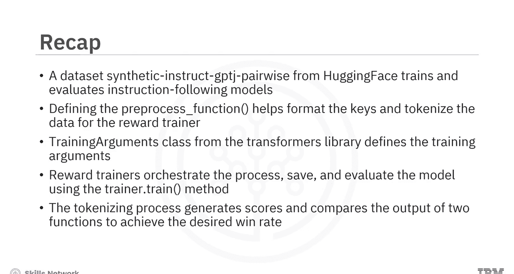

# 生成式人工智能工程：5：使用Hugging Face进行奖励建模 🏆

在本节课中，我们将学习如何使用Hugging Face生态系统进行奖励建模。我们将了解奖励建模的数据集、数据预处理方法，并应用低秩自适应（LoRA）等技术来训练一个奖励模型。课程将涵盖从数据准备到模型训练与评估的完整流程。



## 概述

奖励建模是训练模型区分高质量和低质量响应的关键步骤。本节将引导你使用Hugging Face库，基于成对偏好数据训练一个奖励模型。我们将使用一个合成指令数据集，学习如何配置模型、定义损失函数并进行评估。

## 理解数据集

首先，我们需要理解所使用的数据集。考虑一个来自Hugging Face的数据集，例如 `de haos/synthetic-instruction-GTJ-pairwise`。该数据集通常用于训练和评估遵循指令的模型。

这个数据集通过让模型学习“好”与“坏”的响应配对，来训练模型理解并遵循复杂的指令。以下是数据集中的一个样本数据点。

每个数据点包含三个部分：
*   **prompt**：一个文本提示，模型需要对此作出响应。
*   **chosen**：针对该提示的偏好响应（好的响应）。
*   **rejected**：针对该提示的非偏好响应（差的响应）。

## 数据预处理

在开始训练过程之前，我们需要对数据进行预处理。这包括定义评分函数、设置分词器和模型。例如，我们可以训练一个GPT-2模型用于序列分类，作为评分函数。这个模型有助于确定响应的质量。

模型的输出层是一个单一的类别或一个神经元，它产生一个代表得分的标量值输出。

以下是准备数据的关键步骤：

首先，定义一个 `get_response` 函数来结构化数据，将其整理为查询和响应对，便于读取和测试。接着，将此函数应用到整个数据集上。

定义一个名为 `add_combined_columns` 的函数。该函数接收单个数据点作为示例，并添加两个新列：`prompt_chosen` 和 `prompt_rejected`。
*   `prompt_chosen` 列将提示与偏好响应（chosen）结合起来，并使用“人类”和“助手”标签标注对话部分。
*   `prompt_rejected` 列以相同的标签格式将提示与非偏好响应（rejected）结合起来。

接下来，使用 `map` 方法将此函数应用到训练集中的每个示例。

然后，过滤掉短于指定最大长度的样本，以确保数据集满足所需的长度标准。

现在，我们来定义核心的预处理函数。调用此函数处理单个数据点，以观察其新格式化的键。

`preprocess` 函数为奖励训练器（Reward Trainer）对 `prompt_chosen` 和 `prompt_rejected` 键进行分词。
*   `chosen` 键代表偏好响应。
*   `rejected` 键代表非偏好响应。

对这些键进行分词使模型能够处理和理解高质量与低质量响应之间的差异。通过提供成对的“chosen”和“rejected”输入，奖励训练器可以区分并优先选择更好的响应，这有助于训练模型遵循指令。

处理后的数据点包含以下字段：
*   `input_ids_chosen` 和 `input_ids_rejected`：分别代表“chosen”和“rejected”响应的分词ID。这些ID是模型使用的文本数值表示。
*   `attention_mask_chosen` 和 `attention_mask_rejected`：分别包含“chosen”和“rejected”响应的注意力掩码。

在此阶段，数据点已包含每个标签的文本分词。在训练数据集中，使用 `map` 方法将 `preprocess` 函数应用到每个样本，对 `prompt_chosen` 和 `prompt_rejected` 文本进行分词。设置 `batched=True` 参数可以使函数批量处理多个样本，提高效率。需要注意的是，这只是为了解释评分函数的工作原理，并非训练过程本身的一部分。

最后，将数据分割为训练集和测试集。

## 配置模型与训练参数

你可以使用LoRA来训练模型。首先，为序列分类任务初始化LoRA配置。该配置使用参数高效微调（PEFT）库中的 `LoraConfig` 类来指定多个参数。

```python
from peft import LoraConfig
lora_config = LoraConfig(
    task_type="SEQ_CLS",  # 序列分类任务
    r=8,                   # LoRA秩
    lora_alpha=32,
    target_modules=["q_proj", "v_proj"], # 目标模块
    lora_dropout=0.1,
    bias="none"
)
```

接下来，使用Transformers库中的 `TrainingArguments` 类来定义训练参数，以配置训练过程的各种设置。

```python
from transformers import TrainingArguments
training_args = TrainingArguments(
    per_device_train_batch_size=3,   # 设置每个设备（GPU/CPU）的批次大小为3。根据GPU大小，可以尝试更大的批次。
    num_train_epochs=3,              # 指定训练轮数为3。
    gradient_accumulation_steps=8,   # 梯度累积步数为8。这意味着在执行反向传播或参数更新之前，会累积8个步骤的梯度，这等效于增大了批次大小。
    learning_rate=1.41e-5            # 将优化器的学习率设置为1.41e-5。
)
```

## 使用奖励训练器进行训练

`RewardTrainer` 是一个专门设计用于训练奖励函数的训练器。首先，使用 `RewardTrainer` 来编排训练过程，它会处理诸如批处理、优化、评估和保存模型检查点等任务。它训练模型从反馈信号中学习，并提高其生成高质量响应的能力。

你可以使用各种参数来实例化它：
*   `model`：要训练的模型。
*   `args`：训练参数，通常是 `TrainingArguments` 的实例。
*   `tokenizer`：用于处理文本输入的分词器。
*   `train_dataset`：用于训练模型的数据集。
*   `eval_dataset`：用于评估模型的数据集。
*   `peft_config`：用于配置LoRA。





接下来，使用 `RewardTrainer` 来训练、保存和评估模型。调用 `trainer.train()` 方法来启动训练过程。模型从训练数据集中学习，优化其参数以提高性能。使用 `evaluate` 方法存储评估指标。

使用以下代码绘制训练损失曲线，屏幕显示损失函数正常收敛。

## 模型评估

现在，将分词过程、生成分数以及比较两个独立函数的输出进行封装。

第一个函数对文本进行分词并生成模型的输出分数。第二个函数则对这些分数进行成对比较。

最后，通过计算胜率来评估模型的性能。例如，如果模型为更好的响应分配了更高的分数，则标记为1（正确），否则标记为0（错误）。

模型评估过程首先定义 `N`，即要评估的样本数量。接着，初始化一个计数器 `correct_selections` 来跟踪正确识别偏好响应的数量。代码随后遍历训练数据集中的前N对“chosen”和“rejected”响应。



屏幕显示输出结果为100%的胜率。需要注意的是，此数据基于合成数据。然而，顶尖模型实现的胜率通常在60%到70%之间。

## 总结



在本视频中，你学习了使用Hugging Face进行奖励建模。
*   来自Hugging Face的合成指令配对数据集通常用于训练和评估遵循指令的模型。
*   定义预处理函数有助于为奖励训练器格式化键并对数据进行分词。
*   Transformers库中的 `TrainingArguments` 类定义了训练参数，以配置训练过程的各种设置。
*   `RewardTrainer` 编排训练过程，并使用 `trainer.train()` 方法保存和评估模型。
*   分词过程生成分数，并比较两个函数的输出，以达到期望的胜率。