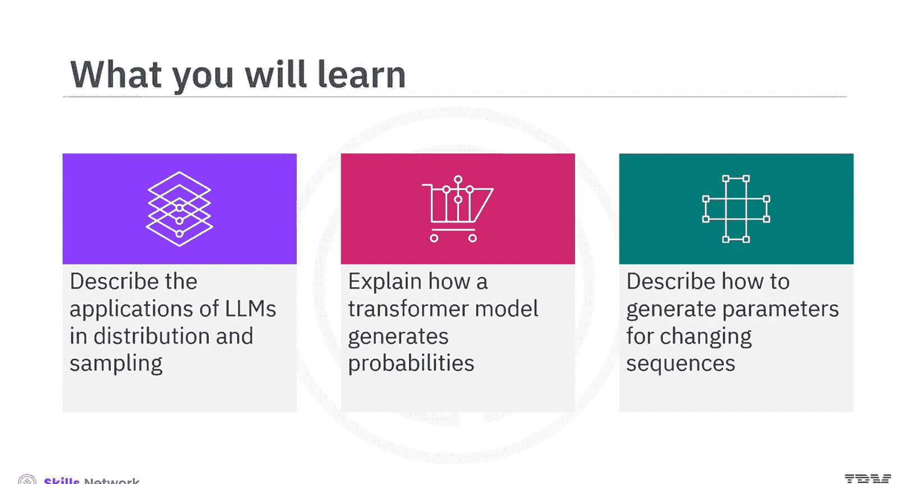
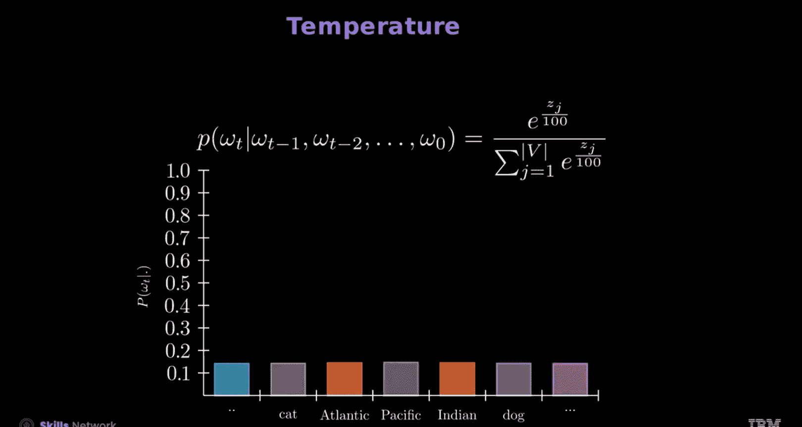
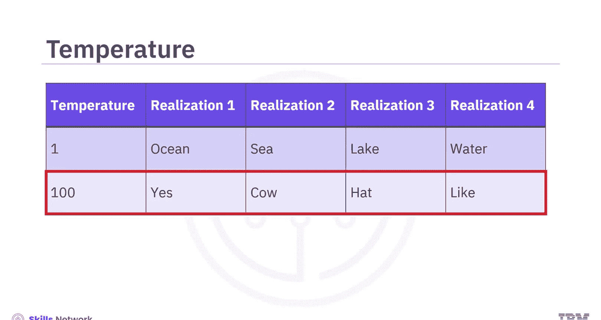
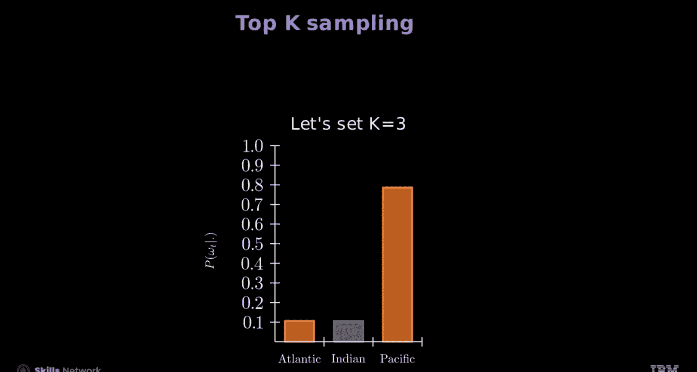

生成式人工智能工程：6：大型语言模型作为分布 🧠

在本节课中，我们将学习大型语言模型如何被视为一种概率分布，并探索如何通过采样从该分布中生成文本。我们将了解Transformer模型如何计算每个词的概率，以及如何通过调整生成参数来控制输出序列的特性。

---

上一节我们介绍了LLM的基本概念，本节中我们来看看LLM如何作为一个概率分布来运作。

一个语言模型接收一个查询样本 `X`，并生成一个响应 `Y`。这里的 `Y` 是一个随机变量。考虑一个查询：“哪个海洋最大？”。对于这个查询，模型会根据概率分布生成各种可能的响应，例如“太平洋”，接着可能是“太平洋是地球上最大的海洋”、“太平洋面积为1.55亿平方公里”或“大西洋”。

你可以将此表示为 `Y ~ π(Y|X)`，其中策略 `π` 就是一个概率分布。然而，我们更关注如何生成 `Y` 中的每一个词元。

Transformer模型通过对其最后一层应用 **softmax函数** 来生成不同词的概率。对于一个查询“哪个海洋最大”，条形图可视化了可能的词。X轴表示在时间步 `t` 可能的词，Y轴表示每个词的概率。

以下是模型生成词元的基本过程：
1.  模型接收查询，并计算第一个词的概率分布。
2.  根据该分布采样或选择下一个词。
3.  将已生成的词作为输入的一部分，反馈给模型，计算下一个词的概率分布。
4.  重复此过程，直到生成完整的序列。

---

理解了LLM作为分布的基本原理后，我们来看看模型在具体时间步上是如何工作的。

在时间步 `t`，模型会基于当前上下文生成一个概率分布，从中可以采样得到不同的实现结果。例如，实现1可能是“太平洋”，实现2可能是“大西洋”，实现3可能是“印度洋”等等。统计每个词出现的次数，你会发现其频率与softmax函数生成的分布成正比。

当时间步从 `t` 变为 `t+1` 时会发生什么？模型生成词元时，时间步 `t+1` 的分布依赖于之前时间步的值。例如，如果时间步 `t` 的词是“太平洋”，那么下一个词的概率分布会相应改变；对于“印度洋”也是如此。这表明，时间步 `t+1` 的概率分布依赖于时间步 `t` 的词及其概率。

这种关系从 `t=0` 开始。随着 `t` 增加，时间步 `t+1` 的分布受到时间步 `t` 及更早时间步的值的影响，从而产生各种可能的序列。例如，“太平洋”会导致在时间步 `t+2` 产生特定的分布，类似于“大西洋”、“印度洋”、“南极洋”所产生的情况。最终，当 `t` 处理更长的序列时，你可以看到从初始查询生成的各种示例。

---

现在，让我们总结一下分布过程，并聚焦于因果Transformer的工作原理。

这里的输入模型将“最大的海洋”转换为词元嵌入，并通过Transformer传递。我们不是应用 `argmax` 函数选择最可能的序列，而是选择一个随机输出。例如，你可能选择“太平洋”，也可能选择其他概率较低的词，如“大西洋”或“印度洋”。将这些词传回模型，并通过从模型生成的概率中随机选择词来重复此过程。接下来你会看到“海洋”、“海”和“湖”等词。

---

上一节我们了解了模型的生成机制，本节中我们来看看能帮助改变LLM生成序列的**生成参数**。

**温度** `τ` 是softmax函数中的一个超参数，它影响概率分布。温度参数控制着分布的随机性，较高的 `τ` 值使分布更均匀，较低的 `τ` 值使其随机性降低。

让我们从softmax方程开始，看看不同的温度值如何影响概率分布：
`P(i) = exp(z_i / τ) / Σ_j exp(z_j / τ)`

以下是不同温度值的效果示例：
*   在温度 `τ=1` 时，观察分布。
*   将温度增加到 `τ=2`，分布变得更均匀。
*   将温度增加到 `τ=5`，分布广泛扩展，显示出更高的随机性。
*   在温度 `τ=10` 时，分布变得更平坦或更均匀。
*   在温度 `τ=100` 时，分布几乎完全均匀，意味着每个词元几乎同等可能，表示随机性最大。

给定表格中的每一列显示了几种随机序列的实现。第一行温度为1，显示每个词含义相似。另一方面，第二行温度较高，显示随机的词。

接下来是**Top-K采样**，参数为 `K`。此方法将下一个词元的选择限制在概率最高的前K个词元内。

例如，设 `K=3`：
1.  首先，用温度1计算softmax值，并显示不同词的初始概率分布。
2.  接着，应用Top-K采样，选择概率最高的前三个词元，并过滤掉不太被偏好的选项。
3.  识别前K个索引并高亮显示对应的词。
4.  最后，对前K个值进行归一化，确保总和为1。

为了生成序列，还可以查看其他参数，如**集束搜索**、**Top-p采样**、**重复惩罚**以及**最大/最小词元数**。
*   **集束搜索**：跟踪并在每一步扩展各种顶级序列。
*   **Top-p采样**：将采样池限制在累积概率超过阈值 `p` 的最小词元集合内。
*   **重复惩罚**：惩罚重复的词元序列，以鼓励输出多样性，避免生成重复文本。
*   **最大/最小词元数**：设置生成序列中词元数量的上限或下限。

---

本节课中我们一起学习了如何使用LLM作为响应生成的策略。样本查询问题可能基于概率分布提供各种随机响应。Transformer模型使用softmax函数生成不同词的概率，在各个时间步选择词，并改变这些词的概率。生成参数（如温度、Top-K采样、集束搜索、Top-p采样、重复惩罚以及最大/最小词元数）有助于改变使用LLM生成的序列。