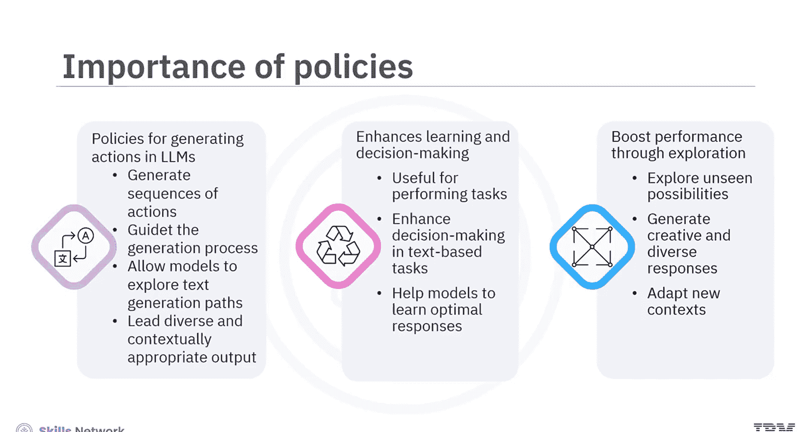
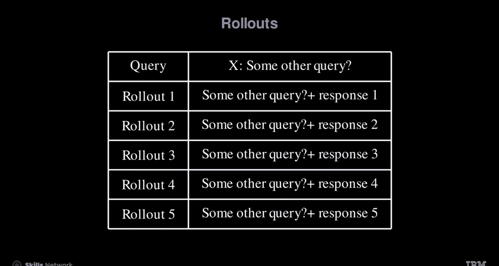

生成式人工智能工程：148：从分布到策略 🧠

在本节课中，我们将学习如何将语言模型视为一种策略分布，并理解其在强化学习中的应用。我们将探讨策略的概念、其重要性，以及如何通过策略分布生成多样化的文本序列。

---

### 策略的重要性

上一节我们引入了策略的概念，本节中我们来看看策略在人工智能领域，特别是强化学习和大语言模型中的核心作用。

策略是智能体根据当前环境状态决定其行动的具体策略或映射。在强化学习中，策略决定了如何生成一系列动作的分布。对于大语言模型，策略可以指导文本生成过程，探索不同的生成路径，从而产生更多样化且符合语境的输出。

以下是策略的几个关键作用：
*   **在强化学习中**：策略用于执行任务，例如玩游戏，通过引导动作来实现目标。
*   **在大语言模型中**：策略增强了决策能力和基于文本的任务性能，帮助模型学习最优响应，从而提高语言理解和生成的准确性与相关性。
*   **与传统AI方法的区别**：强化学习策略利用随机性来探索未知的可能性。这种方法通过生成创造性、多样化的响应并适应新语境，帮助大语言模型表现得更好，使其更健壮和通用。

---

### 语言模型作为策略分布

理解了策略的重要性后，我们来看看如何将语言模型形式化为一个策略分布。

在强化学习的语境下，语言模型可以被视为一个策略分布。它根据输入的查询，遵循策略分布来生成响应。这可以表示为 **`y ~ π(·|x)`**，其中 `x` 是长度为 `M` 的输入序列，`y` 是长度为 `N` 的总输出序列。

例如，考虑查询：“哪个是最大的海洋？”。模型会生成各种可能的响应。每个可能的响应被称为一个“rollout”（轨迹）。

以下是几个可能的rollout：
1.  太平洋。
2.  太平洋是地球上最大的海洋。
3.  大西洋面积1.55亿平方公里。
4.  大西洋。

为了阐明策略与作为参数函数 `θ` 的语言模型之间的关系，可以考虑关系式 **`y ~ π_θ(·|x)`**。详细的策略分布表示为 `θ` 的函数，展示了基于先前标记计算响应概率的方式。

对于查询“哪个是最大的海洋？”，模型首先计算不同响应的概率分布。例如，“大西洋”的概率可以表示为 **`P(“大西洋” | “哪个是最大的海洋？”)`**，或者更一般地，给定查询和前 `k-1` 个标记时，第 `k` 个响应标记的概率。

---

### 理解Rollouts

最后，让我们深入了解rollouts的概念，即模型如何为每个查询生成不同的响应。

rollouts指的是模型为每个查询生成不同响应的过程。为此，我们来看一组初始查询。

考虑查询：“哪个是最大的海洋？”。模型生成若干个随机响应，在这个例子中是5个，每一个都被称为一个rollout。这个过程会持续进行，例如对于查询“你能给我一些Python代码吗？”，模型也会生成若干个rollouts。

需要重点注意的是，在诸如Hugging Face这样的库中，rollout的定义与强化学习中的定义有所不同。在强化学习中，rollout的定义包含了奖励信号。

---

### 总结

本节课中，我们一起学习了如何在强化学习中使用分布作为策略。
*   策略是智能体决定其行动的具体策略或映射。
*   策略有助于在大语言模型中生成动作，增强学习和决策能力，并通过探索提升性能。
*   遵循策略分布，语言模型基于输入的查询生成响应。你可以通过关系式 **`y ~ π_θ(·|x)`** 来理解策略与作为参数函数 `θ` 的语言模型之间的关系。
*   Rollouts是模型为每个查询生成不同响应的方式。Hugging Face等库中的rollout定义与强化学习中的定义不同。