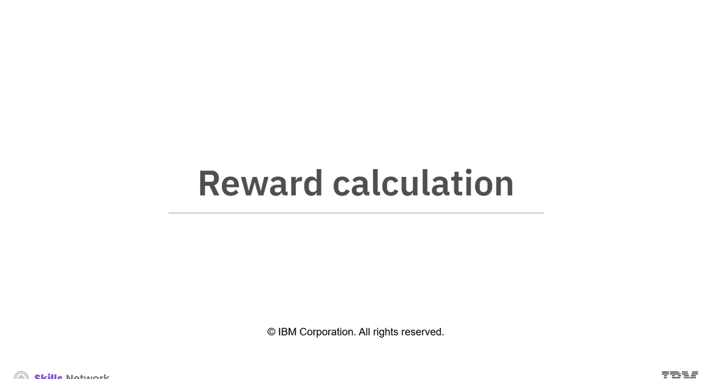
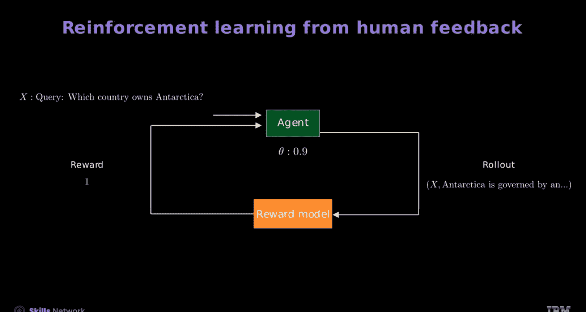

# 生成式人工智能工程：8：从人类反馈中进行强化学习（RLHF）🎯

在本节课中，我们将学习从人类反馈中进行强化学习（RLHF）的核心概念。你将学会如何使用奖励函数计算奖励，并理解模型如何将人类反馈整合到语言模型的微调过程中。

想象一下，让无数只猴子在无限长的时间里随机敲击打字机。最终，它们能打出任何给定的文本，比如莎士比亚的全部作品。但如果引入奖励机制，比如给它们香蕉，是否就能减少所需猴子的数量或缩短所需的时间呢？让我们通过RLHF和这个猴子例子来理解这个过程。

## 奖励计算与人类反馈

上一节我们介绍了RLHF的基本思想，本节中我们来看看如何具体计算奖励。

首先，一只猴子开始打字以生成相关的词语。当它打出一个相关词语后，文档会被提交审核。如果文档令人满意，猴子会得到一个香蕉作为奖励。猴子会重复这个动作，但最终可能会打出随机词语。这些随机词语中的一部分也可能获得奖励，这个过程不断重复。最终，猴子就能创作出莎士比亚的作品。

为了理解奖励计算，我们使用一个奖励函数，表示为 **R(X, Y)**。

接下来，插入查询：“哪个国家拥有南极洲？”。奖励函数为插入的查询提供人类反馈。

*   第一个回应是：“?9DFSA”。这个回应不相关，得分为0。
*   第二个回应是：“没有国家拥有南极洲”。这个回应准确，得分为0.9。
*   最终，理想的回应是：“南极洲由一个国际条约管理”。这个回应最准确，获得满分1分。

类似地，你需要准备各种查询和回应的样本来进行训练。

## 采样过程与“Rollout”

为了审查采样过程，我们需要关注查询和回应的“Rollout”。

以下是Rollout过程的说明：
考虑一个显示在屏幕上的查询表。第一列索引n代表查询编号。第二列代表查询，例如“最大的海洋是？”、“你能给我一些Python代码吗？”、“这是一本儿童书吗？”等等。公式 **X ~ D** 表示从这个表中随机抽取一个样本。

例如，选择查询编号1作为随机样本：“最大的海洋是？”。接下来，将语言模型表示为一个表格。第一行代表查询“最大的海洋是？”，其中n=1。下面的每一行显示可能的回应，包括“太平洋”、“大西洋”等等。**Y ~ D₁** 表示Y是从该表中随机抽样的，K是每个回应的索引。

再取另一个查询：“你能给我一些Python代码吗？”，其中n=2。你可以看到针对这个查询的不同表格，每一行都有不同的回应，由K索引，Y从D₂中抽样。你可以对每个查询问题重复这个过程，包括“这是一本儿童书吗？”、“哪个国家拥有南极洲？”等等。这个过程被称为 **Rollout**。

## 期望奖励

现在，让我们在语言模型使用之前，通过一个表格来理解期望奖励的概念。

首先看经验公式：
`(1/N) * Σ_{n=1}^{N} [ (1/K) * Σ_{k=1}^{K} R(x_n, y_{n,k}) ]`
它通过平均多个查询及其各自回应的奖励来近似期望奖励。在这个公式中，**N** 代表查询总数，**n** 代表单个查询，**K** 代表每个查询的回应数量，**k** 代表单个回应。

转换经验公式有助于确定实际的期望值公式：
`E_{(X,Y) ~ (D, π)}[R(X, Y)]`
这个实际值公式代表了在数据分布和模型针对给定输入的回应分布上的期望。

通过结合给定输入下每个回应的概率，可以得到单个查询的期望奖励。因此，期望奖励总结为 **Σ_Y π(Y|X) * R(X, Y)**，其中 **π(Y|X)** 是给定输入X时回应Y的概率。

## 整合人类反馈进行微调

让我们学习如何整合人类反馈。例如，取一个需要微调的预训练大语言模型（LLM）。该模型表示为一个策略 **π**，展示了在给定输入查询时模型的回应分布。

假设有一个标为“模型”的方框。接下来，引入一个查询“谁制作了这门课程？”，表示为一个蓝色方框。你可以看到一个回应“他看起来像布拉德·皮特”，也表示在蓝色方框中。奖励模型的输入将是“查询+回应”。

为了评估并为“查询+回应”生成奖励，我们使用一个预训练的奖励模型。输入查询是“谁制作了这门课程？”，相关回应是“他看起来像布拉德·皮特”。根据查询和回应，奖励模型生成一个奖励值：-10,000。

现在，让我们看看这在微调策略时如何发挥作用。首先，创建一个代理（或LLM），表示为绿色，具有一组可学习参数 **θ**，以及表示为橙色的奖励模型。接下来，引入一个查询 **X** 作为代理的输入，以生成回应 **Y**。这里的查询和回应被称为 **Rollout**。奖励函数处理 **X** 和 **Y**，并使用该奖励来训练LLM并更新参数 **θ**。

以下是一个针对给定查询“哪个国家拥有南极洲？”的一组Rollout示例。查询作为输入引入代理。你可以在奖励模型的左侧看到这个查询，表明代理正在处理该查询。代理生成多个回应，随后是每个查询的奖励。这些奖励用于更新模型参数 **θ**。

以下是生成的回应示例：
*   第一个回应：“?9DFSA”，奖励为0。
*   第二个回应：“南极洲是...”，奖励为0.0021。
*   第三个回应：“企鹅霸主”，奖励为0.09。
*   第四个回应：“南极洲是一个国家”，奖励为0.02。
*   第五个回应：“没有国家拥有南极洲”，奖励为0.9。
*   最终回应：“南极洲由一个国际条约管理”，奖励为1。

这些生成的回应是从策略分布中随机产生的。奖励有助于优化策略分布的可学习参数。

## 总结📝

本节课中我们一起学习了如何计算奖励，以及如何将人类反馈整合到语言模型的微调中。

*   **奖励函数** 为插入的查询提供人类反馈，以接收相关回应并提供分数。
*   使用查询和回应的 **Rollout** 来审查采样过程。
*   **期望奖励** 有助于理解代理在语言模型中的表现，通过经验公式平均多个查询和回应的奖励来实现。
*   **RLHF** 使用回应分布作为输入查询来微调预训练的LLMs。
*   你可以使用预训练的 **奖励模型** 来评估并为“查询+回应”生成奖励。
*   你可以根据代理生成的每个回应来更新模型参数 **θ**。