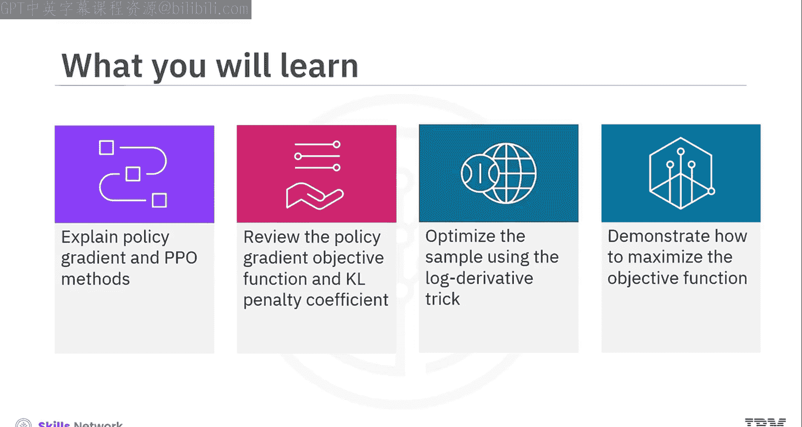
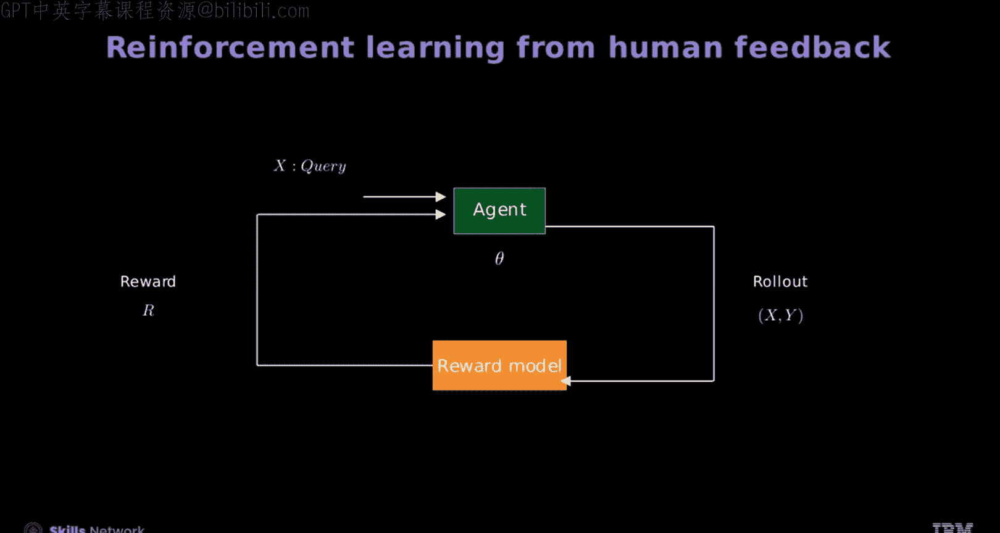
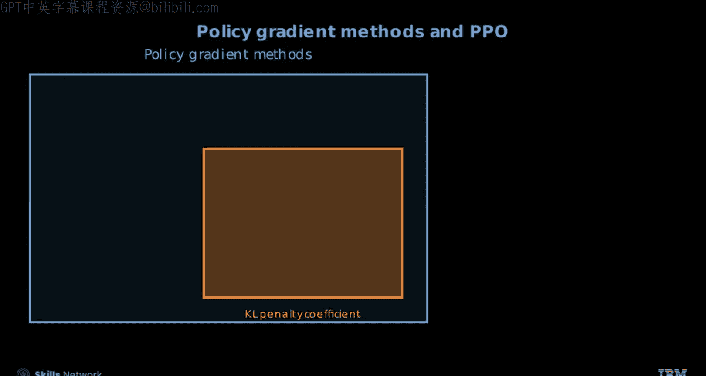
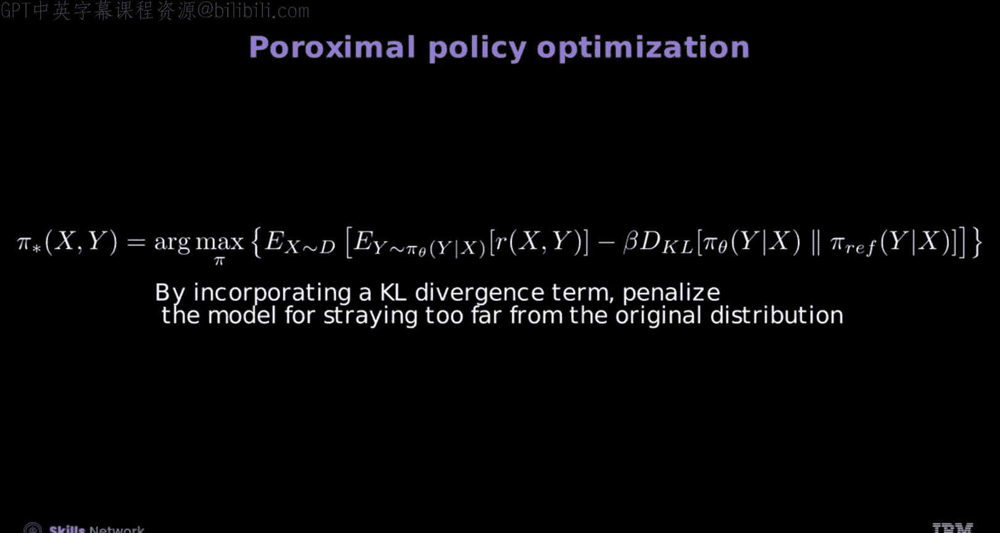
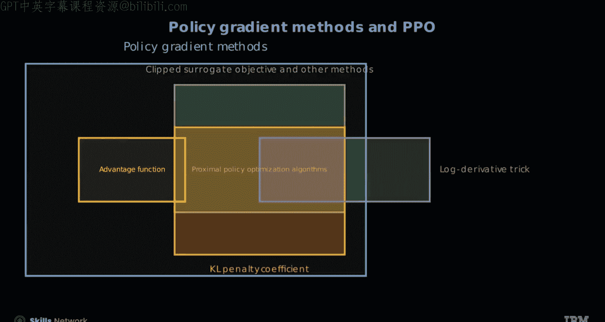
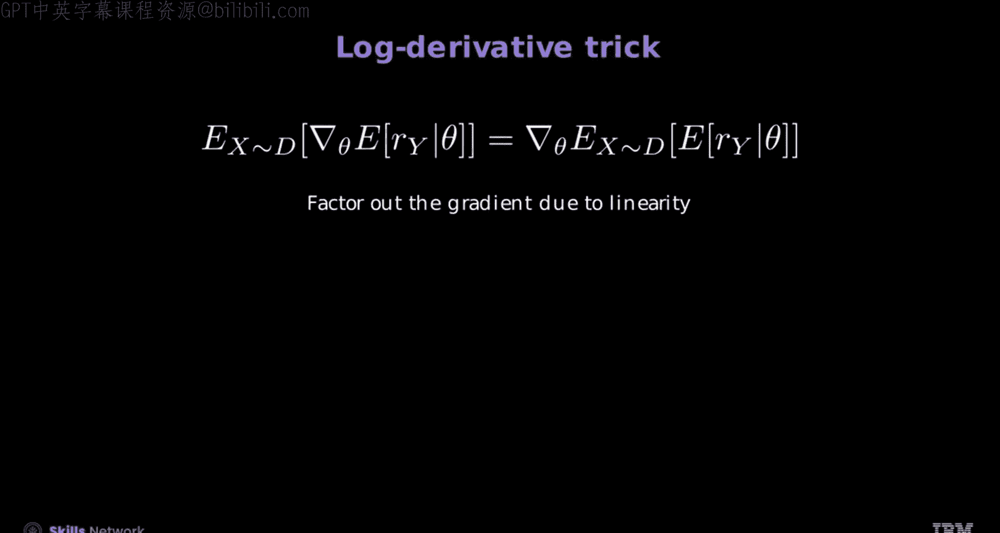

# 生成式人工智能工程：150：近端策略优化（PPO）🚀

在本节课中，我们将学习近端策略优化（PPO）方法。我们将解释策略梯度和PPO的基本概念，回顾策略梯度的目标函数和KL惩罚系数，并学习如何使用对数导数技巧优化采样，以及如何通过梯度上升最大化目标函数。

---

## 构建智能体与奖励模型

首先，我们创建一个具有一组可学习参数 **θ** 的智能体或大语言模型（LLM），以及一个奖励模型。接着，引入一个查询 **X** 作为智能体的输入，以生成一个响应 **Y**。

查询和响应构成一个“轨迹”，奖励函数处理 **X** 和 **Y**，生成的奖励用于训练LLM并更新可学习参数 **θ**。

现在，我们来理解策略梯度和PPO方法。

---

## 理解策略梯度与PPO方法

策略梯度方法的目标函数是我们希望最大化的内容，而近端策略优化是实现这一目标的方法之一。

这些方法包含多个方面，如下图所示。首先，策略梯度方法构成了各种强化学习算法的基础。其次，裁剪替代目标等方法通过确保策略更新不会过于剧烈来稳定训练。KL惩罚系数用于调节新旧策略之间的差异，在训练过程中保持稳定性。另一个重要方面是优势函数，它用于估计奖励。在本视频中，我们将只回顾通用的策略梯度目标函数和KL惩罚系数。

---

## 策略梯度目标函数

策略梯度方法的目标函数类似于需要最大化的“分数”。为此，我们从奖励函数编码器开始，它估计输入对 **x** 和 **Y** 的奖励。接着，引入需要微调的模型。该模型表示为策略 **π** 或LLM（例如可以进行指令微调的GPT类模型）。

让我们看看优化过程的第一步。对于给定的数据查询 **X**，从数据集中推导出样本响应 **Y** 并估计奖励。估计的奖励表示为策略 **π** 寻找参数 **θ** 的期望奖励样本。

在第二步中，扩展整个数据集，并估计所有查询的期望奖励。然而，我们的目标是找到最大化期望奖励的最优策略。此外，引入一个参考模型作为正则化项，以确保模型不会偏离原始模型太远。接下来，控制超参数 **β**。解决这个问题具有挑战性，因为我们试图从采样中找到数据。

---

## 对数导数技巧

为了解决这个问题，即使是基本的策略梯度方法也需要对强化学习统计有基础的理解。对数导数技巧类似于蒙特卡洛方法中使用的技术，它为我们提供了优化这个问题的思路。两种方法都涉及基于采样数据估计梯度以优化函数。

需要注意的是，对数导数技巧只解决了PPO问题的一个方面。让我们来看看对数导数技巧。

为了计算导数，需要找到最大化目标函数（即期望奖励）的策略。为了使这个过程更容易，我们暂时忽略正则化项。首先，通过关注单个查询的期望奖励来简化表达式，注意导数不能直接以这种形式计算。接着，将单个查询或表达式转换为解析分布，从而允许直接针对参数 **θ** 进行优化。为了找到最佳参数，计算梯度并突出对数变换的梯度。然后，将表达式重新排列为可追踪的形式，并将梯度代回表达式。这将采样和表达式转换为允许使用样本进行梯度计算的形式。最后，提取出梯度以完成变换。

---

## 模型训练技巧

以下是训练模型的一些技巧。在训练模型时，定期使用人类反馈进行评估。开始训练模型时使用适中的 **β** 值，并提高温度以探索更多选项。

---

## 总结

在本视频中，我们学习了如何使用策略梯度方法和KL惩罚系数训练模型。策略梯度方法旨在最大化目标函数，而PPO有助于实现这种最大化。为了优化策略，我们推导样本响应、估计奖励并扩展数据集。我们可以通过识别最大化目标函数的策略、简化表达式并将其转换为解析分布来计算对数导数。为了训练模型，应定期使用人类反馈评估模型，使用适中的 **β** 值，并提高温度。