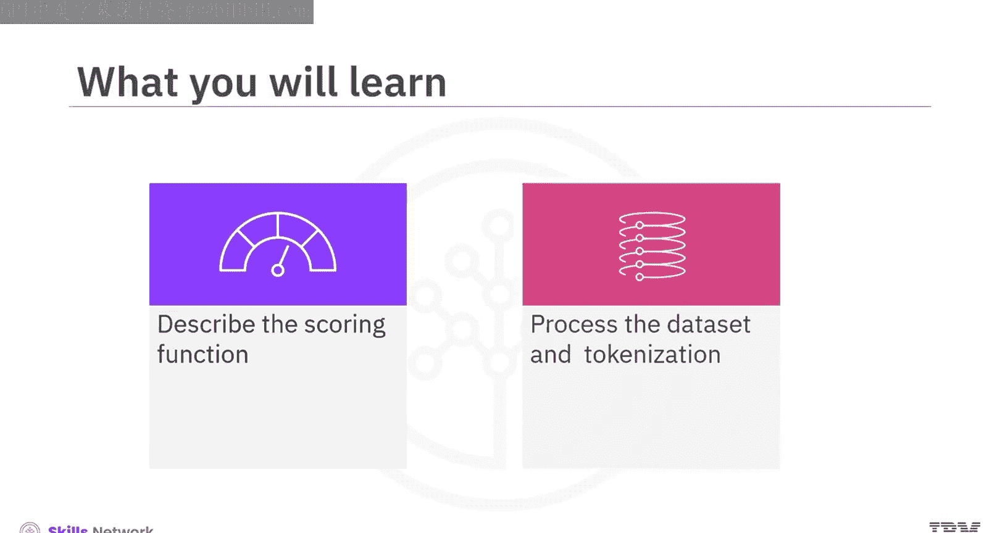
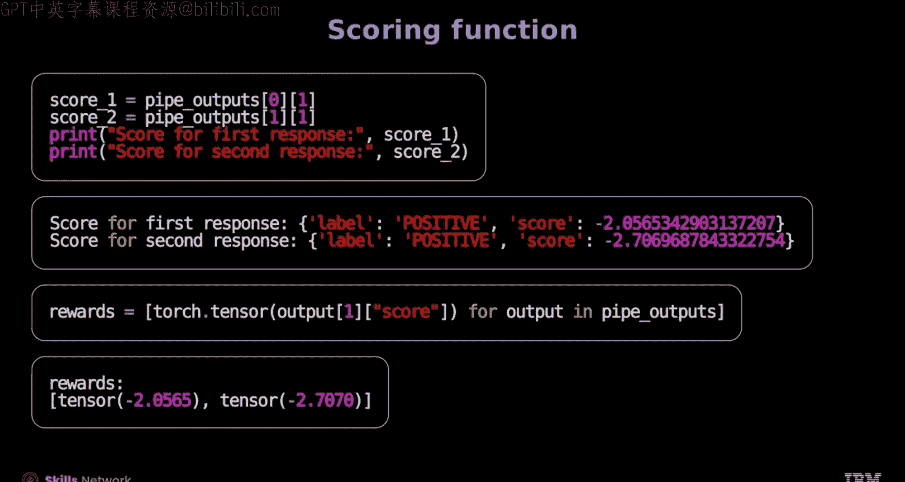
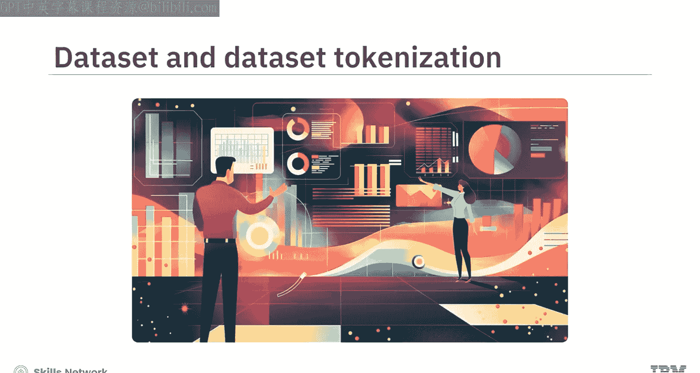
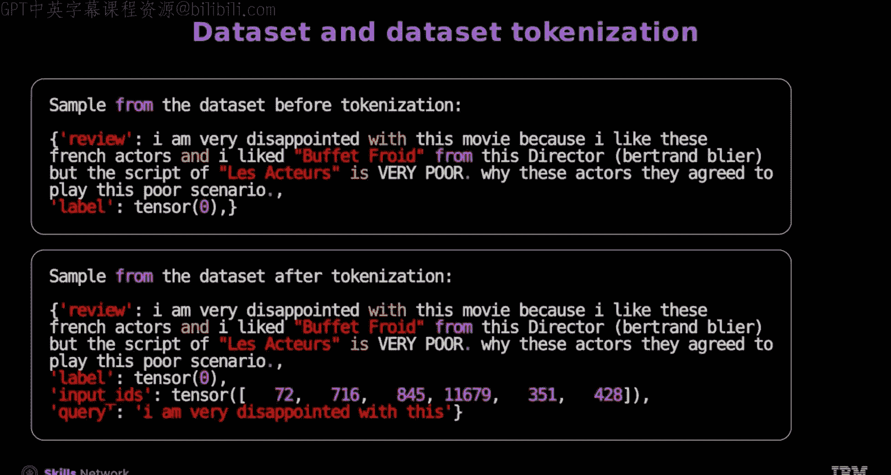

# 生成式人工智能工程：151：使用Hugging Face进行PPO 🚀

在本节课中，我们将学习如何使用Hugging Face库实现近端策略优化（PPO），重点了解情感分析评分函数、数据集及其分词处理过程。

---

## 概述 📋



PPO是强化学习中的一种算法，用于优化策略模型。在本节中，我们将构建一个使用情感分析作为奖励函数的PPO流程。具体来说，我们将：
1.  描述用于情感分析的评分函数。
2.  解释IMDB数据集及其使用Hugging Face进行的分词处理。

---

## 评分函数介绍

上一节我们介绍了PPO的基本概念，本节中我们来看看如何为PPO定义一个评分函数。在生成式AI应用中，对模型生成的回复进行情感分析，可以作为有效的评分函数，用于奖励正面回复而非负面回复。

在强化学习的近端策略优化中，奖励函数为策略采取的行动质量提供反馈。它同样可以评估生成式模型（如聊天机器人）所生成回复的质量。

### 初始化情感分析管道

首先，我们使用一个在IMDB影评数据集上微调过的预训练模型来初始化一个情感分析管道。

```python
from transformers import pipeline

sentiment_pipe = pipeline("sentiment-analysis", model="distilbert-base-uncased-finetuned-sst-2-english")
```

### 应用评分函数

现在，将情感分析管道应用于两段示例文本，以展示其结果。

```python
texts = ["This movie was fantastic!", "I did not enjoy this film at all."]
```

用于情感分析管道的参数字典 `S Wgs` 指定了应返回所有四种结果，应用函数为 `none`，批次大小为 `2`。

运行定义好的管道对象处理上述文本：

```python
outputs = sentiment_pipe(texts, **S_Wgs)
```

可以看到输出为每段文本对应的负面和正面情感概率值。来自情感分析管道的分数用于评估生成回复的质量或相关性，它表示模型对生成正面回复可能性的置信度。

### 提取奖励分数

接下来，遍历管道输出列表，从每个输出中提取分数，将其转换为张量并存储在奖励列表中。这些分数将作为模型对生成正面回复可能性的置信度，进而用作PPO训练中的奖励。

```python
rewards = []
for output in pipe_outputs_list:
    score = output['score']  # 假设输出中包含‘score’键
    reward_tensor = torch.tensor([score])
    rewards.append(reward_tensor)
```

---

## 数据集与分词处理

了解了评分机制后，我们需要准备训练数据。接下来，我们看看所使用的数据集以及如何对其进行预处理。

### IMDB数据集

IMDB数据集包含50,000条电影评论。在本教程中，我们仅使用评论文本进行分析。首先，过滤掉长度小于或等于200个字符的评论，只保留长度大于200的序列。





长度采样器有助于在数据处理中变化文本长度，这能增强模型的鲁棒性并模拟真实的训练条件。同时，它通过管理文本输入长度来确保训练效率并维持模型性能。

长度采样器的范围介于设定的最小文本长度和最大文本长度之间。

### 分词处理

接下来，加载与因果语言模型关联的预训练分词器，并将填充标记设置为句子结束标记。

```python
from transformers import AutoTokenizer

tokenizer = AutoTokenizer.from_pretrained("gpt2")
tokenizer.pad_token = tokenizer.eos_token  # 将EOS标记设为填充标记
```

现在，将评论文本分词为输入ID。将分词后的序列截断到所需长度，并将其赋值给 `input_ids`。

```python
def tokenize_function(examples):
    return tokenizer(examples["text"], truncation=True, max_length=512)

tokenized_datasets = raw_datasets.map(tokenize_function, batched=True)
```

分词后，你可以看到创建了输入ID和查询的样本文本。这可以作为模型的输入。

### 构建数据集函数



让我们将到目前为止讨论的所有步骤组合成一个单一的函数来构建数据集。

屏幕上显示了数据集在处理前后的两个主要差异：
1.  添加了两个新的键。
2.  由于移除了短于200个字符的文本，行数减少了。

下图展示了数据在清洗和分词前后的一个示例。

---

## 总结 🎯

本节课中，我们一起学习了使用Hugging Face进行PPO的过程，包括生成回复和计算评分。

*   **奖励函数**：PPO通过奖励函数为策略采取的行动质量提供反馈。
*   **情感分析评分**：情感分析管道的分数用于评估生成回复的质量。
*   **分数提取**：生成回复的分数从管道输出列表中提取。
*   **长度采样器**：长度采样器通过变化文本长度来增强模型鲁棒性，并模拟真实的训练条件。


通过掌握这些核心步骤，你已经为使用情感分析作为奖励机制来训练和优化生成式模型打下了基础。