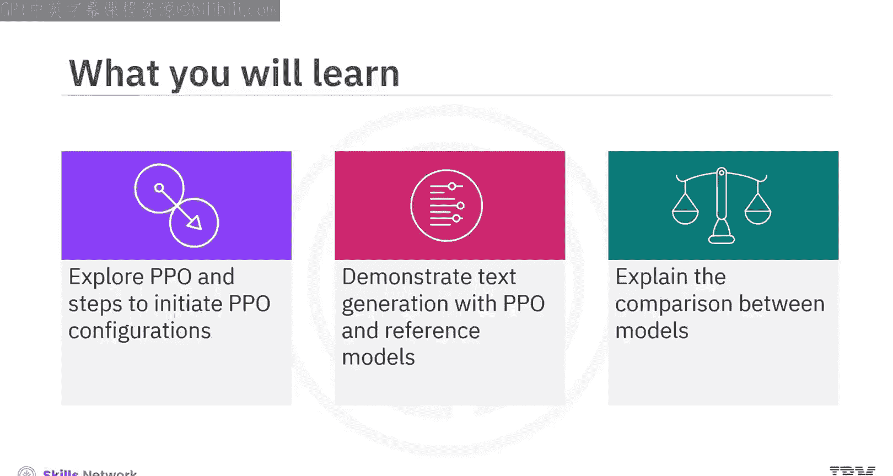
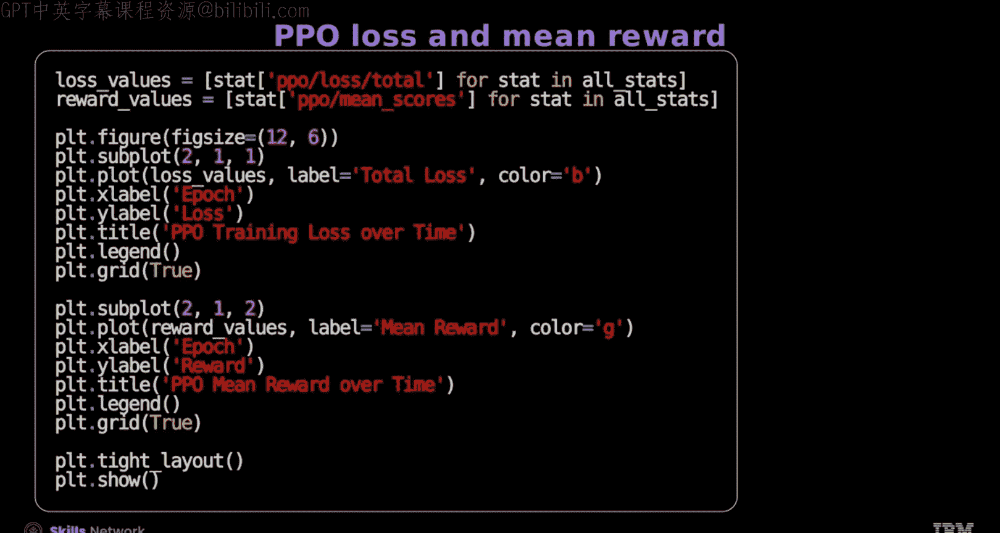
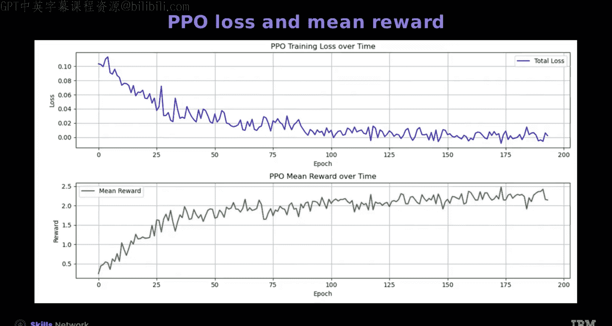
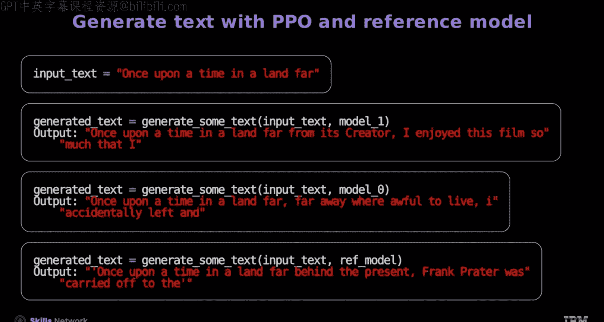
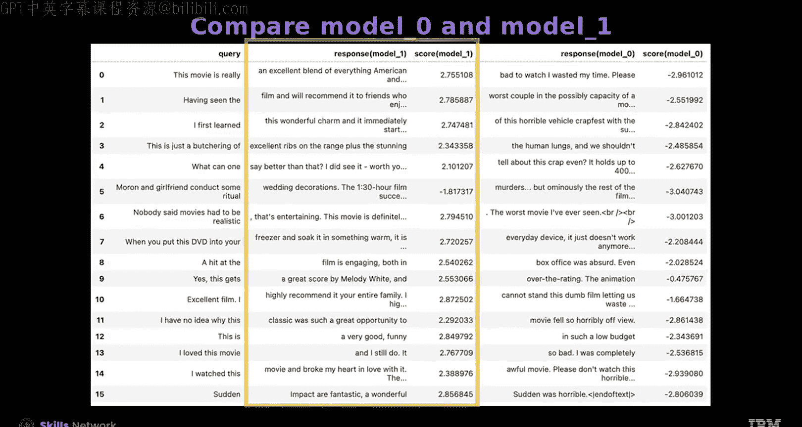
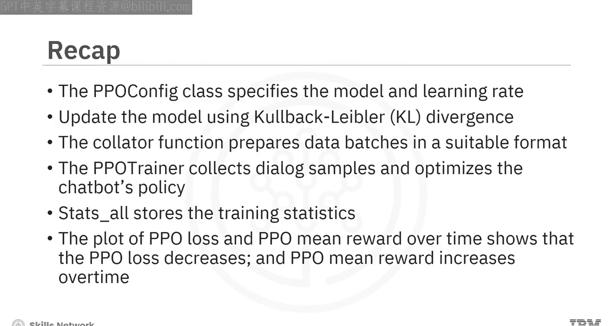

# 生成式人工智能工程：152：PPO训练器 🚀

在本节课中，我们将学习近端策略优化（PPO）训练器的核心概念与使用方法。我们将探索如何初始化PPO配置、使用PPO和参考模型生成文本，并解释不同模型之间的比较。

## 探索PPO配置初始化



上一节我们介绍了PPO的基本概念，本节中我们来看看如何初始化PPO配置。`PPOConfig`类用于指定PPO训练所需的模型和学习率。

以下是配置的关键步骤：

*   **指定模型名称**：`model_name`参数用于设定需要微调的模型。
*   **设置学习率**：`learning_rate`参数控制模型参数更新的步长。

## 加载模型与参考模型

为了稳定训练过程，我们需要加载一个参考模型。其核心作用是**通过KL散度来约束当前策略（即被训练的模型）与参考策略（即参考模型）之间的差异**，防止训练过程偏离太远。

`AutoModelForCausalLMWithValueHead`类扩展了标准的`AutoModelForCausalLM`类，专门用于强化学习场景，它在语言模型基础上增加了一个价值头（Value Head）来估计状态的价值。

## 数据整理器（Data Collator）

数据整理器函数对于准备适合PPO训练器格式的数据批次至关重要。它确保来自数据样本的每个特征（如`input_ids`, `attention_mask`）被正确地分组和填充，形成规整的张量批次。

以下是一个简化的代码示例，展示了其工作原理：
```python
def data_collator(data):
    # 假设data是一个字典列表，每个字典包含‘input_ids’等键
    input_ids = [item[‘input_ids’] for item in data]
    # 对input_ids进行填充，使其长度一致
    padded_ids = pad_sequence(input_ids, batch_first=True, padding_value=tokenizer.pad_token_id)
    return {‘input_ids’: padded_ids}
```

## 理解PPO训练器

`PPOTrainer`是训练过程的核心。它处理查询样本，并优化聊天机器人的策略，以完成确保生成高质量回复的复杂任务。

现在，让我们初始化PPO训练器。这需要组合之前准备好的所有组件。

以下是初始化所需的关键组件列表：

*   **配置**：首先，使用包含学习率和模型名称等设置的`PPOConfig`。
*   **模型**：接下来，输入待微调的主模型。
*   **参考模型**：然后，输入用于稳定训练的参考模型。
*   **分词器**：接着，插入用于处理输入文本的分词器。
*   **数据集**：最后，提供模型训练所需的输入数据集。
*   **数据整理器**：数据整理器负责对输入数据进行批处理和格式化。

## 训练循环与奖励塑造

在PPO训练中，`stats_all`列表存储每个批次的训练统计信息。我们可以通过设置奖励来引导模型生成特定情感的文本。

*   将情感分数变化值`change_score`设为`1`，会为积极情感提供更高的奖励，从而鼓励聊天机器人生成积极回复。
*   反之，将`change_score`设为`0`，则会增加为消极情感提供高奖励的可能性，导致模型生成消极回复。

屏幕上展示了使用情感分析进行PPO算法的训练循环代码。该循环遍历PPO训练器和数据加载器提供的数据批次。

以下是每个训练步骤的核心操作：

1.  **生成回复**：对于批次中的每个查询张量，随机采样一个输出长度，并以此设置生成新令牌的最大数量，然后使用PPO训练器生成回复。
2.  **处理回复**：将生成的回复张量添加到回复张量列表中，并根据生成的长度进行修剪。
3.  **情感分析**：将回复张量解码为文本，与原始查询拼接，然后应用情感分析管道分析拼接后的文本。
4.  **计算奖励**：提取情感分数并将其转换为张量，作为奖励信号。
5.  **模型更新**：执行PPO步骤，传入查询、回复和奖励，调用`trainer.step()`方法更新模型。
6.  **记录统计**：记录统计信息（包括批次和奖励），并将其追加到`stats_all`列表中。PPO训练器会返回一个包含奖励和各项损失的字典。

## 结果分析与模型保存

我们可以编写一个函数来展示这些统计值。

*   将`return_objective`参数设为`True`有助于获取优化模型参数所需的统计信息，例如**模型损失**和**价值损失**。
*   将其设为`False`则有助于获取与强化学习相关的其他指标，例如**优势估计**和**奖励计算**。

训练完成后，是时候保存微调好的模型了。接下来，我们可以绘制PPO训练损失和PPO平均奖励随时间变化的图表。




从图表中可以看到，**损失随时间推移而下降**，同时**PPO平均奖励随时间推移而上升**。为了进行对比，我们也可以通过将`change_score`值设为`0`来训练一个专注于消极情感的模型（Model0）。




## 使用PPO和参考模型生成文本

现在，我们来学习如何使用训练好的模型生成文本。首先，需要根据CPU和GPU的可用性来分配计算设备。

接着，定义一个解码函数，用于对输入文本进行分词，并使用提供的模型生成回复。请注意，**不能使用标准的`text-generation`流水线**，因为它与`AutoModelForCausalLMWithValueHead`类不兼容。

我们可以使用相同的输入文本来查看三个模型的回复：
*   **Model1**：在积极情感上训练，生成积极回复。
*   **Model0**：在消极情感上训练，生成消极回复。
*   **参考模型**：即原始模型，提供中性回复。




## 模型比较



现在让我们比较Model0和Model1。屏幕上展示了积极情感模型和消极情感模型生成的回复示例及其情感分数。

可以看到，**积极模型生成积极回复并获得高分**。相反，**消极模型生成消极回复并获得低分**。


## 总结

本节课中我们一起学习了PPO配置及其使用Hugging Face库进行的训练过程。我们了解到：
*   `PPOConfig`类用于指定PPO训练的模型和学习率。
*   PPO训练通过**KL散度**来更新模型，约束其与参考模型的差异。
*   `data_collator`函数对于准备适合PPO训练器格式的数据批次至关重要。
*   `PPOTrainer`收集对话样本并优化聊天机器人的策略。
*   在PPO中，`stats_all`列表存储每个批次的训练统计信息。
*   绘制PPO损失和PPO平均奖励随时间变化的图表显示，**PPO损失下降，而PPO平均奖励上升**。



