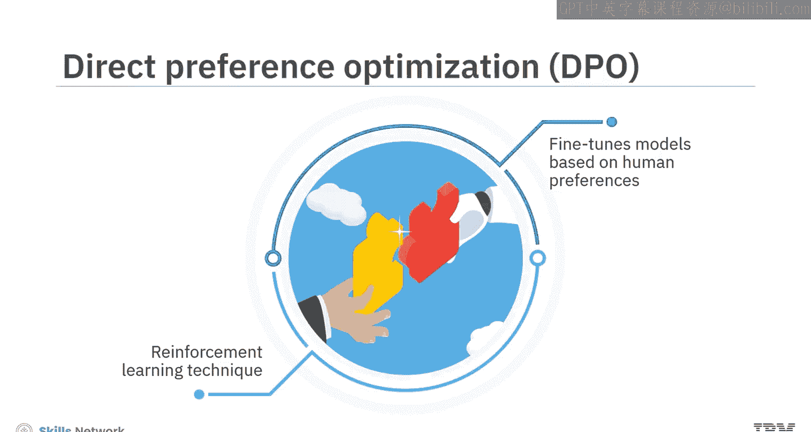
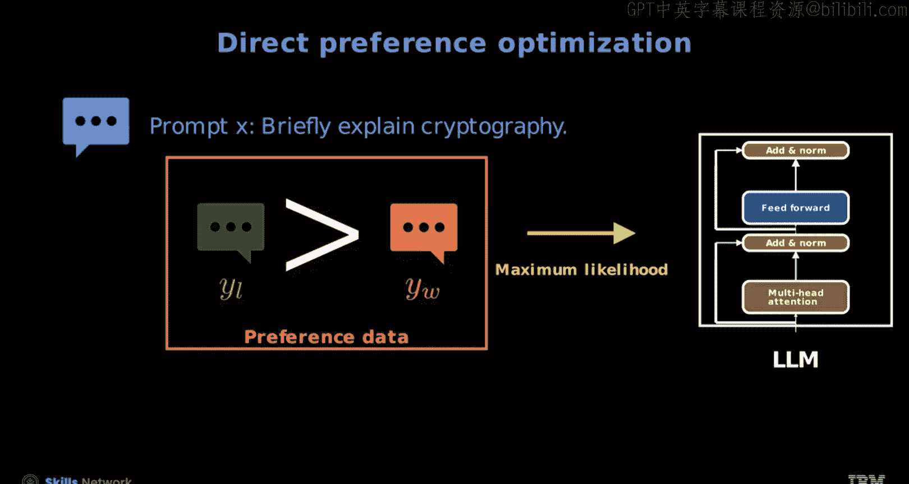
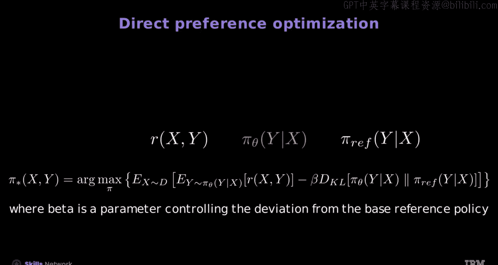
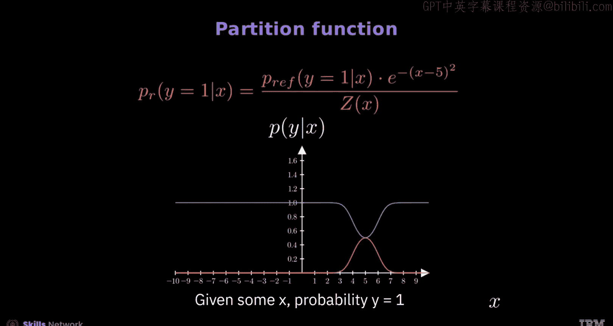

# 生成式人工智能工程：153：DPO分区函数 🧠

在本节课中，我们将学习直接偏好优化（DPO）的基本概念及其模型构成，并重点探讨如何利用分区函数将一个简单的概率分布转换为更复杂的分布，以服务于DPO的目标函数。

## 概述

直接偏好优化（DPO）是一种强化学习技术，旨在比传统方法更直接、更高效地根据人类偏好对模型进行微调。它通过收集人类对不同模型输出的偏好数据来直接优化模型参数，使其输出更符合人类选择。

## DPO的核心概念与模型

上一节我们介绍了DPO的基本目标，本节中我们来看看DPO具体涉及哪些模型。

DPO涉及三个核心模型：奖励函数、目标解码器模型和参考模型。

*   **奖励函数**：使用一个编码器模型。例如，一个用于评估大语言模型（LLM）文本相关性的奖励模型。如果输入文本是“this is a”，而响应是“cat”，奖励模型可能会给出一个低分（如0.1），因为“cat”与LLM无关。反之，如果响应是“reward function”，奖励模型则会给出高分（如0.99），因为这与LLM高度相关。
*   **目标解码器模型**：具有参数 `θ` 的模型，这是我们希望优化的策略模型 `π_θ`。
*   **参考模型**：一个固定的初始模型，用于在优化过程中提供正则化约束。

在GPU上同时运行这三个模型具有挑战性。我们的主要目标是获得一个最优策略 `π*` 及其参数 `θ`，以最大化以下目标函数：

`J(θ) = E[ r(x, y) ] - β * D_KL( π_θ(y|x) || π_ref(y|x) )`

其中，`β` 是一个衡量与参考模型偏离程度的正则化项。这个优化问题通常需要强化学习中的高级方法（如近端策略优化PPO）来解决。

然而，在DPO中，我们可以将这个复杂的强化学习问题转化为一个更简单、更易于优化的目标函数。

## 分区函数的作用

上一节我们了解了DPO希望简化的复杂优化问题，本节中我们来看看分区函数如何帮助实现从简单分布到复杂分布的转换。

分区函数是一个广泛的主题，此处我们仅通过一个直观示例来展示其作用：将一个简单的逻辑分布转换为一个更复杂的自定义分布。

首先，让我们探索逻辑函数 `σ(x)`，它将任何实数映射到0和1之间。此函数构成了逻辑概率函数的基础，该函数计算给定 `x` 时 `y` 为0或1的概率，我们将其称为 `P_ref`，因为我们将基于它创建一个新的分布。

以下是构建新分布的关键步骤：

1.  **绘制基础概率**：首先，绘制 `y=0` 给定 `x` 的概率，即 `1 - σ(x)`（蓝色曲线）。随着 `x` 增加，此概率下降。接着，绘制 `y=1` 给定 `x` 的概率，即 `σ(x)`（红色曲线）。随着 `x` 增加，此概率上升。这两个概率之和，即分区函数 `Z(x)`，恒等于1，确保这是一个有效的概率分布。
2.  **缩放概率（非标准化）**：我们可以使用一个指数函数来缩放 `y=0` 的概率，该函数始终为正且沿Y轴对称。同样，可以使用一个高斯（钟形）函数来缩放 `y=1` 的概率。然而，缩放后的函数本身不再是有效的概率分布，因为它们对于每个 `x` 的概率之和不一定为1。
3.  **应用分区函数进行标准化**：分区函数 `Z` 在这里扮演着关键角色，用于对这些自定义的、缩放后的概率函数进行归一化。通过将每个缩放后的概率除以其对应的分区函数值 `Z(x)`，我们可以得到新的标准化概率。
4.  **验证结果**：标准化后，对于 `y=0` 和 `y=1` 的新概率函数，在任意 `x` 值下，两者之和严格等于1。这演示了归一化如何确保自定义函数满足有效概率分布的标准。

这个过程直观地展示了分区函数如何作为“归一化常数”，将一组未经验证、可能无效的分数或权重，转化为一个结构良好、总和为1的概率分布。在DPO的推导中，类似的技巧被用于将基于奖励的复杂策略优化目标，转化为一个类似于分类问题的、更简单的最大似然目标。

## 总结

本节课中我们一起学习了：
1.  **直接偏好优化（DPO）** 是一种用于根据人类偏好微调模型的强化学习技术，它通过直接优化策略模型来对齐人类选择，比传统奖励建模方法更高效。
2.  DPO涉及三个模型：**奖励函数**、**目标解码器模型**和**参考模型**。
3.  DPO的关键优势在于能够将复杂的强化学习优化问题，转化为一个更简单、更易于处理的目标函数。
4.  **分区函数** 在概率建模中起着核心作用，它通过归一化操作，能够将简单的或自定义的非标准化分布，转换为有效的、总和为1的复杂概率分布，这一原理是DPO数学推导中的重要基础。