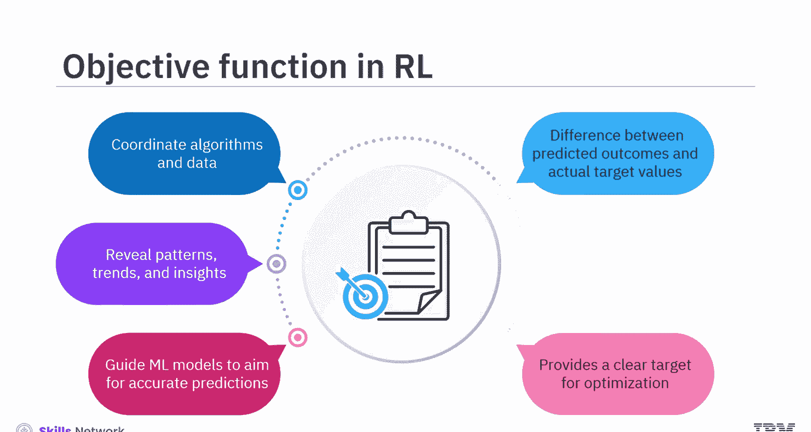
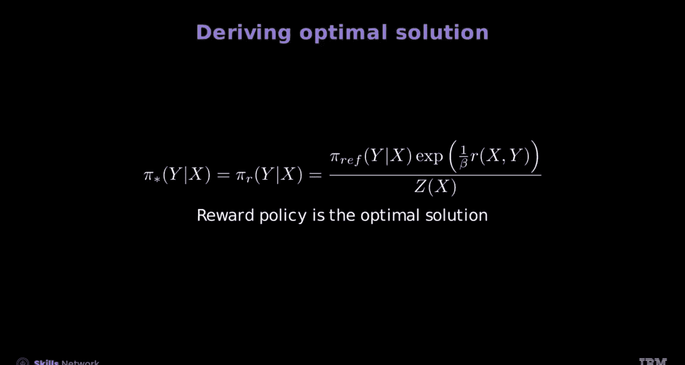
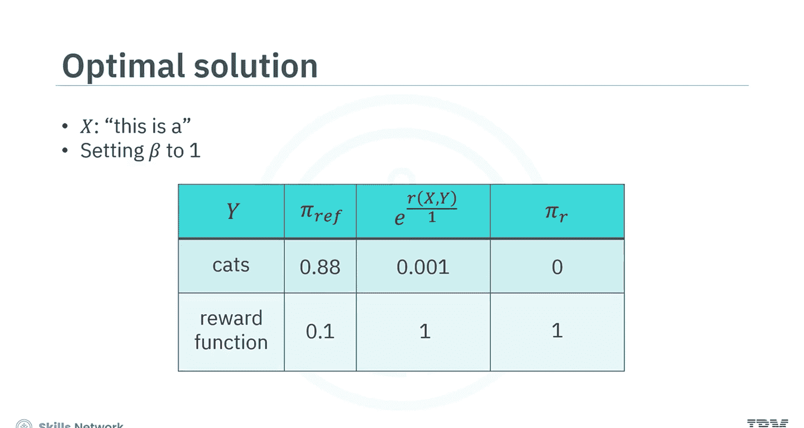
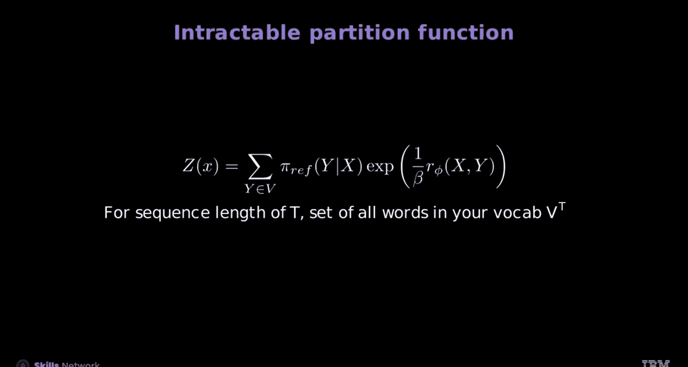
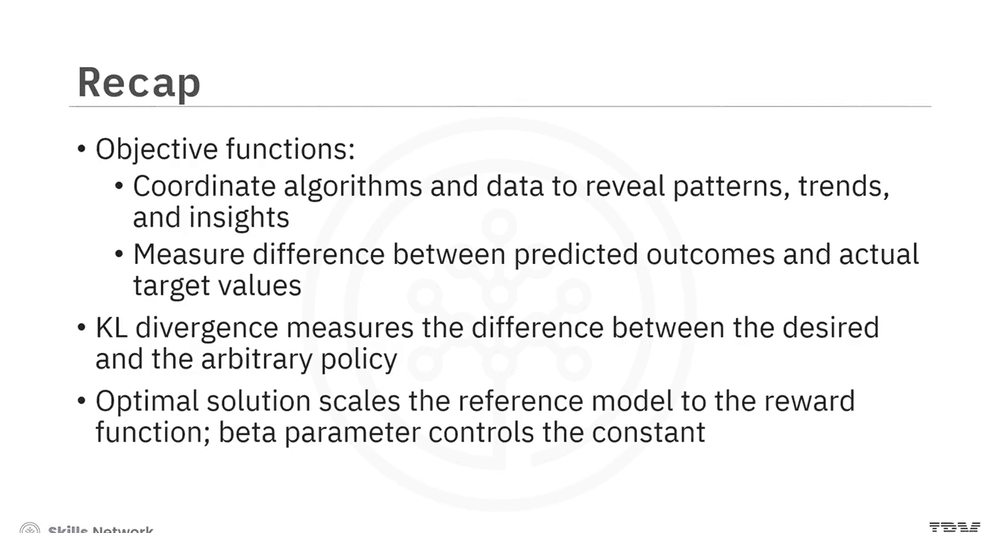

# 生成式人工智能工程：154：DPO最优解 🎯

在本节课中，我们将学习直接偏好优化（DPO）的最优解。我们将推导强化学习目标函数的闭式解，理解DPO目标，并最终找到DPO问题的最优解。

## 目标函数与KL散度

目标函数是机器学习的基础。它们协调算法和数据，以揭示模式、趋势和见解。这些数学工具指导机器学习模型完成学习过程，旨在实现准确的预测。本质上，目标函数衡量机器学习模型的预测结果与实际目标值之间的差异。

这个性能指标至关重要，它为优化提供了一个明确的目标。

让我们学习如何找到强化学习目标函数的闭式解。令 `π*` 为期望策略，`π_ref` 为任意参考策略，两者都代表给定输入 `x` 时输出 `y` 的概率 `P(y|x)`。KL散度衡量这两个概率分布之间的差异，如下图所示，它通过采样获得。

当且仅当 `π*` 和 `π_ref` 完全相同时，KL散度被最小化为0。为了更好地理解，让我们用一个一维示例来可视化，使用两个高斯分布。在y轴上，你有y的可能值。以0为中心的绿色高斯分布代表 `π*`，而以-4为中心（初始状态）的红色高斯分布代表 `π_ref`。当它们重叠时，KL散度达到0。

通过操作方程，你可以将强化学习目标函数问题表述为最小化KL散度，使 `π*` 与 `π_ref` 对齐，并确保你学习到的策略与期望行为匹配。

## 数学变换技巧

接下来，我们将运用一些巧妙而简单的数学技巧来推导目标函数。

第一个技巧是将最大化问题转换为最小化问题。下图绘制了函数 `f(w)`。红点标记了 `f(w)` 达到其最大值 `ŵ` 的点，该点通过取 `arg max f(w)` 找到。

接下来，你将通过取负来转换这个函数以找到其最小值。红点现在移动到取负后的函数达到最小值的点，从而有效地将 `arg max` 转换为 `arg min`。这个简单的变换允许你在寻找函数的最大值和最小值之间高效切换。

以同样的方式，将一个函数乘以一个标量不会改变最小值的位置。在下图中，函数 `g(w)` 被绘制在图上。最小值的位置沿水平轴。将函数乘以标量 `c` 不会改变这个位置。函数被 `c` 缩放，产生一个新函数 `c * f(w)`。请注意，尽管函数的形状发生了变化，但最小值保持在相同的位置。

现在，让我们使用最后两个例子来重新表述强化学习目标。

首先，从初始方程开始。为了使优化更容易，将整个表达式乘以负一，将最大化问题转化为最小化问题。注意各项现在是如何反转的。然后将表达式乘以 `1/β`。这些操作都不会影响最优值的位置。最后，将所有内容表示为期望值。这有助于简化优化过程。

## 推导DPO目标

让我们专注于目标并进一步简化方程。

以下是方程的简化形式，包含你的策略与参考策略的对数比率，以及一个涉及奖励的项。

现在，让我们用一些简单的代数来重新表述DPO目标。从初始目标开始，你有你的策略和参考策略的对数比率减去由 `β` 缩放的奖励项。

接下来，将奖励项表示为对数形式，这允许我们在后续步骤中合并对数。通过合并对数，将方程简化为显示比率除以奖励项指数的对数。

为了归一化，添加并减去一个归一化项 `Z(x)`，确保分布总和为1。结合这个归一化，调整你的方程以明确包含 `Z(x)`。分母包含一个分布，即奖励加权的分布，它将显示为奖励策略 `π_R`。

对于KL散度，必须消除额外的 `log Z` 项。在下图中，函数 `f(w)` 被绘制在图上。红点标记了该函数最小值的位置。

接下来，证明减去一个常数 `C` 不会改变最小值的位置。函数通过减去常数 `C` 进行调整，产生一个新函数 `f(w) - C`。请注意，尽管函数的垂直位置发生了变化，但最小值的x值没有改变。

从简化后的表达式开始，你将制定目标函数。现在，最小化期望值，并通过注意到常数项 `Z(x)` 不是感兴趣的参数来简化。这导致了目标函数更简洁的表述。

接下来，将目标表达为最小化策略与奖励策略在数据上的KL散度，这正是最初的目标。因此，最小化此表达式的策略就是奖励策略，也就是该问题的最优解。

最优解将参考模型按奖励函数进行缩放，其中 `β` 参数控制常数。考虑输入标记 `x` 为 “This is a”，设置 `β` 为1。在下表中，第一列显示了大语言模型的两个输出，第二列显示了这些输出的概率。第一个输出是 “cats”。由于这不罕见，参考模型为其分配了0.8的概率。第二个输出是奖励函数，由于这不太可能，参考模型为其分配了0.1的概率。

如果第三列所示的奖励模型针对与大语言模型相关的问题进行了优化，“cats”将获得比奖励函数更低的分数，而奖励函数的概率会增加。通过取这些概率的乘积并进行归一化，新模型将为奖励函数分配大约1.0的概率，为“cats”分配0.0的概率。改变 `β` 将改变模型权衡参考模型与奖励函数的方式。

## 配分函数的计算挑战

计算这个配分函数本质上是不切实际的。让我们用具体的例子来说明这一点。

首先，对于序列长度为1的情况，`Z(x)` 对词汇表 `V` 中的所有单词求和，例如 “UBA”、“Aaron” 和 “Zziva”。其次，对于序列长度为2的情况，`Z(x)` 对词汇表中所有可能的单词对求和，形成一个更大的集合 `V²`。最后，推广到序列长度为 `T` 的情况，`Z(x)` 对词汇表中所有长度为 `T` 的可能序列求和，即 `V^T`。随着 `T` 的增加，项数呈指数级增长，这使得配分函数随着 `T` 的增加而越来越难以计算。

然而，有了奖励策略，你现在可以应对这种复杂性。

## 总结

在本节课中，我们一起学习了以下核心概念：

*   **目标函数**：协调算法和数据，以揭示模式、趋势和见解，从而产生准确的预测。它们衡量机器学习模型的预测结果与实际目标值之间的差异。
*   **KL散度**：衡量两个概率分布（期望策略和任意参考策略）之间的差异。
*   **最优解**：将参考模型按奖励函数进行缩放，其中 `β` 参数控制权衡常数。

