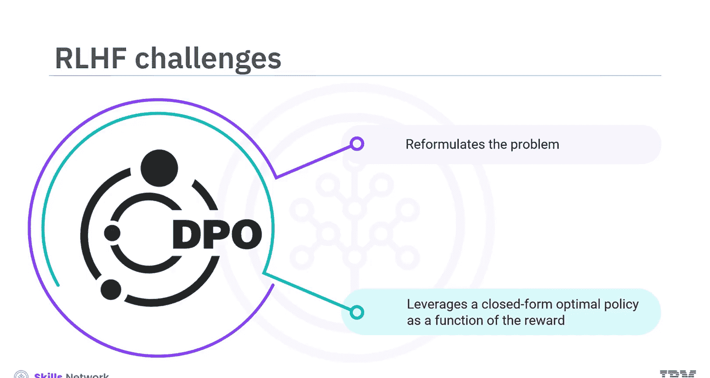
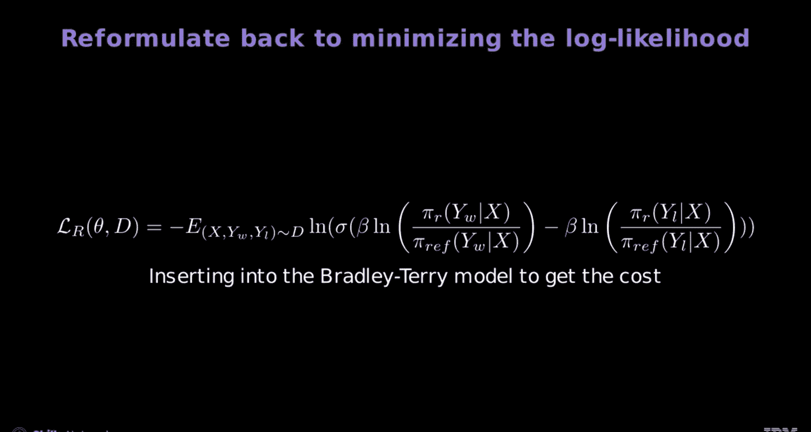
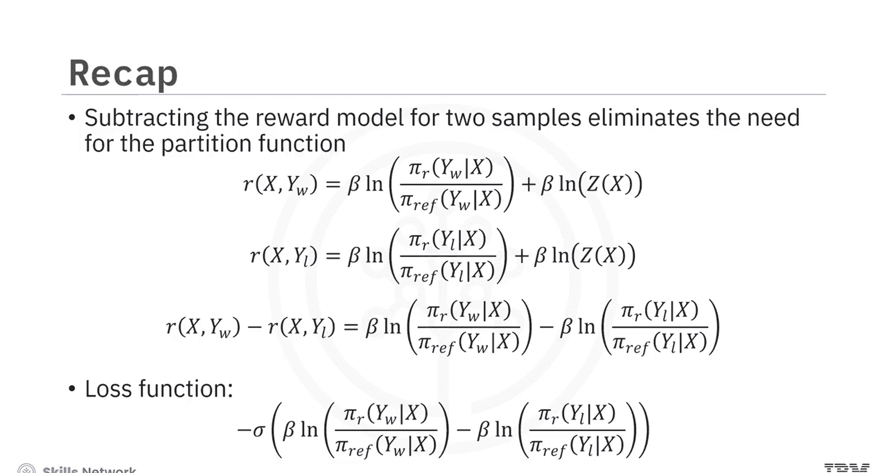

# 生成式人工智能工程：14：从最优策略到DPO 🧠

在本节课中，我们将学习如何通过直接偏好优化（DPO）来训练生成式因果大语言模型。我们将推导DPO的目标函数，并找到最大化它的表达式。同时，我们将使用Bradley Terry模型来理解损失，并将其转换为成本。

## 概述

基于人类反馈的强化学习（RLHF）是优化大语言模型的有效技术，但它也带来了计算复杂性、不可微分性和不稳定性等挑战。DPO通过利用奖励函数的闭式最优策略来重新表述问题，从而解决这些问题。

## 从评分到成对排序

首先，我们使用一个评分函数数据集来通过DPO训练生成式因果大语言模型。人类评估者为回答分配分数，但分配精确的数值分数具有挑战性。

以下是查询、回答和分数的示例表。第一行是查询，第二行是得分较高的回答A，第三行是得分较低的回答B。

对回答进行排序比分配分数更容易。第二张表按受欢迎程度排列回答，无需数值分数，这简化了人类评估者的评估工作。

你的重点将放在两个样本的成对排序上，但该方法可以扩展到多个样本。为保持一致性，我们遵循DPO文献中的相同符号：`W`（win）代表回答A，`L`（lose）代表回答B。

使用采样符号，其中`D`是数据集，波浪线表示采样值。`X`（查询）、`Y_W`（获胜回答）和`Y_L`（失败回答）从数据集中抽取，如上表示例所示。

## Bradley Terry模型与损失函数

在原始的Bradley Terry模型中，损失是sigmoid函数对获胜回答与失败回答得分之差的**对数**。

使用采样符号，可以将求和转换为在数据集`D`上的**期望值**。

现在，让我们关注log和sigmoid函数内部的参数，它本质上代表了损失函数，即获胜与失败回答的得分差。

## 定义DPO问题与挑战

为了解决给定的直接偏好优化（DPO）问题，你需要找到奖励策略，其中策略`π`是最优解。这里：

*   `X` 是查询
*   `Y` 是回答
*   `Z` 是配分函数
*   `π_ref` 是参考模型
*   `R` 是奖励函数
*   `β` 是正则化参数

主要问题是你无法求解配分函数`Z`，因为它涉及对所有可能组合的求和。

然而，通过一些巧妙而简单的数学运算，你可以消除计算配分函数的需要，并为你的因果大语言模型找到一个公式化的成本函数。这使你能够直接基于Bradley Terry模型训练你的模型，而无需经历PPO的困难训练过程。

## 推导DPO目标函数

现在，我们将从最优解开始推导DPO目标函数。

首先，分离指数项，并在等式两边同时乘以配分函数。

然后，对等式两边取自然对数，以线性化指数项，并求解奖励函数。

现在，你得到了用最优解表示的奖励模型。

将正样本（获胜回答，用蓝色表示）和负样本（失败回答，用红色表示）的方程值代入。

回想一下Bradley Terry模型的损失函数。

通过将这些表达式代入方程来减去两个样本的奖励模型，不仅消除了对配分函数的需要，而且这里显示的新损失函数现在变成了大语言模型及其参考模型的函数。这消除了对单独奖励函数的需求，给出了一个最大化DPO目标的表达式。

## 简化与理解损失函数

让我们逐步简化表达式以更好地理解它。

首先，从一个样本输出的损失函数的初始方程开始。

接下来，设`β`为1，通过移除`β`缩放因子来简化方程。

为了进一步简化，用常数`C`替换参考模型，这意味着你以相等的概率随机选择词汇表中的任何单词。

利用对数定律，你可以将对数内的项合并。

最后，将对数的参数设为单个变量`U`，它代表正样本概率与负样本概率的比值。

这种最终形式显示损失是`U`的对数的函数。

## 损失函数随U变化的分析

现在，让我们绘制损失随`U`变化的函数图。

从初始方程开始，考虑当给定查询的获胜回答的策略概率小于失败回答的策略概率时的情况。

如果获胜回答的策略概率增加，但仍小于失败回答的策略概率，则`U`对应于0到1的范围。因此，随着`U`增加，模型变得更好。绘制损失随`U`变化的函数图，你可以看到随着获胜回答的概率增加，损失减少。

当获胜回答的策略概率大于失败回答的策略概率时，`U`的范围从1到无穷大，代表更受青睐的补全概率更高。随着`U`增加，表明正样本概率更高，损失继续减少，如图表相应部分所示。

## 将损失转换为成本

以类似于Bradley Terry模型的方式，你可以将损失转换为成本。

让我们从初始方程开始。这里，损失函数表示为获胜与失败策略概率比值的对数（经`β`缩放）的sigmoid函数的**负值**。

接下来，将此表达式插入Bradley Terry模型。这将方程重新表述为最小化**对数似然**，从而将损失转换为成本。

要在PyTorch中实现这一点，你可以编写一个损失函数并计算损失，或者使用Hugging Face内置的DPOTrainer。

## 总结

本节课中我们一起学习了以下核心内容：

1.  DPO利用奖励函数的**闭式最优策略**来重新表述问题。
2.  为了解决给定的DPO问题，你需要找到奖励策略，该策略由以下表达式给出：`R(X, Y) = β * log(π(Y|X) / π_ref(Y|X)) + β * log Z(X)`。
3.  减去两个样本的奖励模型**消除了对配分函数的需要**，并且新的损失函数变成了大语言模型及其参考模型的函数。
4.  损失函数表示为获胜与失败策略概率比值的对数（经`β`缩放）的sigmoid函数的**负值**：`L_DPO(π_θ; π_ref) = -E_(X, Y_W, Y_L)~D [ log σ( β * log(π_θ(Y_W|X)/π_ref(Y_W|X)) - β * log(π_θ(Y_L|X)/π_ref(Y_L|X)) ) ]`。

通过这种方式，DPO提供了一种更稳定、更高效的方法来根据人类偏好微调大语言模型。