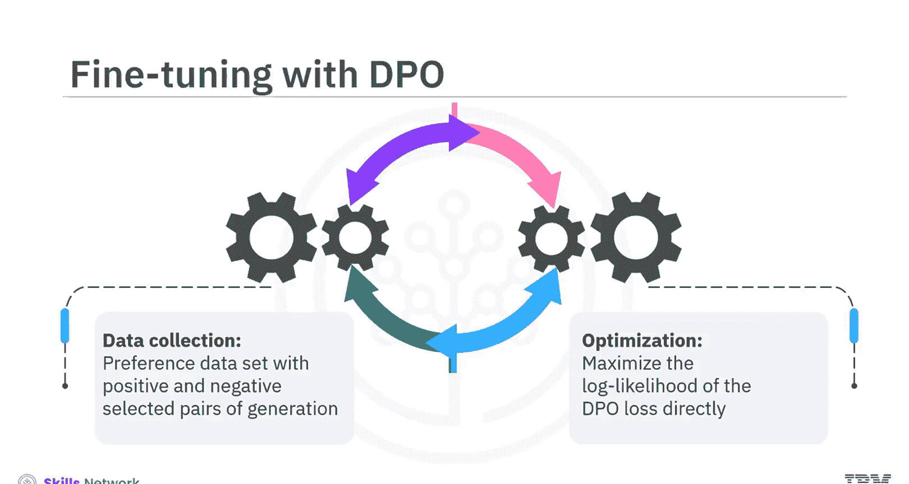
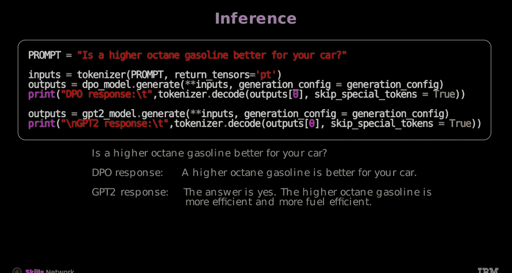

# 生成式人工智能工程：15：使用Hugging Face进行DPO 🚀

在本节课中，我们将学习如何使用Hugging Face工具进行直接偏好优化。我们将介绍可用于模型微调的库和资源，并逐步实现DPO微调，包括数据预处理、模型创建、训练、评估和推理。

与近端策略优化相比，通过DPO微调语言模型更为简便。DPO微调主要包含两个步骤：首先是数据收集，即针对每个提示，收集包含正例和负例选择的偏好数据集；其次是优化，即直接最大化DPO损失的似然函数。

## 数据准备 📊

上一节我们介绍了DPO的基本概念，本节中我们来看看如何准备数据。

我们将使用HuggingFace上由Bra Home提供的数据集。首先，使用以下命令加载数据：

```python
# 加载数据集的代码示例
```



该数据集分为六个部分，每条记录包含七个特征。我们只需要其中三个特征：`chosen`、`rejected`和`prompt`。本质上，该数据集为每个提示提供了一个偏好的回复和一个被拒绝的回复。

为了更好地理解数据集，可以通过执行以下命令来检查一条样本记录：

```python
# 查看样本记录的代码示例
```

这将显示数据集中的一条记录，展示其结构和内容。

在使用该数据集进行DPO训练之前，必须对其进行重新格式化。具体来说，需要提取提示、被拒绝的回复和选中的回复，以匹配DPO训练器的输入要求。

以下是处理步骤：
1.  定义一个处理函数，用于移除不需要的特征，并格式化被拒绝和选中的回复。
2.  使用`map`方法，将处理函数应用到整个数据集。
3.  最后，创建训练集和评估集。

经过预处理后，一条样本记录如下所示：

```python
# 预处理后样本记录的示例
```

## 模型与分词器配置 ⚙️

在准备好数据之后，下一步是创建和配置模型与分词器。

首先，使用Hugging Face Transformers库中的`AutoModelForCausalLM`类加载解码器GPT-2模型。

```python
# 加载GPT-2模型的代码示例
```

接下来，加载一个参考模型，这本质上是GPT-2模型的另一个实例。保留一个未修改的模型版本用于参考非常有用。

为了处理文本数据，需要一个分词器。按如下方式加载GPT-2分词器：

```python
# 加载分词器的代码示例
```

然后，通过将其填充标记设置为序列结束标记来配置分词器。这确保了填充处理的一致性。

为了实现内存高效的微调，可以集成参数高效的LoRA配置。这应用于注意力参数，可以加速训练。你可以尝试不同的权重和参数值以优化性能。

## 训练与评估 🏋️

配置好模型后，现在我们来定义训练参数并进行训练。

以下是定义训练参数的方法。超参数与其他方法类似，但多了一个`beta`参数。`beta`参数是DPO损失的温度参数，通常在0.1到0.5的范围内。

```python
# 定义训练参数的代码示例
```

接下来，定义DPO训练器。参考模型设置为`None`，因为你传递了PEFT配置，这意味着它是添加适配器LoRA层之前的原始模型。

通过运行`trainer.train()`，你可以开始在提供的数据上使用DPO方法训练模型。

现在，让我们绘制模型的训练损失图。训练日志可以从`trainer.state`中检索，这是一个JSON文件。可以看到，在训练过程中，训练损失在不断下降。

## 模型推理与结果 📈

训练完成后，我们来看看如何使用模型生成回复。

首先，加载训练好的DPO模型。同时，为了进行比较，也加载原始的GPT-2模型。

你也可以尝试使用`pipeline`函数和GPT-2分词器。

接下来，为DPO模型定义生成配置。

对于模型推理，定义输入提示：“Is a higher octane gasoline better for your car?”

现在，使用分词器对提示进行编码。然后，分别使用DPO模型和原始GPT-2模型生成文本。

最后，解码生成的文本并打印结果。

结果显示，DPO模型能够生成更高效、更直接的回复。



## 总结 ✨

本节课中我们一起学习了使用DPO微调语言模型的两个主要步骤：数据收集和优化。


要在Hugging Face上使用DPO微调语言模型：
1.  第一步是预处理数据集，你需要重新格式化它，然后定义并应用处理函数，最后创建训练集和评估集。
2.  下一步是为你的任务创建和配置模型与分词器。
3.  然后，你将定义训练参数和DPO训练器。
4.  接着，绘制模型的训练损失图，以确保其在训练过程中不断下降。
5.  最后，加载训练好的模型来生成回复，随后进行模型推理。