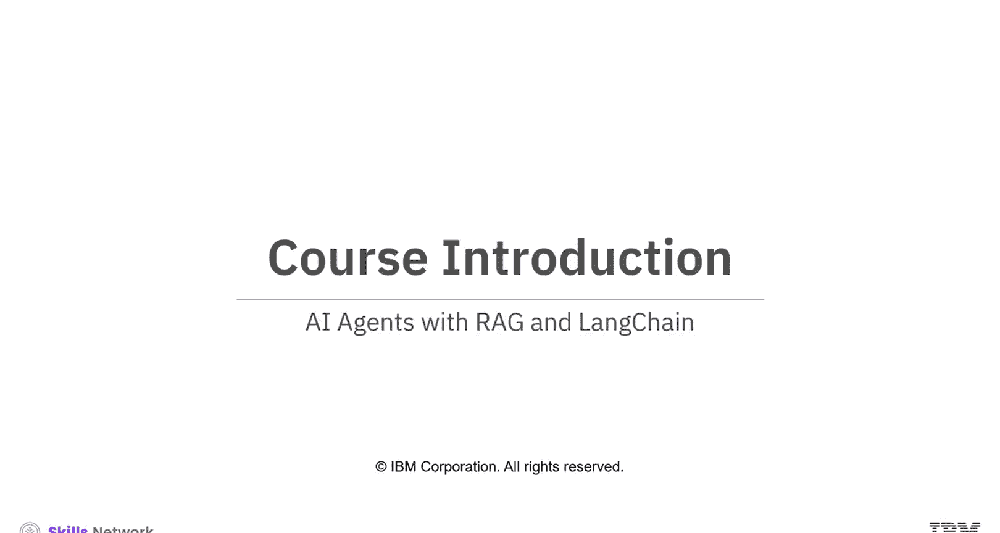
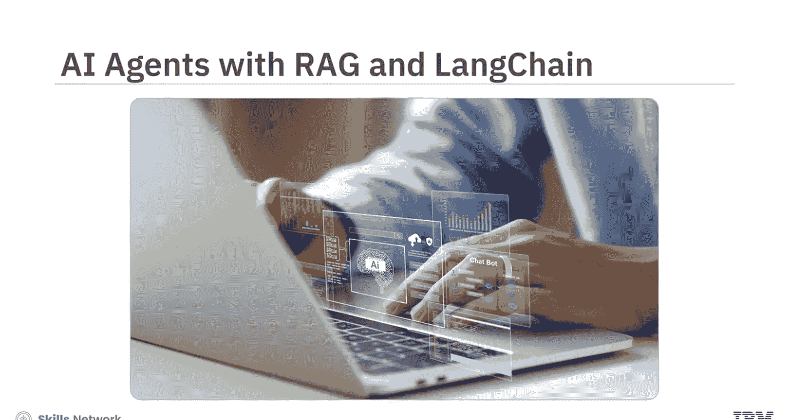
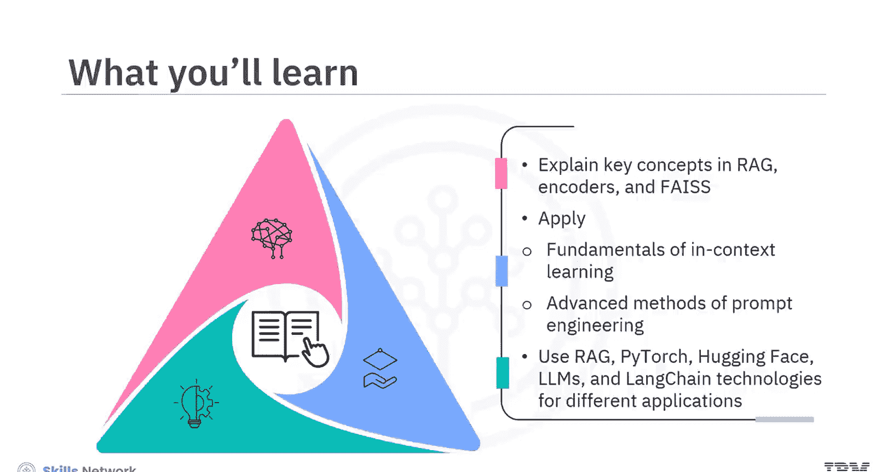
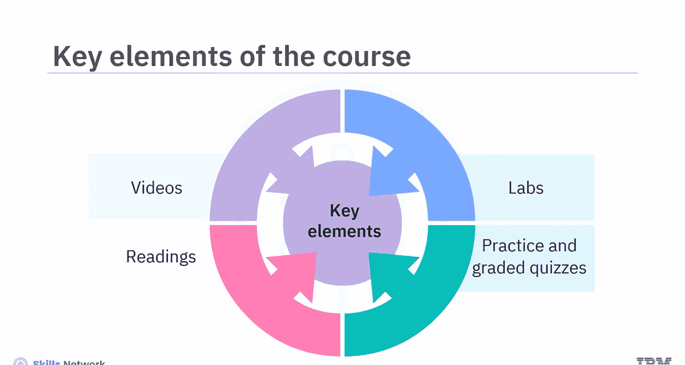
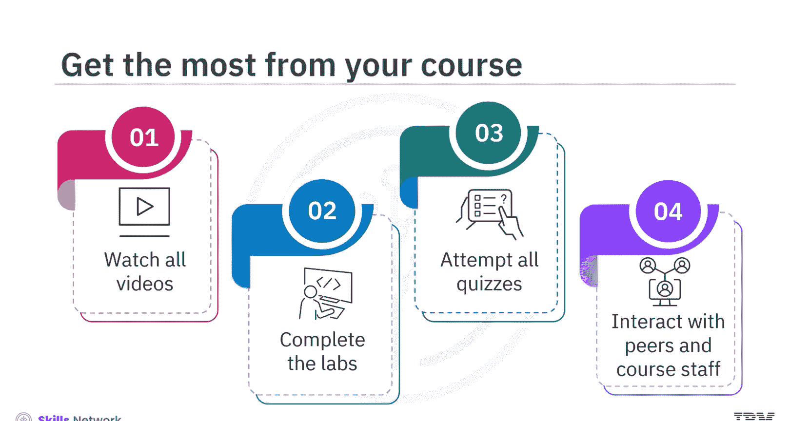

# 生成式人工智能工程：157：课程介绍 🚀

在本课程中，我们将学习如何利用Ra和Langchain构建AI智能体。你将通过实践AI工具和技术，掌握推动AI职业生涯发展所需的实用技能。

## 目标学员

本课程适合现有或志向成为数据科学家、机器学习工程师、深度学习工程师、AI工程师以及希望精通大语言模型（LLMs）的开发者。

## 预备知识

学习本课程，具备Python和PyTorch的基础知识，并对Transformer、嵌入（Embeddings）和掩码（Masking）有所了解将更有优势。

## 学习目标

完成本课程后，你将能够：

*   解释检索增强生成（RAG）、编码器和F等关键概念。
*   应用上下文学习的基础知识和提示工程的高级方法来优化提示设计。
*   运用RAG、PyTorch、Hugging Face、LLMs和Langchain等技术解决不同的应用问题，获得职场实用技能。

## 课程内容概览

本课程主要聚焦于与RAG、上下文学习和Langchain相关的概念。

课程开始时，你将学习用于生成响应的AI框架——RAG及其流程。接着，你将使用上下文编码器、问题编码器及其分词器，并探索由Facebook AI Research开发的F库。你还将练习将RAG与Hugging Face和PyTorch结合，应用于不同场景。

上下文学习的基础知识和提示工程的高级方法将帮助你提升提示设计能力。进一步，你将描述Langchain的核心概念、组件和聊天模型，并探索提示模板、示例选择器和输出解析器。

继续深入，你将利用文档加载器、文本分割器、向量数据库和嵌入等工具来提升LLM生成响应的质量。通过对Langchain框架的深度探索，你还将学习链的序列、Langchain工具与智能体及其记忆机制。

在实践实验中，你将使用Jupyter Lab环境来练习这些概念和技术，为在项目中应用它们打下坚实基础。最后，你将通过一个基于真实场景的指导项目来学习职场实用技能。

## 课程结构与学习建议

本课程混合了多种内容形式以促进学习：视频简短并聚焦主题；阅读材料以文本形式提供详细内容；实验则提供技术环境、详细说明和可用于完成动手练习的代码片段。练习和分级测验将帮助你应用所学并评估知识掌握程度。

为从本课程中获得最大收益，请观看所有视频，完成实验以练习新技能，并尝试所有测验。你也可以通过课程讨论论坛与同学互动，并从课程工作人员那里获得帮助。

让我们开始这段激动人心的旅程吧。祝你好运！

## 总结

本节课我们一起了解了《生成式人工智能工程》课程的整体介绍，明确了课程目标、适合人群、所需基础以及将要学习的核心技术与框架（如RAG、Langchain）。课程将通过视频、阅读、实验和项目相结合的方式，帮助你构建使用AI工具解决实际问题的能力，为你的AI职业生涯做好准备。