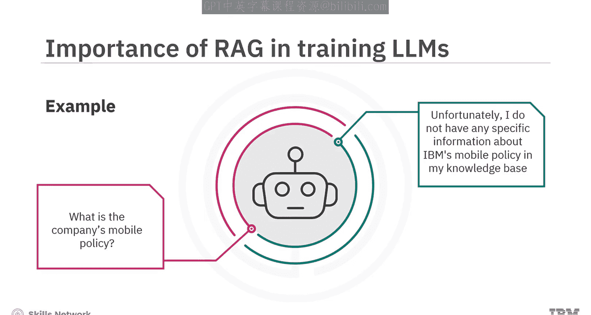
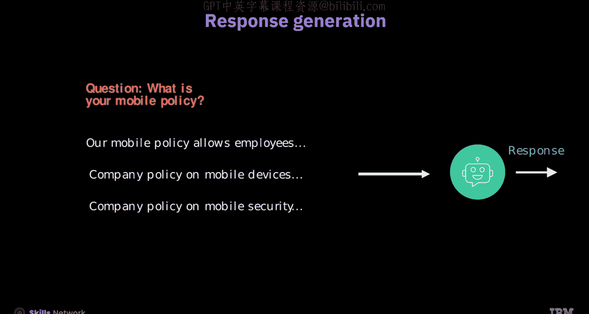
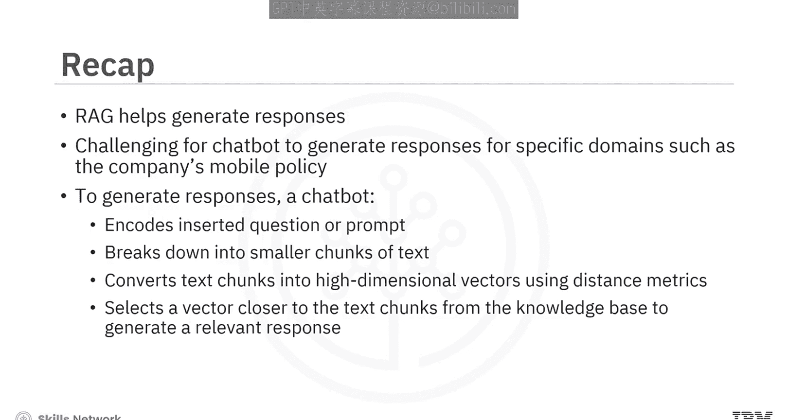

# 生成式人工智能工程：158：检索增强生成（RAG）入门

在本节课中，我们将学习检索增强生成（RAG）的基本概念和工作流程。RAG是一种结合了信息检索与文本生成的AI框架，旨在帮助大型语言模型（LLM）生成更准确、更符合特定领域知识的回答。

## 什么是RAG？🤔

上一节我们介绍了课程目标，本节中我们来看看RAG的定义。

RAG是一个AI框架，用于优化大型语言模型（LLM）的输出。它利用LLM的能力，并结合特定领域知识或组织的内部数据库，而无需重新训练模型本身。

预训练的LLM在处理其训练数据之外的特定领域知识时可能面临挑战。虽然它们在通用任务上表现良好，但对于专业查询可能会给出不准确的回答。因此，引入外部相关知识源有助于确保回答的准确性。

考虑一个公司手机政策的例子。如果你向一个聊天机器人询问公司的手机政策，聊天机器人需要从其知识库中提供答案，因为公司政策通常包含机密信息，不会公开在互联网上。为了生成这种特定领域的回答，RAG过程就非常有帮助。

## RAG如何工作？🔧

了解了RAG的目的后，我们接下来探索其核心工作流程。

RAG基于输入的提示或问题，结合检索到的信息，并生成自然语言来创建回答。它使用的知识库内容多样，包括训练过的聊天机器人数据、未公开在网上的公司政策以及大型文档等。

RAG主要由两个核心组件构成：
*   **检索器**：RAG的核心，负责从知识库中查找相关信息。
*   **生成器**：功能类似于聊天机器人，负责生成最终回答。

RAG过程包含以下几个关键步骤：

以下是RAG流程的具体步骤：

1.  **文本嵌入**：输入的提示或问题通过一个“问题编码器”被转换为高维向量。同时，知识库中的文档被“内容编码器”单独转换为高维向量并嵌入。
2.  **检索**：系统将输入提示的向量与知识库中的文本块向量进行匹配，以检索出相似的信息。
3.  **增强查询创建**：系统将检索到的向量所关联的文本与原始提示结合起来，创建一个“增强查询”。
4.  **模型生成**：语言模型利用创建好的增强查询，结合知识库内容，生成最终的回答。

编码器将提示和知识库转换为代表信息的嵌入向量。上下文和问题的嵌入可以由同一个编码器生成。这种方法易于理解，因为它主要涉及将文本转换为嵌入向量，尽管其效果可能并非最优。

## 提示编码与知识库构建 📝

现在，让我们深入了解提示和知识库是如何被编码成向量的。

### 提示编码

输入的提示使用**词元嵌入**和**向量平均**进行编码，并转换为向量表示。

在词元嵌入中，提示中的每个词元（如单词或子词）都使用一个预训练的模型（例如BERT或GPT）转换为高维向量。公式可以简化为：
`Token_Embedding = Model(token)`

当所有词元都被嵌入后，系统计算所有词元向量的平均值，为整个提示创建一个单一的向量表示。这意味着平均后的向量表示以一种简洁的方式捕获了输入提示的含义。
`Prompt_Vector = Average(Token_Embedding_1, Token_Embedding_2, ..., Token_Embedding_n)`

### 知识库向量化

考虑屏幕上显示的公司手机政策。你可以看到公司政策文档很大，直接将其插入聊天机器人是具有挑战性的。

因此，原始政策文档应被分解成更小、更易管理的文本块，以实现有针对性且高效的检索。

接下来，将每个文本块嵌入为向量，并将其索引到知识库中。

现在，通过使用预训练的词元嵌入模型将文本块转换为高维向量，来编码文本块以获得向量表示。同样，在嵌入所有词元后，系统对每个文本块内的词元向量取平均，为该文本块创建单一的向量表示。

文本块和嵌入向量的组合就代表了知识库，它捕获了每个块的信息。将这些嵌入向量插入一个向量数据库，并用块ID作为键来表示知识库。对这些嵌入向量进行的距离操作使用块ID来查找相关信息。

## 检索与匹配 🔍

RAG过程的下一步是从知识库中搜索与输入提示相关的上下文。

为此，系统将提示向量与知识库中代表文本块的向量进行比较。

让我们问一个关于公司手机政策的问题。知识库和问题都被转换为向量表示。

此外，系统使用**距离度量**计算提示向量与每个上下文向量之间的距离，以识别它们之间的相似性。

接下来，它选择3到5个与提示向量最接近的上下文向量，使用距离度量来呈现更相关的信息，以增强输入。

让我们将查询嵌入记为 **Q**，将知识库中的嵌入记为 **C1** 和 **C2**。

所选的距离度量会影响检索结果：
*   如果使用**点积**，它考虑向量的方向和大小，通过优先考虑整体对齐度，你可能会发现知识库嵌入 **C2** 在数值上更接近上下文向量。
*   现在考虑**余弦相似度**，它专注于方向以测量角度差异，因此知识库嵌入 **C2** 是一个更好的选择。

这意味着，对于重视向量大小的场景，点积更可取；对于重视向量方向的场景，余弦距离更可取。

为了选择最相关的前K个上下文（其中K是一个超参数），假设公司手机政策有7个块，我们选择块ID 6、2和0。真实数据集使用块库来加速此过程。这意味着你应该选择与查询相似且与公司手机或一般公司政策相关的文本块ID。

最后，从知识库中选出的文本与查询一起被输入聊天机器人，以生成合适的回答。

这意味着在RAG的帮助下，聊天机器人可以提供高效的响应。

## 总结 📚

本节课中，我们一起学习了如何利用RAG在模型未经预训练的情况下生成回答。

聊天机器人根据问题生成回答。然而，为特定领域（如公司手机政策）生成回答具有挑战性。为了生成关于公司手机政策的回答，输入的提示使用词元嵌入和向量平均进行编码，其中提示被分解成尽可能小的文本块。这些块被嵌入并转换为高维向量，以便使用距离度量搜索相关上下文。从知识库中选择最接近文本块的向量，以生成合适的回答。