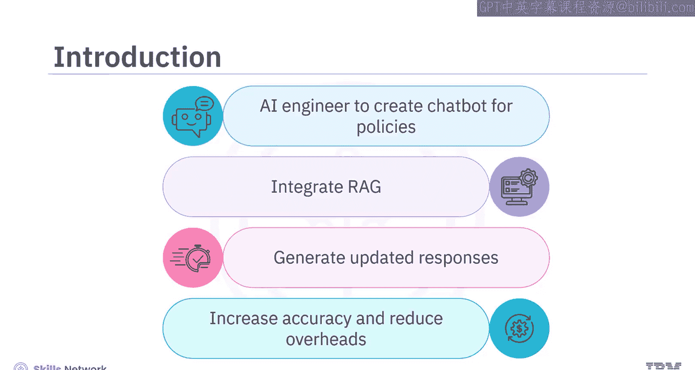
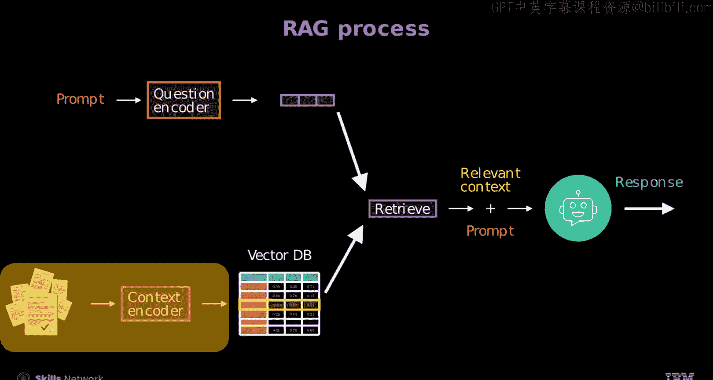
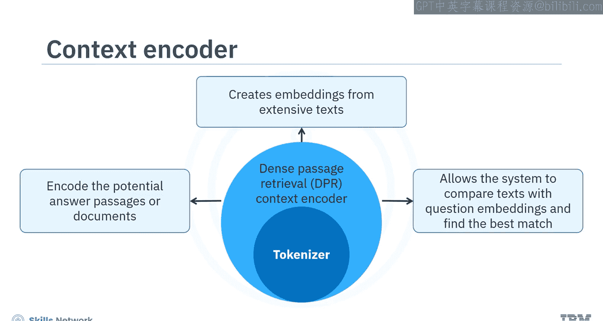
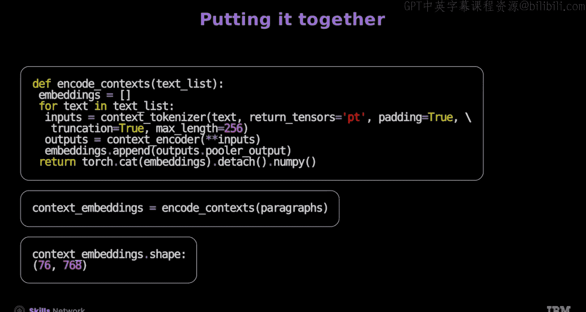
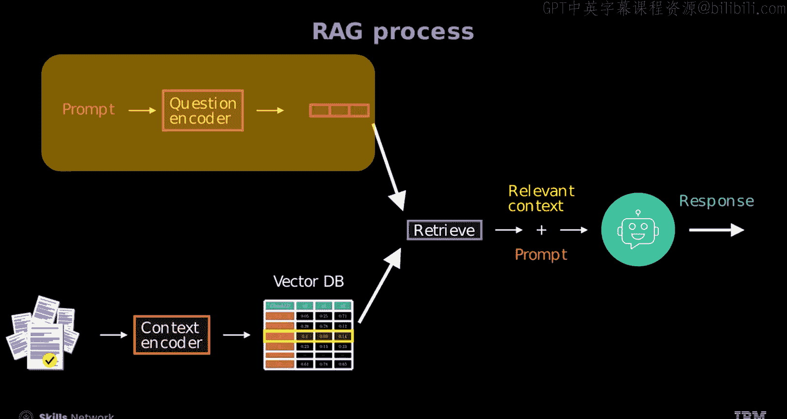
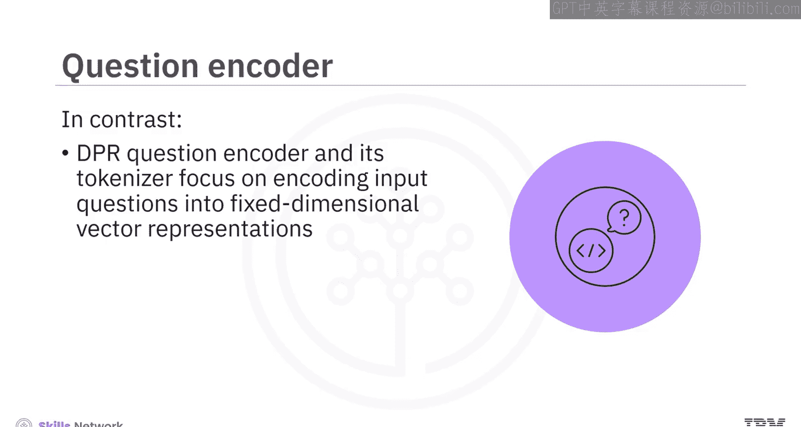
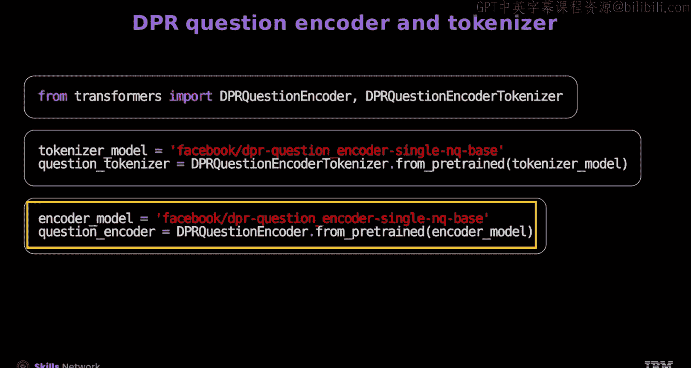
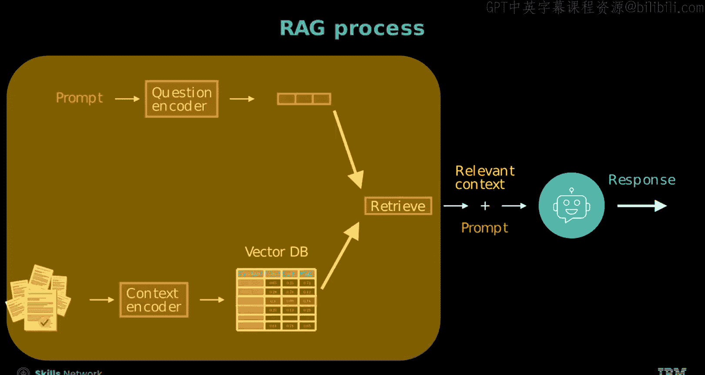
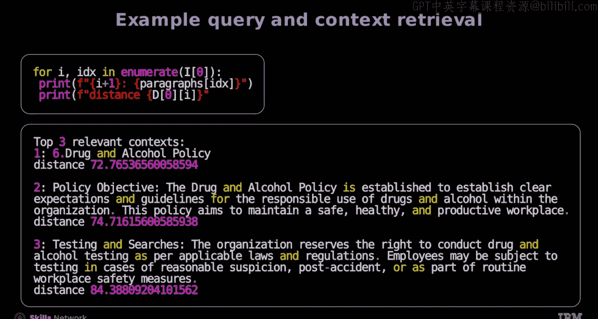
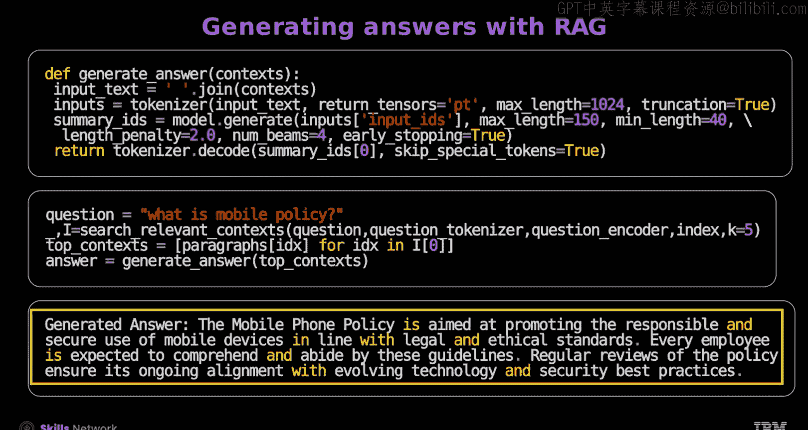

# 生成式人工智能工程：159：RAG编码器与FAISS 🧠

在本节课中，我们将学习检索增强生成（RAG）中的两个核心组件：上下文编码器与Facebook AI相似性搜索（FAISS）。我们将了解它们如何协同工作，将用户查询与海量文档库进行匹配，从而为语言模型提供实时、准确的信息来生成回答。

---

## RAG流程概述 🔄

上一节我们介绍了RAG的基本概念，本节中我们来看看其具体的工作流程。

RAG流程结合了语言模型与实时信息检索的能力。它首先将用户提供的提示和相关文档编码成向量，存储到向量数据库中。然后，系统根据编码后的问题向量与文档向量之间的距离，检索出最相关的上下文向量。最后，生成器将检索到的上下文与原始提示结合，生成最终的回答。



---


## 理解上下文编码器 📄

现在，让我们深入了解流程中的第一个关键部分：上下文编码器。

上下文编码器负责将可能包含答案的文档或段落编码成固定维度的向量（嵌入）。这使得系统能够将问题嵌入与这些文档嵌入进行比较，从而找到最佳匹配。




### 使用上下文分词器

以下是使用上下文分词器的步骤：



1.  从Transformers库中导入DPR上下文编码器的分词器。
2.  加载与指定模型关联的预训练分词器。

```python
from transformers import DPRContextEncoderTokenizer

tokenizer = DPRContextEncoderTokenizer.from_pretrained('facebook/dpr-ctx_encoder-single-nq-base')
```

3.  准备一个包含句子对的文本列表作为输入。
4.  分词器将对输入文本进行分词、填充和截断（最大长度通常为256个标记），并将其转换为PyTorch张量字典。

```python
texts = ["这是第一个句子。", "这是与之配对的第二个句子。"]
token_info = tokenizer(texts, padding=True, truncation=True, max_length=256, return_tensors="pt")
```

输出的 `token_info` 包含RAG所需的基本信息：
*   **`input_ids`**：输入文本对应的标记ID或索引。
*   **`token_type_ids`**：段落ID，用于区分句子对。
*   **`attention_mask`**：注意力掩码，标识哪些是有效标记。

### 生成RAG嵌入

接下来，我们需要使用上下文编码器模型来生成嵌入向量。

1.  从Transformers库中导入DPR上下文编码器类。
2.  初始化编码器，加载预训练的DPR上下文编码器模型。

```python
from transformers import DPRContextEncoder

encoder = DPRContextEncoder.from_pretrained('facebook/dpr-ctx_encoder-single-nq-base')
```

3.  将分词后的输入（`token_info`）传递给上下文编码器，以获得嵌入向量。

```python
with torch.no_grad():
    context_embeddings = encoder(**token_info).pooler_output
```

`pooler_output` 的形状为 `[批量大小, 768]`，其中768是由DPR模型定义的每个文本对的嵌入向量维度。

### 实际应用示例

假设我们加载了一个包含公司政策的文本文件，并将其预处理为单独的段落。将所有段落编码后，我们得到一个形状为 `[76, 768]` 的上下文嵌入矩阵，其中76代表段落数量，768代表每个段落的嵌入维度。

---

## 探索FAISS（Facebook AI相似性搜索） 🔍



在将文档编码成向量后，我们需要一种高效的方法来搜索它们。这就是FAISS的用武之地。

FAISS是由Facebook AI Research开发的一个库，专门用于高效搜索大规模高维向量集合。


本质上，FAISS是一个用于计算问题嵌入与上下文向量数据库之间距离的工具。

### 使用FAISS建立索引

以下是使用FAISS的步骤：

1.  导入FAISS库。
2.  将上下文嵌入转换为NumPy数组。
3.  初始化一个使用L2（欧几里得）距离的FAISS索引对象。
4.  将上下文嵌入添加到这个索引中，使其可被搜索。



```python
import faiss
import numpy as np

# 将嵌入转换为numpy数组
context_embeddings_np = context_embeddings.cpu().numpy().astype('float32')



# 获取嵌入维度
d = context_embeddings_np.shape[1]

# 创建索引（这里使用简单的L2距离索引）
index = faiss.IndexFlatL2(d)
# 将向量添加到索引中
index.add(context_embeddings_np)
```

---

## 理解问题编码器 ❓



与编码文档的上下文编码器相对应，问题编码器负责将输入的问题编码成固定维度的向量表示，以捕捉其含义和上下文，从而便于寻找答案。




其使用方式与上下文编码器类似：

1.  从Transformers库中导入DPR问题编码器及其分词器。
2.  加载预训练的问题编码器分词器和模型。

```python
from transformers import DPRQuestionEncoder, DPRQuestionEncoderTokenizer

question_tokenizer = DPRQuestionEncoderTokenizer.from_pretrained('facebook/dpr-question_encoder-single-nq-base')
question_encoder = DPRQuestionEncoder.from_pretrained('facebook/dpr-question_encoder-single-nq-base')
```

3.  对问题进行分词，并通过问题编码器将其转换为密集的向量嵌入。

```python
question = "公司的休假政策是什么？"
question_tokens = question_tokenizer(question, return_tensors="pt")
with torch.no_grad():
    question_embedding = question_encoder(**question_tokens).pooler_output
```

问题编码器生成的嵌入将用于在上下文嵌入的语料库中搜索最相关的文档。



---

## 检索与生成答案 🎯

现在，我们已经拥有了所有组件，可以测试整个检索过程并生成答案了。

### 检索相关上下文

首先，我们使用FAISS索引来查找与问题嵌入最接近的上下文嵌入。

```python
# 将问题嵌入转换为numpy数组以用于FAISS
question_embedding_np = question_embedding.cpu().numpy().astype('float32')

# 搜索最相似的3个上下文向量
k = 3
distances, indices = index.search(question_embedding_np, k)

print(f"距离: {distances}")
print(f"索引: {indices}")
```

*   **距离**：显示问题嵌入与最接近的三个上下文嵌入之间的欧几里得距离。数值越小，表示匹配度越高，上下文越相关。
*   **索引**：提供在FAISS索引中，最接近的上下文嵌入所对应的位置。这些索引可用于检索实际的文档段落。

### 生成最终回答

最后，我们将检索到的最相关上下文与原始问题一起，输入到一个生成式模型（如BART）中来产生最终答案。

1.  导入BART模型和分词器。
2.  加载预训练的BART模型。

```python
from transformers import BartForConditionalGeneration, BartTokenizer

bart_tokenizer = BartTokenizer.from_pretrained('facebook/bart-large')
bart_model = BartForConditionalGeneration.from_pretrained('facebook/bart-large')
```

3.  构建包含问题和检索上下文的输入文本。
4.  使用BART模型生成回答。

```python
# 假设 top_contexts 是检索到的最相关段落列表
input_text = f"问题: {question} 上下文: {' '.join(top_contexts)}"

# 对输入进行分词
inputs = bart_tokenizer(input_text, max_length=1024, truncation=True, return_tensors="pt")

# 生成回答
summary_ids = bart_model.generate(
    inputs["input_ids"],
    max_length=150,
    min_length=40,
    length_penalty=2.0,
    num_beams=4,
    early_stopping=True
)

# 解码生成的标记为文本
answer = bart_tokenizer.decode(summary_ids[0], skip_special_tokens=True)
print(f"生成的回答: {answer}")
```

通过这种方式，即使聊天机器人模型没有专门针对公司政策进行训练，它也能利用RAG检索到的实时、相关信息，生成准确且相关的回答。




---

## 总结 📝

本节课中我们一起学习了RAG流程的核心组成部分：
1.  **RAG流程**：涉及将提示编码为向量、存储并检索相关向量以生成响应。
2.  **DPR上下文编码器**：负责将潜在的回答段落或文档编码成向量嵌入。
3.  **FAISS**：一个用于高效搜索大规模高维向量库的工具，用于快速找到与问题最相关的上下文。
4.  **问题编码器**：负责将输入问题编码成固定维度的向量表示。
5.  **答案生成**：我们学习了如何结合检索到的上下文，使用如BART这样的生成模型来生成最终答案，而无需对模型进行额外的训练。

通过结合这些技术，我们可以构建出能够动态访问最新信息并生成高质量回答的智能系统。


