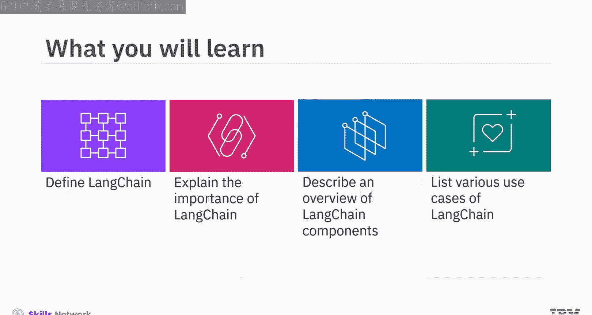
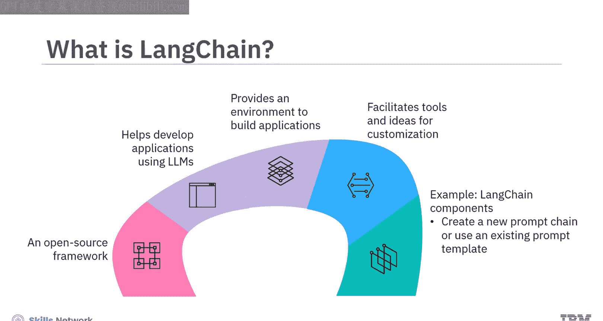
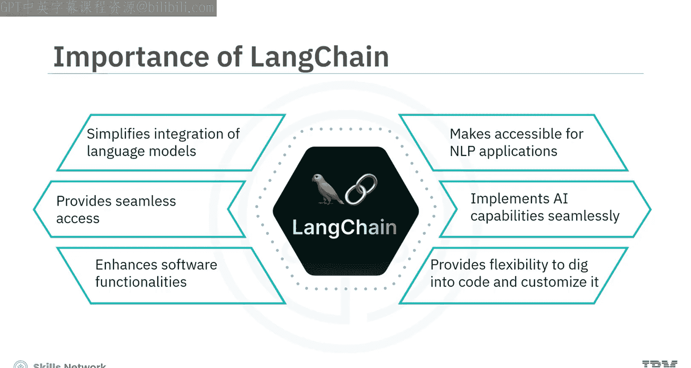
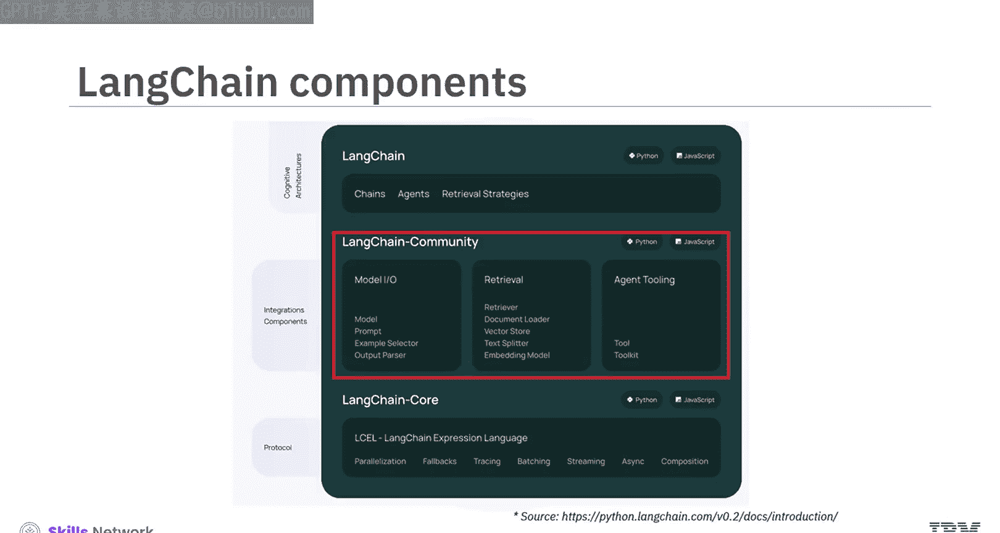
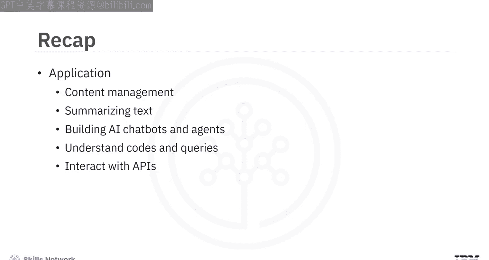

生成式人工智能工程：160：LangChain简介

在本节课中，我们将学习LangChain的基本概念，包括其定义、重要性、核心组件以及典型应用场景。

---

### 什么是LangChain？🤔

LangChain是一个开源框架，旨在帮助开发者利用大型语言模型（LLMs）来构建应用程序。

LangChain为LLMs提供了一个通用接口，并创建了一个环境，用于将应用程序与外部数据集和工作流集成。此外，LangChain提供了工具和思路，用于定制生成的模型、提高其准确性并提供相关信息。例如，开发者可以利用LangChain组件创建新的提示链，或使用现有的提示模板，让LLMs能够基于不同的变量生成响应。

### 为什么LangChain很重要？💡

LangChain简化了如GPT-4等语言模型的集成过程，使开发者能够更便捷地构建自然语言处理（NLP）应用程序。它为开发者提供了无缝访问先进人工智能和机器学习技术的能力。

LangChain帮助开发者将AI功能无缝地实施到他们的项目中，从而解锁新的可能性并增强软件功能。同时，LangChain为开发者提供了无与伦比的灵活性和自由度，允许他们自由探索代码库、进行定制，并根据业务需求开发商业产品。

### LangChain的核心组件 🧩

现在，我们来了解一下LangChain的组成部分。LangChain框架由多个开源库构成。

以下是其主要组件：

*   **LangChain**：这是核心部分，包含**链（Chains）**、**代理（Agents）** 和**检索策略（Retrieval Strategies）**。这些组件共同构成了应用程序的认知架构基础。
*   **LangChain Core**：这是LangChain的表达式语言，也是所有抽象概念的基础。
*   **LangChain Community**：这是第三方集成库。它包含合作伙伴包，例如`langchain-ibm`、`langchain-openai`和`langchain-anthropic`。它还将多个集成拆分到依赖于LangChain Core的轻量级包中。

### LangChain的应用场景 🌐

接下来，我们看看LangChain的用例。LangChain提供了多种应用，鼓励开发者在不同领域创建无缝的AI解决方案。

以下是LangChain的一些主要应用方向：

*   **构建聊天机器人和AI代理**：增强用户交互体验。
*   **简化API集成**：与各种服务无缝连接。
*   **数据洞察与分析**：通过理解表格数据中的代码和查询，提取有价值的见解。
*   **文档处理与内容管理**：生成基于文档的问答、总结文本，并增强信息检索和内容管理能力。
*   **广泛的NLP任务**：作为一个综合性工具，扩展平台能力以提取和评估数据。

---

### 总结 📝

本节课中，我们一起学习了LangChain的概述。LangChain是一个开源框架，用于帮助开发者利用LLMs构建AI应用程序。它简化了如GPT-4等语言模型的集成，使开发者能够更便捷地构建NLP应用。LangChain的组件包括LangChain本身、LangChain Core和LangChain Community。LangChain可应用于多个领域，如内容管理、文本摘要、构建AI聊天机器人和代理、理解代码和查询，以及与API集成。