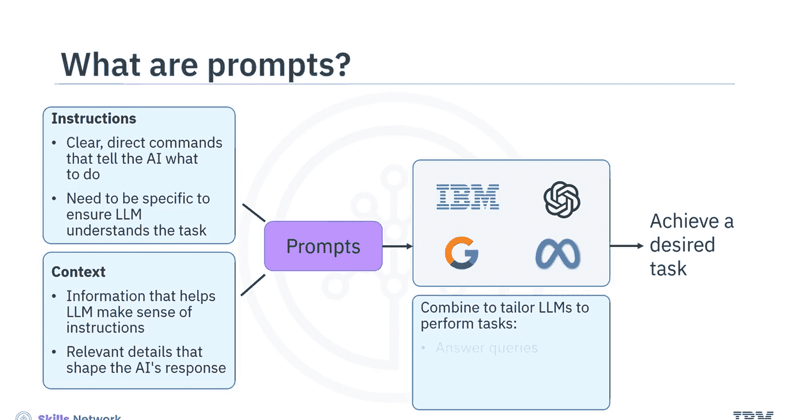
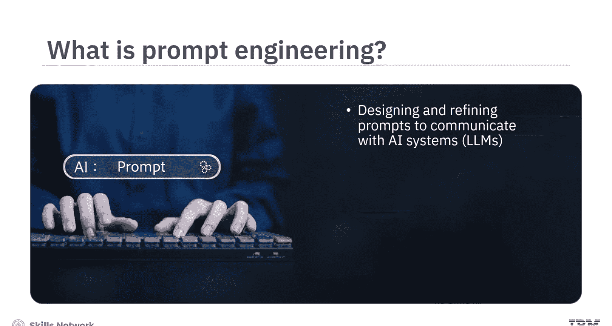
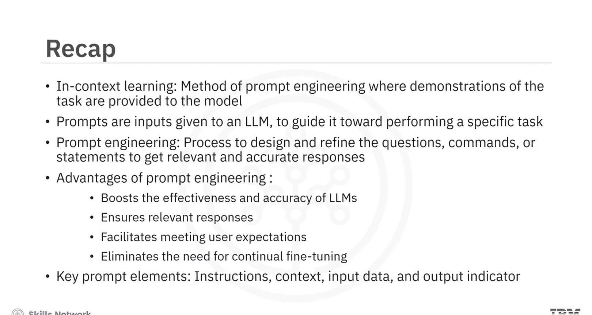

# 生成式人工智能工程：161：上下文学习简介 🧠

在本节课中，我们将要学习上下文学习的基本概念，并了解提示工程的基础知识。上下文学习是一种无需额外训练即可让大语言模型适应新任务的方法。

## 什么是上下文学习？

上一节我们介绍了课程主题，本节中我们来看看上下文学习的定义。

上下文学习是提示工程的一种特定方法。在这种方法中，任务的演示会以自然语言的形式，作为提示的一部分提供给模型。然而，上下文学习不需要额外的训练。模型在推理时，会从上下文或提示中提供的一小部分示例中学习新任务。

## 上下文学习的优缺点

了解了定义后，接下来我们分析其优势与局限。

上下文学习不需要针对特定数据集对模型进行微调。这可以极大地减少使大语言模型适应特定任务所需的资源和时间，同时提升其性能。

尽管上下文学习效率很高，但它受限于在上下文中实际能提供的内容。复杂的任务可能需要梯度步骤或更传统的机器学习训练方法，这些方法涉及根据误差梯度调整模型的权重。

## 提示工程基础

在探讨了上下文学习之后，现在让我们深入了解提示工程。首先从理解什么是提示及其在与AI系统交互中的作用开始。

本质上，提示是给予大语言模型的指令或输入，旨在引导其执行特定任务或生成期望的输出。一个提示包含两个主要组成部分：

以下是提示的两个核心组成部分：
*   **指令**：清晰、直接的命令，告诉AI要做什么。指令需要具体，以确保大语言模型理解任务。
*   **上下文**：帮助大语言模型理解指令的必要信息或背景。它可以是数据、参数或任何相关的细节，用以塑造AI的回应。

通过有效结合这些元素，你可以定制像IBM、OpenAI、Google或Meta开发的大语言模型，来执行从回答查询、分析数据到生成内容的各种任务。

## 提示工程的定义与重要性

现在你已经熟悉了提示的基本构成，让我们深入探讨为什么提示工程对于增强AI能力至关重要。

提示工程是一个专业化的过程，在这个过程中，你设计和优化用于与AI系统（特别是大语言模型）交互的问题、命令或陈述。目标不仅仅是提出问题，而是以最佳方式提出问题。这涉及精心设计清晰、上下文丰富的提示，以从AI获得最相关和最准确的响应。

这个过程在从客户服务自动化到高级研究和计算语言学等多个领域都至关重要。

提示工程通过直接影响大语言模型运行的有效性和准确性来提升其效能。它通过使大语言模型能够生成精确且完全符合上下文的响应来确保相关性。它通过更清晰的提示和减少误解来促进满足用户期望。它消除了持续微调的需要，允许模型在其上下文中进行适应和学习。

## 提示构成要素解析

为了更具体地理解，让我们分解一个结构良好的提示所包含的要素。

以下是一个提示的四个关键元素：
*   **指令**：告诉大语言模型需要做什么。例如：`将以下客户评论分类为中立、负面或正面情感。` 这直接引导大语言模型的行为。
*   **上下文**：帮助大语言模型理解其运作的场景或背景。例如，指明该评论是针对新推出产品的反馈，这可以帮助大语言模型结合产品的新颖性来衡量情感分析。
*   **输入数据**：提示中需要大语言模型处理的实际数据。例如客户评论：`“产品到货晚了，但质量超出了我的预期。”` 大语言模型使用这些数据来执行指令指定的任务。
*   **输出指示符**：提示中期望大语言模型给出回应的部分。它是一个清晰的标记，告诉AI在哪里交付其分析。在本例中，`情感：` 表示等待大语言模型附加其分类结果。

## 课程总结

本节课中我们一起学习了上下文学习和提示工程的核心内容。

*   上下文学习是一种提示工程方法，其中任务演示作为提示的一部分提供给模型。
*   提示是给予大语言模型的输入，用于引导其执行特定任务，由指令和上下文构成。
*   提示工程是设计和优化提示以获得AI相关且准确响应的过程。
*   提示工程有几个优点：提升大语言模型的有效性和准确性；确保响应相关性；促进满足用户期望；消除持续微调的需要。
*   一个提示包含四个关键要素：指令、上下文、输入数据和输出指示符。