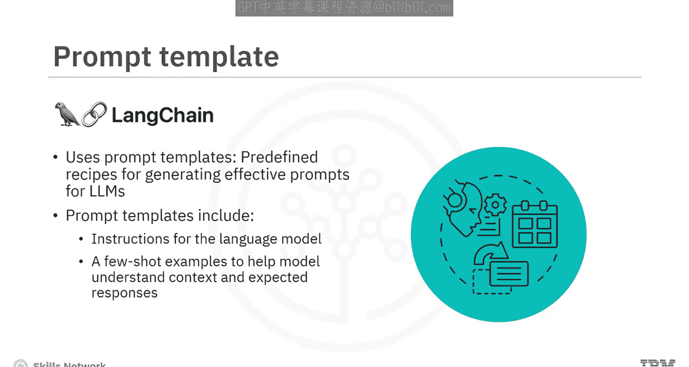
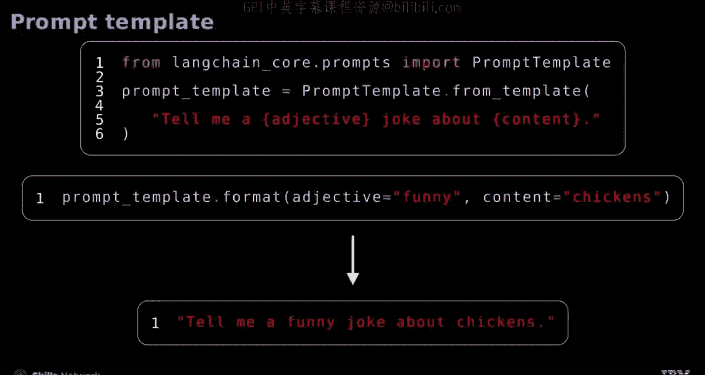
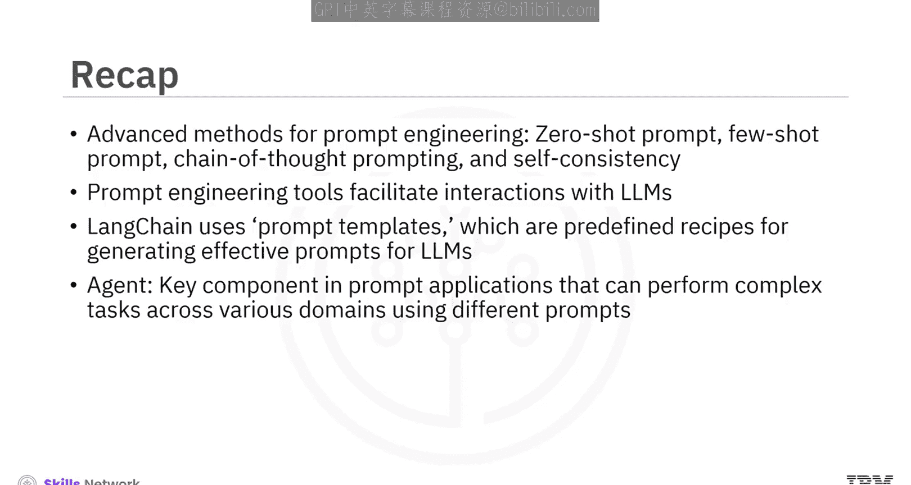

# 生成式人工智能工程：5：提示工程的高级方法 🚀

在本节课中，我们将学习提示工程的高级方法。通过学习零样本提示、少样本提示、思维链提示和自洽性等技术，你将能够设计更有效的提示，并了解如何利用相关工具在实际场景中应用这些方法。

## 零样本提示

上一节我们介绍了课程概述，本节中我们来看看第一种高级方法：零样本提示。这种提示方法要求大型语言模型（LLM）在没有接受过任何针对该任务的具体训练或示例的情况下执行任务。

**示例**：
*   **提示**：`The Eiffel Tower is located in Berlin.`（埃菲尔铁塔位于柏林。）
*   **任务**：请判断该陈述是真是假。
*   **模型输出**：`False`（假）

这个任务要求LLM在不依赖任何先前针对特定查询的微调的情况下，理解上下文和信息。

## 少样本提示

理解了无需示例的零样本提示后，我们来看看提供示例的提示方法。少样本提示分为两种：单样本提示和少样本提示。

### 单样本提示

单样本提示为LLM提供一个示例，以帮助其执行类似任务。

**示例**：
*   **示例**：`How is the weather today? -> Quel temps fait-il aujourd'hui?`（今天天气怎么样？ -> 今天天气怎么样？）
*   **新提示**：`Where is the nearest supermarket?`（最近的超市在哪里？）
*   **预期输出**：`Où se trouve le supermarché le plus proche?`（最近的超市在哪里？）

AI利用初始示例来正确执行新的翻译任务。

### 少样本提示

少样本提示让AI在解决类似任务之前，先学习一小部分示例。这有助于AI从少数实例中归纳，以处理新数据。

以下是示例：

*   **示例1**：`I just got a promotion at work!`（我刚刚升职了！） -> `Happiness`（快乐）
*   **示例2**：`I lost my wallet yesterday.`（我昨天丢了钱包。） -> `Sadness`（悲伤）
*   **示例3**：`The deadline is tomorrow and I'm not ready.`（明天就是截止日期，我还没准备好。） -> `Anxiety`（焦虑）
*   **新提示**：`That movie was so scary. I had to cover my eyes.`（那部电影太吓人了。我不得不捂住眼睛。）
*   **预期输出**：`Fear`（恐惧）

这些示例教会LLM根据上下文对情绪进行分类。

## 思维链提示

除了提供示例，我们还可以引导模型进行逐步推理。思维链提示是一种用于引导LLM进行复杂推理、逐步解决问题的方法。这种方法对于需要多个中间步骤或模仿人类思维过程的推理问题非常有效。

**示例**：
一家商店最初有22个苹果，卖出了15个，然后新到了一批8个苹果。请问现在有多少个苹果？

通过将计算分解为清晰的连续步骤，模型得出了正确答案，并提供了透明的解释。

## 自洽性

为了进一步提高输出的可靠性，我们可以采用自洽性技术。这种方法通过生成对同一问题的多个独立答案，然后评估这些答案以确定最一致的结果，从而增强输出的可靠性和准确性。

**示例**：
问题：`When I was 6, my sister was half my age. Now I am 70. What age is my sister?`（当我6岁时，我妹妹的年龄是我的一半。现在我70岁。我妹妹多大？）

模型被提示进行三种独立的计算和解释，以确保准确性。通过交叉验证通往同一答案的多种路径，这种方法可以验证LLM响应的可靠性。

## 提示工程工具与应用

掌握了核心方法后，我们来看看支持这些方法的工具和应用。某些工具可以促进与LLM的交互，例如OpenAI的Playground、LangChain、Hugging Face的模型中心和IBM的AI Classroom。

这些工具的主要功能包括：
*   允许你开发、实验、评估和部署提示。
*   支持实时调整和测试提示，并立即看到对输出的影响。
*   提供适用于不同任务和语言的各种预训练模型。
*   促进团队或社区之间共享和协作编辑提示。
*   提供工具来跟踪更改、分析结果并根据性能指标优化提示。

### LangChain 与提示模板

在众多工具中，让我们进一步了解LangChain。LangChain使用提示模板，这是为LLM生成有效提示的预定义“配方”。

这些模板通常包含：
1.  给语言模型的指令。
2.  帮助模型理解上下文和预期响应的少量示例。
3.  向语言模型提出的具体问题。

以下是一个应用LangChain提示模板的代码片段：

```python
# 首先，从langchain_core.prompts导入PromptTemplate
from langchain_core.prompts import PromptTemplate



# 定义一个笑话提示模板
joke_template = PromptTemplate.from_template("Tell me a {adjective} joke about {content}.")

# 使用模板，为占位符填入具体值
prompt = joke_template.format(adjective="funny", content="chickens")

# 这将生成提示："Tell me a funny joke about chickens."
```

这种方法简化了提示创建过程，使提示在不同上下文中保持一致且易于适配。



### 智能体应用

在提示工程的应用中，智能体是一个核心概念。它由LLM驱动，并集成LangChain等工具，能够使用不同的提示跨各种领域执行复杂任务。

变革性的应用包括：
*   **带来源的问答智能体**：提供答案并引用信息来源。
*   **内容创作与总结智能体**：用于生成和总结内容。
*   **数据分析与商业智能智能体**：用于分析数据和提供商业洞察。
*   **多语言智能体**：用于无缝的上下文感知翻译和沟通。

## 总结

本节课中我们一起学习了提示工程的高级方法。主要内容包括：
*   **高级提示方法**：包括零样本提示、少样本提示、思维链提示和自洽性。
*   **工具**：如LangChain，它使用提示模板来生成有效的提示。
*   **应用**：智能体可以利用不同的提示跨领域执行复杂任务。



通过掌握这些方法和工具，你将能够更有效地设计与大型语言模型交互的提示，从而解锁生成式AI在各类场景中的应用潜力。