# 生成式人工智能工程：6：LangChain核心概念 🧠

在本节课中，我们将要学习LangChain的核心概念。LangChain是一个开源框架，旨在简化使用大型语言模型构建应用程序的过程。我们将逐一介绍其关键组件，包括语言模型、聊天模型、聊天消息、提示模板和输出解析器。

## 什么是LangChain？

LangChain是一个开源接口，它通过提供结构化的方式，简化了使用大型语言模型的应用开发流程。它便于将语言模型集成到各种用例中，包括自然语言处理和数据检索。

LangChain由多个组件构成，主要包括：文档、链、代理、语言模型、聊天模型、聊天消息、提示模板和输出解析器。本节视频将重点回顾语言模型、聊天模型、聊天消息、提示模板和输出解析器这几个核心部分。

## 语言模型

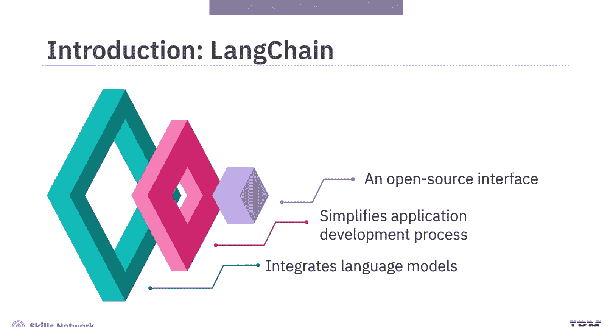

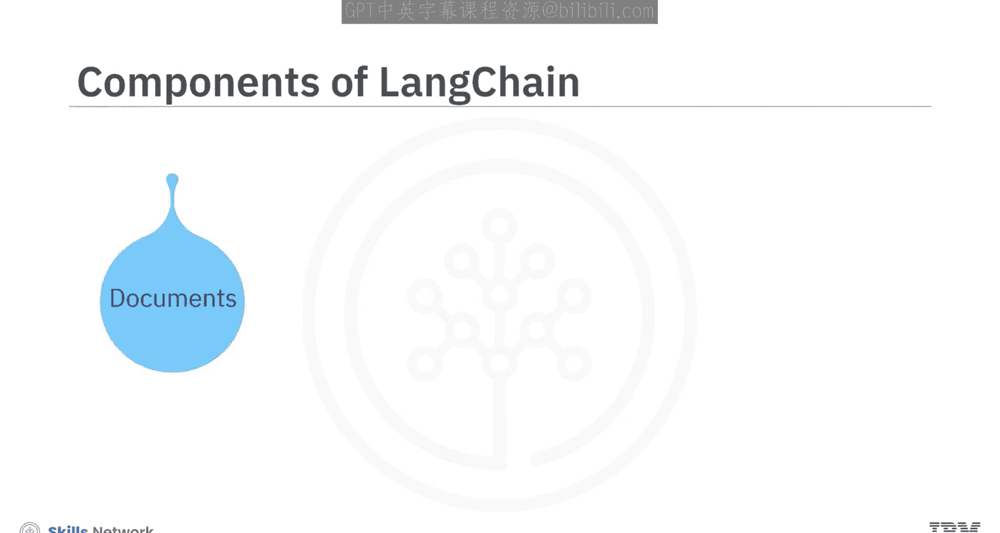

语言模型是LangChain中LLMs的基础。它接收文本输入并生成文本输出，可用于完成任务和总结文档等。

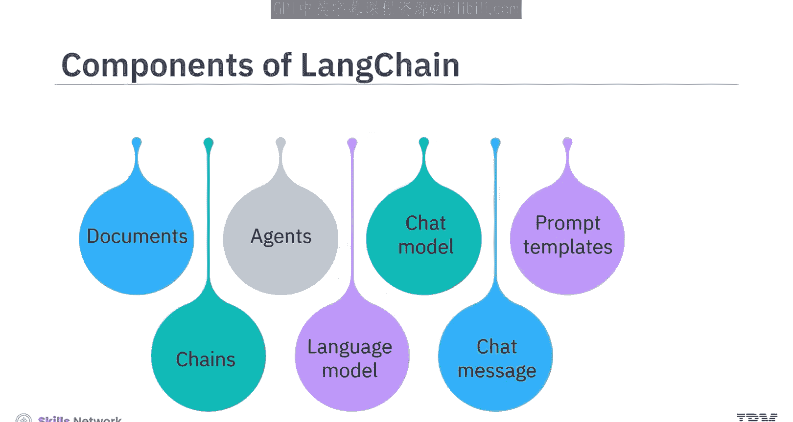

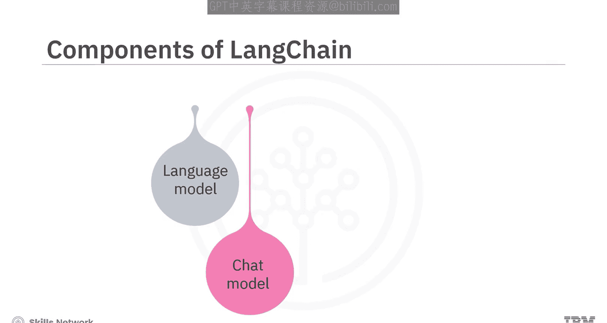

LangChain支持多种语言模型，例如来自IBM、OpenAI、Google和Meta的模型。例如，要使用语言模型为新的销售方案生成回复，我们可以使用IBM的Watsonx.ai平台。

以下是一个使用基于Mistral 8x7B Instruct模型创建LLM的代码示例：

```python
# 确保已导入必要的依赖项，例如来自IBM Watson Machine Learning包的genai和model_inference
from ibm_watson_machine_learning.foundation_models import Model

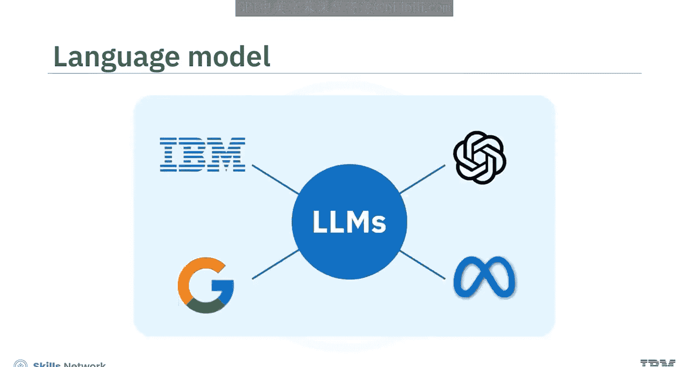

# 通过调整tokens和temperature等参数来自定义模型
model = Model(
    model_id="mistralai/mistral-8x7b-instruct-v0.1",
    params={
        "max_new_tokens": 100,
        "temperature": 0.7
    }
)

# 使用模型为插入的提示生成响应
prompt = "提出一个新的销售方案。"
response = model.generate_text(prompt)
print(response)
```

创建模型对象后，模型会为插入的提示生成响应文本，你可以查看生成的示例回复。

## 聊天模型

上一节我们介绍了基础的语言模型，本节中我们来看看专为高效对话设计的聊天模型。聊天模型能够理解问题或提示，并像人类一样进行回应。

首先，我们需要使用Watsonx.ai创建一个语言模型，然后使用`WatsonxLLM`函数将其转换为聊天模型。这会将模型转换为能够进行对话的会话式LLM。

例如，要查看响应，可以向模型插入一个问题，比如“人类最好的朋友是谁？”。你可以查看针对该问题生成的示例回复。

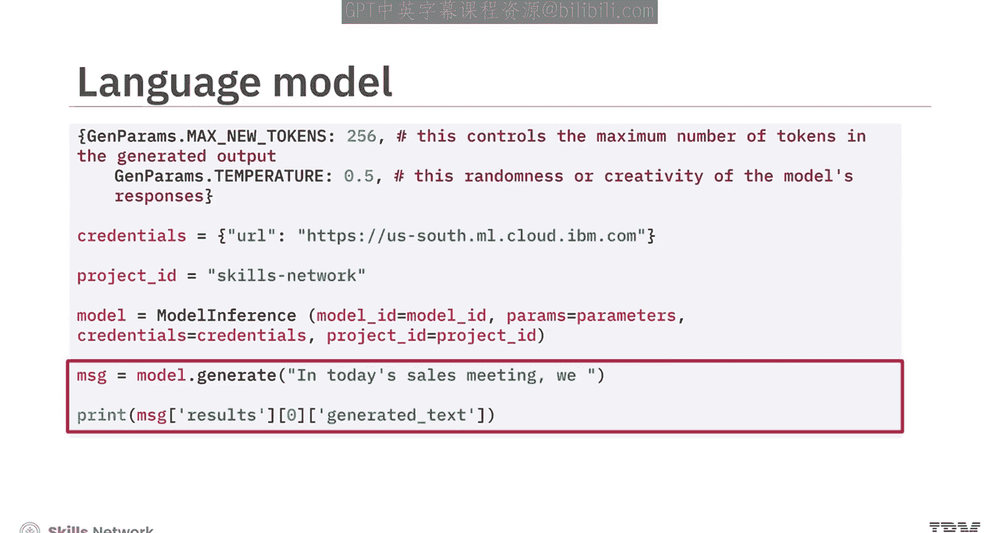

```python
from ibm_watson_machine_learning.foundation_models import Model
from langchain_ibm import WatsonxLLM

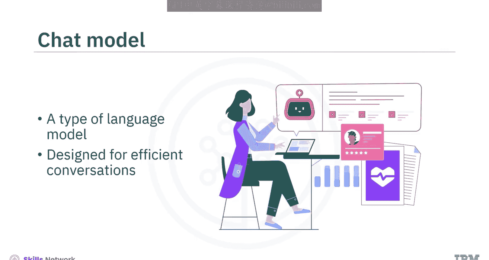

# 创建基础语言模型
base_model = Model(model_id="...", params={...})
# 转换为LangChain可用的聊天模型
chat_model = WatsonxLLM(model=base_model)

# 插入问题
question = "人类最好的朋友是谁？"
response = chat_model.invoke(question)
print(response)
```

## 聊天消息

为了使模型在动态聊天环境中有效工作，聊天模型需要处理各种类型的聊天消息。

以下是主要的聊天消息类型：
*   **HumanMessage**：代表用户的输入。
*   **AIMessage**：由模型生成的回复。
*   **SystemMessage**：用于向模型提供指令。
*   **FunctionMessage**：用于传递函数调用的结果，包含名称参数。
*   **ToolMessage**：用于工具交互以实现特定结果。

每条聊天消息都包含两个关键属性：`role`（发言者）和`content`（发言内容）。

让我们看一个系统生成消息的例子。在这个例子中，模型被指令“扮演一个AI机器人，用一个短句回答问题：吃什么？”。

为了响应这个问题，聊天模型会创建一个消息列表。首先，使用SystemMessage将模型配置为一个健身活动机器人；然后，使用HumanMessage和AIMessage模拟过去的对话。接下来，模型基于之前的对话生成响应。

你也可以仅使用HumanMessage作为输入来操作聊天模型，并允许模型在没有SystemMessage或AIMessage提示的情况下生成响应。这意味着聊天机器人直接响应用户的输入。

```python
from langchain.schema import HumanMessage, SystemMessage, AIMessage

# 配置系统指令
system_message = SystemMessage(content="你是一个健身活动机器人，请用简短句子回答。")
# 模拟历史对话
history = [
    HumanMessage(content="我今天应该做什么运动？"),
    AIMessage(content="建议进行30分钟慢跑。")
]
# 当前用户输入
current_input = HumanMessage(content="那明天呢？")

# 组合所有消息并调用模型
messages = [system_message] + history + [current_input]
response = chat_model.invoke(messages)
print(response)
```

## 提示模板

接下来，我们探讨LangChain中用于格式化输入的提示模板。提示模板将用户的问题或消息转化为清晰的指令，语言模型利用这些指令生成恰当且连贯的响应。

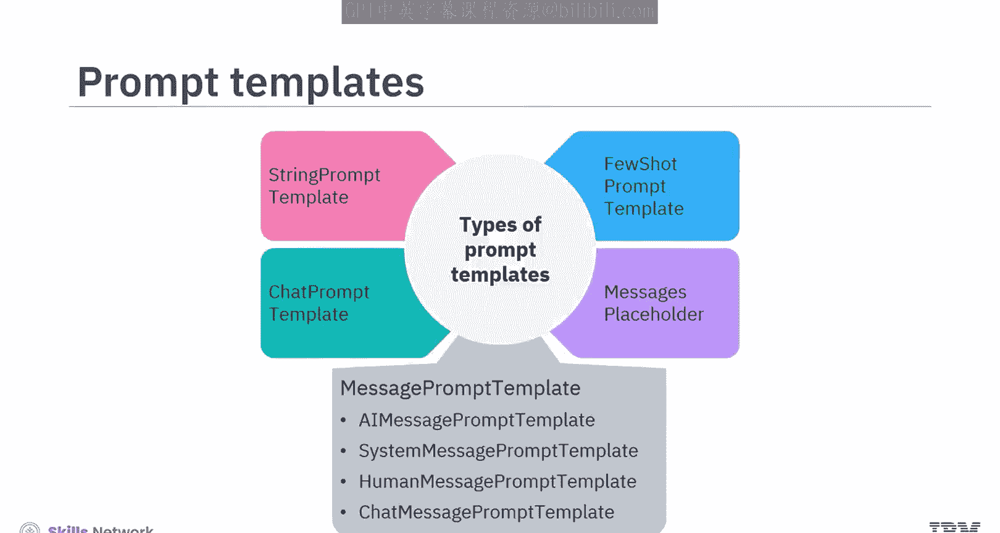

提示模板主要有以下几种类型：
*   **字符串提示模板**：适用于简单的字符串格式化。
*   **聊天提示模板**：适用于消息列表。
*   **特定消息模板**：如`AIMessagePromptTemplate`、`SystemMessagePromptTemplate`、`HumanMessagePromptTemplate`，允许灵活的角色分配。
*   **消息占位符**：提供对消息渲染的完全控制。
*   **少样本提示模板**：为LLMs提供具体的示例（样本），以指导其输出。

让我们使用聊天提示模板来生成响应。在这个提示模板中，你需要指定消息的角色和内容。在内容中，可以包含参数占位符以便重复使用，从而基于输入参数生成动态灵活的消息。

```python
from langchain.prompts import ChatPromptTemplate, HumanMessagePromptTemplate
from langchain.schema import HumanMessage

# 创建带占位符的提示模板
template = ChatPromptTemplate.from_messages([
    ("system", "你是一个乐于助人的助手。"),
    ("human", "请用{language}总结以下文本：{text}")
])
# 格式化提示
formatted_prompt = template.format_messages(
    language="中文",
    text="这里是需要总结的长篇内容..."
)
# 调用模型
response = chat_model.invoke(formatted_prompt)
print(response)
```

### 示例选择器

在提示模板中，从示例库中选择最相关的示例放入提示中非常重要。提示模板中的示例选择器使这一过程更加高效。

例如，少样本提示模板为LLM提供具体的示例。这些示例告知模型插入的上下文，并指导LLM生成期望的输出。

使用LangChain的示例选择器，你可以通过以下方式优化少样本提示模板：
*   **语义相似度**：选择与输入最语义相似的示例。
*   **最大边际相关性**：在相似性和多样性之间取得平衡。
*   **NGram重叠**：基于文本重叠度选择示例。

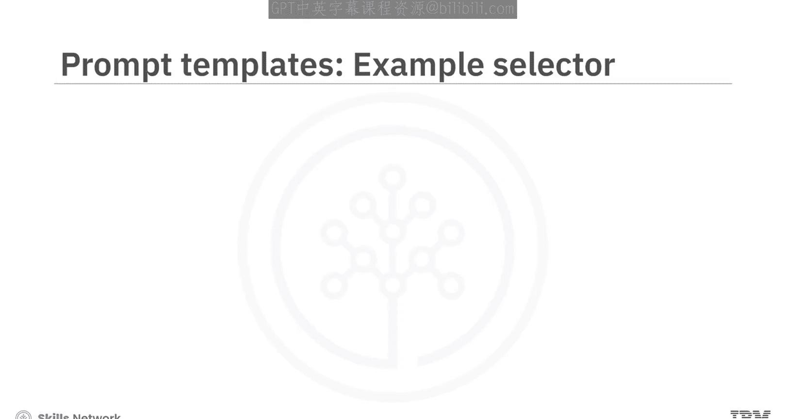

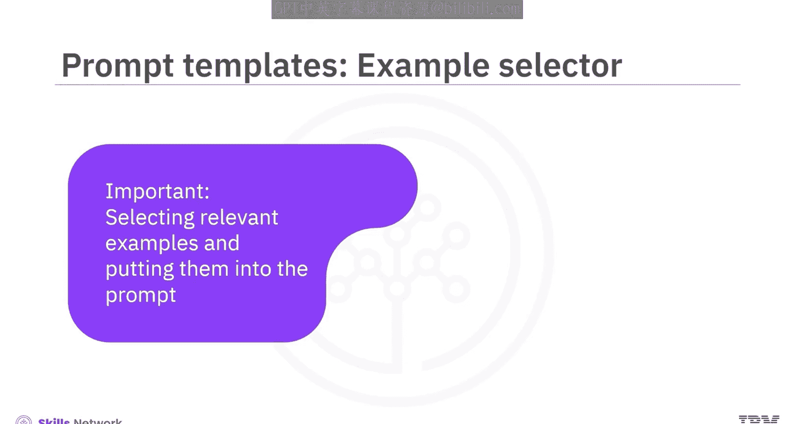

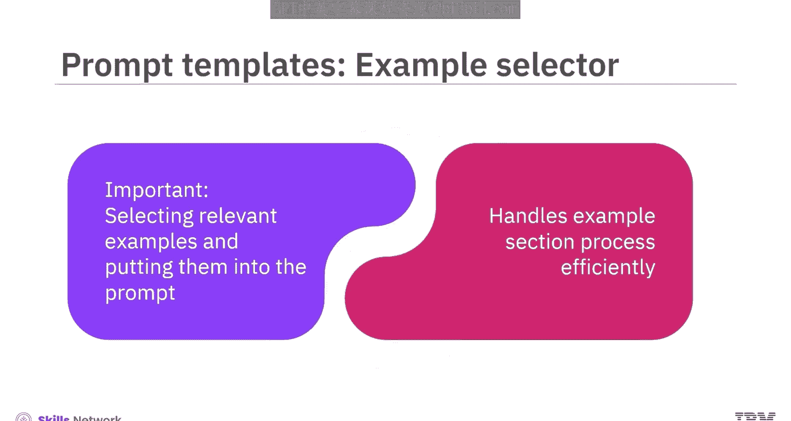

以下屏幕显示了使用NGram重叠示例选择器来选择示例以形成少样本提示的过程。

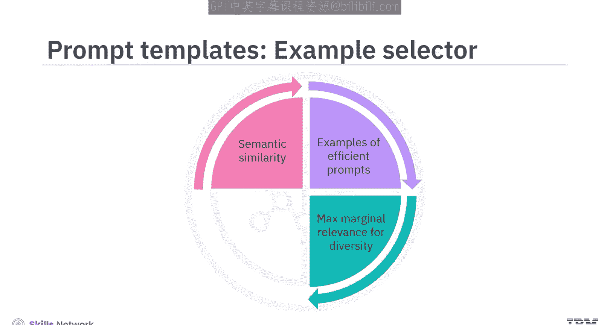

## 输出解析器

最后，我们来了解LangChain中用于结构化输出的组件——输出解析器。输出解析器将LLM的输出转换为更合适的格式，以便生成结构化数据。

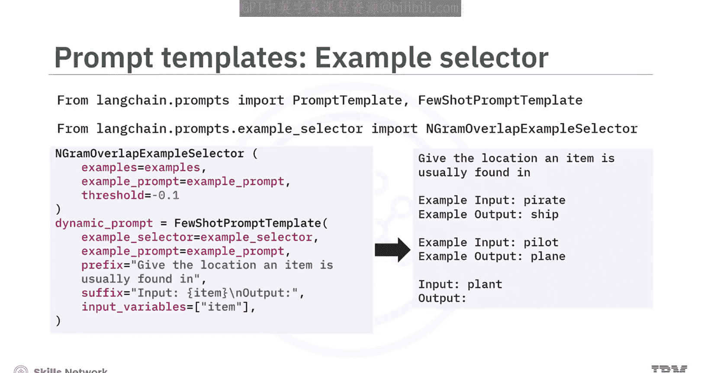

LangChain提供了一个输出解析器库，支持多种数据格式，包括JSON、XML、CSV和Pandas DataFrames。输出解析器允许你定制模型的输出，以满足特定的数据处理需求。

例如，让我们使用逗号分隔列表输出解析器将LLM的响应转换为CSV格式。这种输出解析器能有效地构建输出结构，并简化其在电子表格应用程序中的处理和分析。

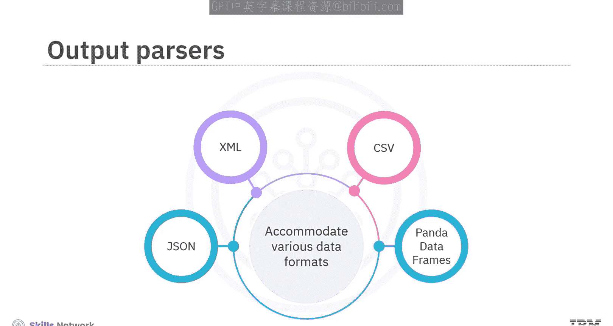

```python
from langchain.output_parsers import CommaSeparatedListOutputParser
from langchain.prompts import PromptTemplate

# 创建输出解析器
output_parser = CommaSeparatedListOutputParser()
# 获取格式指令，用于告诉模型如何格式化输出
format_instructions = output_parser.get_format_instructions()

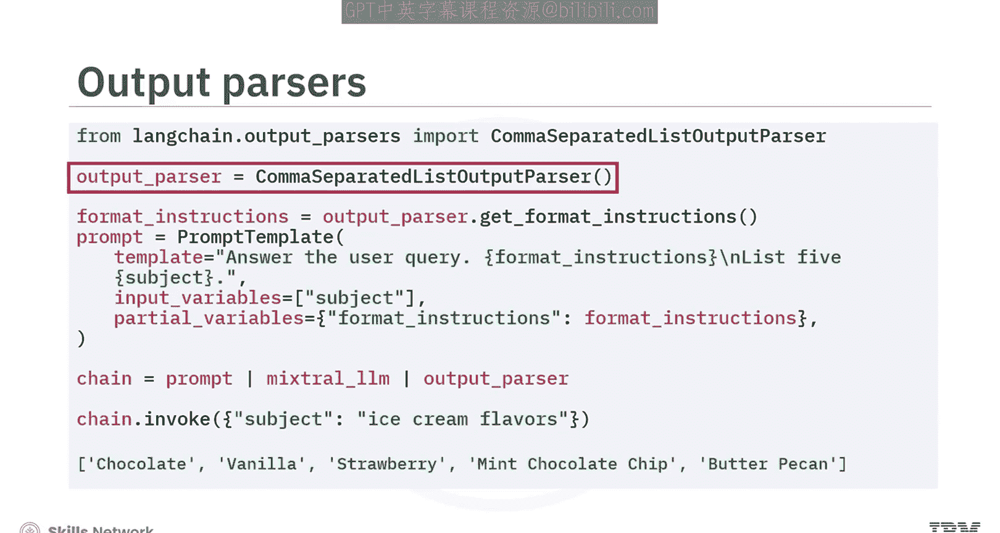

# 创建提示模板，包含格式指令
prompt = PromptTemplate(
    template="列出三种{subject}。\n{format_instructions}",
    input_variables=["subject"],
    partial_variables={"format_instructions": format_instructions}
)

# 格式化提示并调用模型
model_input = prompt.format(subject="水果")
model_output = chat_model.invoke(model_input)

# 解析输出
parsed_list = output_parser.parse(model_output)
print(parsed_list)  # 输出例如：['苹果', '香蕉', '橙子']
```

## 总结

本节课中我们一起学习了LangChain的核心组件。LangChain是一个简化使用LLMs进行应用开发的开源接口。

其核心组件包括：
*   **语言模型**：使用文本输入生成文本输出。
*   **聊天模型**：理解问题或提示并像人类一样回应，能处理各种聊天消息（如HumanMessage, AIMessage, SystemMessage等）。
*   **提示模板**：将问题或消息转化为清晰的指令，并可通过示例选择器优化上下文提供。
*   **输出解析器**：将LLM的输出转换为如JSON、CSV等合适的结构化格式。

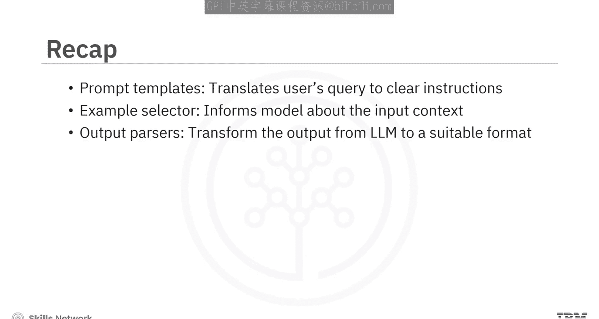

掌握这些核心概念是使用LangChain构建强大生成式AI应用的基础。