# 生成式人工智能工程：164：构建RAG应用的LangChain文档 📄

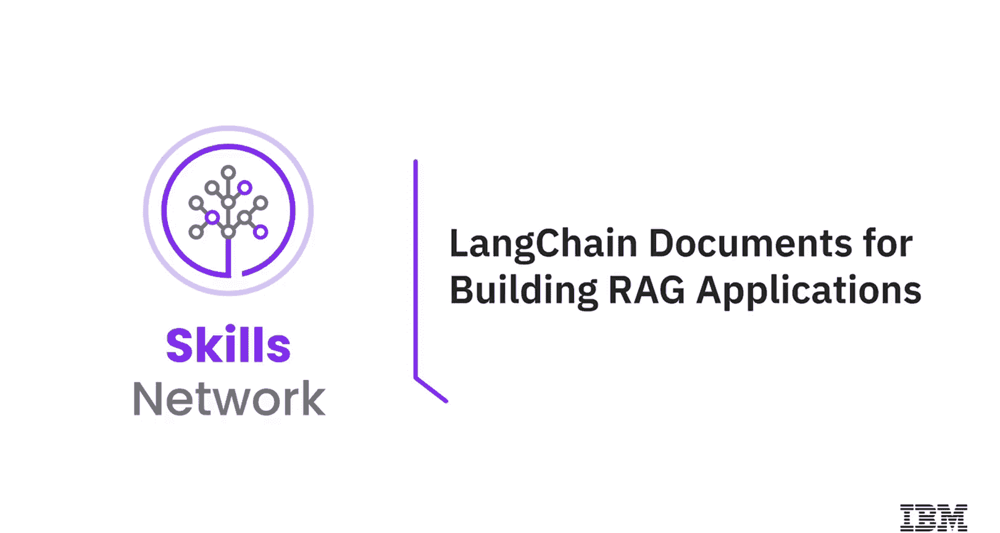

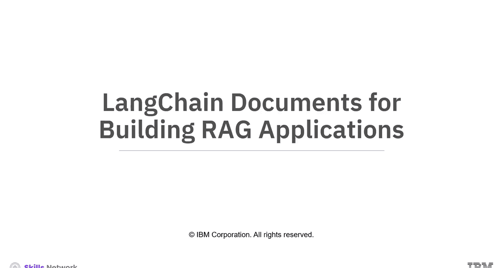

在本节课中，我们将学习如何使用LangChain工具来构建检索增强生成（RAG）应用。我们将重点探讨LangChain文档处理流程中的核心组件，包括文档对象、文档加载器、文本分割器、向量数据库和检索器。

## 概述

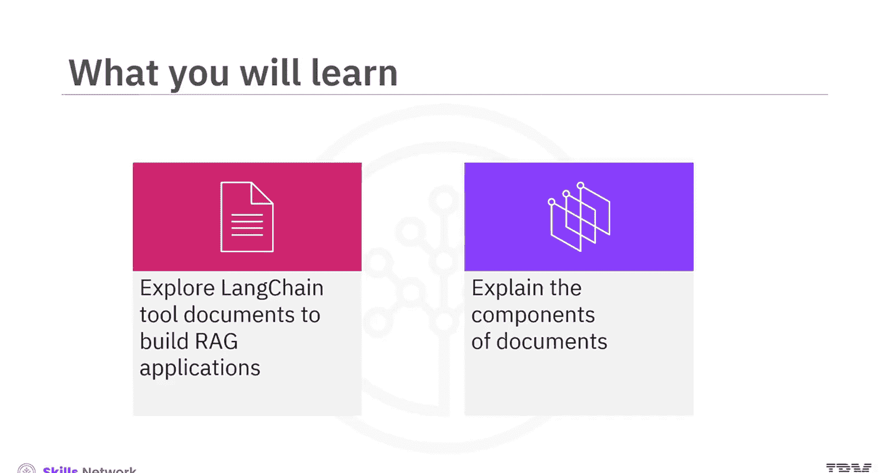

构建基于大型语言模型（LLM）的应用，尤其是RAG应用，需要整合用户特定的外部数据。LangChain通过提供易于使用的接口，简化了集成数据、API和预训练语言模型的过程。本节课将详细介绍LangChain中用于处理文档以支持RAG应用的关键工具和步骤。

## LangChain文档处理流程

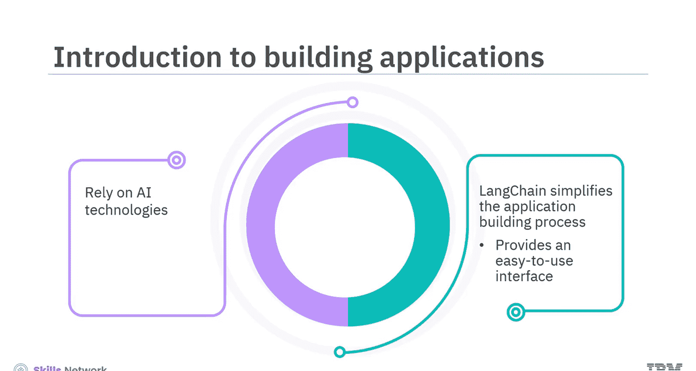

RAG应用的核心在于检索步骤，它确保能够获取足够的相关数据来增强生成过程。数据获取流程包含多个步骤，让我们逐一了解。

### 文档对象

在LangChain中，文档对象是承载数据信息的容器。它包含两个关键属性：
*   **`page_content`**：存储文档的文本内容，其类型限定为字符串。
*   **`metadata`**：存储与文档关联的任意元数据，例如文档ID、文件名或其他相关信息。

这些属性使得文档对象能够在LangChain的RAG应用中有效地管理和使用文档数据。

### 文档加载器

将文档加载到系统中是一个至关重要的过程。LangChain支持从超过100种数据源加载文档，包括Airbyte、Unstructured等主要提供商。它能处理多种文档类型，例如HTML、PDF和代码，并可以从各种位置加载，如S3存储桶和公共网站。

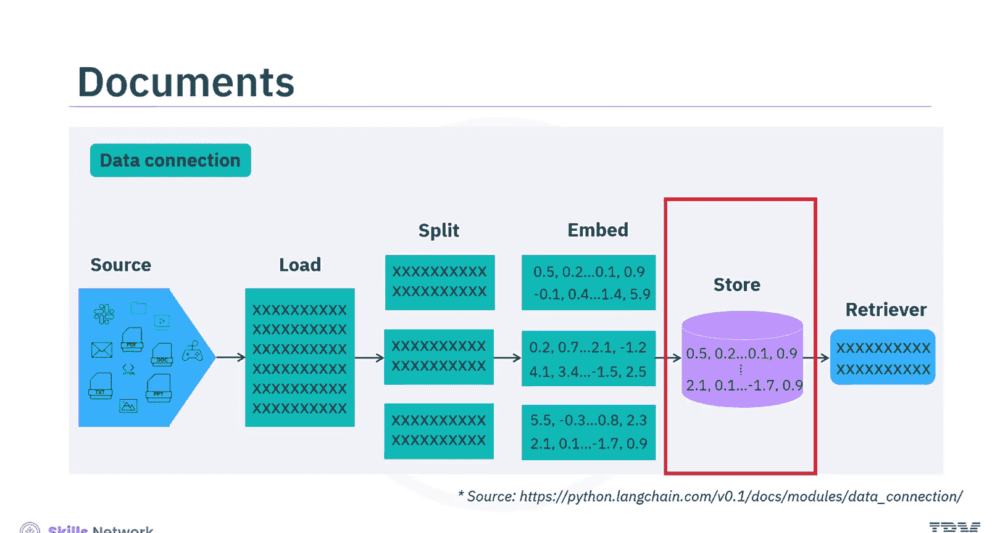

例如，基于网络的加载器可以直接从网站或URL导入文本内容。

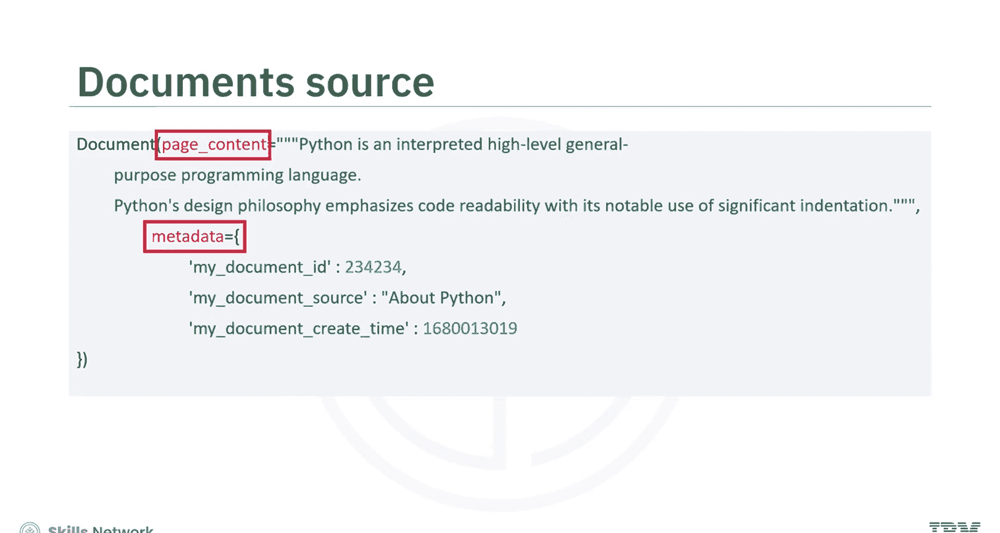

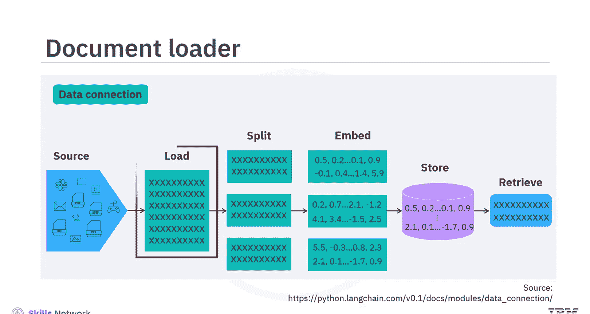

### 文本分割器

接下来是文档转换步骤，即将数据分割成块。通过将大型文档分割成可管理的小块，LangChain能够从文档中检索出相关的独立片段。LangChain提供了多种定制的文本分割器。

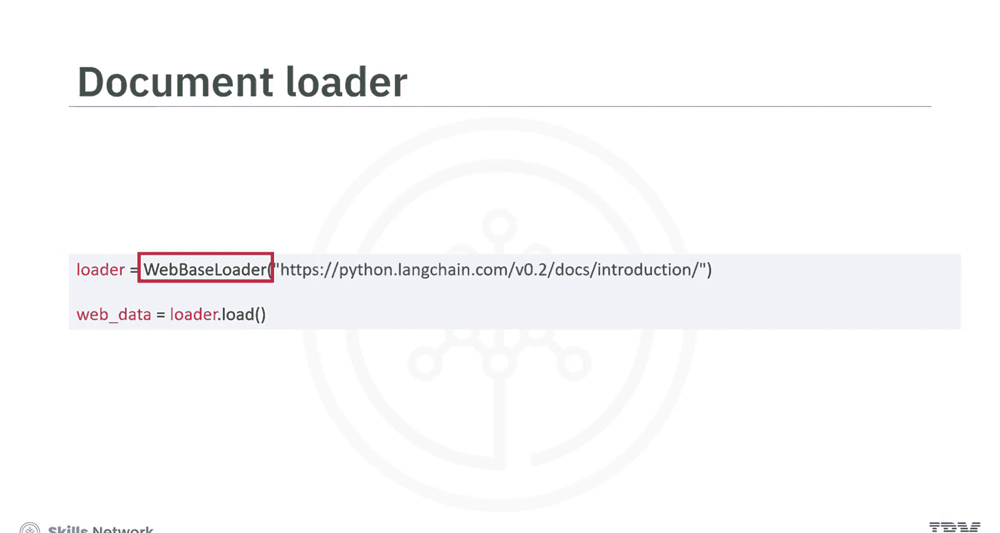

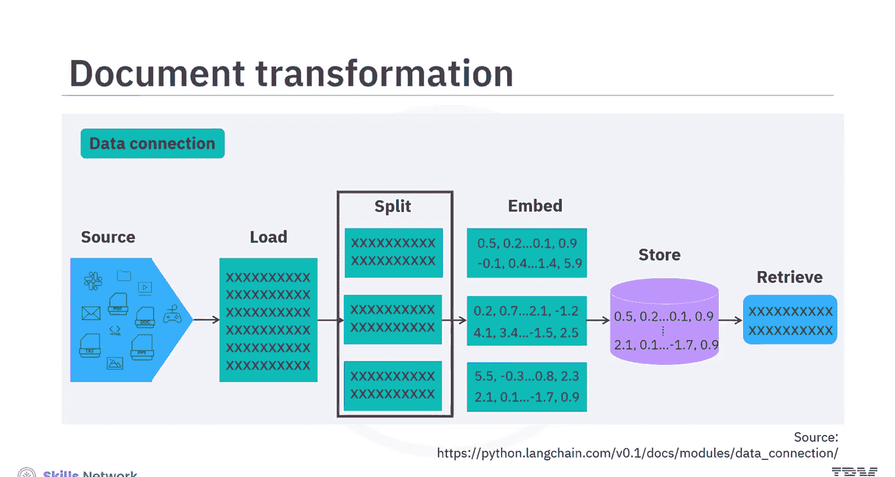

以下是两种常见的分割器示例：
*   **递归字符文本分割器**：递归地分割文本。
*   **Markdown标题文本分割器**：利用Markdown标题来划分文本。

我们也可以使用字符文本分割器，并指定用户自定义的分隔符，来查看内容被分割成了多少块。

### 文档嵌入

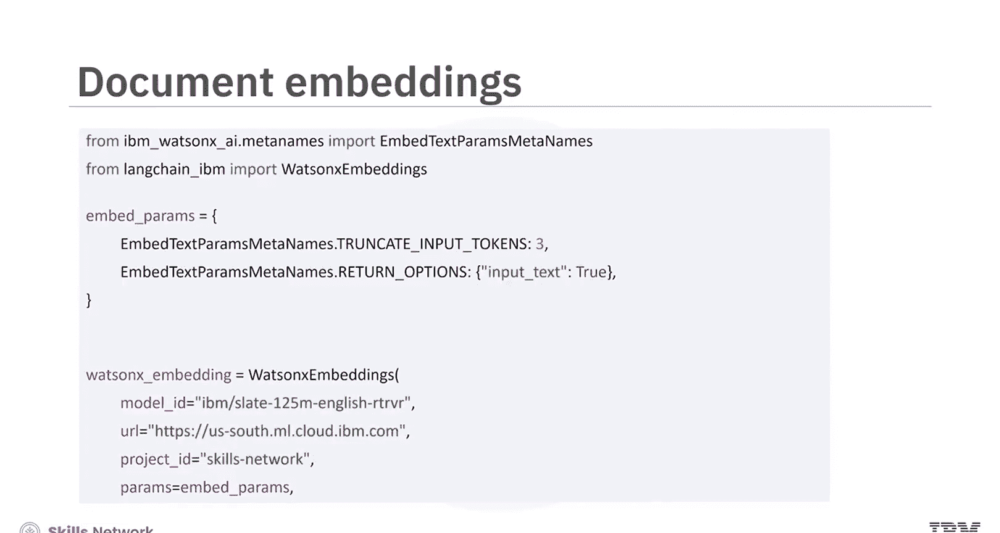

嵌入用于捕捉文本的语义含义。例如，我们可以使用来自Watsonx.ai的嵌入模型为文档创建嵌入向量。这些向量将文本转换为数值形式，便于后续的相似性比较。

### 向量数据库存储

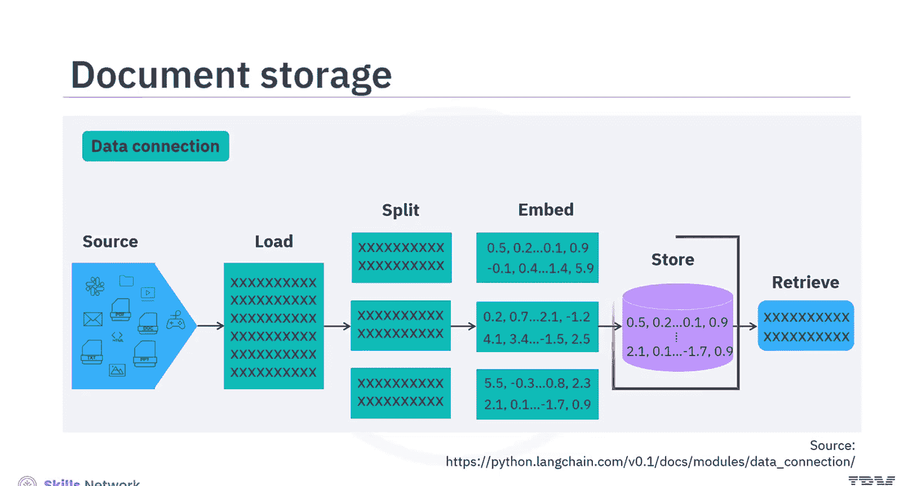

随着嵌入的重要性日益增加，高效存储这些数据的需求也在增长。向量数据库专门用于存储嵌入向量并执行高效的相似性搜索。

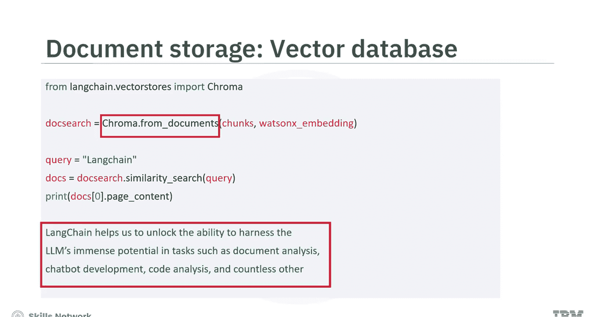

例如，我们可以使用Chroma向量数据库来存储嵌入，并执行相似性搜索，为输入的查询检索相关内容。通过计算距离并找到最接近的文本块嵌入，可以查看LLM根据查询检索到的内容。

### 检索器

数据存储在向量数据库后，高效地检索数据至关重要。LangChain支持多种检索算法，旨在提升搜索效果。

LangChain提供了多种检索器，例如：
*   **向量存储检索器**：用于执行相似性搜索。
*   **父文档检索器**：用于在文档块内部进行搜索。
*   **自查询检索器**：用于解析查询并分离出过滤条件。

让我们使用向量存储检索器为文档识别LangChain的相关信息。这是一个响应示例。可以看到，它显示了与在向量数据库中进行相似性搜索策略相似的结果，因为向量存储检索器正是基于相似性原理工作的。

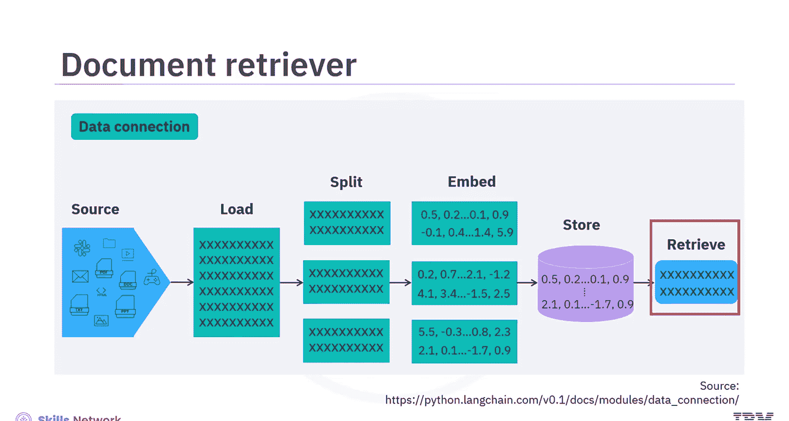

## 总结

本节课中，我们一起学习了LangChain为RAG应用提供的全面工具，这些工具专注于检索步骤以确保充分的数据获取。我们了解到：
*   LangChain中的文档对象是数据信息的容器，包含`page_content`和`metadata`两个关键属性。
*   LangChain文档加载器能够处理来自多种位置的HTML、PDF和代码等多种文档类型。
*   LangChain通过将文档分割成可管理的片段，来检索相关的独立部分。
*   嵌入模型用于为文档创建语义向量表示。
*   LangChain提供了多种检索器，如向量存储检索器，以高效地从存储的数据中查找信息。

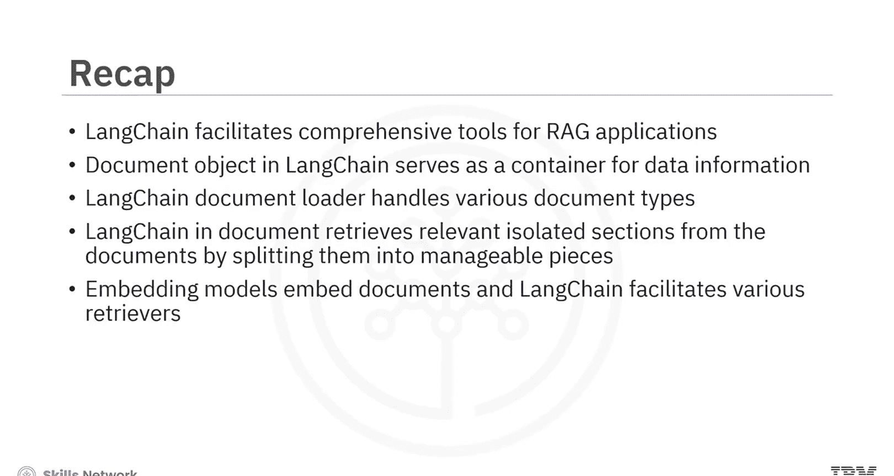

掌握这些组件是构建高效、准确的RAG应用程序的基础。