# 生成式人工智能工程：165：构建应用的LangChain链和代理 🧠

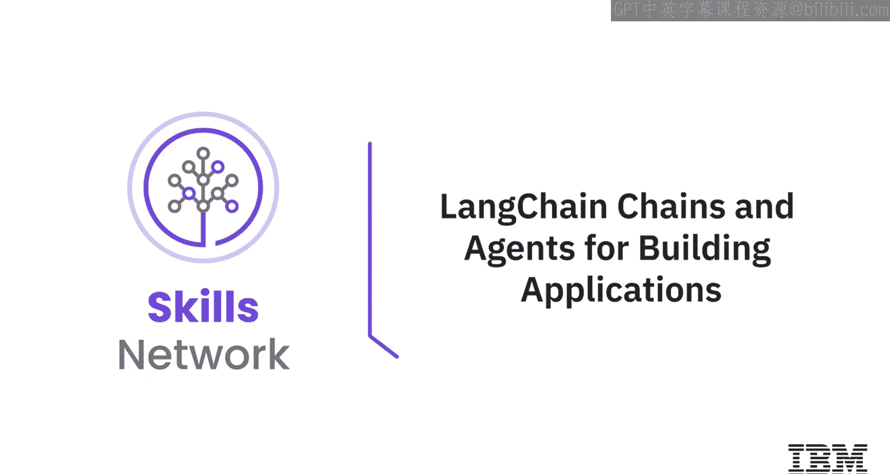

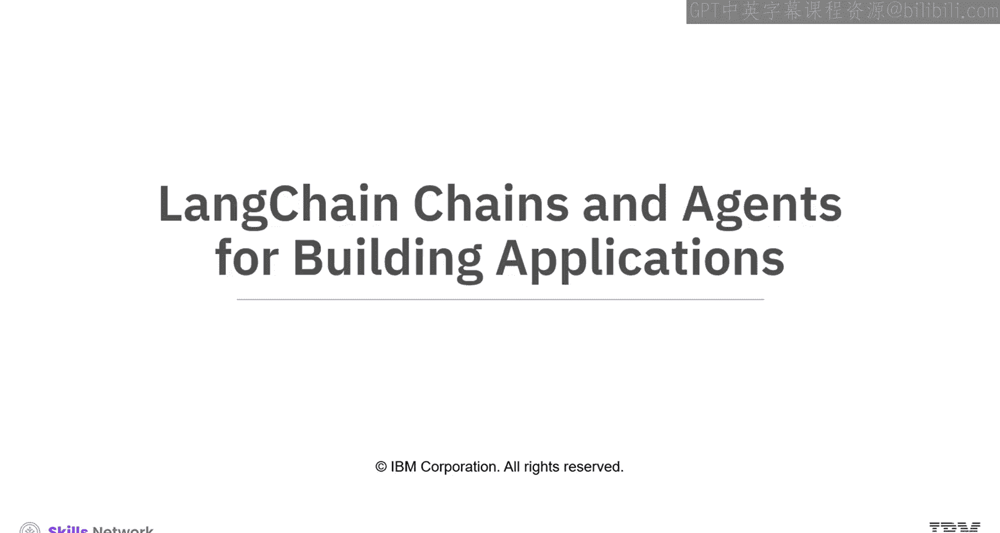

在本节课中，我们将要学习LangChain框架中的两个核心概念：**链**和**代理**。我们将了解链如何通过一系列顺序调用处理信息，以及代理如何利用语言模型和外部工具来动态执行任务。掌握这些概念是构建智能、交互式应用的基础。

---

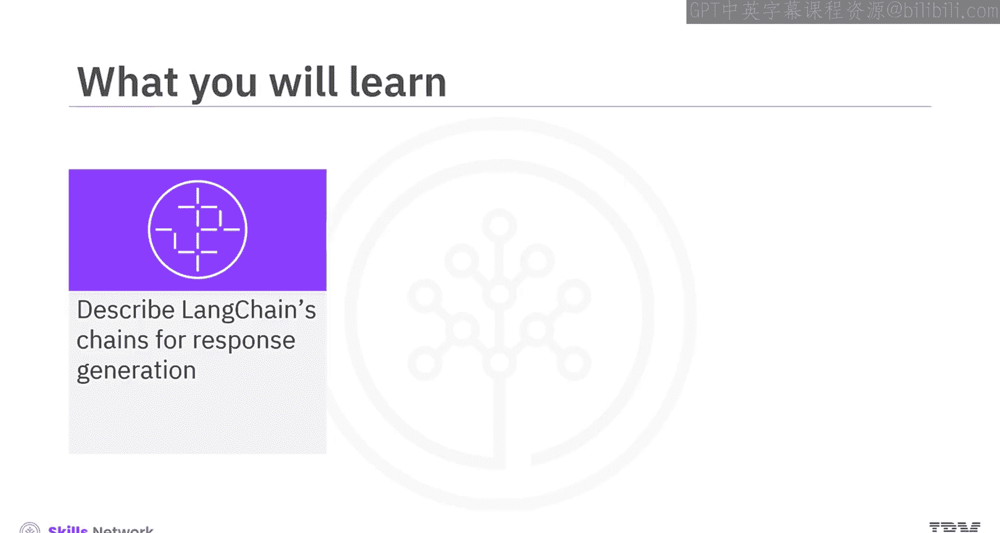

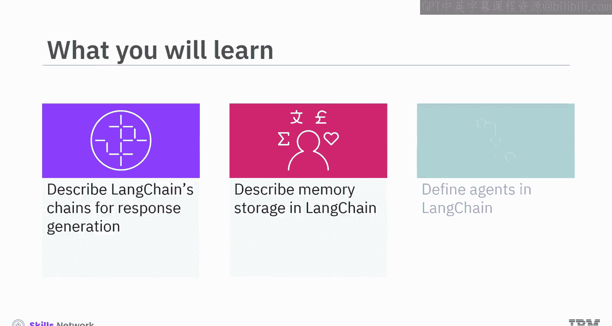

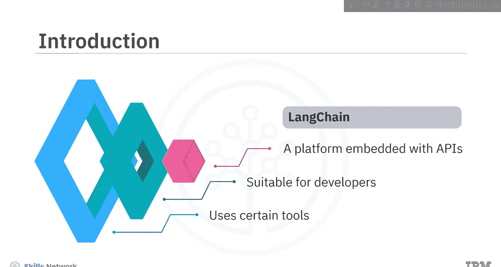

## 链：构建顺序处理流程 🔗

上一节我们介绍了LangChain平台，本节中我们来看看其核心组件之一——链。在LangChain中，链是一系列顺序调用的组合。一个顺序链由多个基本步骤构成，其中每一步接收一个输入并生成一个输出，从而创建一个无缝的信息流。第一步的输出会成为第二步的输入。

让我们通过一个具体例子来理解如何创建一个包含三个独立链的顺序链。这个链的目标是：根据用户输入的地点，找出该地的著名菜肴、提供食谱并估算烹饪时间。

以下是创建这个顺序链的步骤：

1.  **链1：确定地点对应的著名菜肴**
    此链接收用户指定的地点（例如“中国”）作为输入，并输出该地的著名菜肴（例如“北京烤鸭”）。
    ```python
    # 定义提示词模板
    template_1 = “请列出{location}的一道著名菜肴。”
    prompt_1 = PromptTemplate(input_variables=[“location”], template=template_1)
    # 创建LLM链
    location_chain = LLMChain(llm=llm_model, prompt=prompt_1, output_key=“meal”)
    ```

2.  **链2：获取菜肴的食谱**
    此链接收链1输出的菜肴名称作为输入，并输出该菜肴的简单食谱。
    ```python
    # 定义提示词模板
    template_2 = “请提供{meal}的简易食谱。”
    prompt_2 = PromptTemplate(input_variables=[“meal”], template=template_2)
    # 创建LLM链
    meal_chain = LLMChain(llm=llm_model, prompt=prompt_2, output_key=“recipe”)
    ```

3.  **链3：估算食谱的烹饪时间**
    此链接收链2输出的食谱作为输入，并估算出所需的烹饪时间。
    ```python
    # 定义提示词模板
    template_3 = “根据以下食谱，估算烹饪时间：{recipe}”
    prompt_3 = PromptTemplate(input_variables=[“recipe”], template=template_3)
    # 创建LLM链
    time_chain = LLMChain(llm=llm_model, prompt=prompt_3, output_key=“time”)
    ```

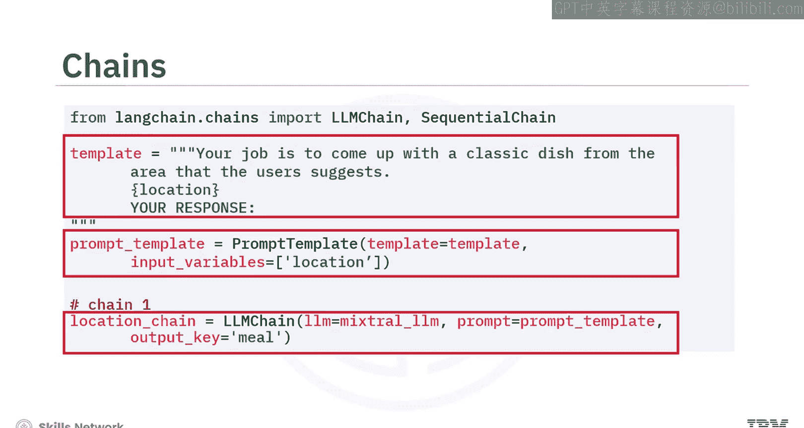

最后，使用`SequentialChain`将这三个独立的链组合成一个统一的流程。通过调用这个组合链并设置`verbose=True`，可以清晰地追踪信息从开始到结束的流转过程。

---

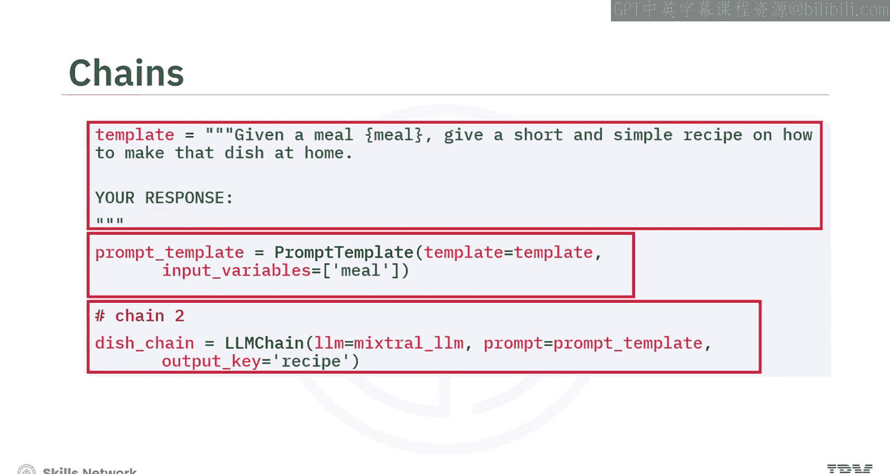

## 内存：在链中保存对话历史 💾

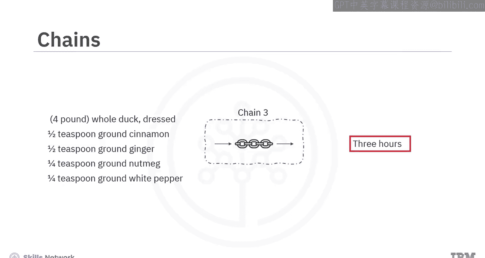

理解了链的基本流程后，我们来看看如何让应用记住之前的对话。在LangChain应用中，内存存储对于读写历史数据至关重要。每个链可以依赖特定的输入，例如用户输入和内存内容。

链在执行其核心逻辑之前，会从内存中读取信息以增强用户输入；在执行之后，会将当前运行的输入和输出写回内存。这确保了跨交互的连续性和上下文保存。

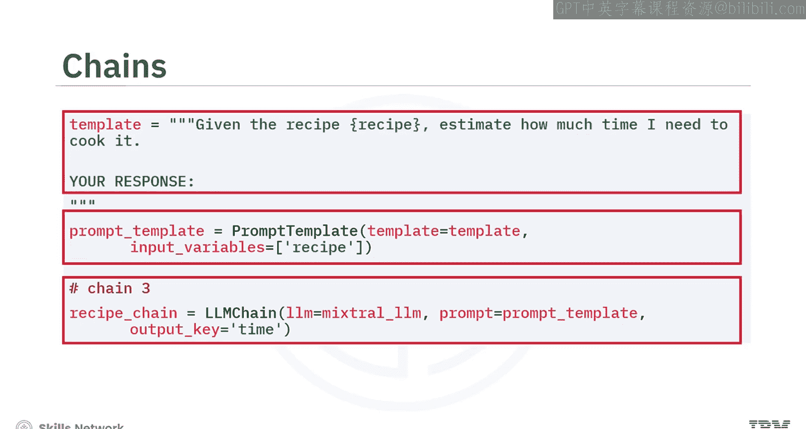

`ChatMessageHistory`类就是用来有效管理和存储对话历史的，包括人类消息和AI消息。它允许向历史记录中添加消息。

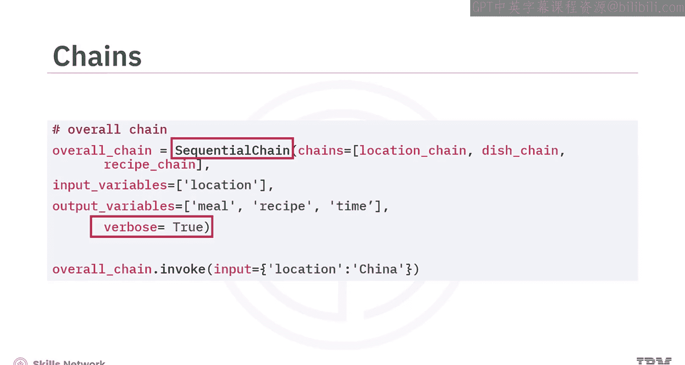

```python
from langchain.memory import ChatMessageHistory

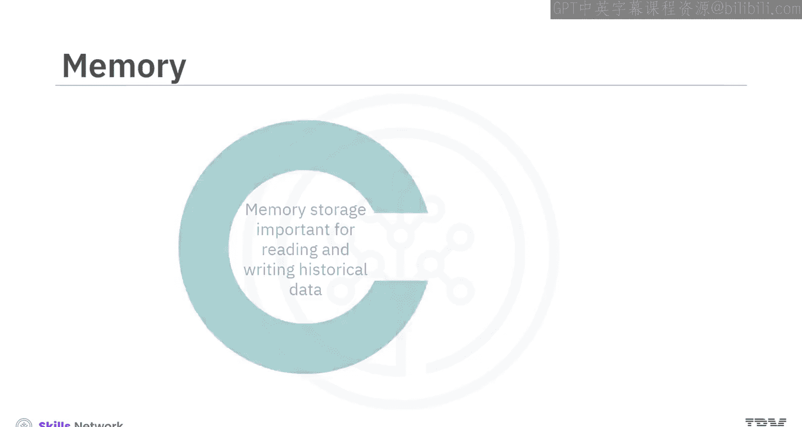

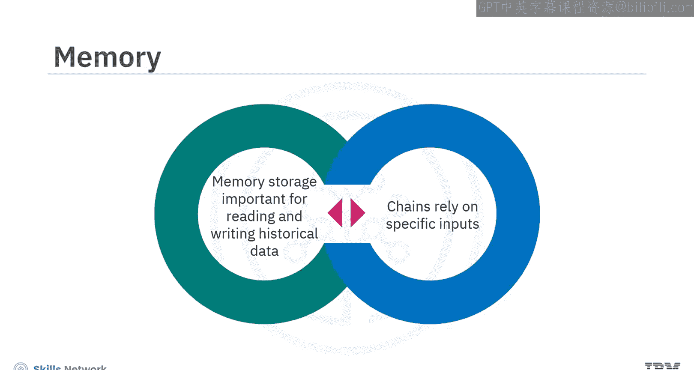

history = ChatMessageHistory()
# 添加AI消息
history.add_ai_message(“你好！我是AI助手。”)
# 添加用户消息
history.add_user_message(“法国的首都是什么？”)
# 后续的链可以基于存储的内存（history.messages）生成响应
```

---

## 代理：动态决策与执行系统 🤖

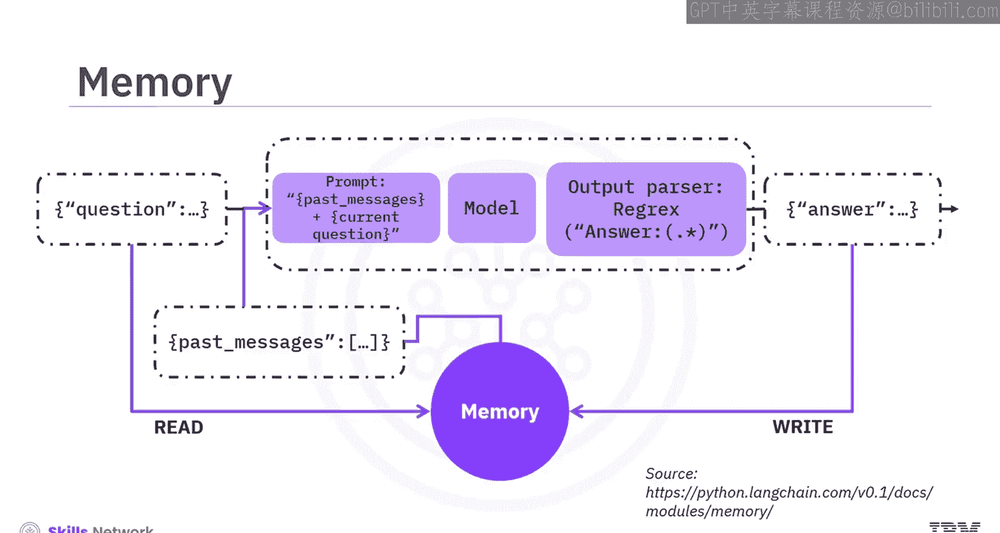

除了预定义的顺序链，LangChain还提供了更灵活的**代理**系统。代理是动态系统，其中语言模型负责决定和排序要执行的动作（例如调用预定义的链或工具）。模型生成文本来指导动作，但不直接执行它们。

代理的关键在于它们能与外部工具（如搜索引擎、数据库和网站）集成，以完成用户请求。例如，如果用户询问“意大利的人口”，代理会使用语言模型来规划步骤：可能先调用搜索工具查找最新数据，然后整理并返回答案。这展示了代理自主利用LLM推理能力与外部工具结合的能力。

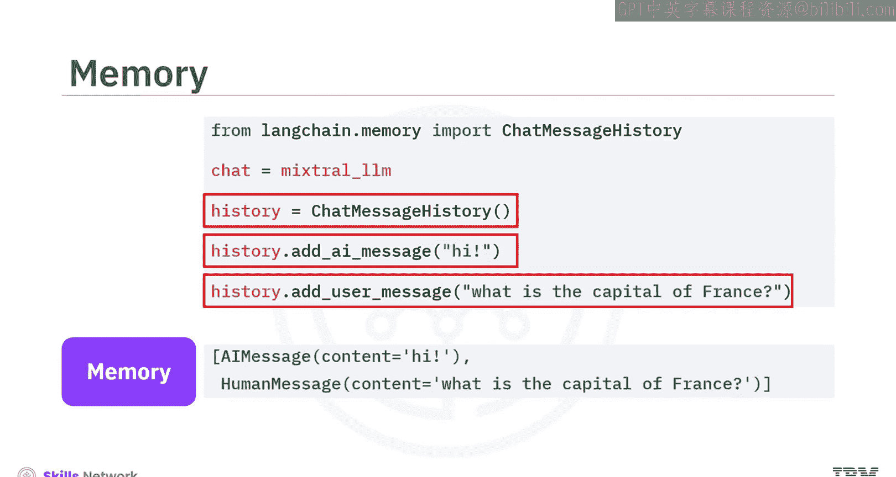

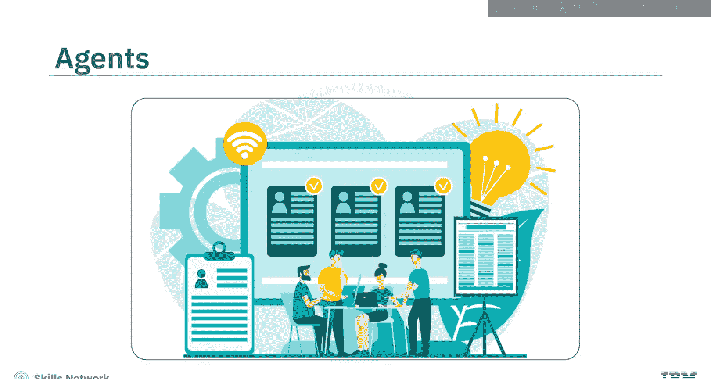

让我们看一个创建Pandas DataFrame代理的例子，它允许用户用自然语言查询和可视化数据：

```python
from langchain.agents import create_pandas_dataframe_agent
import pandas as pd

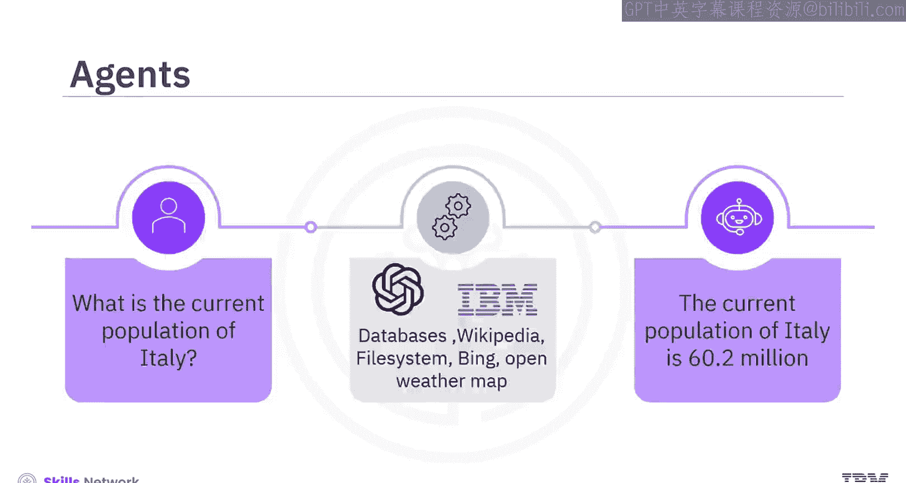

# 假设df是一个Pandas DataFrame
df = pd.read_csv(‘data.csv’)
# 创建代理
agent = create_pandas_dataframe_agent(llm=chat_model, df=df, verbose=True)
# 执行查询
response = agent.invoke(“数据框中有多少行？”)
print(response[‘output’]) # 例如：“数据框中有139行。”
```

在这个例子中，LLM将自然语言查询转化为在后台执行的Python代码（如`len(df)`），从而提供精确的答案。

---

## 总结 📝

本节课中我们一起学习了LangChain框架中构建应用的两个核心模块：

1.  **链**：作为一系列顺序调用，它将复杂任务分解为多个步骤，每一步的输出作为下一步的输入，形成流畅的信息处理管道。创建链通常涉及定义提示模板、构建LLM链对象，最后将它们组合成顺序链。
2.  **内存**：通过`ChatMessageHistory`等类实现，使应用能够保存和利用对话历史，保持交互的连续性。
3.  **代理**：这是一种更高级的动态系统，它利用语言模型来决策动作序列，并通过集成外部工具（如搜索引擎、数据库）来执行任务，从而灵活地响应用户的复杂请求。

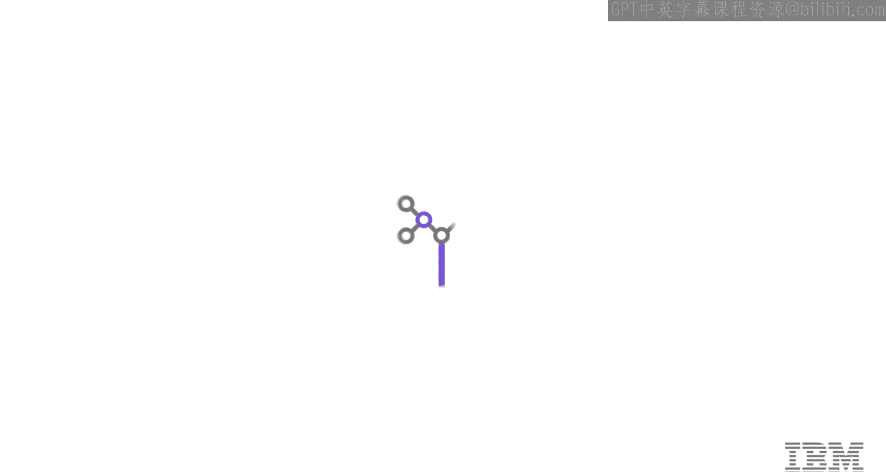

掌握链和代理的使用，是开发能够理解上下文、执行多步骤任务并与外部世界交互的智能应用程序的关键。