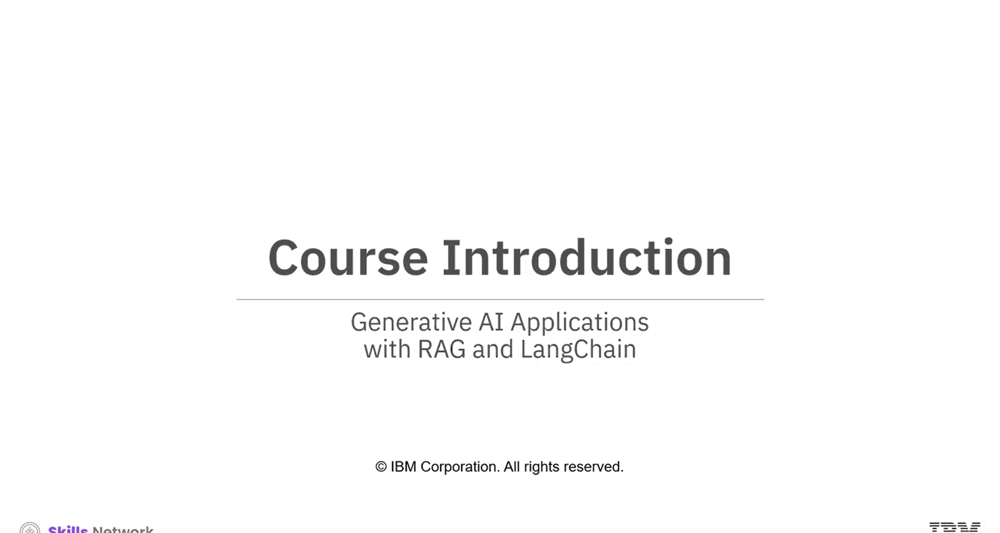
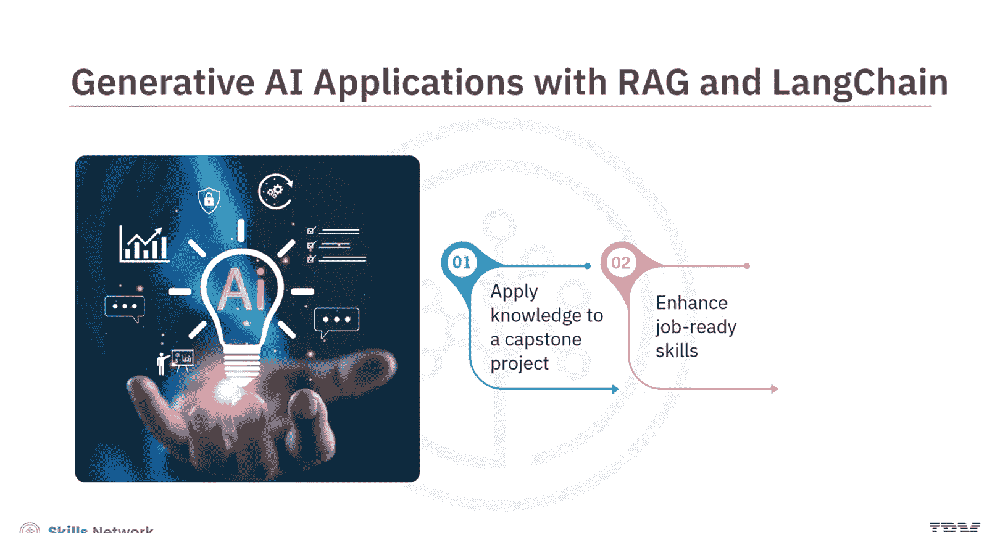
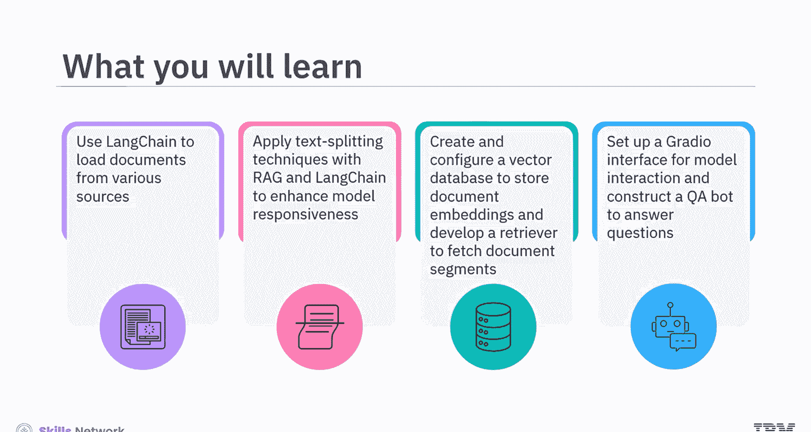
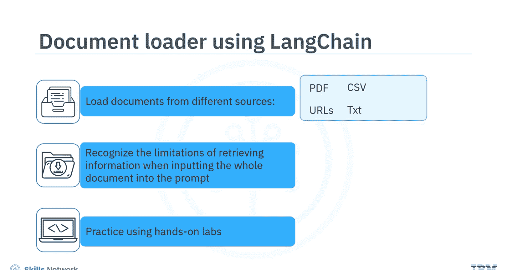
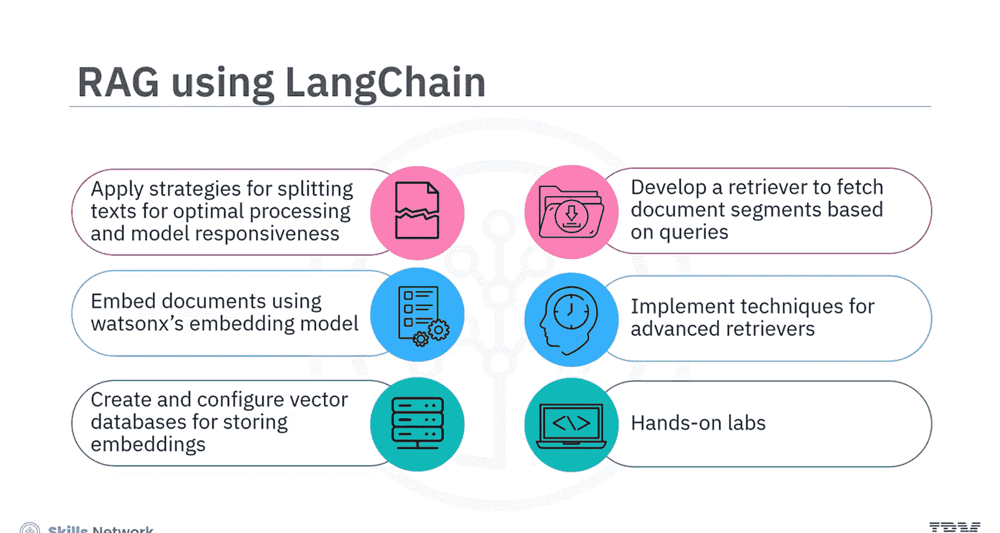
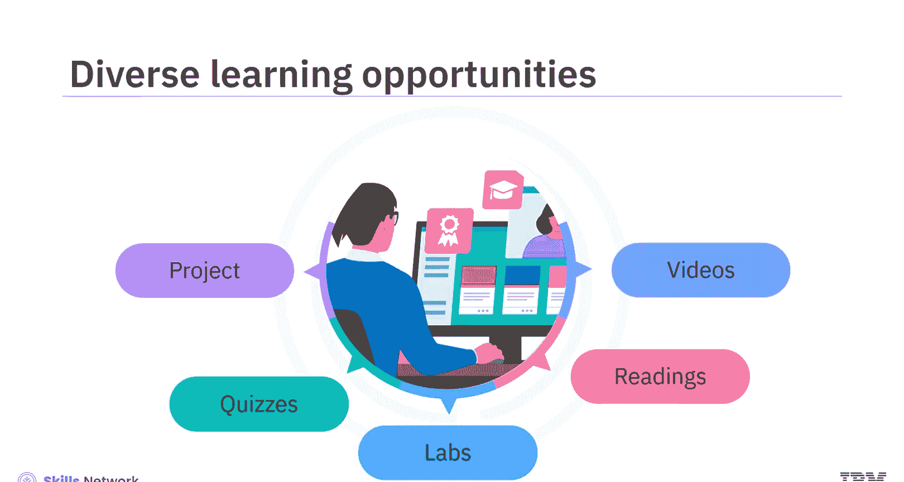
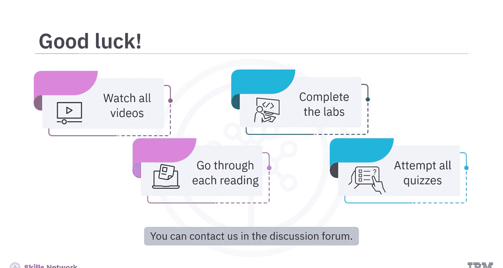

# 生成式人工智能工程：166：课程介绍 🚀

在本节课中，我们将要学习一门关于使用RAG和LangChain构建生成式AI应用的课程。本课程旨在通过一个顶点项目，让你应用新学到的知识和技能，从而提升你的就业竞争力，并加速你在AI领域的职业发展。

## 课程概述 📖

本课程适合对AI工程感兴趣的学习者，内容包括大型语言模型的训练、开发、微调和部署。现有的和有抱负的数据科学家、机器学习工程师都将从本课程中受益匪浅。

学习本课程需要具备Python基础知识。如果对LLM、LangChain和RAG有所了解，将是额外的优势。

## 你将学到什么 🎯

完成本课程后，你将能够掌握以下核心技能：

以下是本课程的核心学习目标列表：

*   使用LangChain从多种来源（如PDF、CSV、URL和文本）加载文档。
*   应用RAG和LangChain的文本分割技术，以提升模型的响应能力。
*   创建和配置向量数据库来存储文档嵌入。
*   开发一个检索器，根据查询获取相关的文档片段。
*   设置一个简单的Radio接口与模型进行交互。
*   使用LangChain和LLM构建一个问答机器人，来回答从已加载文档中提取的问题。

## 课程内容与结构 🗺️

上一节我们介绍了课程的整体目标，本节中我们来看看课程的具体内容和结构安排。

### 第一阶段：文档加载与处理

你将首先学习使用LangChain从不同来源（如PDF、CSV、URL和文本）加载文档。此外，你将了解到将整个文档内容输入提示词时，在信息检索方面的局限性。

你将在动手实验练习中使用Jupyter Lab环境来实践这些概念和技术。

### 第二阶段：RAG与检索增强

接下来，你将学习与使用LangChain实现RAG相关的概念。

以下是本阶段的核心学习内容：

*   学习用于优化处理的文本分割策略，并应用它们来增强模型的响应能力。
*   学习如何使用Watson X嵌入模型为文档生成嵌入。
*   熟悉如何创建和配置向量数据库来存储这些嵌入。
*   学习如何开发一个检索器，根据查询获取文档片段。
*   探索实现高级检索器的技术。

你将再次在动手实验中练习这些概念和工具。

### 第三阶段：集成与构建应用

然后，你将学习如何将前端界面与LLM应用集成，并设置一个Symbol Radio接口来与LLM模型交互。

最后，你将构建一个QA机器人来回答从已加载文档中提取的问题。在此阶段，你也能够通过动手实验来练习这些技术。

最终，你将通过参与一个基于真实场景的指导项目，完成获得工作所需技能的“最后一公里”。

## 学习资源与建议 💡

本课程提供了丰富多样的学习机会来辅助你的学习之旅。教学视频配有信息丰富的阅读材料，以促进扎实的概念学习。以动手实验形式提供的技术实践环境，允许你应用对关键工具和技术的概念性知识。最后，测验和项目将帮助你评估自己的学习成果。

为了从本课程中获得最大收益，请观看每一段视频，阅读每一份材料，完成所有动手实验和活动，并尝试所有测验。

## 总结与开始 🏁

本节课中我们一起学习了这门关于RAG和LangChain的生成式AI应用课程的目标、内容、结构以及学习建议。本课程涵盖了从文档处理、检索增强到应用构建的完整流程。

加入我们，一起探索这个不断增长且充满活力的、结合了RAG和LangChain的AI应用领域。如果你对课程材料有任何疑问，请随时在讨论区联系我们。让我们开始吧。祝你一切顺利！