# 生成式人工智能工程：167：从不同来源加载文档 📄

在本节课中，我们将学习如何使用 LangChain 的文档加载器（Document Loaders）从多种来源高效地导入数据。这是构建检索增强生成（RAG）应用的第一步，也是处理和分析信息的基础。

LangChain 通过文档加载器从网站、文件和数据库等多种来源收集信息，并将其转换为 LangChain 可以处理的格式。文档加载器充当连接器，拉取数据并进行格式转换。收集必要信息是创建 RAG 应用的第一步，之后才能开始处理数据，以根据用户查询找到相关答案。这个过程帮助你的应用高效地访问和使用广泛的信息。

## 加载文本文件 📝

如果你正在处理纯文本文件，可以利用 LangChain 中的 `TextLoader` 类来高效加载它们。LangChain 的 `load` 方法专门设计用于从配置好的源加载数据为文档对象。

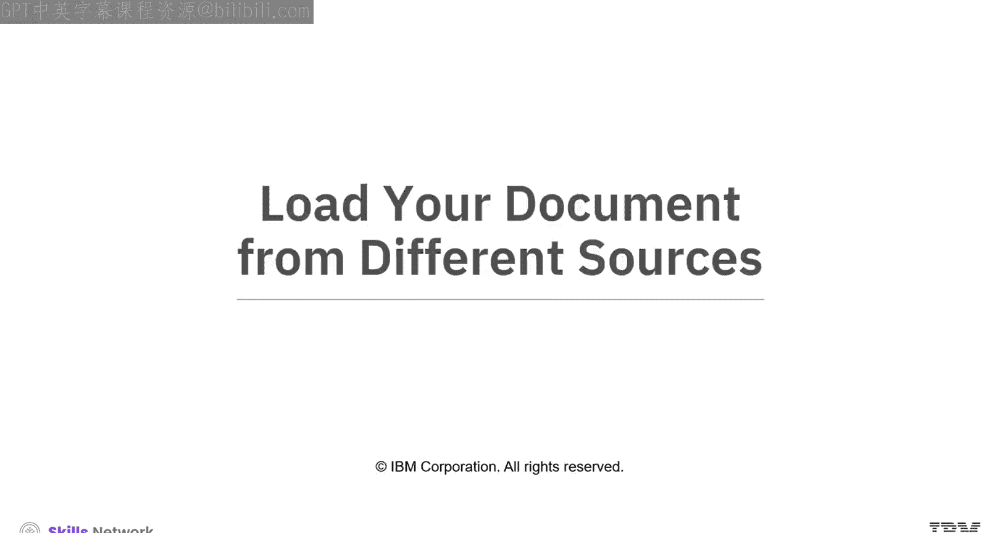

以下是使用该方法加载文本数据的代码示例。加载后，每个包含元数据和页面内容属性的文档对象会被存储在一个列表中。

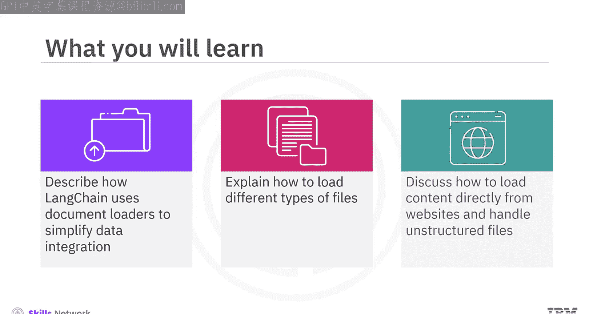

```python
from langchain.document_loaders import TextLoader

loader = TextLoader("example.txt")
documents = loader.load()
```

这是一个打印文本文件内容的示例，展示了文档对象的结构和访问方式。

## 加载 PDF 文件 📑

对于 PDF 文件，LangChain 中的 `PyPDFLoader` 类是你的首选工具。这个类可以将 PDF 加载到一个文档对象数组中，每个文档对象捕获一页的内容，以及元数据和页码。

你可以看到这里加载了一篇学术论文的 PDF 文件。这是第一页的内容。

```python
from langchain.document_loaders import PyPDFLoader

loader = PyPDFLoader("example.pdf")
documents = loader.load()
```

你也可以使用 `PyMuPDFLoader`，这是 LangChain 中最快的 PDF 解析工具。

这个加载器能快速处理每一页，并提供关于 PDF 及其页面的详细元数据，每页返回一个文档对象。让我们用这个加载器重新加载上一张幻灯片中的论文。

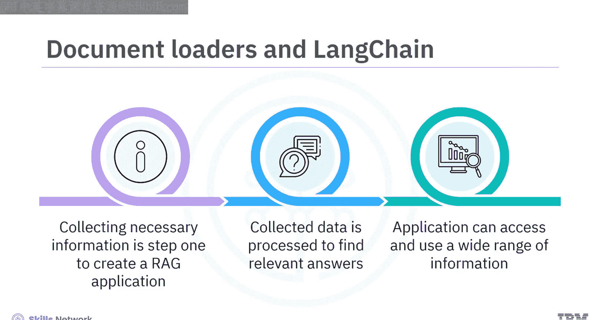

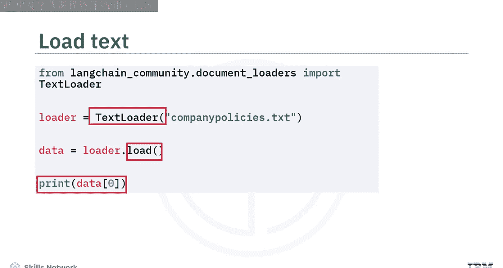

`PyMuPDFLoader` 与 `PyPDFLoader` 的关键区别在于，它包含了更全面的元数据。

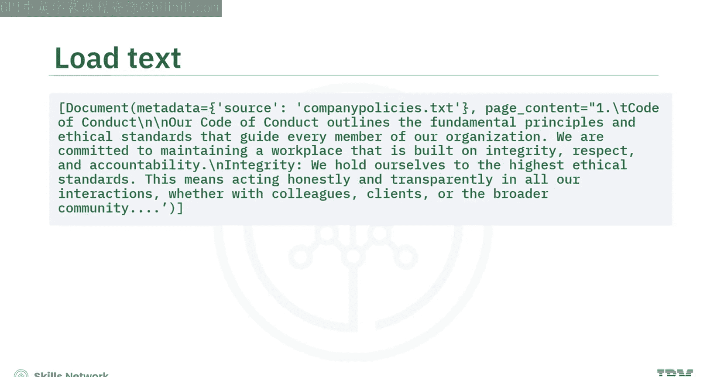

## 加载 Markdown 文件

如果你正在处理 Markdown 文件，LangChain 提供了 `UnstructuredMarkdownLoader` 类来加载它。

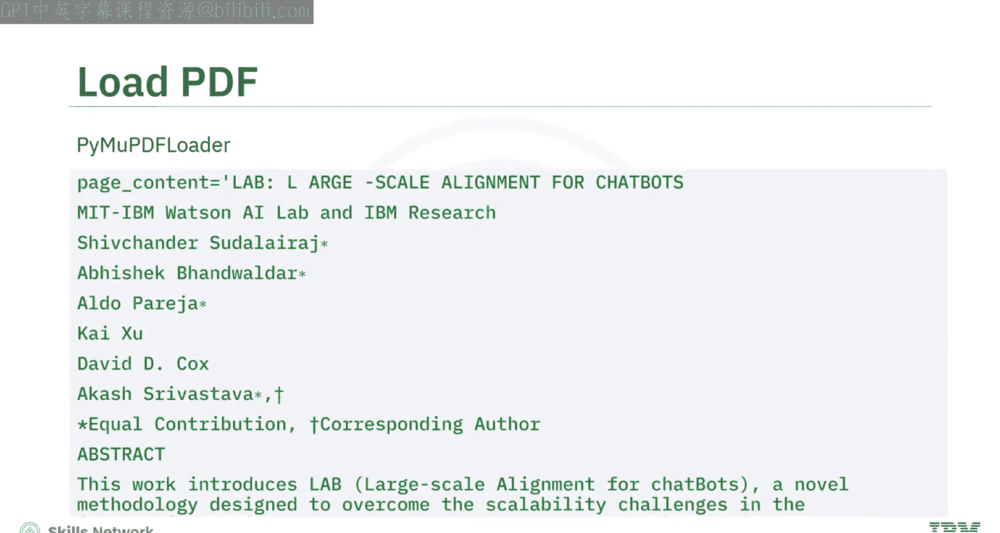

请注意，内容可能包含许多换行符。

## 加载 JSON 文件

处理 JSON 文件时，需要考虑其独特的键值对结构。让我们看一个例子。

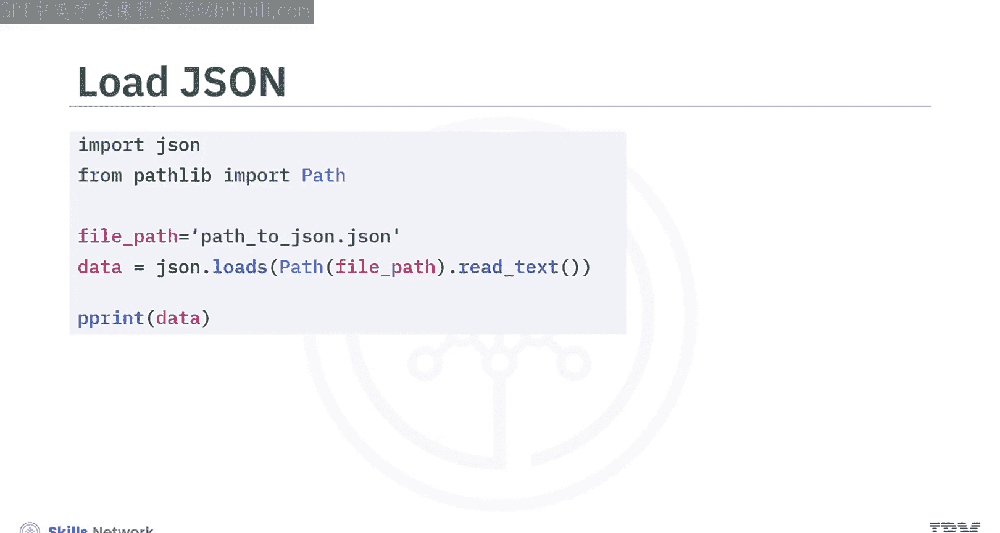

我们将使用以下代码来加载和显示一个 JSON 文件。

```python
# 示例代码：加载JSON文件
```

这是文件内容。它包含各种字段的结构，你特别希望从 `messages` 中提取 `content` 字段，以便在 LangChain 中进行进一步处理。你该怎么做？

LangChain 提供了专门设计用于加载 JSON 文件的 `JSONLoader` 类。这个加载器利用 `jq` 模式根据特定需求解析 JSON 文件。

例如，如果你想从 JSON 数据的 `message` 键下的 `content` 字段中提取值，你应该为 `content` 定义一个合适的 `jq` 模式。设置好后，加载器将提取这些值，并将它们加载到一个文档对象数组中，其中每个文档代表一条消息内容。

## 加载 CSV 文件 📊

处理 CSV 文件中的数据时，LangChain 中的 `CSVLoader` 是理想的工具。这个加载器通过将数据的每一行转换为一个单独的文档对象来处理 CSV 文件。

以下是一个示例。

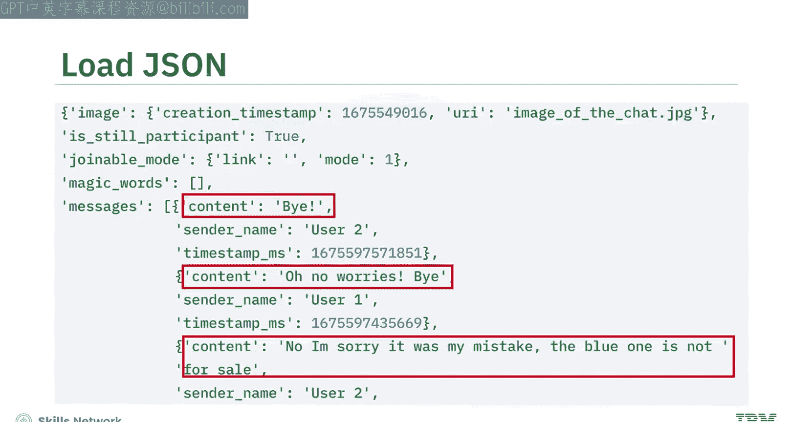

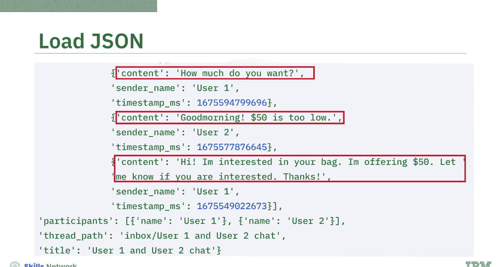

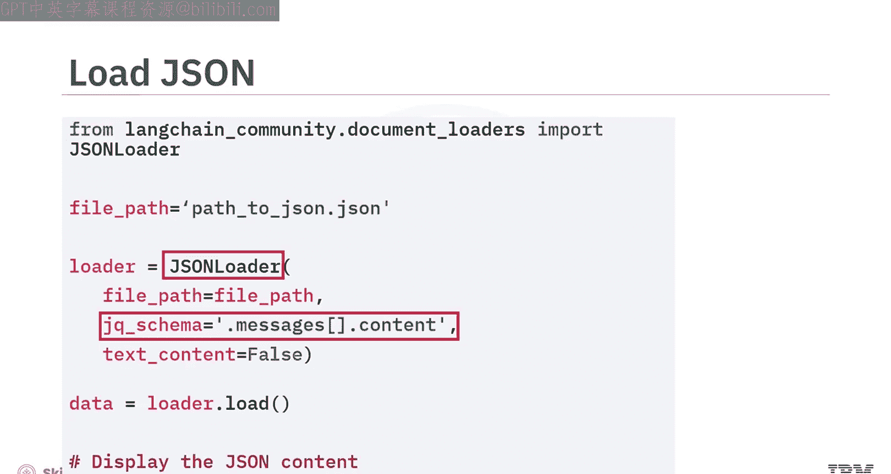

```python
from langchain.document_loaders import CSVLoader

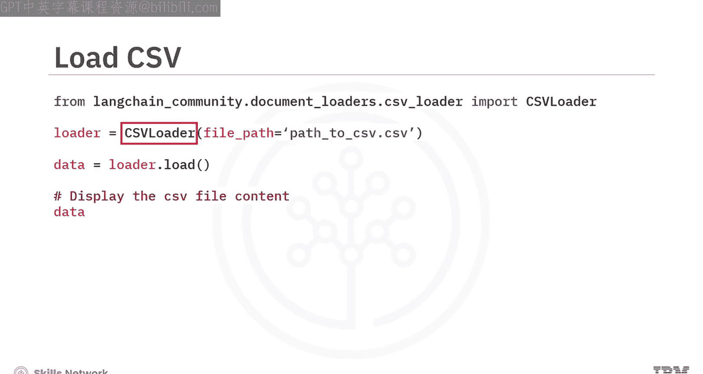

loader = CSVLoader("example.csv")
documents = loader.load()
```

如果你想将所有数据加载到一个文档对象中，可以使用 `UnstructuredCSVLoader`。

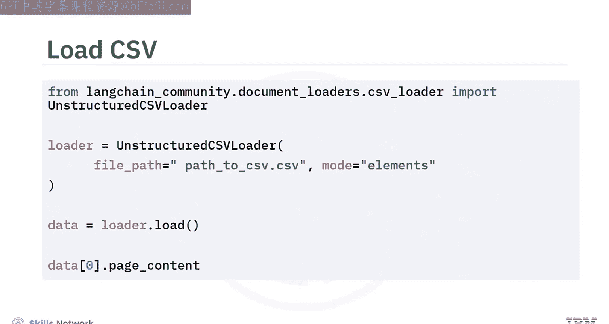

与将每一行视为一个单独文档（由表头定义数据）的 `CSVLoader` 不同，`UnstructuredCSVLoader` 将整个 CSV 文件视为一个单一的非结构化表格元素。

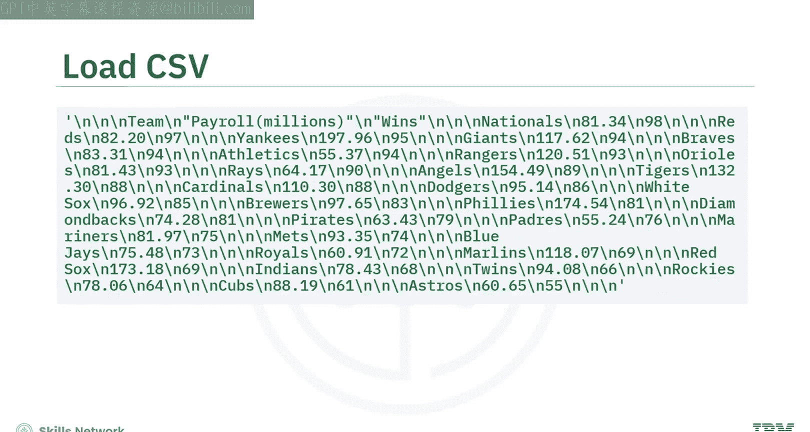

这在将数据作为表格而非单个条目进行分析时非常有用。

## 从网站加载内容 🌐

如果需要加载和解析在线网页，标准方法是使用一个名为 `BeautifulSoup` 的 Python 包。

例如，这里有一个你想加载的网站。这是网页 URL 和网页部分内容的截图。

你可以使用此处显示的代码，通过 `BeautifulSoup` 来加载和解析它。

让我们看看它的表现。这是加载响应部分内容的截图。

你可以看到，`BeautifulSoup` 加载了网页内容，并包含了一些 H 标签和外部链接，这些内容是不必要的，甚至在你只想加载网页文本内容时会成为负担。

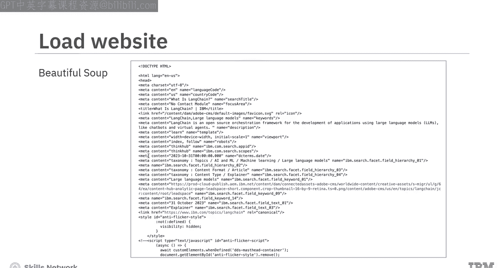

`BeautifulSoup` 有其局限性。有更好的方法吗？是的。

LangChain 中的 `WebBaseLoader` 旨在高效地从 HTML 网页中提取所有文本，并将其转换为适合下游处理的文档格式。

让我们再次使用 `WebBaseLoader` 加载相同的 URL。加载后，可以观察到加载器只捕获了网页的所有文本，避免了 HTML 标签和链接，只包含换行符。

当需要加载多个网站时，你该怎么做？你可以创建一个这些网站的列表，并将其传递给 `WebBaseLoader`。加载器会将每个网站的所有内容加载到一个文档对象中，并将它们格式化为一个数组。

## 加载 Word 文档

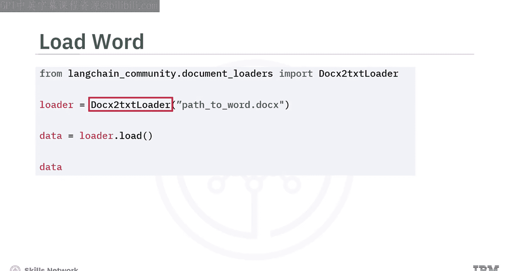

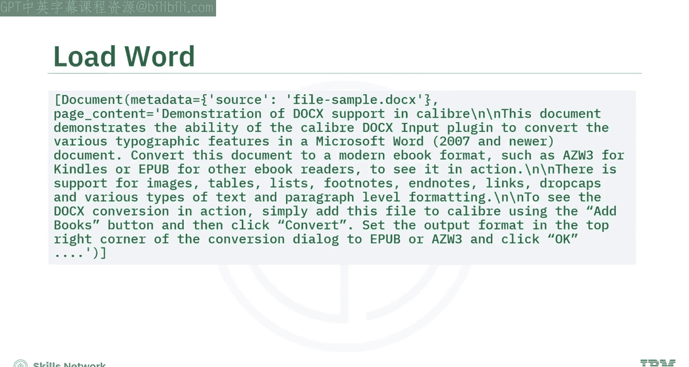

LangChain 还提供了 `Docx2txtLoader` 来帮助将 Word (.docx) 文件加载为文档内容，类似于文本加载器。

以下是如何加载 Word 文档的示例。

```python
from langchain.document_loaders import Docx2txtLoader

loader = Docx2txtLoader("example.docx")
documents = loader.load()
```

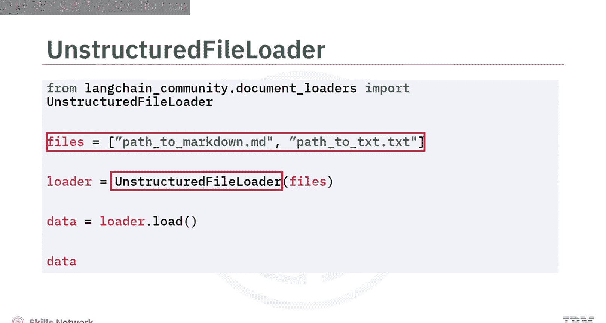

## 使用通用文件加载器

对于因文件格式未知或多样而需要灵活性的项目，LangChain 中的 `UnstructuredFileLoader` 非常完美。

这个加载器设计用于通用目的，支持多种文件类型，包括文本文件、PowerPoint 演示文稿、HTML 页面、PDF、图像等。

例如，如果你有一个 Markdown 文件和一个文本文件需要加载，你可以只使用这一个加载器。

`UnstructuredFileLoader` 能高效地将这些不同文件的内容转换为单个文档对象。

## 总结 📚

本节课中，我们一起学习了 LangChain 如何使用文档加载器作为连接器来收集数据并将其转换为兼容格式。

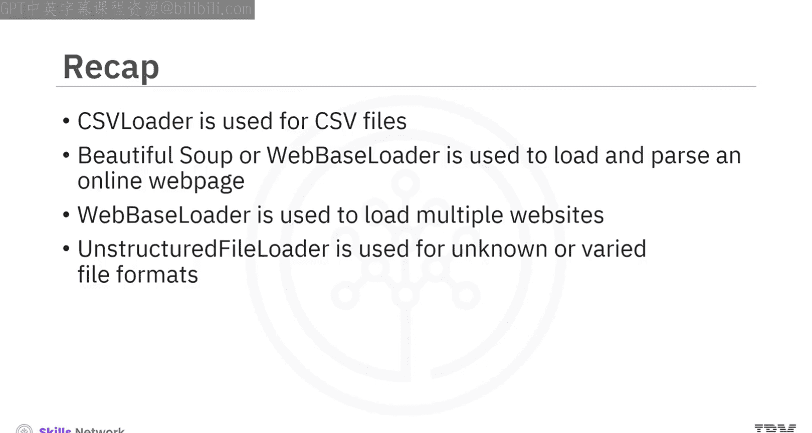

*   你可以使用 LangChain 中的 `TextLoader` 类来加载纯文本文件。
*   对于 PDF 文件，LangChain 中的 `PyPDFLoader` 类或 `PyMuPDFLoader` 是理想选择。
*   对于 Markdown 文件，LangChain 提供了 `UnstructuredMarkdownLoader`。
*   LangChain 提供了 `JSONLoader` 类，专门设计用于加载 JSON 文件。
*   处理 CSV 文件中的数据时，LangChain 中的 `CSVLoader` 是理想的工具。
*   要加载和解析在线网页，可以使用 Python 包 `BeautifulSoup` 或 LangChain 中的 `WebBaseLoader`。
*   要加载多个网站，请使用 `WebBaseLoader`。
*   最后，你了解到对于文件格式未知或多样的项目，LangChain 中的 `UnstructuredFileLoader` 是一个理想的解决方案。