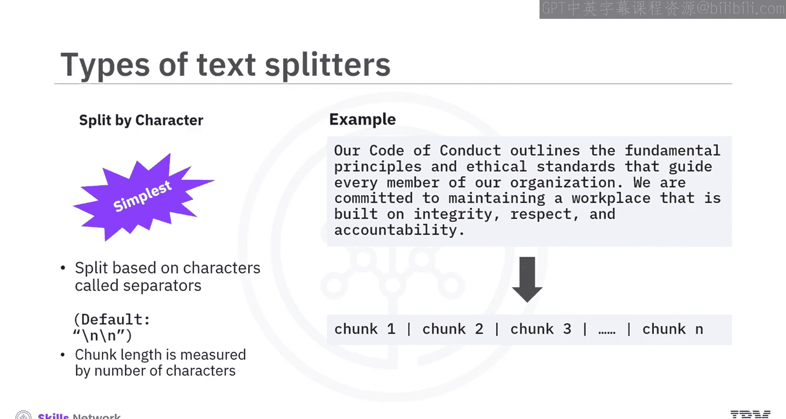
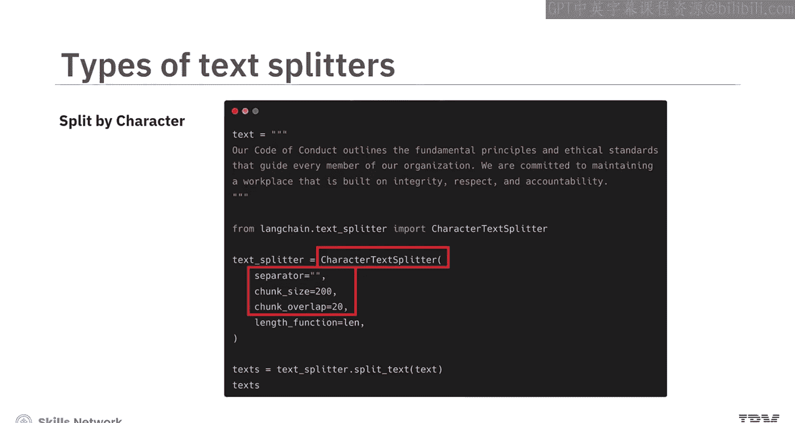
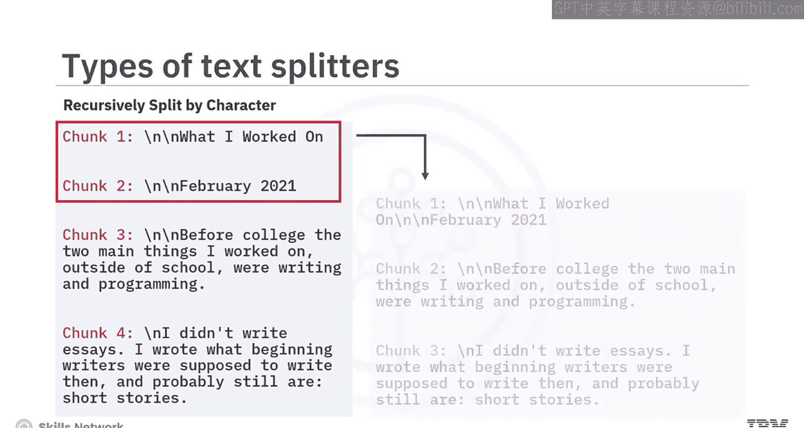
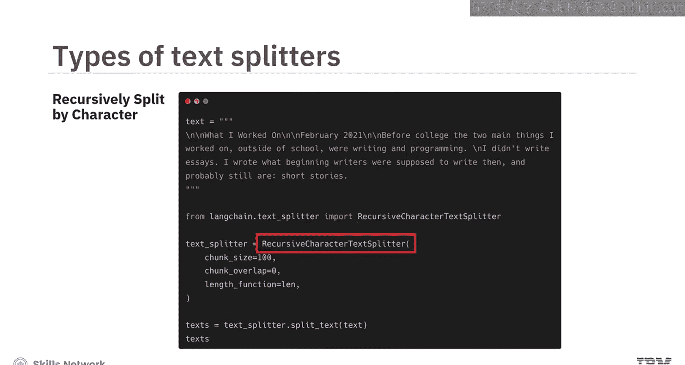
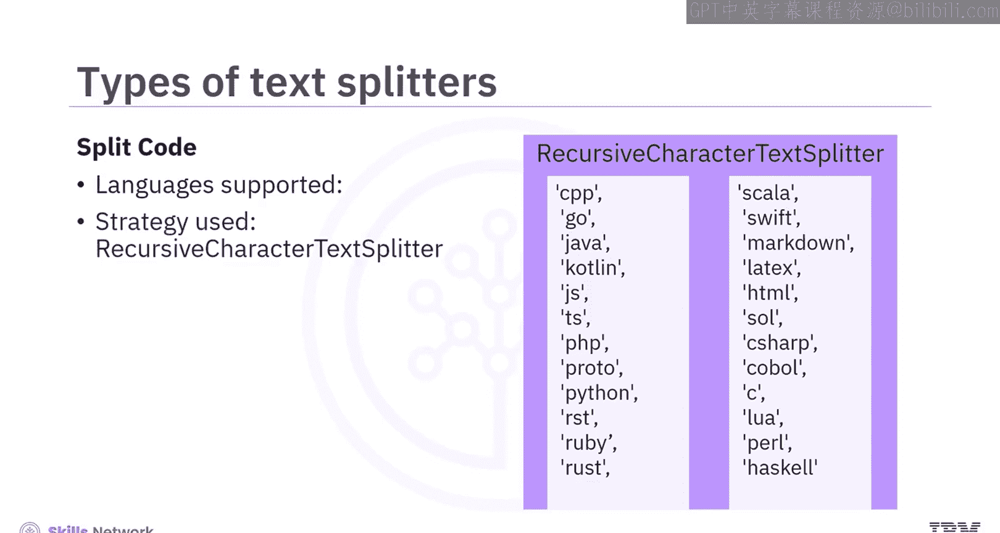
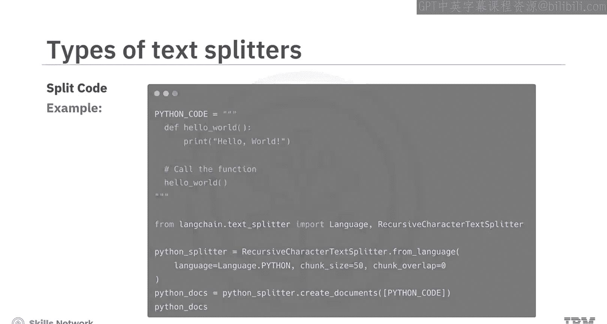
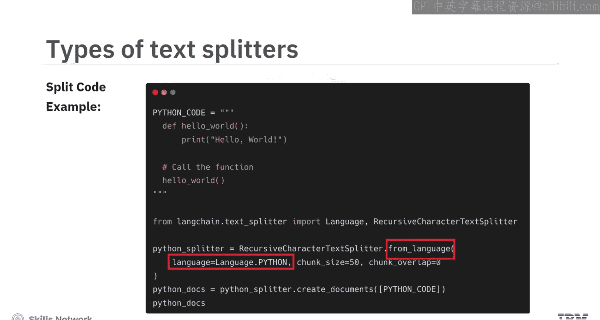
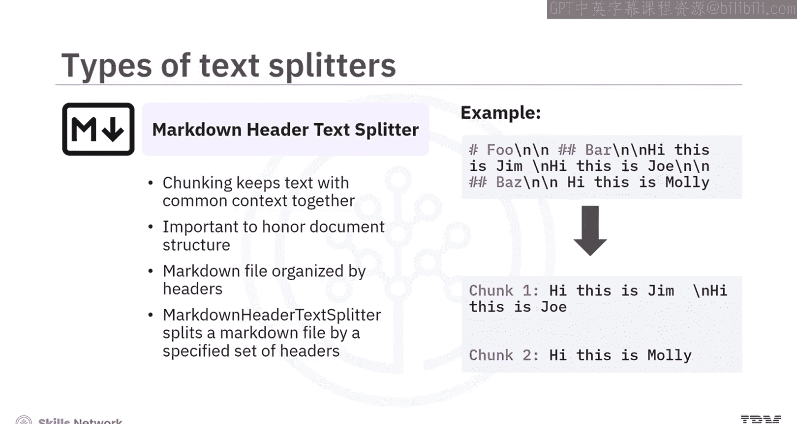
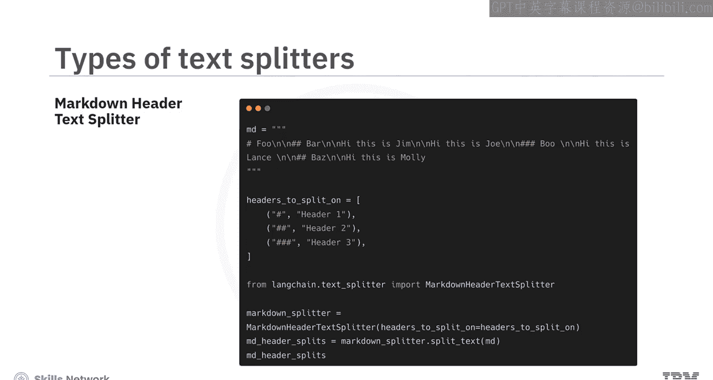
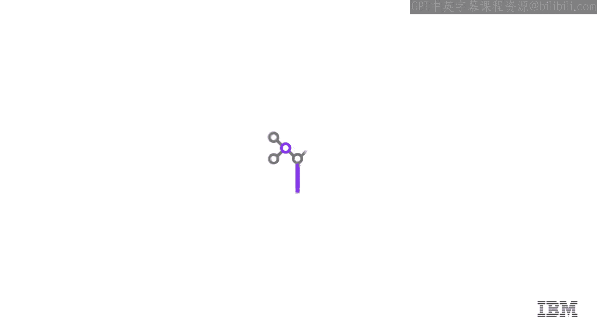

生成式人工智能工程：168：优化处理的文本分割策略 📄

在本节课中，我们将学习 Langchain 如何利用文本分割器来分割、合并、筛选和操作文档，以满足特定需求。我们将探讨几种常用的分割器及其使用方法。

文本分割是处理长文档的关键步骤，目的是将其分割成适合大语言模型上下文窗口的小块。Langchain 提供了多种内置的文档分割器来简化这一过程。

---

### 文本分割器的工作原理

首先，文本分割器将文本分割成小的、有语义意义的块，通常是句子。接着，它将这些小块组合成更大的块，以达到特定的大小。一旦达到该大小，分割器就将该块指定为一个独立的文本片段。然后，分割器会创建一个新的块，并与前一个块保持一定的重叠，以确保块之间的上下文连贯性。

从根本上讲，文本分割器沿着两个轴进行操作：
1.  **如何分割文本**：指用于将文本分解成更小块的方法或策略。这可能涉及按特定字符、单词、句子甚至自定义标记进行分割。
2.  **如何测量块大小**：指用于确定一个块何时完成的标准。这可能涉及计算字符数、单词数、标记数或自定义指标。

---

### 文本分割器的关键参数

文本分割器中的某些关键参数决定了其工作方式。

以下是这些参数：
*   **分隔符**：指用于将文本分割成可管理块的字符或字符集。例如，常见的分隔符有换行符、段落分隔符或空格。默认分隔符是按段落。
*   **块大小**：指每个块可以包含的最大字符数。块是指从较大文本体中分离出来的文本段。默认值为 1000。
*   **块重叠**：指连续块之间重叠的字符数。默认值为 200。
*   **长度函数**：长度函数决定了如何计算块的长度。

---

### 常用文本分割器

Langchain 提供了几种不同类型的文本分割器。让我们探讨一些常用的分割器及其使用方法。

#### 字符文本分割器

这是最简单的方法。分割基于字符进行，这些字符也称为分隔符。您可以通过字符数来测量块长度。

例如，这里有一段文本。字符分割器可以将文本分割成不同的块，每个块由自定义的分隔符分隔。您甚至可以在块之间设置重叠，以确保信息不会丢失。

以下是展示如何使用字符文本分割器的代码。使用单个字符作为分隔符，块大小设置为 200，重叠为 20。

```python
# 示例代码：使用字符文本分割器
from langchain.text_splitter import CharacterTextSplitter

splitter = CharacterTextSplitter(separator=" ", chunk_size=200, chunk_overlap=20)
chunks = splitter.split_text(your_text)
```



这意味着当字符数达到 200 时，文本将被分割。分割后，您可以看到文本如何被分成两个块，每个块之间有一些用黄色显示的字符重叠。



#### 递归字符文本分割器

递归字符文本分割器采用递归作为核心机制来完成文本分割。它推荐用于通用文本。它接收一大段文本，并尝试将其分割，直到块足够小。它通过使用一组字符来实现这一点。默认提供的字符是按段落、句子、单词或字符。

例如，这里它接收文本，然后尝试按第一个分隔符（即按段落，由 `\n` 字符表示）进行分割。您最终得到三个块。接下来，评估每个块以确保它们小于指定的大小，比如 100 个字符。前两个块满足此条件，但第三个块不满足。因此，您继续进行下一级的分割，即按句子分割。这将第三个块进一步分割，得到四个块。之后，您会发现合并前两个块仍然在 100 个字符的限制内，因此可以合并它们。这就得到了最终的块集。

以下是展示如何使用递归字符文本分割器的代码。

```python
# 示例代码：使用递归字符文本分割器
from langchain.text_splitter import RecursiveCharacterTextSplitter

splitter = RecursiveCharacterTextSplitter(chunk_size=100, chunk_overlap=0)
chunks = splitter.split_text(your_text)
```

#### 代码文本分割器

代码文本分割器使您能够分割代码，并支持多种语言。它提供的支持语言列表如下：
*   Python
*   C
*   C++
*   Java
*   ...



分割策略基于递归字符文本分割器。



以下是分割 Python 代码的示例。虽然它基于递归字符文本分割器，但当应用于代码分割器时，您需要在调用 `RecursiveCharacterTextSplitter` 类后添加 `from_language`，并在其中指定您要分割的语言。

```python
# 示例代码：使用代码文本分割器（以Python为例）
from langchain.text_splitter import RecursiveCharacterTextSplitter, Language



splitter = RecursiveCharacterTextSplitter.from_language(
    language=Language.PYTHON,
    chunk_size=200,
    chunk_overlap=50
)
chunks = splitter.split_text(your_python_code)
```

#### Markdown 标题文本分割器



分块的目标是保持具有共同上下文的文本在一起。考虑到这一点，您可能希望尊重文档结构。Markdown 文件按标题组织，在特定标题组内创建块是一个直观的想法。您可以使用 Markdown 标题文本分割器来应对这一挑战，它将按指定的标题集分割 Markdown 文件。



例如，如果您有这样的 Markdown 原始文本，您可以使用 Markdown 标题文本分割器按任何标题（在本例中是 `## Bar` 和 `### BS`）来分割内容。

以下是实现按标题分割 Markdown 文件的代码。

```python
# 示例代码：使用Markdown标题文本分割器
from langchain.text_splitter import MarkdownHeaderTextSplitter



headers_to_split_on = [
    ("#", "Header 1"),
    ("##", "Header 2"),
    ("###", "Header 3"),
]
splitter = MarkdownHeaderTextSplitter(headers_to_split_on=headers_to_split_on)
chunks = splitter.split_text(your_markdown_text)
```

---



### 总结

本节课中，我们一起学习了 Langchain 如何使用文本分割器将长文档分割成适合大语言模型上下文窗口的小块。



文本分割器沿着两个轴进行操作：第一个是用于将文本分解成更小块的方法，第二个是如何测量块的大小。文本分割器的关键参数包括分隔符、块大小、块重叠和长度函数。一些常用的分割器包括按字符分割、递归按字符分割、代码分割器和 Markdown 标题文本分割器。