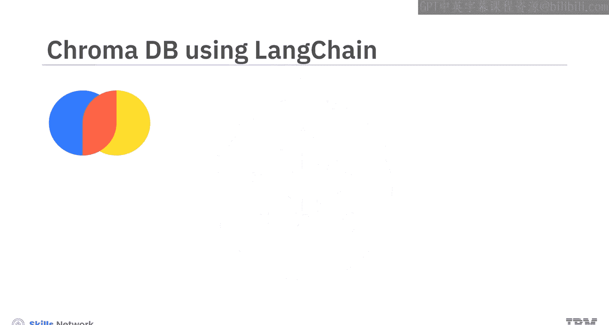
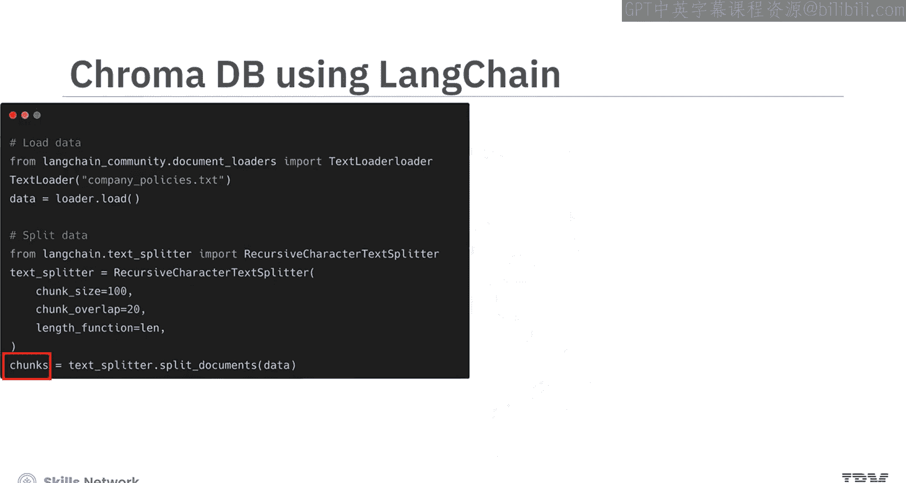
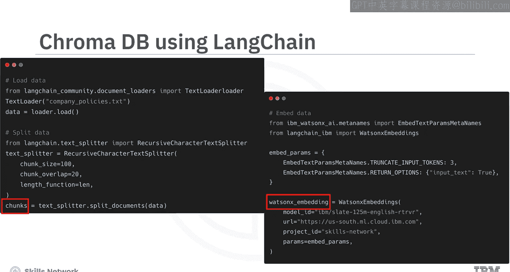
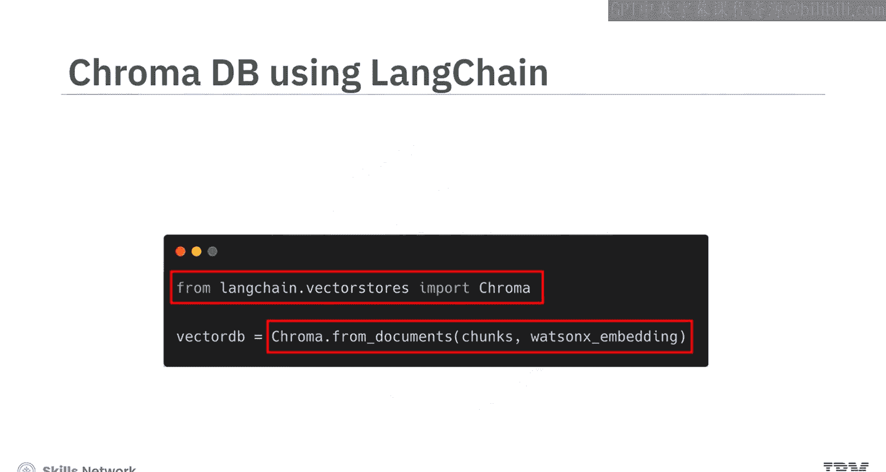
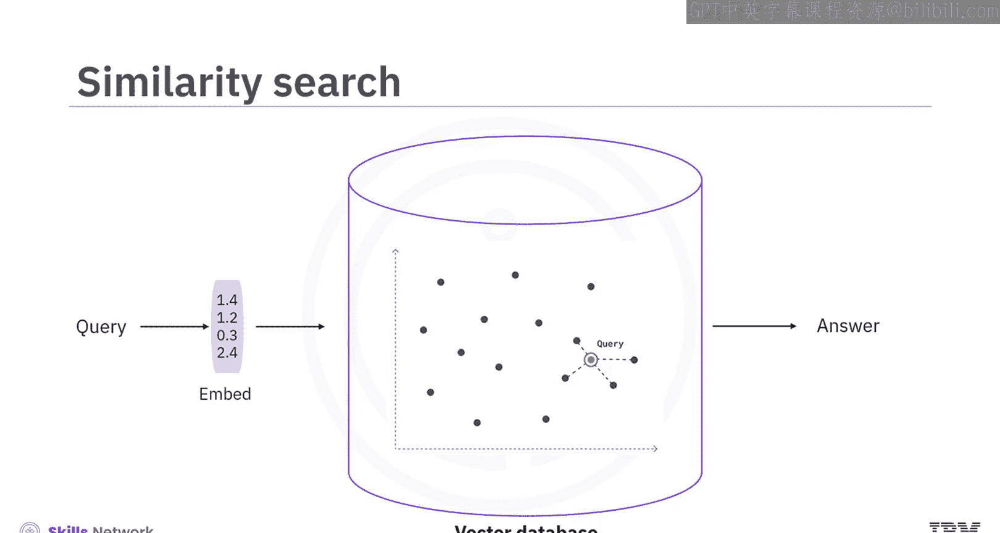
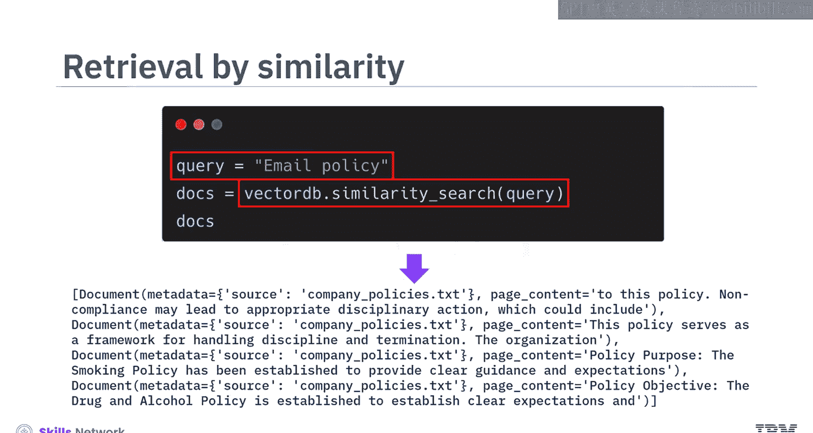
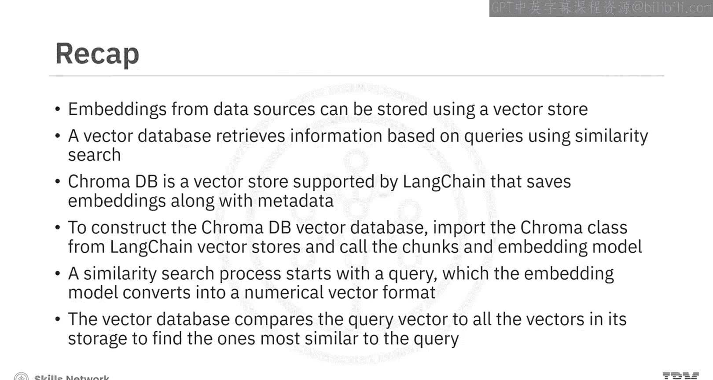

# 向量数据库入门：169：存储嵌入 🧠

在本节课中，我们将学习如何使用向量数据库存储嵌入向量。你将能够描述存储嵌入向量的方法，解释 Langchain 支持的向量数据库 ChromaDB 的用法，并讨论如何在向量数据库中进行相似性搜索以检索与查询最相关的内容。

## 从数据到向量存储

上一节我们介绍了如何从各种来源加载、分割数据并生成嵌入向量，为下游任务做准备。在获得数据源的嵌入向量后，下一个关键步骤是存储它们。你可以使用专门为存储嵌入向量设计的**向量存储**来实现这一目标。

向量数据库的功能不仅仅是存储数据，它还能通过**相似性搜索**，根据查询检索所需信息。

其工作原理如下：
1.  查询首先被转换为嵌入向量。
2.  该嵌入向量被输入向量数据库。
3.  数据库执行相似性计算，搜索并检索与查询最相关的内容。

## 为什么需要向量数据库？

向量数据库至关重要，因为嵌入向量将数据（通常是文本等非结构化数据）转换为高维空间中的数值向量格式。像 SQL 这样的传统数据库并非为存储和查询大量向量数据而优化，通常难以有效地存储和搜索这些向量表示。

相比之下，向量存储可以使用复杂的相似性算法对向量进行索引并快速搜索相似向量。这种能力使得应用程序能够基于目标向量查询找到相关向量，从而实现高效的信息检索。

## 认识 ChromaDB 🗄️

接下来，我们来看看 Langchain 支持的一个向量数据库：ChromaDB。ChromaDB 是一个用于存储和检索向量嵌入的开源向量存储。它的主要用途是保存嵌入向量和元数据，供大型语言模型后续使用。此外，它也是一个强大的工具，可用于构建基于文本数据的语义搜索引擎。

以下是 ChromaDB 的主要特点：
*   **开源**：可免费使用和修改。
*   **存储嵌入与元数据**：不仅能存向量，还能关联额外的描述信息。
*   **支持语义搜索**：擅长理解查询的深层含义，而不仅仅是关键词匹配。

## 使用代码构建 ChromaDB 数据库

让我们看看如何使用代码实现 ChromaDB。在构建向量数据库之前，假设你已经加载并将目标数据分割成块。此外，最好准备好一个嵌入模型对象。在本示例中，已使用 WatsonX 构建了一个嵌入模型。

使用 Langchain 构建 ChromaDB 向量数据库非常简单。

1.  从 `langchain.vectorstores` 导入 `Chroma` 类。
2.  使用这个 `Chroma` 类，传入数据块和嵌入模型。







ChromaDB 将自动处理其余工作，使过程无缝且高效。



```python
# 示例代码结构
from langchain.vectorstores import Chroma
from your_embedding_module import YourEmbeddingModel

# 假设已有数据块 documents 和嵌入模型 embedding_model
vectorstore = Chroma.from_documents(documents=documents, embedding=embedding_model)
```

## 理解相似性搜索过程 🔍

现在，我们来看看向量数据库中的相似性搜索。这个过程从一条查询开始，查询可以是任何你感兴趣的文本问题。

1.  **查询向量化**：嵌入模型将此查询转换为数值向量格式，将其转化为向量数据库可以处理的高维向量。
2.  **向量比对**：向量数据库中包含许多与源数据相关的预存向量。当嵌入后的查询向量进入数据库时，系统会执行相似性计算。
3.  **计算相似度**：这些相似性计算可以基于**欧几里得距离**、**余弦相似度**、曼哈顿距离等。本质上，它将查询向量与存储中的所有向量进行比较，以找到与查询最相似的向量。
4.  **返回结果**：相似性搜索的结果是检索到与查询最相关的内容。这个输出就是最终的答案。



## 执行相似性搜索的代码

以下是如何执行相似性搜索的代码示例。查询可以是关于源数据的任何文本。然后，你调用之前构建的向量数据库并基于查询执行搜索。默认情况下，搜索将返回向量数据库中最相似的前四条内容。

例如，这里的查询是关于邮件政策的，搜索返回的内容如下所示。



```python
# 执行相似性搜索
query = "公司的邮件使用政策是什么？"
results = vectorstore.similarity_search(query, k=4) # 返回最相似的4个结果

# 打印结果
for doc in results:
    print(doc.page_content)
    print("-" * 20)
```

## 课程总结

本节课中，我们一起学习了以下核心内容：

*   你可以使用**向量存储**来存储来自数据源的嵌入向量。
*   向量数据库通过**相似性搜索**基于查询检索信息，从而获取相关内容。
*   **ChromaDB** 是一个能保存嵌入向量及元数据的向量存储，是进行语义搜索的强大工具。
*   使用 Langchain 构建 ChromaDB 向量数据库时，你需要从 `langchain.vectorstores` 导入 `Chroma` 类，并传入数据块和嵌入模型，之后它将自动形成向量数据库。
*   相似性搜索的过程始于一个查询，嵌入模型将其转换为数值格式。向量数据库将查询向量与其存储中的所有向量进行比较，以找到最相似的向量。



掌握这些知识，你便能够有效地利用向量数据库管理和检索嵌入向量，为构建更智能的应用程序打下基础。