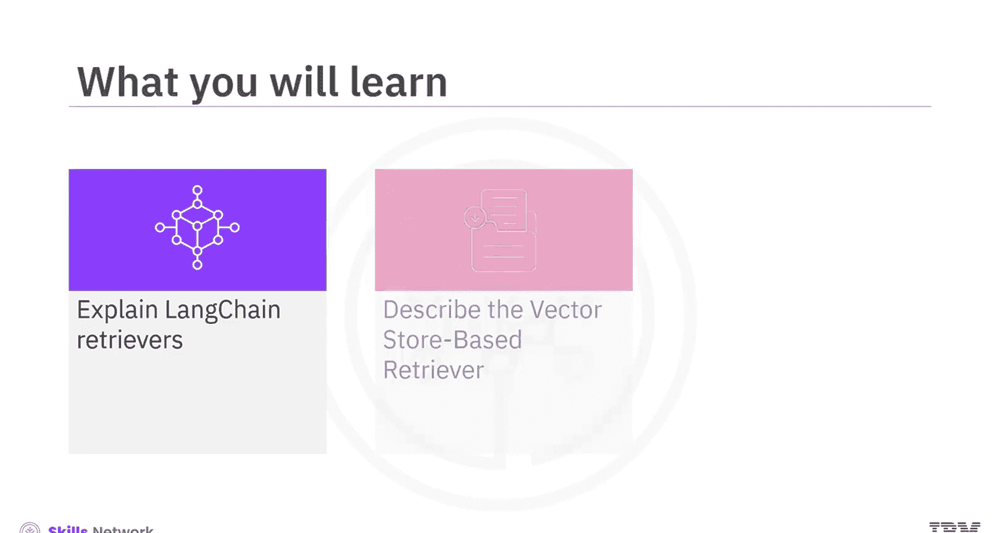
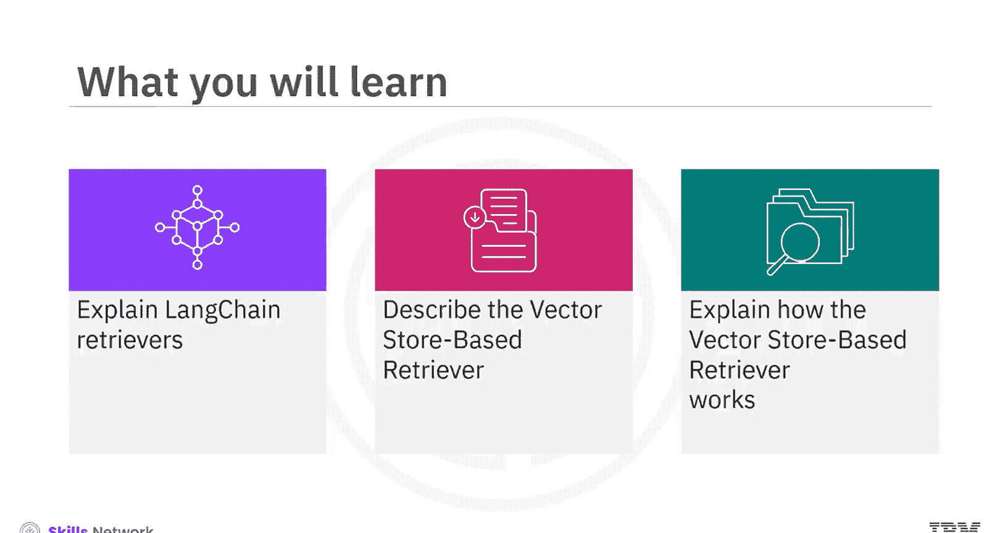
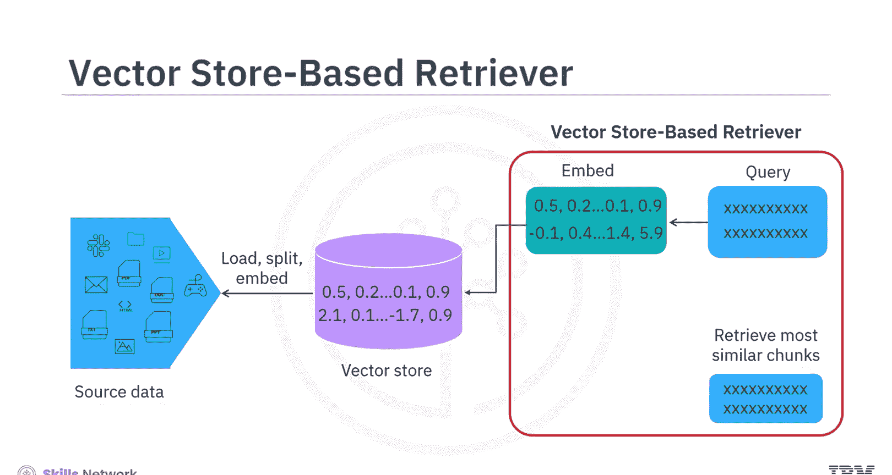
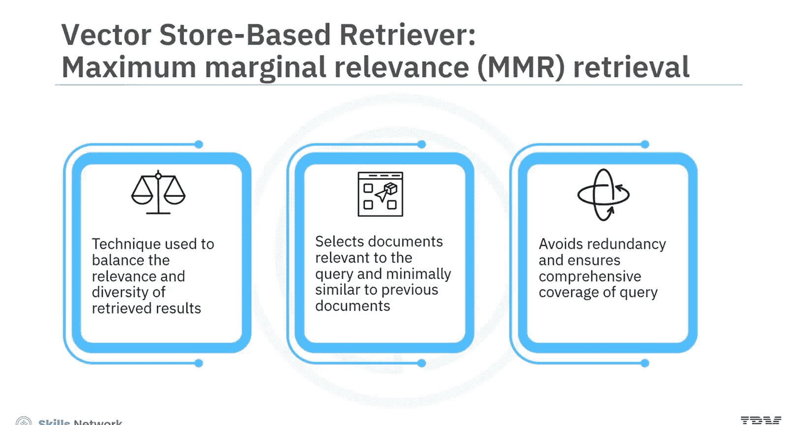
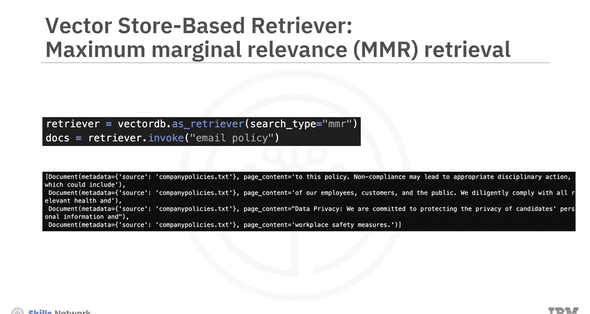
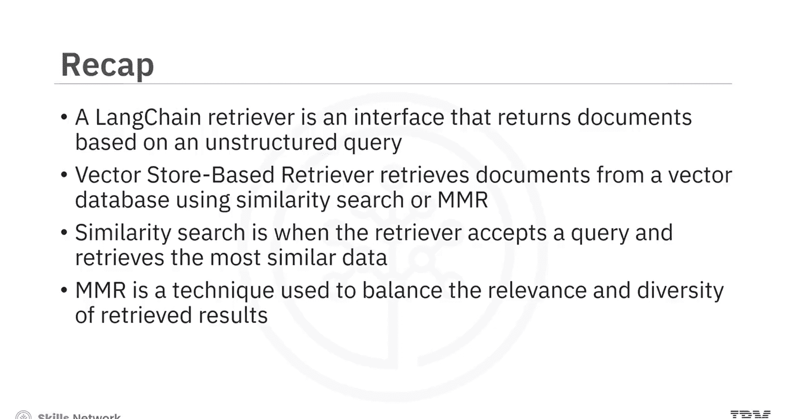

# 生成式人工智能工程：170：探索LangChain中的高级检索器（第1部分）🔍

在本节课中，我们将要学习LangChain中检索器的基本概念，并深入探讨其中一种最基础的检索器类型——基于向量存储的检索器。我们将了解它的工作原理、创建方法以及两种核心的检索策略。

---

## 什么是LangChain检索器？🤔

上一节我们介绍了课程目标，本节中我们来看看LangChain检索器的核心定义。

LangChain检索器是一个接口，它能够根据一个非结构化的查询返回相关文档。它比向量存储的概念更通用。它的主要目的不一定是存储文档，而是检索文档或其片段。

一个LangChain检索器接受一个字符串查询作为输入，并返回一个文档或文本块的列表作为输出。

虽然检索数据的过程听起来简单，但其实现可能相当复杂，存在多种可能的实现方式。

---

## 基于向量存储的检索器📚

在理解了检索器的基本定义后，本节中我们来学习最简单的一种检索器类型——基于向量存储的检索器。

这种检索器从向量数据库中检索文档。回想一下，这个向量数据库是通过加载源文档、将其分割成块并嵌入向量而创建的。基于向量存储的检索器接入这个已存在的向量存储。

它接受一个查询，并检索最相似的数据。在这个场景下，最相似的数据就是文本块。

以下是基于向量存储的检索器的工作原理：
1.  将查询文本进行向量嵌入。
2.  使用**相似性搜索**或**最大边际相关性**算法，将查询向量与向量库中所有文本块的向量进行比较。
3.  检索出最相关的文本块。

基于向量存储的检索器易于理解，因为它查询的是一个现成的向量存储，并且不需要大型语言模型来检索最相似的文本块。

---

## 检索策略：相似性搜索与MMR ⚖️

我们已经知道基于向量存储的检索器如何工作，现在具体看看它使用的两种核心检索策略。

除了使用相似性分数，你还可以使用**最大边际相关性检索**。

MMR是一种用于平衡检索结果相关性和多样性的技术。它选择那些既与查询高度相关，又彼此之间相似度最低的文档。

这种方法有助于避免冗余，并确保更全面地覆盖查询的不同方面。

在这个具体例子中，查询“邮件政策”返回了三个检索到的文档。

---

## 总结 📝

本节课中我们一起学习了LangChain检索器的基础知识。

我们了解到，LangChain检索器是一个基于非结构化查询返回文档的接口，它拥有多种类型。基于向量存储的检索器是其中一种，它从向量数据库中检索文档。

它可以直接通过向量存储对象的`.as_retriever()`方法创建，并使用相似性搜索或MMR策略进行检索。
*   **相似性搜索**：检索器接受查询并返回最相似的数据。
*   **MMR**：一种用于平衡检索结果相关性和多样性的技术。