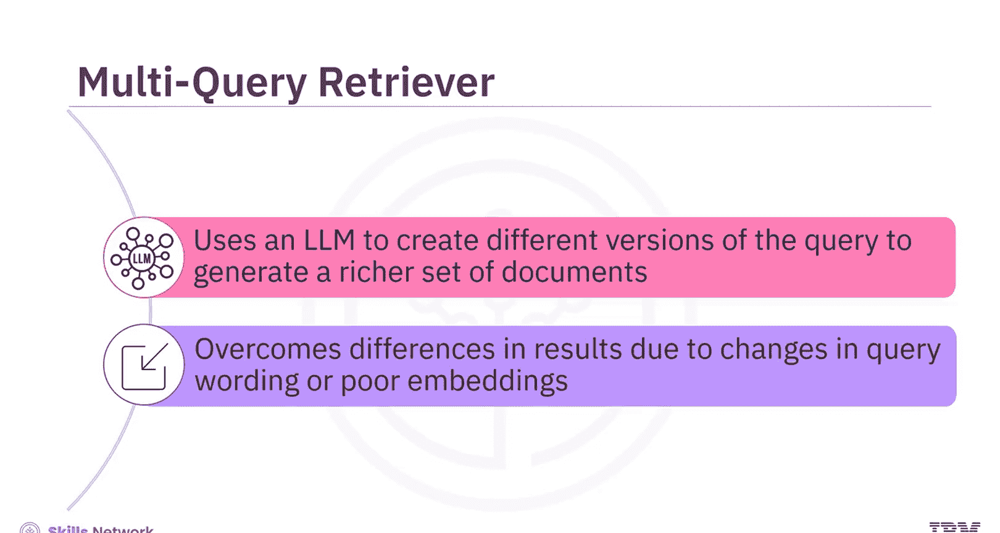
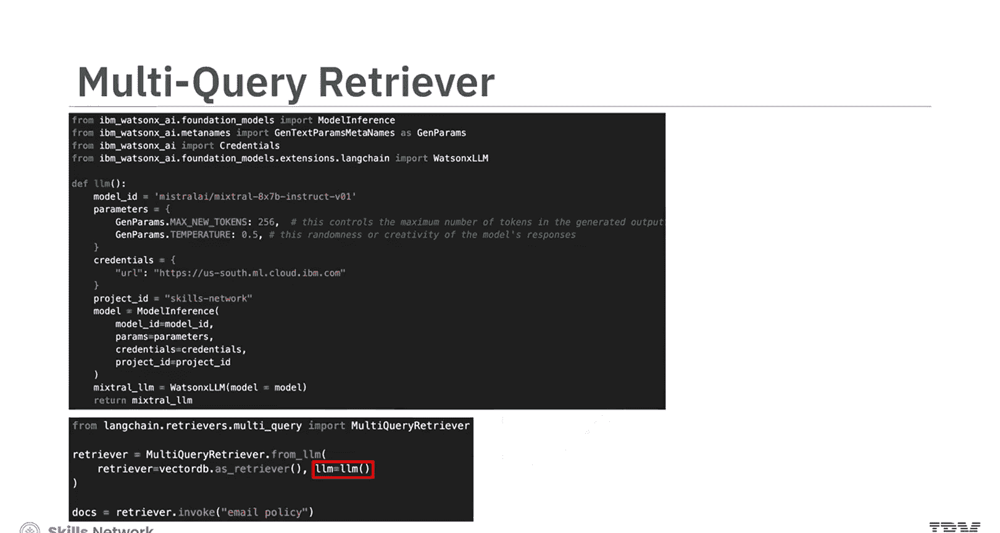
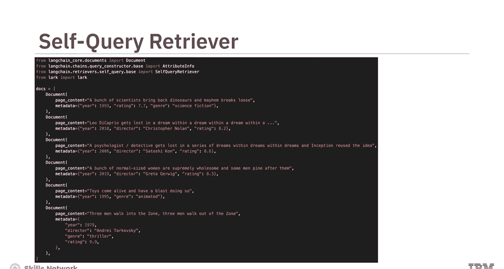
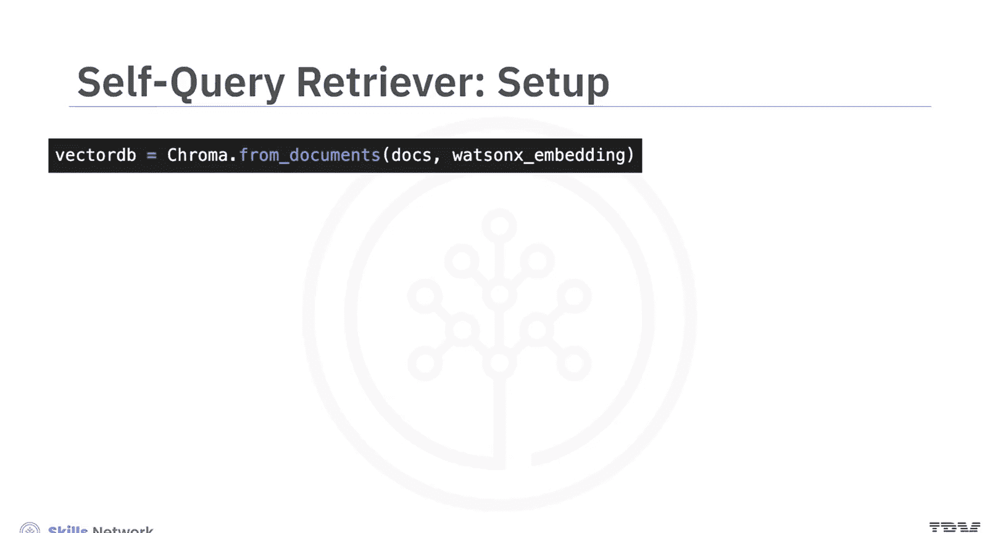
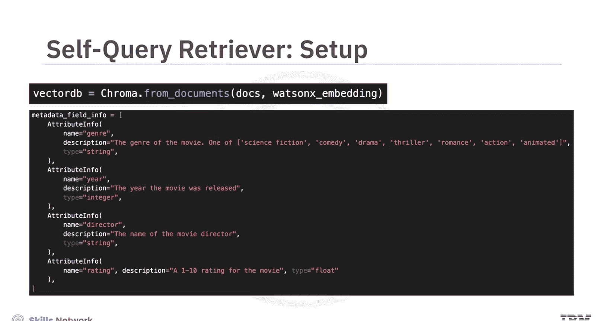
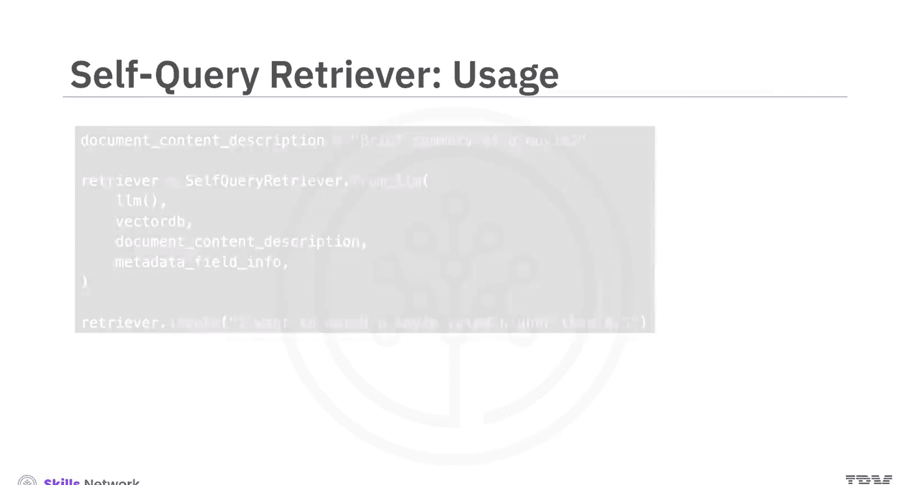
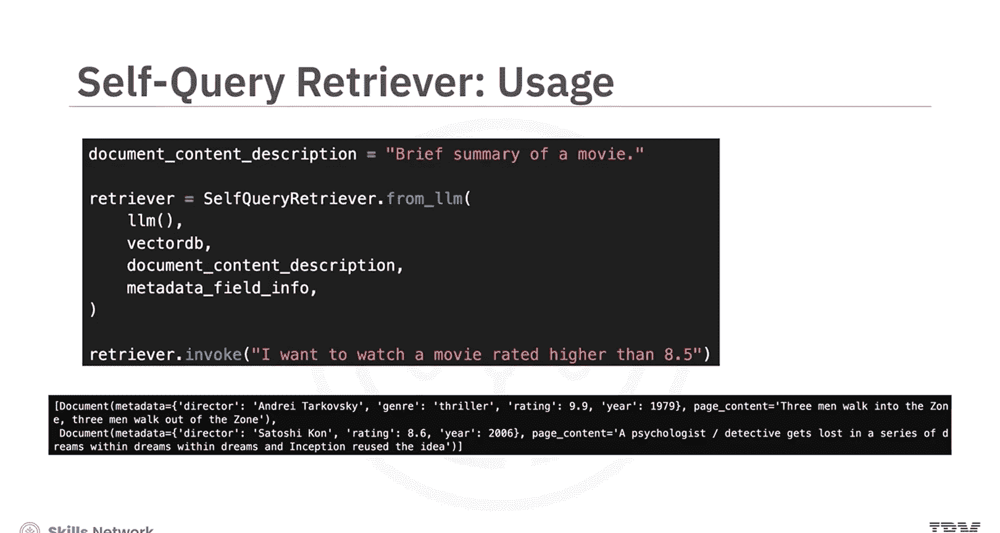
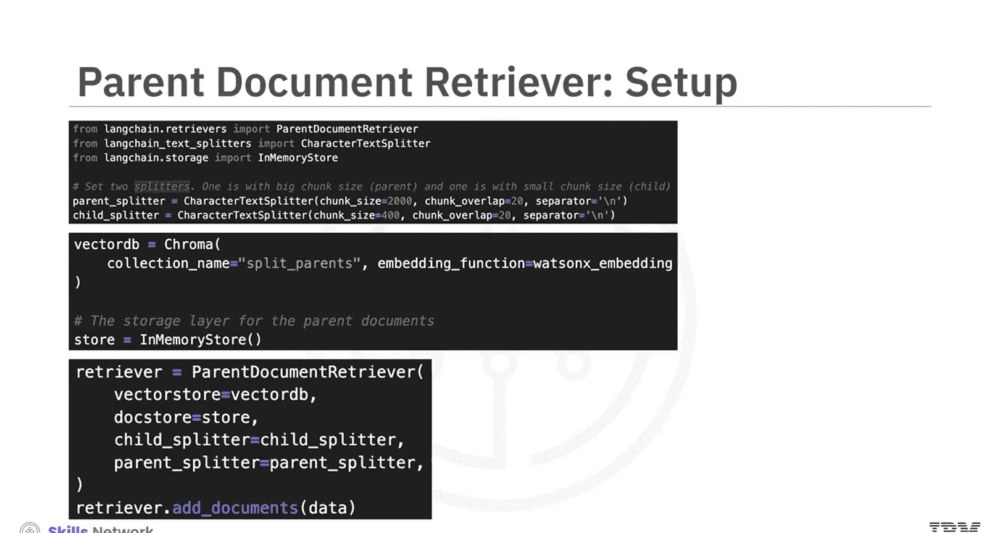

# 生成式人工智能工程：5：探索LangChain中的高级检索器（第二部分）🔍

在本节课中，我们将要学习LangChain中三种高级检索器的工作原理与应用。这些检索器能够处理更复杂的查询场景，提升信息检索的准确性和丰富度。

上一节我们介绍了基础的向量存储检索器，本节中我们来看看三种更高级的检索器：多查询检索器、自查询检索器和父文档检索器。

## 多查询检索器

多查询检索器与基于向量的检索器类似，但它使用大语言模型来生成原始查询的不同版本。这样做是为了克服因查询措辞的细微变化，或嵌入未能很好捕捉数据语义而可能导致的不同检索结果，从而生成一组更丰富的检索文档。

以下是其工作原理的图示：

在这个特定示例中，创建了一个使用 `mixtral-8x7b` 基础模型的Watson X LLM实例来生成不同的查询版本。然后使用 `MultiQueryRetriever.from_llm` 方法创建多查询检索器对象。该方法接受一个 `retriever` 参数，即用于为每个查询检索结果的基于向量的检索器。在本例中，使用的是简单的相似性搜索检索器，但也可以使用其他检索器，如MMR检索器。此外，`MultiQueryRetriever.from_llm` 方法还接受一个 `llm` 参数，该LLM用于为每个传入的查询生成替代版本。

对于每个查询，多查询检索器都会检索一组相关文档，并取所有查询结果的唯一并集，从而获得一组更大的潜在相关文档。

## 自查询检索器

现在，假设文档不仅包含文本，还包含关于这些文档的元数据。换句话说，假设你的文档如以下代码所示：

这里看到的文档包含描述电影的文本，以及一些与这些电影相关的元数据，例如电影上映年份、导演和IMDB评分。到目前为止，所看过的检索器都无法访问这些元数据，因为只考虑了文档文本。这就是自查询检索器的用武之地。自查询检索器将查询转换为两个部分：一个用于语义查找的字符串，以及一个与之配套的元数据过滤器。

让我们来设置自查询检索器。第一个单元格将刚刚看到的文档转换为可以从中检索文档的向量存储。第二个单元格描述了向量存储中文档的元数据字段。例如，`year` 属性被描述为一个指示电影上映年份的整数。

这些元数据字段描述有助于LLM创建有意义的元数据过滤器来选择相关文档。

给定此处描述的向量存储和元数据描述，可以使用 `SelfQueryRetriever.from_llm` 方法基于文本和元数据检索文档。该方法接受LLM、向量数据库、文档内容描述和元数据字段描述作为属性。

使用查询“我想看一部评分高于8.5的电影”检索文档，成功返回了两部评分大于8.5的电影。

## 父文档检索器

在为检索而分割文档时，常常存在相互冲突的需求。一方面，可能需要较小的文档，以便其嵌入能够准确反映其含义。另一方面，又需要足够长的文档，以便保留每个文本块的上下文。这就是父文档检索器的作用所在。在检索过程中，父文档检索器首先获取较小的文本块，查找它们的父ID，然后返回这些小文本块所在的大型文档。

让我们来设置父文档检索器。父文档检索器有两个文本分割器：一个父分割器，将文本分割成待检索的大块；一个子分割器，将文档分割成小块以生成有意义的嵌入。还需要一个用于嵌入的向量存储和一个用于存储父文档的存储。最后，需要创建父文档检索器对象，并使用 `add_documents` 方法将文档添加到其中。

父文档检索器可以使用与之前所见所有检索器相同的统一语法来调用。请注意，对于查询“smoking policy”，父文档检索器检索的是由父分割器生成的大块，而不是由子分割器创建的小块。

在这里，检索到的文本块正是查询所要求的“smoking policy”。

## 总结

本节课中我们一起学习了三种高级检索器。多查询检索器使用LLM创建查询的不同版本，生成一组更丰富的检索文档。自查询检索器将查询转换为两个部分：一个用于语义查找的字符串，以及一个与之配套的元数据过滤器。最后，学习了父文档检索器有两个文本分割器：一个父分割器将文本分割成待检索的大块，一个子分割器将文档分割成小块以生成有意义的嵌入。

