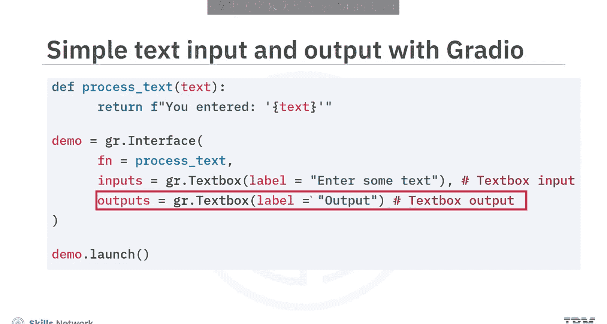
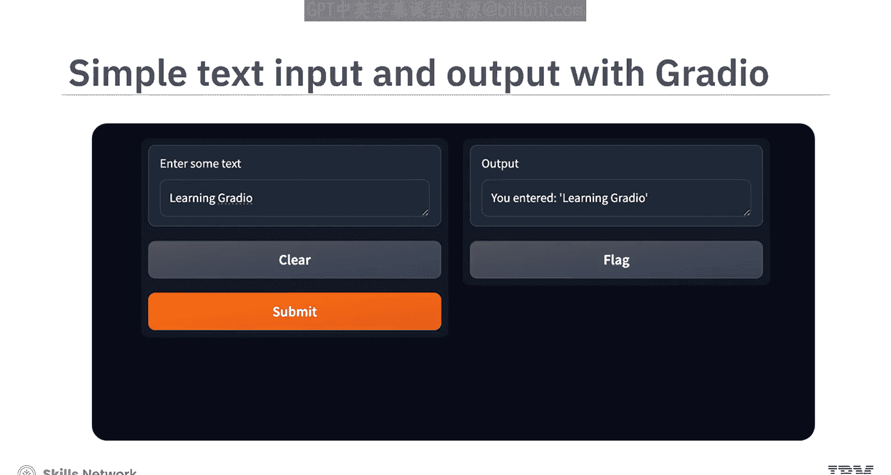
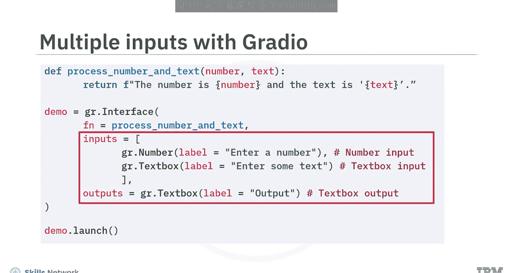
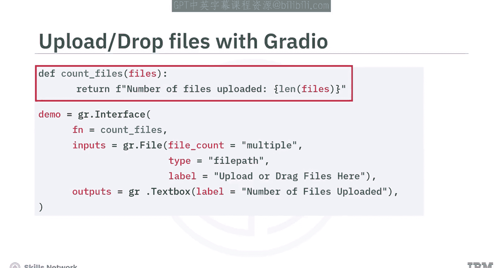
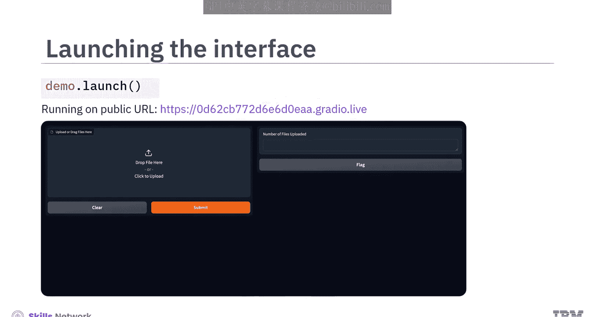
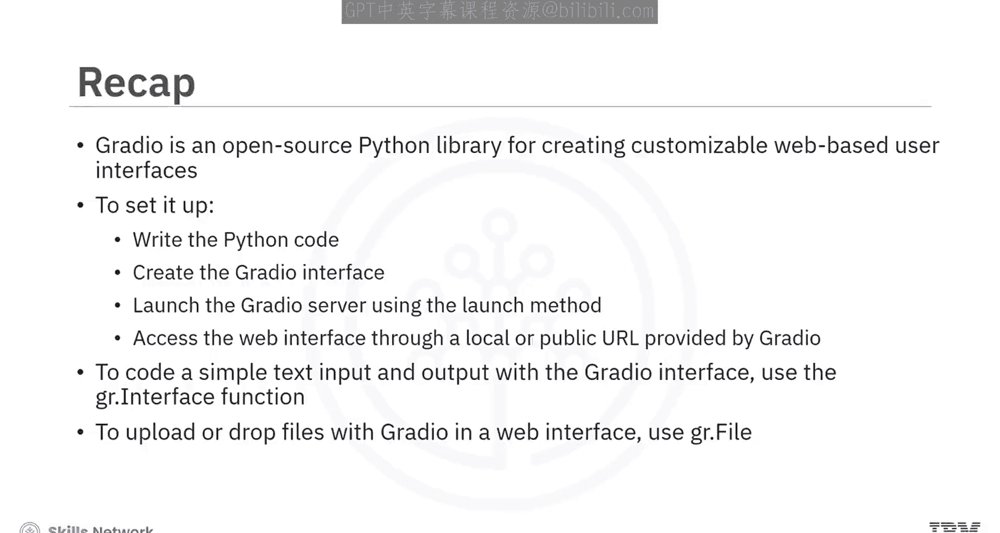

生成式人工智能工程：172：开始使用Gradio 🚀

在本节课中，我们将学习如何使用Gradio库快速为机器学习模型或Python函数创建交互式Web界面。我们将从了解Gradio是什么开始，逐步学习如何安装、构建一个简单的界面，并探索处理多种输入类型（如文本、数字和文件）的方法。

---

Gradio是一个开源的Python库，用于创建可定制的、基于Web的用户界面。它设计简单易用，特别适合用于展示机器学习模型和计算工具。

接下来，我们分步来看它的工作原理。

首先，你需要编写Python代码来定义应用程序的函数和逻辑。接着，你使用Gradio为这些函数创建一个界面。这里，你使用Gradio的`Interface`类来指定函数的输入和输出组件，然后配置界面以定义用户如何与你的应用程序交互。

下一步是使用`launch`方法启动Gradio服务器。这会在你的机器上启动一个本地服务器，为你的应用程序创建一个Web界面。

作为最后一步，你可以通过Gradio提供的本地或公共URL访问这个Web界面。用户可以与界面交互，实时提供输入并接收输出。

---

### 安装与基础设置

首先，你需要使用pip安装Gradio包。
```bash
pip install gradio
```
安装完成后，你可以在Python代码中导入Gradio。
```python
import gradio as gr
```

现在，让我们编写一个简单的Gradio界面，它包含一个文本输入字段，并将输入的文本显示为输出。

`gr.Interface`函数是Gradio库的核心组件。它用于为Python函数创建交互式Web界面，并可以自定义输入和输出组件。

接着，你定义用户输入查询后要执行的函数。你可以根据具体用例在此定义任何功能。在本例中，我们只是返回输入的文本。

`gr.Textbox`用于创建一个文本框，你还可以为文本框定义自定义标签。同样地，你可以为输出创建一个文本框。

```python
import gradio as gr

def greet(name):
    return f"Hello 数据科学与人工智能笔记（一）!"

demo = gr.Interface(
    fn=greet,
    inputs=gr.Textbox(label="Your name"),
    outputs=gr.Textbox(label="Greeting")
)

demo.launch()
```

使用`launch`方法，你可以运行这个界面。这是从上述代码中得到的Gradio界面。如图所示，这里有两个文本框，一个用于输入，另一个用于输出。



---

### 处理多种输入类型



让我们看看如何在Gradio界面中设置多个输入。

就像`gr.Textbox`用于创建文本字段一样，`gr.Number`用于创建数字字段。你可以将`gr.Number`和`gr.Textbox`作为输入列表传递。同样地，如果你想添加更多输入，可以在这里的输入列表中添加。

以下是处理文本和数字输入的示例代码：
```python
import gradio as gr

def combine_text_and_number(text, number):
    return f"Text: {text}, Number: {number}"



demo = gr.Interface(
    fn=combine_text_and_number,
    inputs=[gr.Textbox(label="Enter text"), gr.Number(label="Enter a number")],
    outputs=gr.Textbox(label="Combined Result")
)

demo.launch()
```


现在，让我们看看生成的代码输出。你可以观察到，现在有两种类型的输入：一种用于文本，另一种用于数字值。

---

### 文件上传功能

你还可以使用Gradio创建一个上传或拖放文件的选项。

以下是一个计算用户上传文件数量的代码示例。



`gr.File`允许用户在Web界面中上传文件。它支持多文件上传，并为后端函数提供上传文件的路径以供进一步处理。

接着，你定义`count_files`函数来计算用户上传的文件数量。

```python
import gradio as gr



def count_files(files):
    return len(files)

demo = gr.Interface(
    fn=count_files,
    inputs=gr.File(file_count="multiple"),
    outputs=gr.Textbox(label="Number of files")
)

demo.launch()
```

启动代码后，它会生成一个唯一的Web界面链接，在会话运行期间，可以从任何地方访问该链接。现在，你拥有了通过Web界面上传或拖放文件的选项。

---

### 总结



本节课中，我们一起学习了以下内容：
*   Gradio是一个用于创建可定制Web用户界面的开源Python库。
*   要设置它，你需要编写Python代码，创建Gradio界面，使用`launch`方法启动Gradio服务器，并通过Gradio提供的本地或公共URL访问Web界面。
*   你学会了如何使用`gr.Interface`函数编写一个简单的文本输入和输出界面。
*   最后，你学会了如何在Web界面中使用`gr.File`组件来实现文件的上传或拖放功能。