# 001：人工智能导论 🧠

在本节课中，我们将要学习人工智能的基本概念。我们将了解人工智能的定义、发展历史、学习方式以及基于其能力的分类。课程旨在为初学者提供一个清晰、全面的AI入门视角。

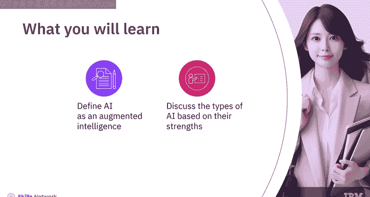

## 概述

人工智能旨在模拟人类的智能过程，通过算法和数据使机器能够执行通常需要人类智能的任务。我们将从历史脉络开始，逐步探讨其核心定义、学习机制和不同类型。

## 人工智能的历史 📜

人工智能的历史可以追溯到计算机的起源。从算盘和早期计算器时代开始，人类就一直致力于实现心智任务的自动化。

正式的旅程始于20世纪50年代，当时艾伦·图灵提出了用于测试机器智能的图灵测试，约翰·麦卡锡则创造了“人工智能”这一术语。

从20世纪60年代早期的Eliza和Shrdlu等程序，到70年代专家系统的兴起，人工智能不断进步。80年代见证了机器学习的蓬勃发展，为后续进展奠定了基础。90年代引入了神经网络，而21世纪初则标志着深度学习的崛起。

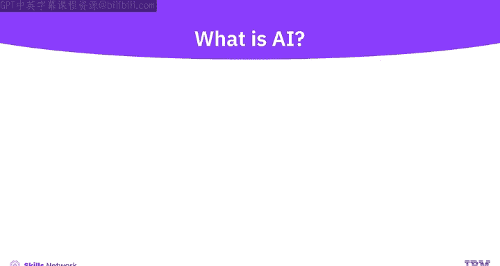

从2010年到2020年，人工智能应用扩展到各个行业，例如自然语言处理和计算机视觉。在本世纪20年代，人工智能继续快速扩张，包括深度学习模型、自主系统和医疗保健应用的进步。

## 什么是人工智能？🤔

人工智能指的是计算机系统对人类智能过程的模拟。

它涉及使用算法和数据，使机器能够执行通常需要人类智能的任务，例如学习、推理、解决问题和决策。

人工智能的范围可以从简单的自动化到复杂的深度学习和神经网络。

## 技术背景与增强智能 💻

互联网彻底改变了连接性，让我们能更快地获取更多信息。

分布式计算扩展了数据处理规模，实现了高效性。

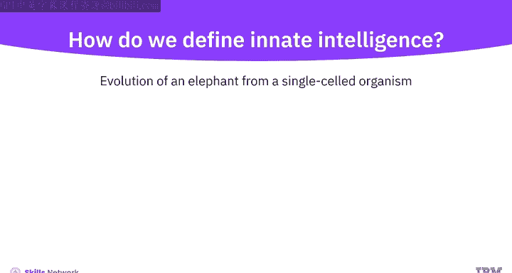

物联网普及了互联设备，生成了海量数据。

社交网络鼓励我们中的大多数人产生非结构化数据。

这些技术共同重塑了我们的数字景观，加速了信息获取和创新。

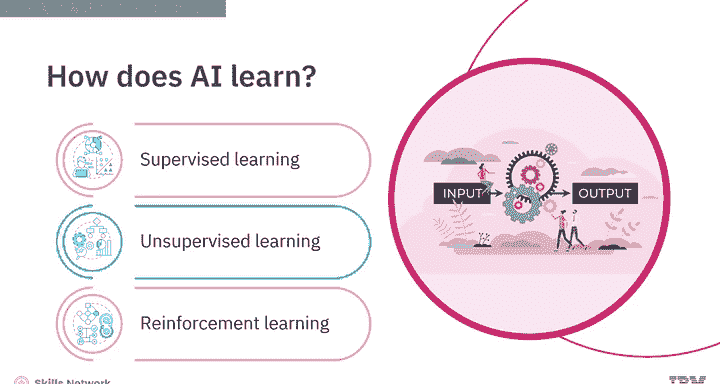

通过增强智能，领域专家所需的信息被置于他们指尖，并有证据支持，使他们能够做出明智的决策。专家被鼓励扩展他们的能力，让机器处理耗时的工作。

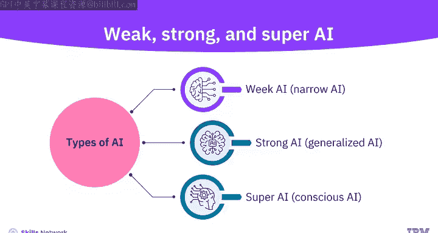

## 内在智能与人工智能学习 🧬

人类拥有内在智能，它被定义为支配我们身体每一项活动的智能。这种智能使得橡树能从一颗小种子中生长出来，也使得大象这样复杂的生物能从单细胞生物进化而来。

那么，人工智能如何学习呢？机器唯一的内在智能是我们赋予它们的。

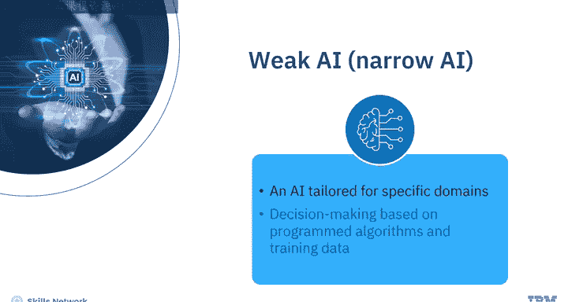

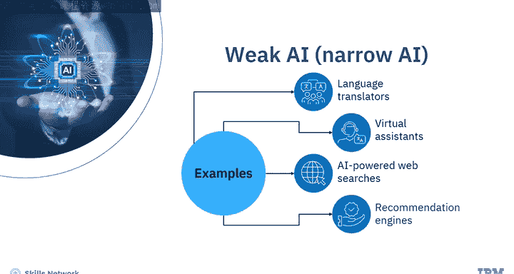

我们赋予机器检查示例并根据输入和期望输出创建机器学习模型的能力。我们通过不同的方式实现这一点，例如监督学习、无监督学习和强化学习，这些内容将在后面详细学习。

## 人工智能的分类 🗂️

人工智能可以根据其能力强度、广度及应用进行分类。

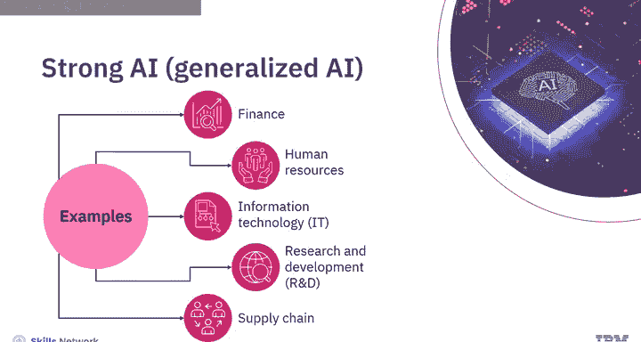

基于能力强度，人工智能可以分为三种类型：弱人工智能或狭义人工智能、强人工智能或通用人工智能，以及超级人工智能或意识人工智能。

以下是基于强度的分类详情：

*   **弱人工智能 / 狭义人工智能**：应用于特定领域的人工智能。应用型人工智能可以执行特定任务，但无法学习新任务，它根据编程算法和训练数据做出决策。例如：语言翻译器、虚拟助手、AI驱动的网络搜索、推荐引擎和智能垃圾邮件过滤器。
*   **强人工智能 / 通用人工智能**：指能够参与和执行多种不同且不相关任务的人工智能。它具备获取新技能以应对新挑战的能力，通过自主学习新方法来实现这一点。通用人工智能是多种AI策略的结合，能从经验中学习，并能达到人类水平的智能。其用例包括金融、人力资源、信息技术、研发和供应链。
*   **超级人工智能 / 意识人工智能**：将生成式人工智能的概念扩展到更高级的层次。它是一种具有人类水平意识的人工智能，这要求它具备自我意识，展现出高级认知能力并发展自己的思维能力。由于我们尚无法充分定义意识是什么，在不久的将来我们不太可能创造出有意识的人工智能。超级人工智能可能在医疗保健、自动驾驶汽车、机器人技术、自然语言理解和环境保护等领域展现出超越人类智能的能力。

## 人工智能的学科融合 📚

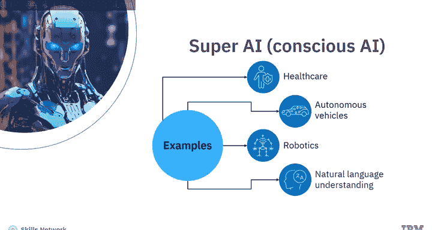

人工智能是许多研究领域的融合。计算机科学和电气工程决定了人工智能如何在软件和硬件中实现。

数学和统计学决定了可行的模型并衡量性能。

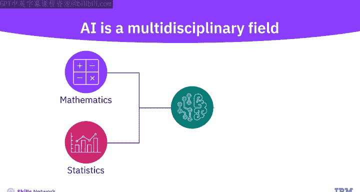

因为人工智能是基于我们认为大脑如何工作的模型，心理学和语言学在理解人工智能如何工作方面发挥着重要作用。

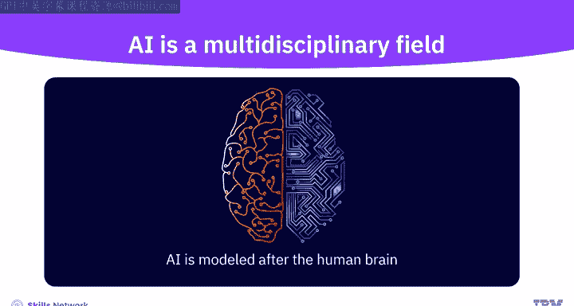

另一方面，哲学为智能和伦理考量提供了指导。

## 总结

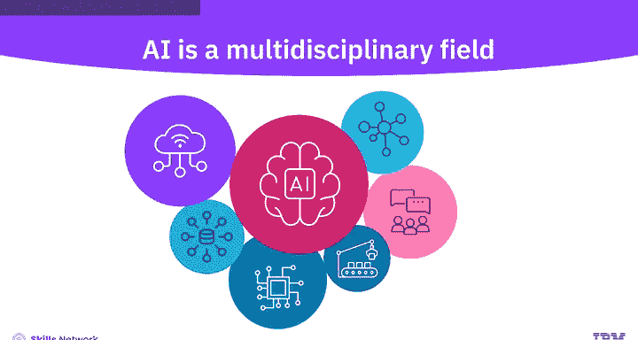

本节课中我们一起学习了人工智能的基础知识。

你学习了人工智能如何被定义为增强智能，旨在扩展人类能力，并处理超越人类和机器能力的任务。

你也了解到机器学习模型是通过监督学习、无监督学习和强化学习开发的。

最后，你学习了人工智能如何根据其能力强度进行分类。你了解了弱人工智能或狭义人工智能（为特定领域定制的人工智能）、强人工智能或通用人工智能（具备跨不相关任务的多样化能力的人工智能），以及超级人工智能或意识人工智能（具有人类水平意识的人工智能）。

虽然科幻版本的人工智能可能还是一个遥远的可能性，但我们已经看到越来越多的人工智能参与到我们日常所做的决策中。多年来，人工智能已被证明在不同领域都很有用，并以有意义的方式影响着我们的社会。