# 004：生成式AI概述和用例 🚀

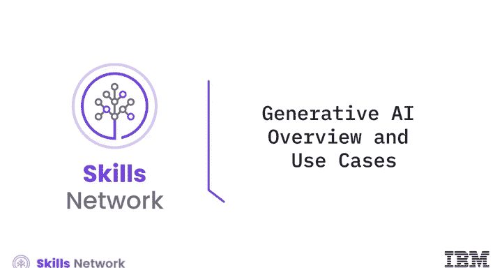

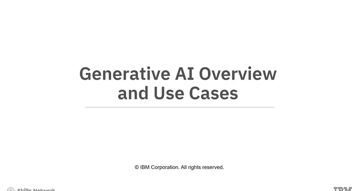

在本节课中，我们将学习生成式人工智能（Generative AI）的基本定义、其重要性以及它在不同领域的多样化应用。通过本教程，你将能够清晰地理解生成式AI的核心概念，并了解它如何改变世界。

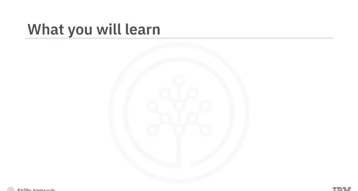

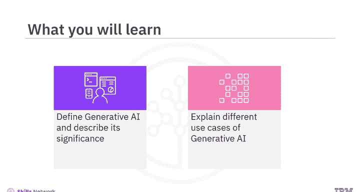

## 什么是生成式AI？🤖

上一节我们介绍了课程的整体框架，本节中我们来看看生成式AI的具体定义。

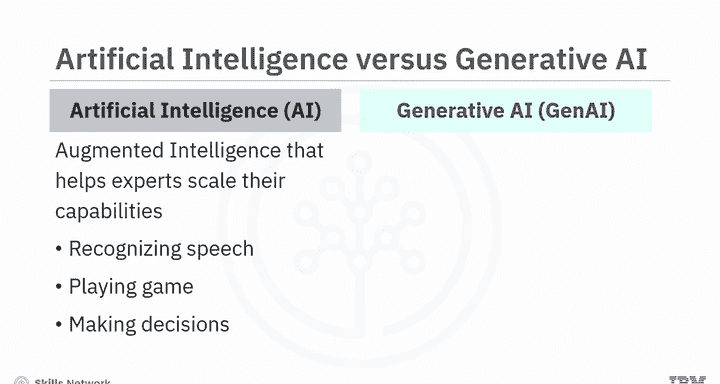

人工智能（AI）被定义为增强智能，它使专家能够扩展其能力，同时让机器处理耗时的任务，例如识别语音、玩游戏和做出决策。

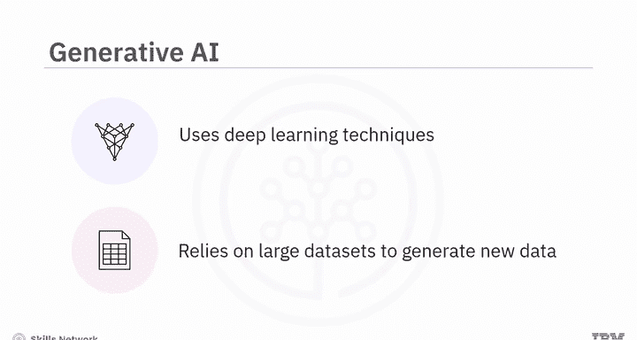

另一方面，**生成式人工智能**（Gen AI）是一种能够创造全新且独特数据的人工智能技术，其生成范围涵盖图像、音乐、文本乃至整个虚拟世界。

与传统AI模型依赖预定义规则和模式不同，**生成式AI模型使用深度学习技术，并依赖海量数据集来生成具有各种应用的全新数据**。

## 生成式AI与大语言模型（LLM）的关系 🔗

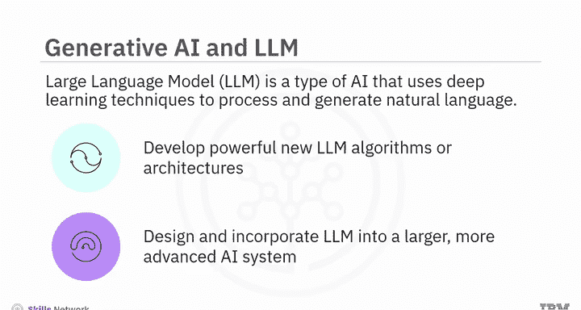

理解了生成式AI的基本定义后，我们来看看它与当前热门的大语言模型有何关联。

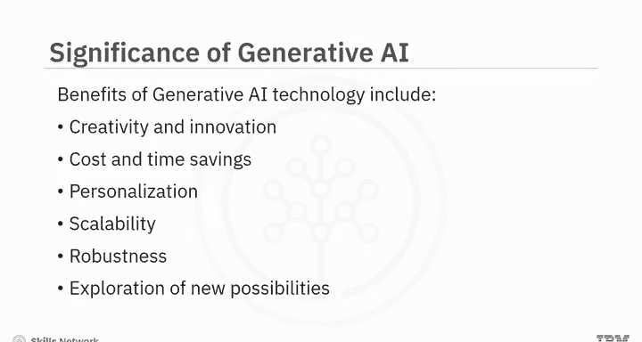

一个生成式AI模型也可以使用**大语言模型**。大语言模型是一种基于深度学习技术的人工智能，旨在处理和生成自然语言。

例如，生成式AI可以开发出更新、更强大的LLM算法和架构，从而带来更准确或更高效的自然语言处理和生成能力。

或者，生成式AI可以将LLM设计和整合到一个更大、更先进的AI系统中，以执行各种高级任务，例如决策制定、问题解决和创造性工作。

## 生成式AI的战略优势 💡

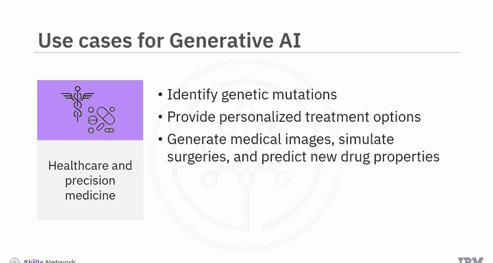

生成式AI涵盖了多种AI技术和开发AI系统的理念。尽管关于生成式AI的更多内容即将展开，但以下优势已使其成为一项战略性技术：

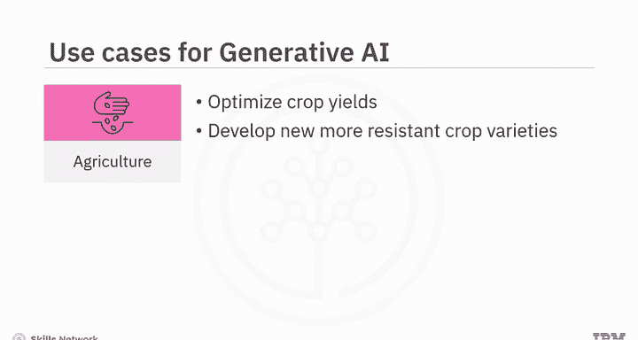

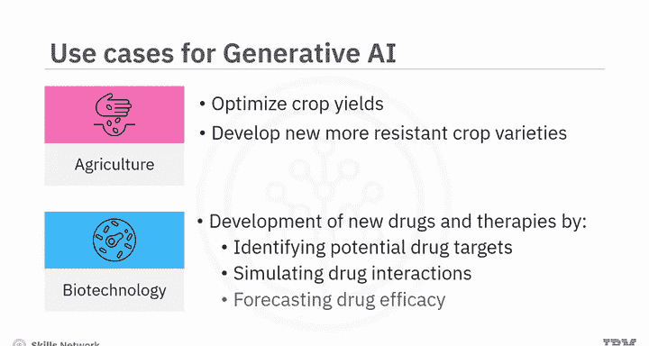

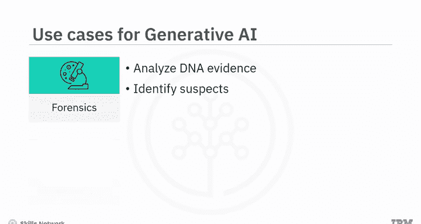

以下是生成式AI的六大核心优势：

1.  **创造与创新**：能够生成前所未有的新内容。
2.  **成本与时间节约**：自动化创造过程，提高效率。
3.  **个性化**：根据特定需求或用户偏好生成定制化内容。
4.  **可扩展性**：能够快速生成大量数据或内容。
5.  **鲁棒性**：在多样化的数据和任务中表现稳定。
6.  **探索新可能性**：开辟传统方法无法触及的新领域。

## 生成式AI的多样化用例 🌍

了解了生成式AI的优势后，本节我们将探索它在各个行业中的具体应用场景。

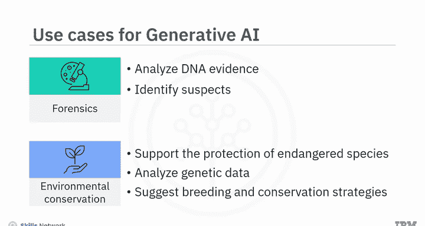

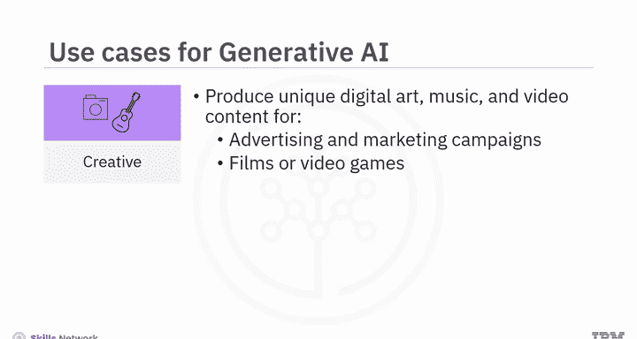

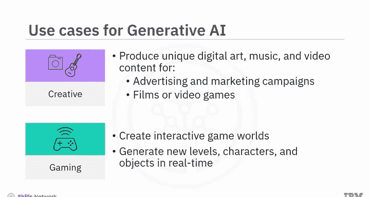

以下是生成式AI在不同领域的十个关键用例：

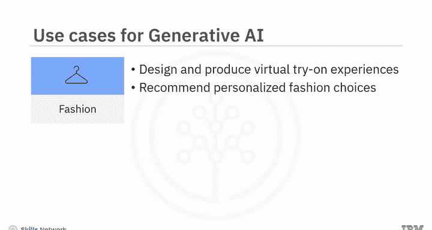

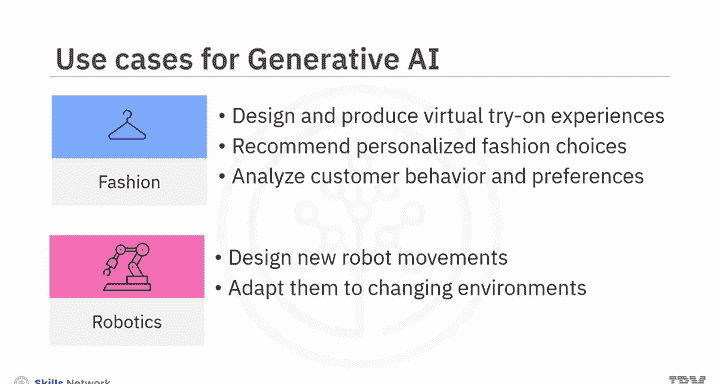

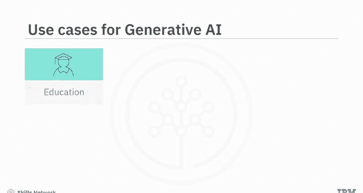

1.  **医疗保健与精准医疗**：生成式AI可以协助医生识别导致患者疾病的基因突变并提供定制化治疗方案。它还能生成医学图像、模拟手术并预测新药特性，以帮助医生练习操作和开发治疗方法。
2.  **农业**：生成式AI可以优化作物产量，并创造出能够抵御环境压力、害虫和疾病的更强健植物品种。
3.  **生物技术**：生成式AI可以通过识别潜在药物靶点、模拟药物相互作用和预测药物疗效，来帮助开发新的疗法和药物。
4.  **法医学**：生成式AI可以通过分析DNA证据和识别嫌疑犯来帮助破案。
5.  **环境保护**：生成式AI可以通过分析濒危物种的遗传数据并提出繁殖和保护策略，来支持保护濒危物种。
6.  **创意领域**：生成式AI可以为广告和营销活动创作独特的数字艺术、音乐和视频内容，并为电影或视频游戏生成配乐。
7.  **游戏**：生成式AI可以通过生成能适应玩家行为的新关卡、角色和对象，来创造交互式游戏世界。
8.  **时尚**：生成式AI可以为客户设计和提供虚拟试穿体验，并根据客户行为和偏好推荐个性化的时尚选择。
9.  **机器人技术**：生成式AI可以设计新的机器人动作并使其适应不断变化的环境，从而使它们能够执行复杂的任务。
10. **教育**：生成式AI可以创建定制的学习材料和交互式学习环境，以适应学生的学习风格和进度。
11. **数据增强**：生成式AI可以为机器学习模型生成新的训练数据，从而提高其准确性和性能。

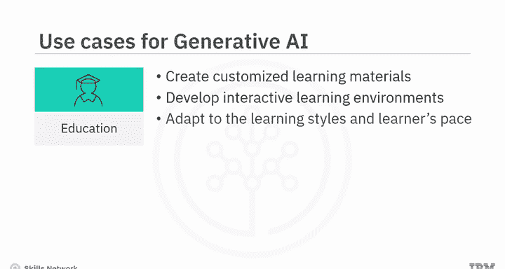

## 总结 📝

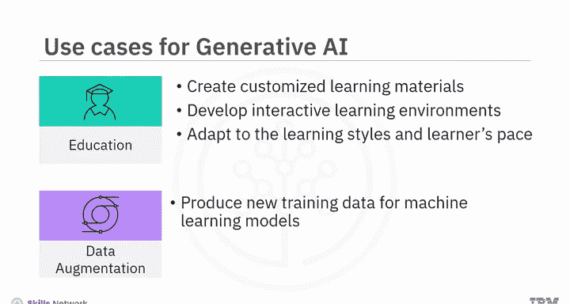

本节课中我们一起学习了生成式人工智能的核心概念。你了解到，生成式AI是一种能够创造全新且独特数据的人工智能技术。

它在创造力、成本和时间节约、个性化、可扩展性、鲁棒性以及探索新可能性方面优于传统AI模型。

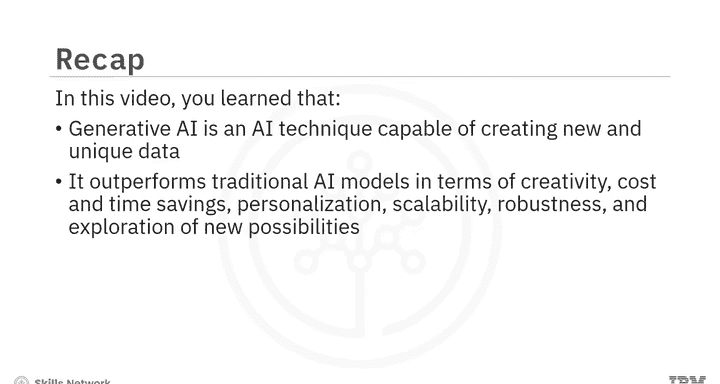

生成式AI有潜力改变各行各业并改善人们的生活，生成前所未有的数据和体验。它可以用于执行广泛的任务，其灵活性和适应性堪比人类智能。