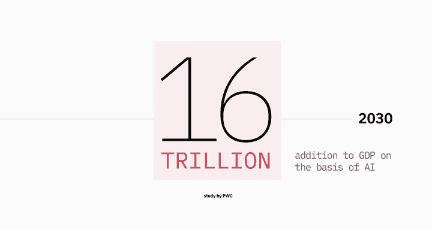
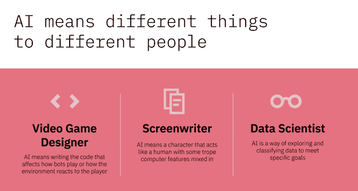
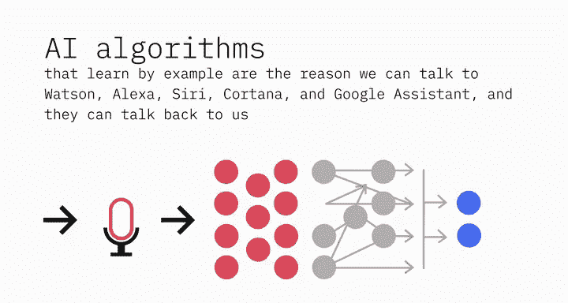
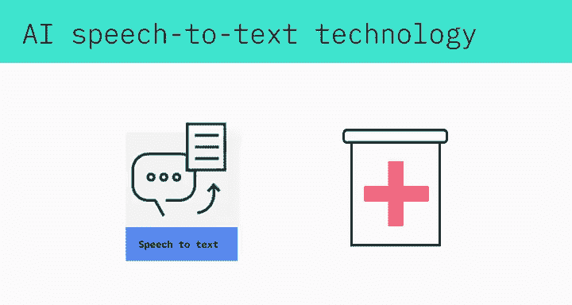
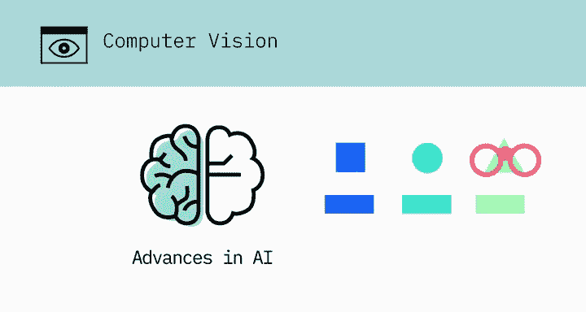
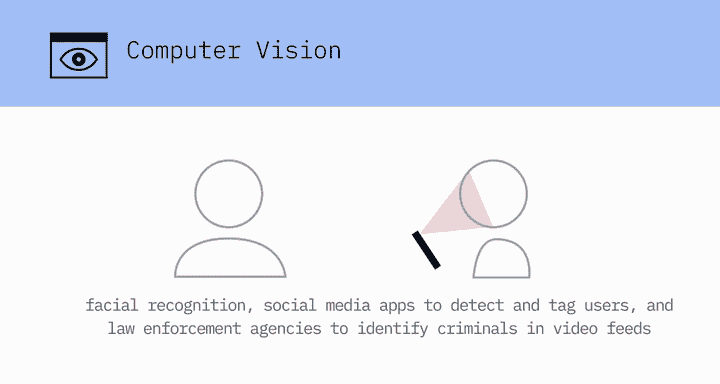
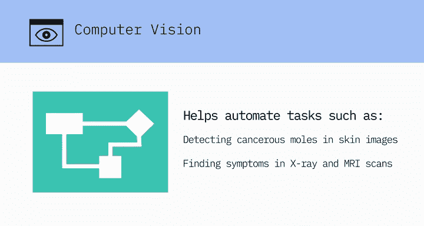
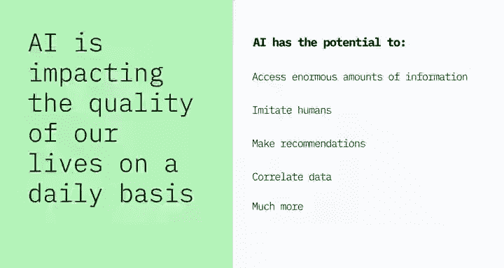

# 005：AI的影响与示例

在本节课中，我们将探讨人工智能（AI）的深远影响及其在各行各业中的具体应用示例。AI正以前所未有的规模改变世界的工作方式。

## AI的经济影响

根据普华永道的一项研究，从现在到2030年，AI将为全球GDP增加**16万亿美元**。这种规模的经济影响是前所未有的，并且其影响范围远不止于IT行业，几乎触及我们生活的每一个行业和方面。

## AI的多元定义

AI对不同的人意味着不同的事物。以下是几个例子：

*   对于视频游戏设计师，AI意味着编写影响游戏机器人行为以及环境如何对玩家做出反应的代码。
*   对于编剧，AI意味着一个行为像人类、但混合了某些计算机特征的角色。
*   对于数据科学家，AI是一种探索和分类数据以实现特定目标的方法。

## AI在自然语言处理中的应用

上一节我们看到了AI的多元定义，本节中我们来看看AI如何通过实例学习，实现与人类的自然交互。正是通过学习示例的AI算法，我们才能与Watson、Alexa、Siri、Cortana和Google Assistant等助手对话，它们也能回应我们。

AI的自然语言处理和自然语言生成能力不仅使机器和人类能够相互理解和互动，还创造了新的商业机会和方式。以下是几个应用实例：

*   **医疗保健**：由自然语言处理能力驱动的聊天机器人被用于询问患者病情并进行类似真实医生的基本诊断。
*   **教育**：它们为学生提供了易于学习的对话界面和按需在线辅导。
*   **客户服务**：客服聊天机器人通过现场解决查询来改善客户体验，并将客服人员的时间释放出来用于更有价值的对话。

## AI在语音技术中的应用

AI在语音转文本技术方面的进步，使得实时转录成为现实。语音合成的进步则是公司使用AI语音来增强客户体验并赋予其品牌独特声音的原因。

在医学领域，例如，它正在帮助患有肌萎缩侧索硬化症（卢伽雷氏病）的患者恢复他们真实的声音，而不是使用计算机合成的声音。

## AI在计算机视觉中的应用

正是由于AI的进步，计算机视觉领域才能够在与检测和标记物体相关的任务中超越人类。计算机视觉是汽车能够在街道和高速公路上行驶并避开障碍物的原因之一。

计算机视觉算法检测图像中的面部特征，并将其与面部特征数据库进行比较。这使得消费类设备能够通过面部识别验证其所有者的身份，社交媒体应用能够检测和标记用户，执法机构能够在视频流中识别罪犯。

计算机视觉算法正在帮助自动化诸如在皮肤图像中检测癌性痣、或在X光和MRI扫描中发现症状等任务。

## AI在日常生活中的广泛影响

AI正以多种方式影响我们的生活质量。我们的Netflix推荐、导航应用、拦截垃圾邮件的收件箱过滤器以及重要事件提醒中都有AI的身影。

AI在幕后工作，监控我们的投资、检测欺诈交易、识别信用卡欺诈并预防金融犯罪。

AI正以重要方式影响医疗保健，帮助医生做出更准确的初步诊断、解读医学影像、为患者寻找合适的临床试验。它不仅影响患者的治疗结果，还使运营流程成本更低。

AI有潜力访问海量信息、模仿人类（甚至是特定个体）、提出改变生活的健康和财务建议、关联可能侵犯隐私的数据等等。

## 总结

本节课中，我们一起学习了人工智能（AI）巨大的经济影响力及其在各领域的广泛应用。从自然语言处理、语音技术到计算机视觉，AI正在深刻改变医疗、教育、客户服务、日常生活乃至整个社会的运作方式。理解这些影响和示例，是进一步探索生成式AI工程世界的重要基础。