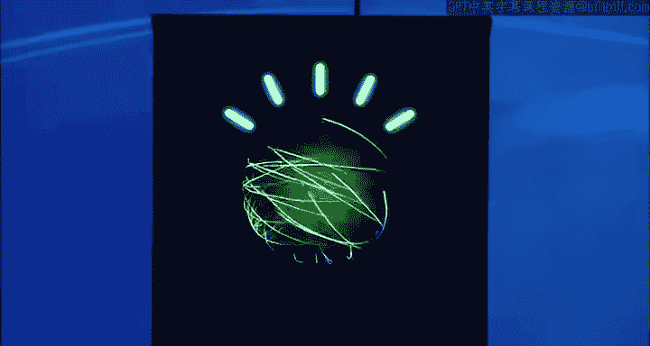
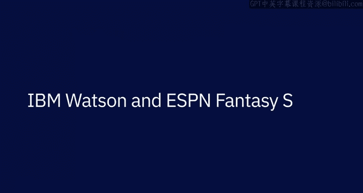

# 009：IBM的著名AI应用 🧠

在本节课中，我们将通过回顾IBM历史上几个标志性的AI应用案例，来了解人工智能技术如何从实验室走向现实世界，并解决复杂的实际问题。这些案例展示了AI在分析非结构化数据、辅助决策和增强人类能力方面的强大潜力。

## 沃森在《危险边缘》的胜利 🏆

上一节我们提到了AI的广泛潜力，本节中我们来看看一个具体的历史性时刻——IBM沃森在智力竞赛节目《危险边缘》中战胜人类冠军。

我记得那天早上去实验室时，我在想。就是今天了。这是最后一场《危险边缘》游戏。当音乐响起，约翰尼·吉尔伯特说“来自纽约约克敦高地的IBM研究院，这里是《危险边缘》”时，这一切对我来说变得真实。我只是。🎼它来了。有一天，这是所有工作的 culmination。说实话。我很激动。沃森，你是什么，你是对的，我们实际上取得了领先，我们领先于他们，但我们随后开始答错一些问题。沃森，腿是什么，不，抱歉，我不能接受那个。什么是1920年代。不，什么是脸颊。不，抱歉，布拉德，什么是班级，你答对了，沃森，什么是索伦，萨兰是对的。这使你与布拉德并列领先。

🎼第一场比赛的双倍积分环节我认为是现象级的。沃森，法国右边是小提琴，谁是教堂女士，沃森，你是什么，你是对的，凭借这个你移动到366。81。现在我们来到沃森，谁是布朗？17，973和两日总计。77。47。我们赢得了《危险边缘》。他们完全有理由为他们所做的事感到自豪。我原以为像这样的技术还要好几年才能实现，但它现在已经在这里了。我有挫败的自尊心可以证明这一点。我认为我们今天看到了重要的东西。哇，等等，这是历史。

## AI在娱乐与媒体行业的应用 🎬

在见证了沃森在知识竞赛中的突破后，我们来看看AI技术如何被应用于娱乐产业，处理海量的非结构化数据。

第60届格莱美颁奖典礼由IBM沃森提供技术支持。在格莱美周日，我们处理着数量巨大的非结构化数据。我们与录音学院的合作重点在于帮助他们优化数字制作方面的一些工作流程。我的内容团队不仅负责接收所有这些原始素材，还要对其进行策展和发布。我们谈论的是五个小时的红毯报道，有5，000名艺术家走过红毯，在过去的五个小时里拍摄了100，000张照片。沃森一直在使用AI分析每一套经过的服装的颜色、图案和轮廓。因此，我们能够看到所有的主要趋势，并将它们与以往的格莱美秀进行比较。沃森还在分析过去60年里格莱美提名歌曲歌词的情感。要知道，它实际上可以识别音乐中的情感主题，并将其分类为喜悦、悲伤以及介于两者之间的一切。这非常酷。

## AI赋能体育与商业决策 ⚽

除了娱乐业，AI在体育和商业决策领域也发挥着重要作用。以下是AI如何通过分析复杂数据来辅助决策。

梦幻体育是我们服务体育迷的一种极其重要且有趣的方式。我们的梦幻游戏极大地推动了ESPN数字平台的消费，并促进了用户收看我们的赛事和演播室节目。但我们的用户有很多不同的方式可以消磨时间，因此我们必须不断改进我们的游戏，以吸引他们选择与我们共度时光。今年，ESPN与IBM合作，为其梦幻足球平台增加了一个强大的新功能。梦幻足球产生了海量的内容，包括文章、博客、视频、播客，我们称之为非结构化数据，即那些无法整齐地放入电子表格或数据库的数据。沃森就是为了分析这类信息并将其转化为可用见解而构建的。我们使用数百万篇梦幻足球故事、博客文章和视频来训练沃森。我们教会它为数千名球员制定一个得分范围，评估他们的上升空间和下降空间。我们还教会它估算一名球员超过其上升空间或低于其下降空间的概率。沃森甚至评估球员的媒体热度及其上场可能性。这对我们的梦幻足球玩家来说是一个巨大的胜利。这是帮助他们决定每周首发哪位跑卫或四分卫的又一个工具，并且是对我们球迷所依赖的获奖分析师们的绝佳补充。与任何机器学习系统一样，该系统会变得越来越智能。这意味着见解会更好，从而我们的用户可以做出更好的决策，并有更好的机会每周赢得比赛。我们的梦幻玩家越成功，他们花在我们平台上的时间就越多。ESPN与IBM的合作是一个很好的载体，向数百万人展示了企业级AI的强大能力。不难看出，同样的技术如何应用于现实生活。有成千上万的商业场景涉及价值评估和权衡取舍。这就是未来决策的样子：人与机器协同工作，评估风险与回报，共同应对艰难的决策。IBM正是使用同样的技术来帮助医生挖掘数百万页的医学研究，并帮助投资银行发现影响市场的见解。

---

本节课中我们一起学习了IBM人工智能发展的几个关键里程碑。从沃森在《危险边缘》中战胜人类冠军，展示了其在理解和处理自然语言方面的能力；到格莱美颁奖礼上分析时尚趋势和歌曲情感，体现了AI处理多媒体和非结构化数据的潜力；再到与ESPN合作优化梦幻体育决策，揭示了AI在复杂商业场景中辅助人类进行价值评估和风险权衡的实际应用。这些案例共同描绘了一幅人机协作的未来图景，其中AI作为强大工具，帮助我们在海量信息中提取洞察，做出更明智的决策。