生成式人工智能工程：P10：生成式AI应用 🚀

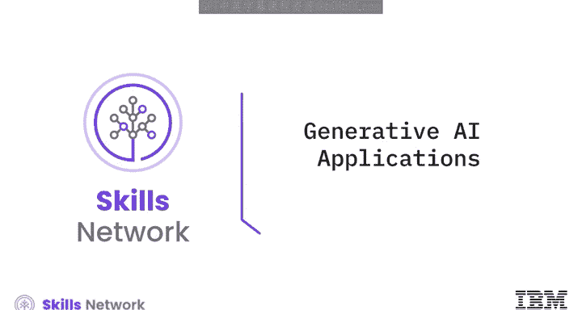

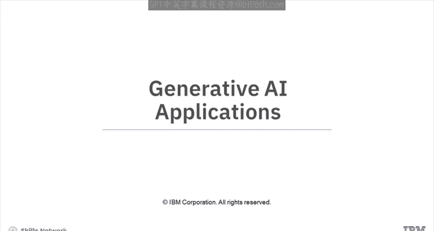

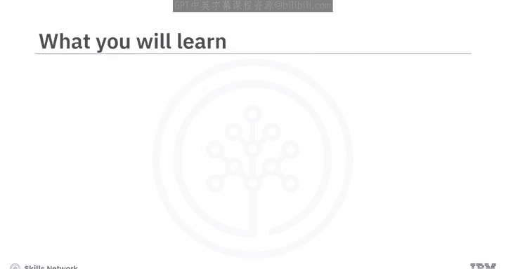

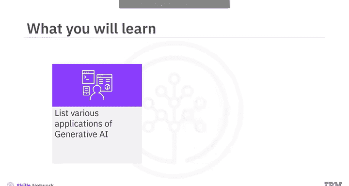

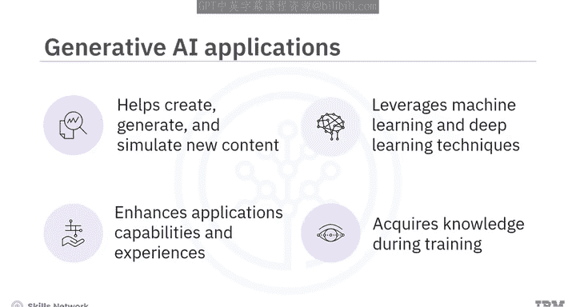

在本节课中，我们将学习生成式人工智能的各种应用，并探索每个应用的具体用途。

***

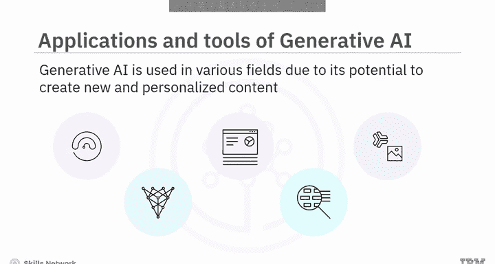

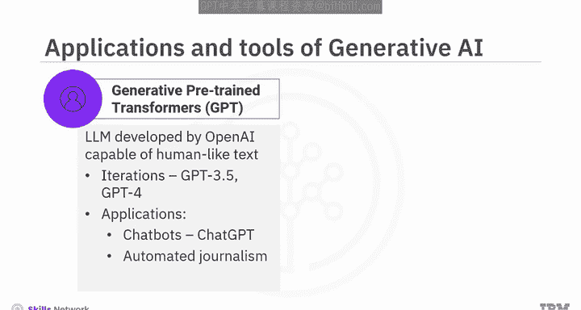

生成式人工智能已成为一项强大的技术，它使软件应用能够创建、生成和模拟新内容，从而增强其能力并提供独特的体验。与传统软件遵循预定义规则和算法不同，生成式人工智能利用机器学习和深度学习技术来学习模式，并根据其在训练中获得的知识生成原创内容。

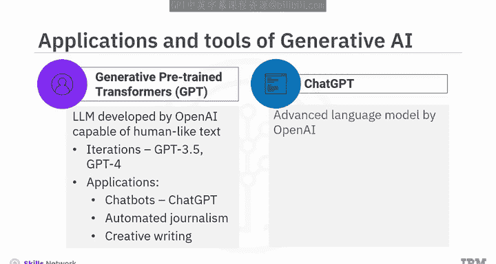

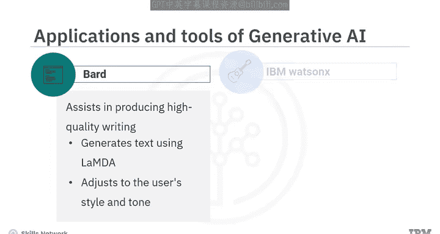

由于其能够创建前所未有的、个性化的新内容，生成式人工智能已被应用于多个领域，催生了众多引人入胜且广受欢迎的应用。

以下是生成式人工智能的一些流行应用：

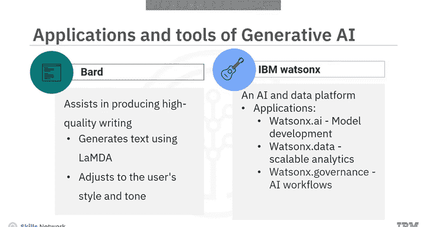

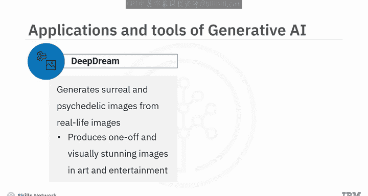

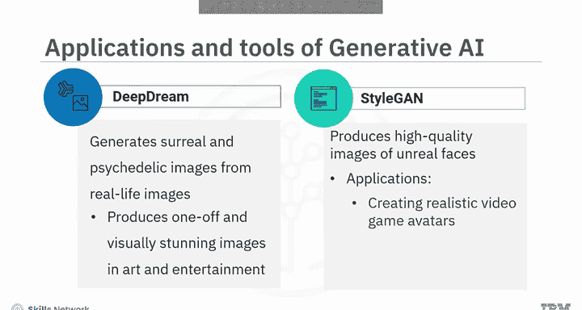

1.  **生成式预训练变换器**：这是由OpenAI开发的一系列大型语言模型，能够生成类人文本。GPT-3.5和GPT-4是该系列模型的迭代版本，更先进的模型正在开发中。其应用广泛，包括由GPT驱动的聊天机器人、自动化新闻写作，甚至创意写作。
2.  **ChatGPT**：这是OpenAI开发的聊天机器人或对话式AI工具，允许用户与底层语言模型进行基于文本的对话。该模型在多样化的互联网文本上训练，能生成类人回应，提供信息、回答问题、协助完成任务、进行创意写作，并在各种主题上提供建议。
3.  **Bard**：这是谷歌开发的AI写作助手，旨在帮助用户为电子邮件和社交媒体帖子等沟通性文档生成高质量文本。Bard使用名为LaMDA（对话应用语言模型）的大型语言模型生成文本，并能适应用户的风格和语调偏好。
4.  **Watson X**：来自IBM的AI和数据平台，包含用于模型部署的Watson X.ai、用于可扩展分析的Watson X.data，以及用于负责任AI工作流的Watson X.governance。它有助于大规模构建、部署和管理AI应用，提升AI在整个组织中的影响力。
5.  **DeepDream**：这是一种生成模型，可以从真实图像生成超现实和迷幻风格的图像。它已被用于艺术和娱乐领域，创造出一些独一无二且视觉震撼的图像。
6.  **StyleGAN**：这是一种能够生成现实中不存在的高质量人脸的生成模型。它已被用于多种应用，包括创建逼真的视频游戏头像和为医学研究模拟人脸。
7.  **AlphaFold**：这是一种可以预测蛋白质结构的生成模型。它有可能改变药物发现领域，使开发更有效的疾病治疗方法成为可能。
8.  **Magenta**：这是谷歌的一个项目，利用生成式AI创作音乐和艺术。它已产生了一些引人入胜且令人印象深刻的结果，例如由人类和AI生成的钢琴进行的二重奏。
9.  **Google AI的PaLM 2**：这是一个强大的大型语言模型，其训练数据量是前代的10倍。它在理解细微差别、生成连贯的文本和代码、翻译和回答问题方面表现出色。其持续发展有望彻底改变人机交互，提升准确性、效率、创造力和沟通能力。
10. **GitHub Copilot**：这是由OpenAI和GitHub联合开发的AI编程助手，旨在帮助开发者更高效地编写代码。它使用深度学习算法分析代码，并为开发者生成建议，例如自动补全代码片段或根据代码上下文建议函数。

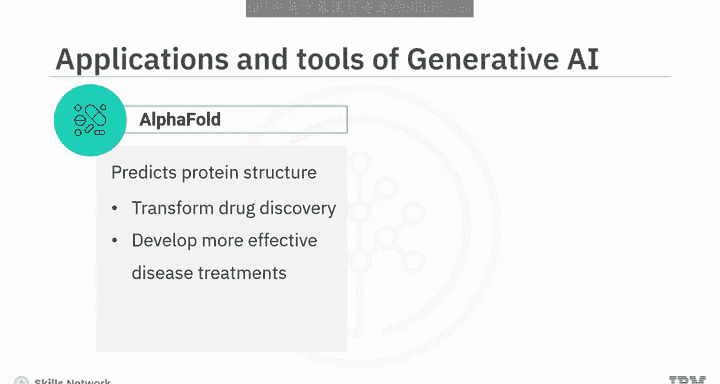

生成式人工智能是一个快速发展的领域，预计在未来几年将显著增长。尽管存在一些伦理问题，包括AI生成内容的潜在滥用以及对知识产权和版权法的影响。

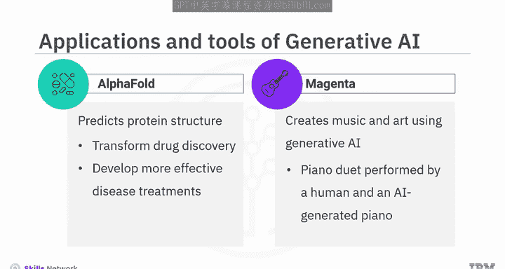

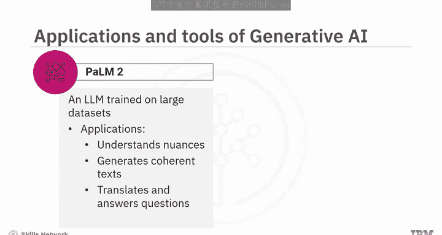

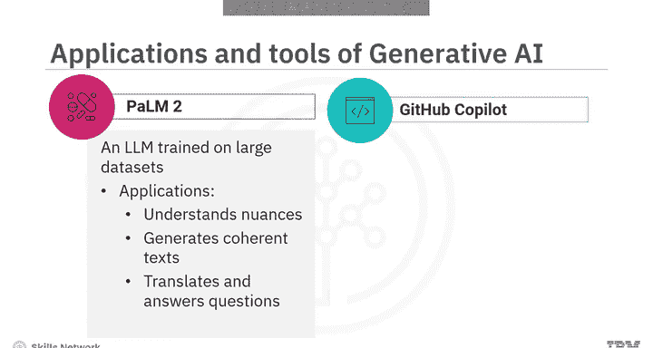

***

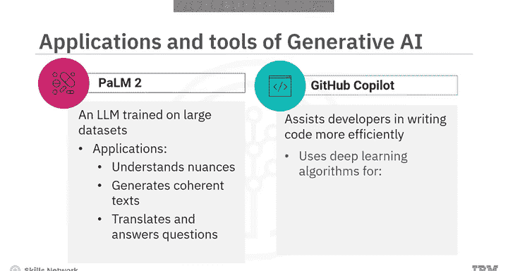

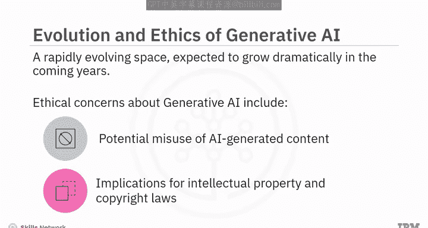

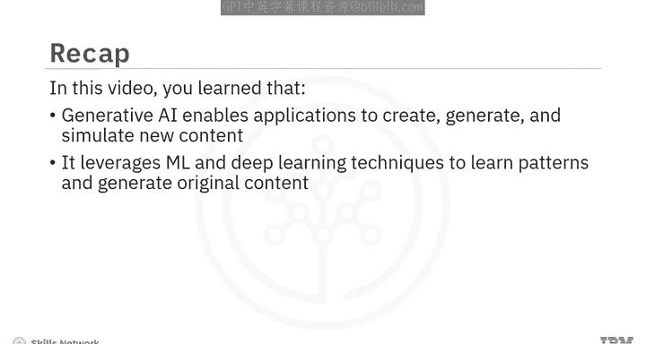

本节课中，我们一起学习了生成式人工智能使应用能够创建、生成和模拟新内容。它利用机器学习和深度学习技术来学习模式并生成原创内容。生成式AI的一些应用包括GPT-4、ChatGPT、Bard、GitHub Copilot和PaLM 2。