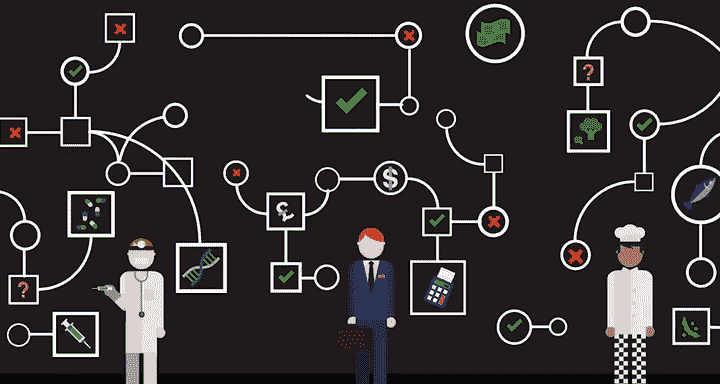
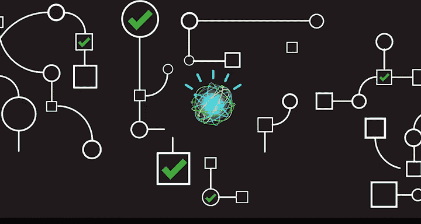
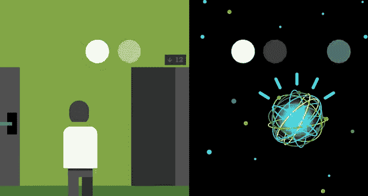
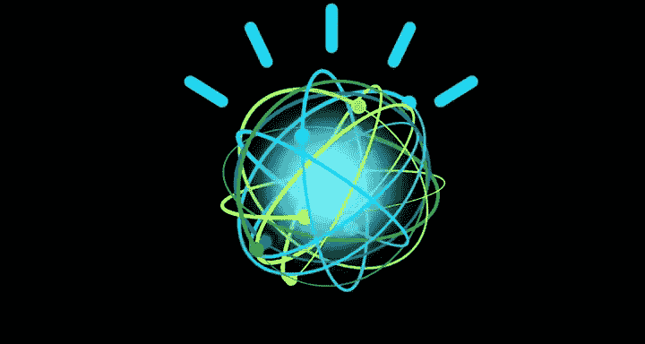

# 011：感知、学习、推理 🧠

在本节课中，我们将要学习认知计算的核心概念。认知计算是人工智能领域的前沿，它代表了一种全新的计算范式，旨在模仿人类的认知过程，如感知、学习和推理，以处理和理解海量的、非结构化的信息。

---

## 认知计算：一个新时代的计算


人工智能正处于一个新时代计算的前沿，即认知计算。这是一种根本性的新型计算，与之前的可编程系统截然不同，其差异程度堪比一个世纪前的制表机与可编程系统之间的区别。

传统的计算解决方案基于20世纪40年代衍生的数学原理，它们依据规则和逻辑进行编程，旨在通过通常遵循**刚性决策树**的方法来得出数学上精确的答案。

```python
# 传统决策树逻辑示例（伪代码）
if condition_A:
    do_X()
elif condition_B:
    do_Y()
else:
    do_Z()
```

但是，面对当今丰富的大数据和基于复杂证据进行决策的需求，这种僵化的方法常常会失效或无法跟上可用信息的步伐。

---



## 认知计算的价值与人类专长

认知计算使人们能够创造一种深刻的新型价值，即从海量数据中找出隐藏的答案和洞察。无论是医生诊断病人、财富经理为客户提供退休投资组合建议，还是厨师创造新食谱，他们都需要新的方法来处理日常接触的大量信息，并将其置于具体情境中，从而从中获取价值。

这些过程旨在增强人类的专业知识。🎼 认知计算模仿了人类专业知识的一些关键认知要素，其系统能够像人类一样对问题进行推理。

---



## 人类推理的四个关键步骤


当我们人类试图理解某事并做出决策时，会经历四个关键步骤。以下是这些步骤的详细说明：


1.  **观察**：我们观察可见的现象和证据体。
2.  **解读**：我们运用已知知识来解读所见，生成关于其含义的假设。
3.  **评估**：我们评估哪些假设是正确的或错误的。
4.  **决策**：我们选择看似最佳的行动方案并据此行动。

正如人类通过观察、评估和决策过程成为专家一样，认知系统使用类似的过程来推理它们所读取的信息，并且能够以极快的速度和巨大的规模完成这一过程。

---

## 处理结构化与非结构化数据

与传统计算解决方案不同，认知计算解决方案能够理解**非结构化数据**。传统方案通常只能处理整齐组织的**结构化数据**，例如存储在数据库中的数据。

```python
# 结构化数据示例（如数据库中的一行）
{
    "姓名": "张三",
    "年龄": 30,
    "城市": "北京"
}
```




而非结构化数据占当今数据的80%，主要包括人类为其他人类消费而产生的所有信息，例如文学、文章、研究报告、博客、帖子和推文。处理这类数据是一个巨大的挑战。


---


## 自然语言处理的挑战

结构化数据由定义明确的字段管理，包含明确指定的信息。而认知系统依赖于**自然语言**，它受语法、上下文和文化的规则支配。自然语言是隐含的、模糊的、复杂的，处理起来极具挑战性。

虽然所有人类语言都难以解析，但某些习语在英语中尤其具有挑战性。例如，我们可能会因为“下着倾盆大雨”而感到“忧郁”，同时还在填写别人要求我们填写的表格。

认知系统像人一样阅读和解释文本。它们通过语法、关系和结构上分解句子，从书面材料的语义中辨别含义。


---


## 理解上下文与持续学习

认知系统能够理解**上下文**。这与简单的语音识别非常不同，后者只是将人类语音转换为一组单词。认知系统试图理解用户语言的真实意图，并利用这种理解，通过一系列广泛的语言模型和算法进行推断。

```python
# 上下文理解示例（伪代码）
用户输入: “我觉得有点冷。”
系统理解: [用户可能希望调高室温，或需要一件外套。]
```

此外，认知系统会**学习、适应并不断变得更聪明**。它们通过从与我们的互动中，以及从自身的成功和失败中学习来做到这一点，就像人类一样。


---

## 总结



本节课中，我们一起学习了认知计算的核心概念。我们了解到，认知计算是一种模仿人类感知、学习和推理过程的新型计算范式，它能够处理和理解海量的非结构化数据，理解自然语言的上下文和真实意图，并通过持续学习不断进化。这使其在增强人类专业知识、从复杂数据中提取洞察方面具有巨大潜力。