# 012：人工智能的术语与核心概念

在本节课中，我们将学习人工智能领域的关键术语与核心概念。理解这些术语和概念是掌握人工智能技术的基础，能帮助你更好地利用AI的潜力、推动创新并在相关领域保持领先。

人工智能正在创造一个机器不仅能理解人类语言，还能预测需求、识别人脸并提供安全防护的世界。在这个AI时代，理解其语言、关键术语和相关概念至关重要。例如，自动驾驶汽车就高度依赖机器学习、深度学习、自然语言处理和计算机视觉等技术来导航并做出实时决策。理解这些关键术语，能为你提供关于这些系统如何运作、其优势与挑战的宝贵见解。

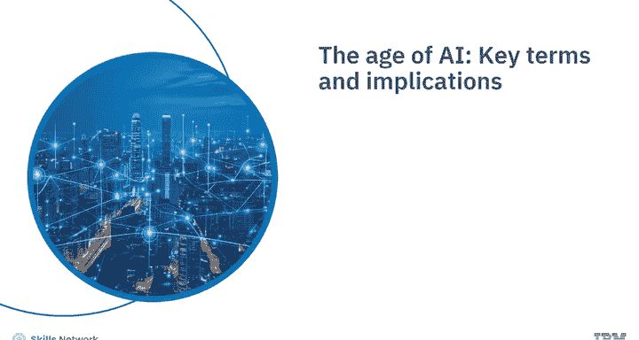

在讨论各种术语和概念之前，让我们先从理解人工智能本身开始。

## 什么是人工智能？🤖

人工智能是计算机科学的一个分支，专注于创建能够执行通常需要人类智能才能完成任务的系统。

AI系统通常会展现出与人类智能相关的行为，例如：
*   **规划**
*   **学习**
*   **推理**
*   **解决问题**
*   **知识表示**
*   **感知**
*   **运动与操控**
*   **社交智能**
*   **创造力**

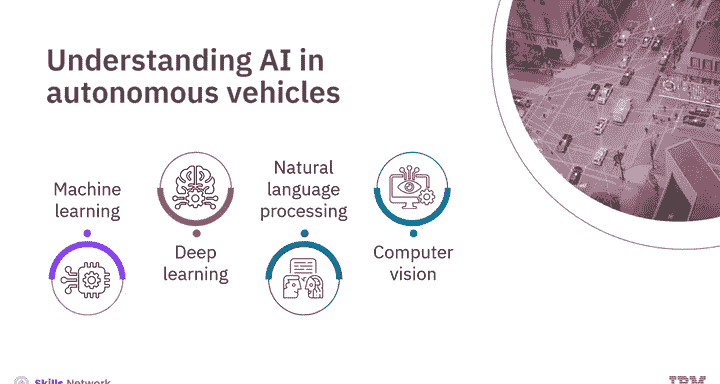

人工智能主要分为三类：
1.  **狭义人工智能**：也称为弱人工智能，专注于执行特定任务。
2.  **通用人工智能**：也称为强人工智能，具备类人的认知技能，能够跨多种任务进行学习和适应。
3.  **超级人工智能**：旨在超越人类智能，目前仍处于理论阶段，尚未实现。

## 什么是机器学习？🧠

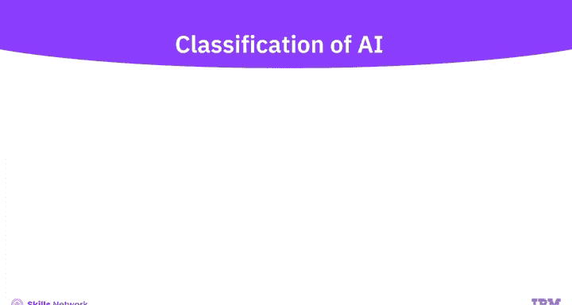

理解了人工智能的基本概念后，让我们深入探讨机器学习。

机器学习是人工智能的一个子集，它使用计算机算法分析数据，并根据学习到的内容做出智能决策，而无需进行显式编程。

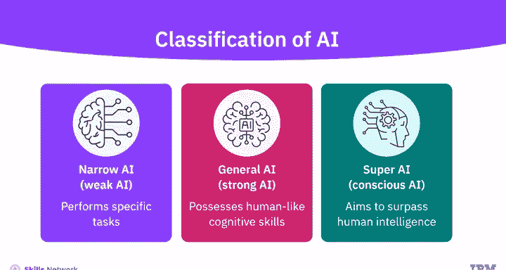

机器学习算法使用大型数据集进行训练，并从示例中学习。它们不遵循基于规则的算法。机器学习使机器能够自主解决问题，并利用提供的数据做出准确的预测。

## 什么是深度学习？🔍

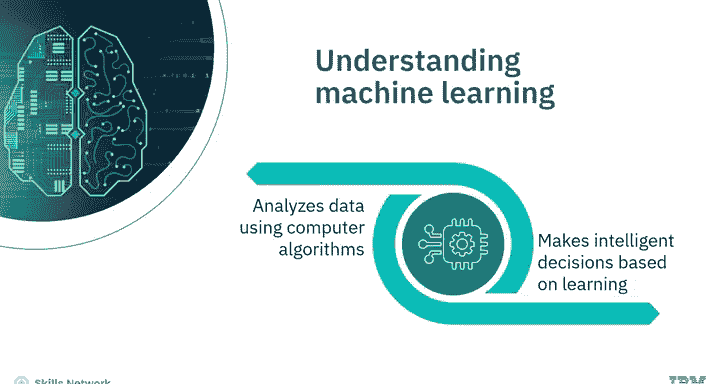

接下来，让我们讨论深度学习。

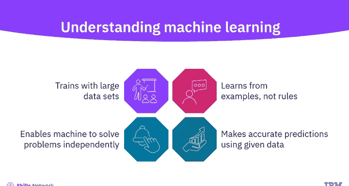

深度学习是一个重要的概念，也是机器学习的一个专门子集。它使用多层神经网络（称为深度神经网络）来分析复杂数据并模拟人类的决策过程。

深度学习算法能够标记和分类信息，并识别数据中的复杂模式。它使AI系统能够通过评估决策的正确性来持续学习，并提高结果的质量和准确性。

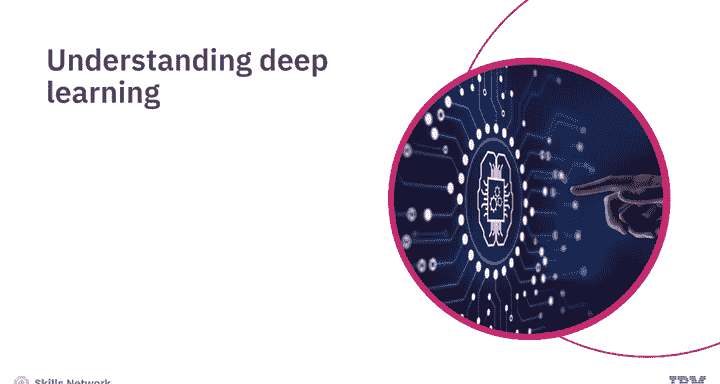

## 什么是神经网络？⚙️

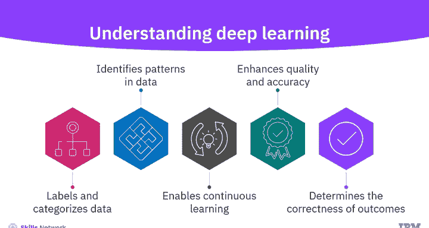

另一个重要概念是神经网络，这是一种受人类大脑神经结构启发的计算模型。

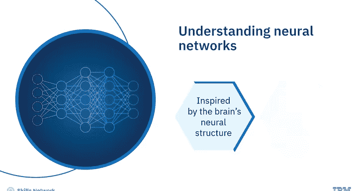

神经网络由相互连接的节点（或称神经元）组成，通常包含三层：
1.  **输入层**：接收并处理原始数据。
2.  **隐藏层**：执行复杂的计算并转换数据。
3.  **输出层**：将处理后的数据转换为输出格式，产生最终结果。

---

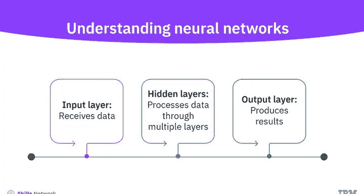

本节课中，我们一起学习了人工智能如何模拟人类智能，并将其分为三类：用于特定任务的弱人工智能、具备类人认知能力的强人工智能，以及旨在超越人类智能的超级人工智能。

我们还学习了机器学习作为AI的子集，如何使用算法分析数据、无需显式编程即可做出决策，并实现自主解决问题。

此外，我们了解到深度学习使用具有多层的神经网络来分析复杂数据。

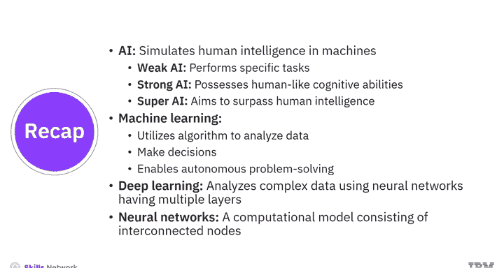

最后，我们学习了神经网络这一由三层互连节点组成的计算模型。掌握这些核心概念，是您进一步探索生成式人工智能世界的坚实第一步。