# 013：术语和相关概念 🔍

在本节课中，我们将学习人工智能领域几个核心且容易混淆的术语和概念，包括人工智能、机器学习、深度学习、神经网络以及数据科学。理解它们之间的区别与联系，是深入学习AI技术的基础。

在深入探讨AI的工作原理及其各种应用之前，我们首先需要区分几个密切相关的术语和概念：人工智能、机器学习、深度学习以及神经网络。这些术语有时会被混用，但它们所指的并非同一事物。

## 人工智能 (AI) 🤖

人工智能是计算机科学的一个分支，致力于模拟智能行为。AI系统通常会展现出与人类智能相关的行为，例如规划、学习、推理、解决问题、知识表示、感知、运动与操控，以及（在较小程度上）社交智能和创造力。

## 机器学习 (ML) 📊

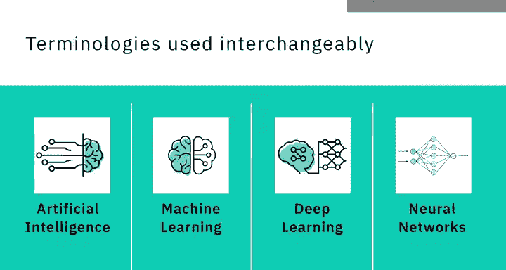

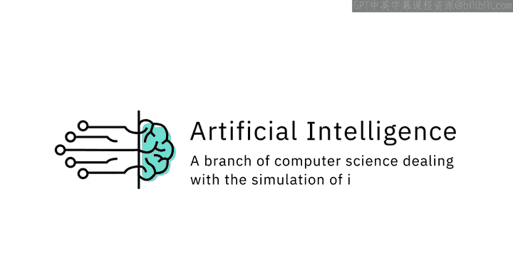

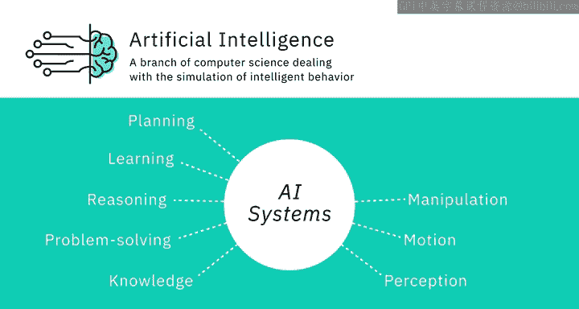

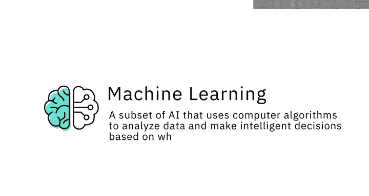

机器学习是人工智能的一个子集，它使用计算机算法分析数据，并根据学习到的内容做出智能决策，而无需进行显式编程。机器学习算法使用大型数据集进行训练，它们从示例中学习，不遵循基于规则的算法。

以下是机器学习的一个核心特点：
*   **数据驱动学习**：算法通过分析大量数据来学习模式，而非依赖硬编码的指令。

机器学习使机器能够自主解决问题，并利用提供的数据做出准确的预测。

## 深度学习 (DL) 🧠

深度学习是机器学习的一个专门子集，它使用分层的神经网络来模拟人类的决策过程。深度学习算法能够对信息进行标记、分类并识别模式。正是深度学习使得AI系统能够在工作中持续学习，并通过判断决策是否正确来提高结果的质量和准确性。

## 神经网络 (NN) ⚡

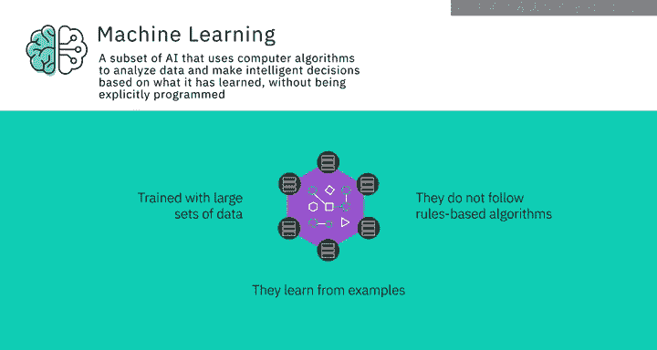

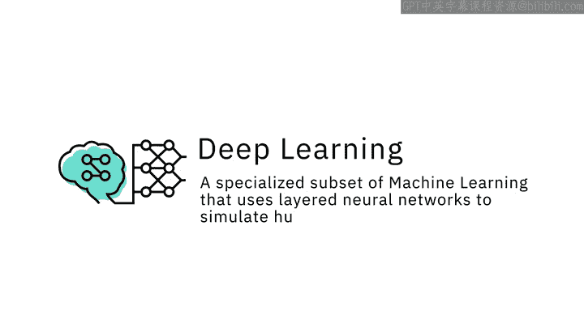

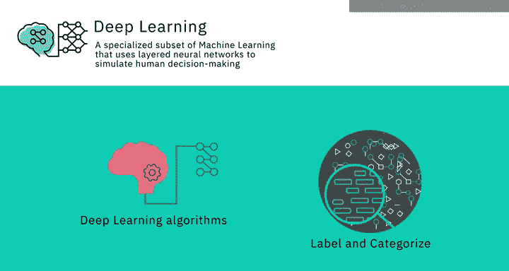

人工神经网络（通常简称为神经网络）的灵感来源于生物神经网络，尽管其工作方式有很大不同。AI中的神经网络是由称为“神经元”的小型计算单元组成的集合，这些单元接收输入数据，并随着时间学习如何做出决策。

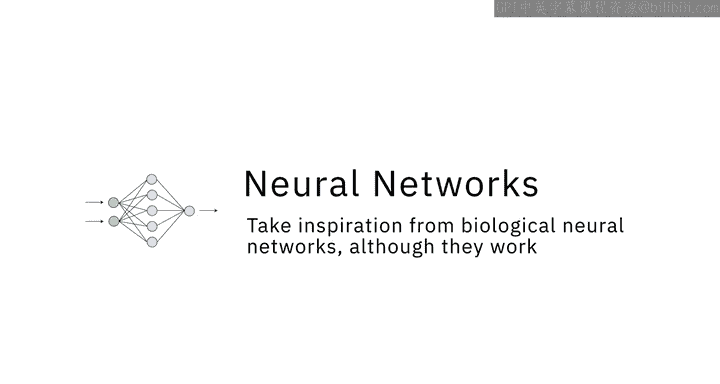

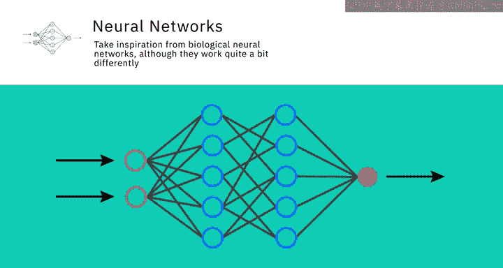

神经网络通常是深度分层的，这也是深度学习算法随着数据集规模增大而效率提升的原因。相比之下，其他一些机器学习算法在数据量增加时性能可能会达到瓶颈。

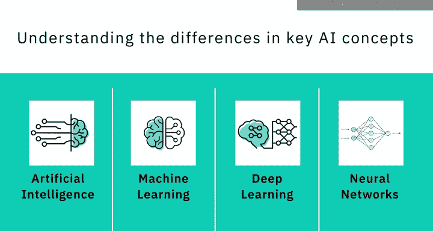

## 人工智能与数据科学 📈

现在你已经对几个关键AI概念之间的区别有了大致了解，还有一个重要的区分需要理解，那就是人工智能与数据科学之间的区别。

数据科学是从大量不同数据中提取知识和见解的过程与方法。它是一个跨学科领域，涉及数学、统计分析、数据可视化、机器学习等。数据科学使我们能够处理信息、从海量数据中看到模式、发现意义，并利用这些来做出驱动业务的决策。

数据科学可以使用许多AI技术从数据中获取洞察。例如，它可以使用机器学习算法甚至深度学习模型来从数据中提取意义并得出结论。人工智能和数据科学之间存在一些交叉，但两者并非子集关系。更准确地说，数据科学是一个涵盖整个数据处理方法的广义术语，而人工智能则包含了让计算机学习如何解决问题和做出智能决策的一切技术。人工智能和数据科学都可能涉及使用大数据，即体量巨大的数据集。

在接下来的几节课中，我们将更详细地讨论机器学习、深度学习和神经网络这些术语。

## 总结 📝

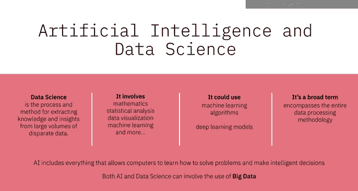

本节课中，我们一起学习了人工智能领域的核心术语。我们明确了**人工智能 (AI)** 是模拟智能行为的广阔领域，**机器学习 (ML)** 是其子集，专注于让机器从数据中学习。**深度学习 (DL)** 是机器学习的一个分支，利用深层**神经网络 (NN)** 进行复杂决策。最后，我们区分了**数据科学**，它是一个更广泛的数据处理和分析领域，与AI有交集但各有侧重。理解这些概念的区别是构建AI知识体系的重要第一步。