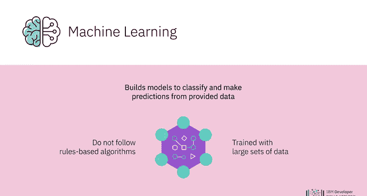
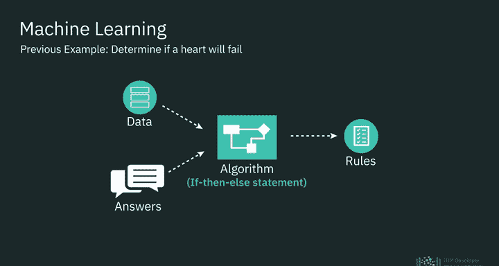
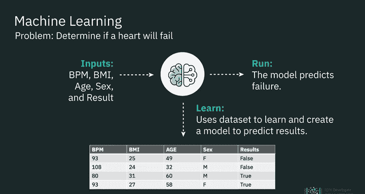
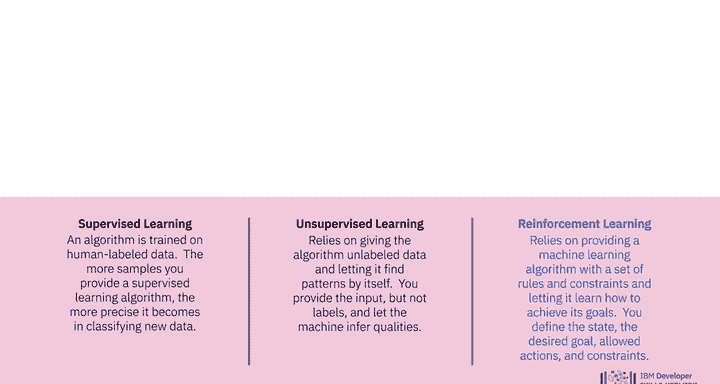
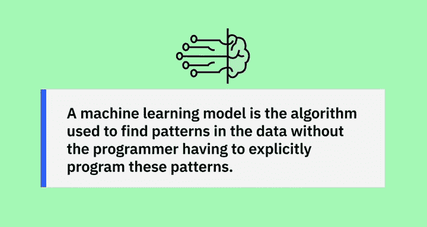

# 014：机器学习 🧠

在本节课中，我们将要学习机器学习的核心概念。机器学习是人工智能的一个子集，它使用计算机算法分析数据，并根据学习到的知识做出智能决策，而不是遵循基于规则的算法。机器学习通过构建模型来对数据进行分类和预测。

## 什么是机器学习？

上一节我们介绍了机器学习的定义，本节中我们来看看一个具体的例子，以理解机器学习如何解决问题。

假设我们想要判断一颗心脏是否会衰竭。这是一个可以用机器学习解决的问题。例如，我们拥有以下数据：每分钟心跳次数、身体质量指数、年龄、性别，以及心脏是否衰竭的结果。利用机器学习，我们可以基于这些数据学习并创建一个模型，该模型在给定输入时能够预测结果。

那么，这与使用统计分析创建算法有何不同？算法是一种数学技术。在传统编程中，我们获取数据和规则，并用它们来开发一个能给出答案的算法。

## 机器学习与传统编程的区别

在刚才的心脏衰竭例子中，如果使用传统算法，我们会利用每分钟心跳次数和身体质量指数等数据来创建一个判断心脏是否会衰竭的算法。本质上，这将是一个 `if-then-else` 语句。当我们提交输入时，会根据我们确定的算法得到答案，而这个算法本身不会改变。

相比之下，机器学习则使用数据和答案来创建算法。我们最终得到的不是答案，而是一套决定机器学习模型形态的规则。模型在获得输入时，会自行确定规则和 `if-then-else` 逻辑。本质上，模型所做的是确定传统算法中的参数。我们不是武断地决定“每分钟心跳次数 + 身体质量指数 = 某个结果”，而是使用模型来确定逻辑是什么。

与传统算法不同，这个模型可以持续训练，并在未来用于预测数值。机器学习通过检查和比较大型数据集来定义行为规则，从而发现共同模式。

## 机器学习的类型

机器学习主要依赖几种不同的学习范式。以下是三种主要的机器学习类型：

### 监督学习

例如，我们可以向机器学习程序提供大量鸟类图片，并训练模型在提供鸟类图片时返回“鸟”的标签。我们也可以为“猫”创建标签，并提供猫的图片进行训练。当机器学习模型看到猫或鸟的图片时，它会以一定的置信度给图片贴上标签。这种类型的机器学习被称为**监督学习**，即算法在人类标记的数据上进行训练。你为监督学习算法提供的样本越多，它在分类新数据时就越精确。

### 无监督学习

另一种机器学习类型是**无监督学习**，它依赖于向算法提供未标记的数据，并让它自行寻找模式。你提供输入但不提供标签，让机器推断其特性。算法接收未标记的数据，进行推断并发现模式。这种学习对于数据聚类很有用，即根据数据与其邻居的相似程度以及与其他所有事物的差异程度对数据进行分组。数据聚类后，可以使用不同的技术来探索这些数据并寻找模式。

例如，你可以向机器学习算法提供持续的网络流量数据流，让它独立学习基线正常网络活动，以及网络上可能发生的异常和恶意行为。

### 强化学习

第三种机器学习算法是**强化学习**，它依赖于为机器学习算法提供一套规则和约束，并让它学习如何实现目标。你定义状态、期望目标、允许的操作和约束。算法通过尝试不同的允许操作组合来找出如何实现目标，并根据决策的好坏获得奖励或惩罚。算法会尽力在提供的约束条件下最大化其奖励。你可以使用强化学习来教机器下棋或穿越障碍路线。

## 机器学习模型

机器学习模型是用于在数据中寻找模式的算法，而无需程序员显式地编程这些模式。

---

本节课中我们一起学习了机器学习的基本概念，包括其定义、与传统编程的区别，以及监督学习、无监督学习和强化学习这三种主要类型。理解这些基础是进一步探索生成式人工智能和提示工程的关键。